# noita spell reference

* [by name](README.md)
* [by category](README_cat.md)
* [by spell id](README_id.md)

<a id="contents"></a>## contents

* <a id="ACCELERATING_SHOT_CONTENTS"></a>[ACCELERATING_SHOT](#ACCELERATING_SHOT)
* <a id="ACIDSHOT_CONTENTS"></a>[ACIDSHOT](#ACIDSHOT)
* <a id="ACID_TRAIL_CONTENTS"></a>[ACID_TRAIL](#ACID_TRAIL)
* <a id="ADD_DEATH_TRIGGER_CONTENTS"></a>[ADD_DEATH_TRIGGER](#ADD_DEATH_TRIGGER)
* <a id="ADD_TIMER_CONTENTS"></a>[ADD_TIMER](#ADD_TIMER)
* <a id="ADD_TRIGGER_CONTENTS"></a>[ADD_TRIGGER](#ADD_TRIGGER)
* <a id="AIR_BULLET_CONTENTS"></a>[AIR_BULLET](#AIR_BULLET)
* <a id="ALCOHOL_BLAST_CONTENTS"></a>[ALCOHOL_BLAST](#ALCOHOL_BLAST)
* <a id="ALL_ACID_CONTENTS"></a>[ALL_ACID](#ALL_ACID)
* <a id="ALL_BLACKHOLES_CONTENTS"></a>[ALL_BLACKHOLES](#ALL_BLACKHOLES)
* <a id="ALL_DEATHCROSSES_CONTENTS"></a>[ALL_DEATHCROSSES](#ALL_DEATHCROSSES)
* <a id="ALL_DISCS_CONTENTS"></a>[ALL_DISCS](#ALL_DISCS)
* <a id="ALL_NUKES_CONTENTS"></a>[ALL_NUKES](#ALL_NUKES)
* <a id="ALL_ROCKETS_CONTENTS"></a>[ALL_ROCKETS](#ALL_ROCKETS)
* <a id="ALL_SPELLS_CONTENTS"></a>[ALL_SPELLS](#ALL_SPELLS)
* <a id="ALPHA_CONTENTS"></a>[ALPHA](#ALPHA)
* <a id="ARC_ELECTRIC_CONTENTS"></a>[ARC_ELECTRIC](#ARC_ELECTRIC)
* <a id="ARC_FIRE_CONTENTS"></a>[ARC_FIRE](#ARC_FIRE)
* <a id="ARC_GUNPOWDER_CONTENTS"></a>[ARC_GUNPOWDER](#ARC_GUNPOWDER)
* <a id="ARC_POISON_CONTENTS"></a>[ARC_POISON](#ARC_POISON)
* <a id="AREA_DAMAGE_CONTENTS"></a>[AREA_DAMAGE](#AREA_DAMAGE)
* <a id="ARROW_CONTENTS"></a>[ARROW](#ARROW)
* <a id="AUTOAIM_CONTENTS"></a>[AUTOAIM](#AUTOAIM)
* <a id="AVOIDING_ARC_CONTENTS"></a>[AVOIDING_ARC](#AVOIDING_ARC)
* <a id="BALL_LIGHTNING_CONTENTS"></a>[BALL_LIGHTNING](#BALL_LIGHTNING)
* <a id="BERSERK_FIELD_CONTENTS"></a>[BERSERK_FIELD](#BERSERK_FIELD)
* <a id="BIG_MAGIC_SHIELD_CONTENTS"></a>[BIG_MAGIC_SHIELD](#BIG_MAGIC_SHIELD)
* <a id="BLACK_HOLE_CONTENTS"></a>[BLACK_HOLE](#BLACK_HOLE)
* <a id="BLACK_HOLE_BIG_CONTENTS"></a>[BLACK_HOLE_BIG](#BLACK_HOLE_BIG)
* <a id="BLACK_HOLE_DEATH_TRIGGER_CONTENTS"></a>[BLACK_HOLE_DEATH_TRIGGER](#BLACK_HOLE_DEATH_TRIGGER)
* <a id="BLACK_HOLE_GIGA_CONTENTS"></a>[BLACK_HOLE_GIGA](#BLACK_HOLE_GIGA)
* <a id="BLOODLUST_CONTENTS"></a>[BLOODLUST](#BLOODLUST)
* <a id="BLOOD_MAGIC_CONTENTS"></a>[BLOOD_MAGIC](#BLOOD_MAGIC)
* <a id="BLOOD_TO_ACID_CONTENTS"></a>[BLOOD_TO_ACID](#BLOOD_TO_ACID)
* <a id="BLOOD_TO_POWER_CONTENTS"></a>[BLOOD_TO_POWER](#BLOOD_TO_POWER)
* <a id="BOMB_CONTENTS"></a>[BOMB](#BOMB)
* <a id="BOMB_CART_CONTENTS"></a>[BOMB_CART](#BOMB_CART)
* <a id="BOMB_DETONATOR_CONTENTS"></a>[BOMB_DETONATOR](#BOMB_DETONATOR)
* <a id="BOMB_HOLY_CONTENTS"></a>[BOMB_HOLY](#BOMB_HOLY)
* <a id="BOMB_HOLY_GIGA_CONTENTS"></a>[BOMB_HOLY_GIGA](#BOMB_HOLY_GIGA)
* <a id="BOUNCE_CONTENTS"></a>[BOUNCE](#BOUNCE)
* <a id="BOUNCE_EXPLOSION_CONTENTS"></a>[BOUNCE_EXPLOSION](#BOUNCE_EXPLOSION)
* <a id="BOUNCE_LARPA_CONTENTS"></a>[BOUNCE_LARPA](#BOUNCE_LARPA)
* <a id="BOUNCE_LASER_CONTENTS"></a>[BOUNCE_LASER](#BOUNCE_LASER)
* <a id="BOUNCE_LASER_EMITTER_CONTENTS"></a>[BOUNCE_LASER_EMITTER](#BOUNCE_LASER_EMITTER)
* <a id="BOUNCE_SPARK_CONTENTS"></a>[BOUNCE_SPARK](#BOUNCE_SPARK)
* <a id="BOUNCY_ORB_CONTENTS"></a>[BOUNCY_ORB](#BOUNCY_ORB)
* <a id="BOUNCY_ORB_TIMER_CONTENTS"></a>[BOUNCY_ORB_TIMER](#BOUNCY_ORB_TIMER)
* <a id="BUBBLESHOT_CONTENTS"></a>[BUBBLESHOT](#BUBBLESHOT)
* <a id="BUBBLESHOT_TRIGGER_CONTENTS"></a>[BUBBLESHOT_TRIGGER](#BUBBLESHOT_TRIGGER)
* <a id="BUCKSHOT_CONTENTS"></a>[BUCKSHOT](#BUCKSHOT)
* <a id="BULLET_CONTENTS"></a>[BULLET](#BULLET)
* <a id="BULLET_TIMER_CONTENTS"></a>[BULLET_TIMER](#BULLET_TIMER)
* <a id="BULLET_TRIGGER_CONTENTS"></a>[BULLET_TRIGGER](#BULLET_TRIGGER)
* <a id="BURN_TRAIL_CONTENTS"></a>[BURN_TRAIL](#BURN_TRAIL)
* <a id="BURST_2_CONTENTS"></a>[BURST_2](#BURST_2)
* <a id="BURST_3_CONTENTS"></a>[BURST_3](#BURST_3)
* <a id="BURST_4_CONTENTS"></a>[BURST_4](#BURST_4)
* <a id="BURST_8_CONTENTS"></a>[BURST_8](#BURST_8)
* <a id="BURST_X_CONTENTS"></a>[BURST_X](#BURST_X)
* <a id="CHAINSAW_CONTENTS"></a>[CHAINSAW](#CHAINSAW)
* <a id="CHAIN_BOLT_CONTENTS"></a>[CHAIN_BOLT](#CHAIN_BOLT)
* <a id="CHAIN_SHOT_CONTENTS"></a>[CHAIN_SHOT](#CHAIN_SHOT)
* <a id="CHAOS_POLYMORPH_FIELD_CONTENTS"></a>[CHAOS_POLYMORPH_FIELD](#CHAOS_POLYMORPH_FIELD)
* <a id="CHAOTIC_ARC_CONTENTS"></a>[CHAOTIC_ARC](#CHAOTIC_ARC)
* <a id="CIRCLE_ACID_CONTENTS"></a>[CIRCLE_ACID](#CIRCLE_ACID)
* <a id="CIRCLE_FIRE_CONTENTS"></a>[CIRCLE_FIRE](#CIRCLE_FIRE)
* <a id="CIRCLE_OIL_CONTENTS"></a>[CIRCLE_OIL](#CIRCLE_OIL)
* <a id="CIRCLE_SHAPE_CONTENTS"></a>[CIRCLE_SHAPE](#CIRCLE_SHAPE)
* <a id="CIRCLE_WATER_CONTENTS"></a>[CIRCLE_WATER](#CIRCLE_WATER)
* <a id="CLIPPING_SHOT_CONTENTS"></a>[CLIPPING_SHOT](#CLIPPING_SHOT)
* <a id="CLOUD_ACID_CONTENTS"></a>[CLOUD_ACID](#CLOUD_ACID)
* <a id="CLOUD_BLOOD_CONTENTS"></a>[CLOUD_BLOOD](#CLOUD_BLOOD)
* <a id="CLOUD_OIL_CONTENTS"></a>[CLOUD_OIL](#CLOUD_OIL)
* <a id="CLOUD_THUNDER_CONTENTS"></a>[CLOUD_THUNDER](#CLOUD_THUNDER)
* <a id="CLOUD_WATER_CONTENTS"></a>[CLOUD_WATER](#CLOUD_WATER)
* <a id="COLOUR_BLUE_CONTENTS"></a>[COLOUR_BLUE](#COLOUR_BLUE)
* <a id="COLOUR_GREEN_CONTENTS"></a>[COLOUR_GREEN](#COLOUR_GREEN)
* <a id="COLOUR_INVIS_CONTENTS"></a>[COLOUR_INVIS](#COLOUR_INVIS)
* <a id="COLOUR_ORANGE_CONTENTS"></a>[COLOUR_ORANGE](#COLOUR_ORANGE)
* <a id="COLOUR_PURPLE_CONTENTS"></a>[COLOUR_PURPLE](#COLOUR_PURPLE)
* <a id="COLOUR_RAINBOW_CONTENTS"></a>[COLOUR_RAINBOW](#COLOUR_RAINBOW)
* <a id="COLOUR_RED_CONTENTS"></a>[COLOUR_RED](#COLOUR_RED)
* <a id="COLOUR_YELLOW_CONTENTS"></a>[COLOUR_YELLOW](#COLOUR_YELLOW)
* <a id="CRITICAL_HIT_CONTENTS"></a>[CRITICAL_HIT](#CRITICAL_HIT)
* <a id="CRUMBLING_EARTH_CONTENTS"></a>[CRUMBLING_EARTH](#CRUMBLING_EARTH)
* <a id="CRUMBLING_EARTH_PROJECTILE_CONTENTS"></a>[CRUMBLING_EARTH_PROJECTILE](#CRUMBLING_EARTH_PROJECTILE)
* <a id="CURSE_CONTENTS"></a>[CURSE](#CURSE)
* <a id="CURSED_ORB_CONTENTS"></a>[CURSED_ORB](#CURSED_ORB)
* <a id="CURSE_WITHER_ELECTRICITY_CONTENTS"></a>[CURSE_WITHER_ELECTRICITY](#CURSE_WITHER_ELECTRICITY)
* <a id="CURSE_WITHER_EXPLOSION_CONTENTS"></a>[CURSE_WITHER_EXPLOSION](#CURSE_WITHER_EXPLOSION)
* <a id="CURSE_WITHER_MELEE_CONTENTS"></a>[CURSE_WITHER_MELEE](#CURSE_WITHER_MELEE)
* <a id="CURSE_WITHER_PROJECTILE_CONTENTS"></a>[CURSE_WITHER_PROJECTILE](#CURSE_WITHER_PROJECTILE)
* <a id="DAMAGE_CONTENTS"></a>[DAMAGE](#DAMAGE)
* <a id="DAMAGE_FOREVER_CONTENTS"></a>[DAMAGE_FOREVER](#DAMAGE_FOREVER)
* <a id="DAMAGE_RANDOM_CONTENTS"></a>[DAMAGE_RANDOM](#DAMAGE_RANDOM)
* <a id="DARKFLAME_CONTENTS"></a>[DARKFLAME](#DARKFLAME)
* <a id="DEATH_CROSS_CONTENTS"></a>[DEATH_CROSS](#DEATH_CROSS)
* <a id="DEATH_CROSS_BIG_CONTENTS"></a>[DEATH_CROSS_BIG](#DEATH_CROSS_BIG)
* <a id="DECELERATING_SHOT_CONTENTS"></a>[DECELERATING_SHOT](#DECELERATING_SHOT)
* <a id="DELAYED_SPELL_CONTENTS"></a>[DELAYED_SPELL](#DELAYED_SPELL)
* <a id="DESTRUCTION_CONTENTS"></a>[DESTRUCTION](#DESTRUCTION)
* <a id="DIGGER_CONTENTS"></a>[DIGGER](#DIGGER)
* <a id="DISC_BULLET_CONTENTS"></a>[DISC_BULLET](#DISC_BULLET)
* <a id="DISC_BULLET_BIG_CONTENTS"></a>[DISC_BULLET_BIG](#DISC_BULLET_BIG)
* <a id="DISC_BULLET_BIGGER_CONTENTS"></a>[DISC_BULLET_BIGGER](#DISC_BULLET_BIGGER)
* <a id="DIVIDE_10_CONTENTS"></a>[DIVIDE_10](#DIVIDE_10)
* <a id="DIVIDE_2_CONTENTS"></a>[DIVIDE_2](#DIVIDE_2)
* <a id="DIVIDE_3_CONTENTS"></a>[DIVIDE_3](#DIVIDE_3)
* <a id="DIVIDE_4_CONTENTS"></a>[DIVIDE_4](#DIVIDE_4)
* <a id="DRAW_3_RANDOM_CONTENTS"></a>[DRAW_3_RANDOM](#DRAW_3_RANDOM)
* <a id="DRAW_RANDOM_CONTENTS"></a>[DRAW_RANDOM](#DRAW_RANDOM)
* <a id="DRAW_RANDOM_X3_CONTENTS"></a>[DRAW_RANDOM_X3](#DRAW_RANDOM_X3)
* <a id="DUPLICATE_CONTENTS"></a>[DUPLICATE](#DUPLICATE)
* <a id="DYNAMITE_CONTENTS"></a>[DYNAMITE](#DYNAMITE)
* <a id="ELECTRIC_CHARGE_CONTENTS"></a>[ELECTRIC_CHARGE](#ELECTRIC_CHARGE)
* <a id="ELECTROCUTION_FIELD_CONTENTS"></a>[ELECTROCUTION_FIELD](#ELECTROCUTION_FIELD)
* <a id="ENERGY_SHIELD_CONTENTS"></a>[ENERGY_SHIELD](#ENERGY_SHIELD)
* <a id="ENERGY_SHIELD_SECTOR_CONTENTS"></a>[ENERGY_SHIELD_SECTOR](#ENERGY_SHIELD_SECTOR)
* <a id="ENERGY_SHIELD_SHOT_CONTENTS"></a>[ENERGY_SHIELD_SHOT](#ENERGY_SHIELD_SHOT)
* <a id="ESSENCE_TO_POWER_CONTENTS"></a>[ESSENCE_TO_POWER](#ESSENCE_TO_POWER)
* <a id="EXPANDING_ORB_CONTENTS"></a>[EXPANDING_ORB](#EXPANDING_ORB)
* <a id="EXPLODING_DEER_CONTENTS"></a>[EXPLODING_DEER](#EXPLODING_DEER)
* <a id="EXPLODING_DUCKS_CONTENTS"></a>[EXPLODING_DUCKS](#EXPLODING_DUCKS)
* <a id="EXPLOSION_CONTENTS"></a>[EXPLOSION](#EXPLOSION)
* <a id="EXPLOSION_LIGHT_CONTENTS"></a>[EXPLOSION_LIGHT](#EXPLOSION_LIGHT)
* <a id="EXPLOSION_REMOVE_CONTENTS"></a>[EXPLOSION_REMOVE](#EXPLOSION_REMOVE)
* <a id="EXPLOSION_TINY_CONTENTS"></a>[EXPLOSION_TINY](#EXPLOSION_TINY)
* <a id="EXPLOSIVE_PROJECTILE_CONTENTS"></a>[EXPLOSIVE_PROJECTILE](#EXPLOSIVE_PROJECTILE)
* <a id="FIREBALL_CONTENTS"></a>[FIREBALL](#FIREBALL)
* <a id="FIREBALL_RAY_CONTENTS"></a>[FIREBALL_RAY](#FIREBALL_RAY)
* <a id="FIREBALL_RAY_ENEMY_CONTENTS"></a>[FIREBALL_RAY_ENEMY](#FIREBALL_RAY_ENEMY)
* <a id="FIREBALL_RAY_LINE_CONTENTS"></a>[FIREBALL_RAY_LINE](#FIREBALL_RAY_LINE)
* <a id="FIREBOMB_CONTENTS"></a>[FIREBOMB](#FIREBOMB)
* <a id="FIREWORK_CONTENTS"></a>[FIREWORK](#FIREWORK)
* <a id="FIRE_BLAST_CONTENTS"></a>[FIRE_BLAST](#FIRE_BLAST)
* <a id="FIRE_TRAIL_CONTENTS"></a>[FIRE_TRAIL](#FIRE_TRAIL)
* <a id="FIZZLE_CONTENTS"></a>[FIZZLE](#FIZZLE)
* <a id="FLAMETHROWER_CONTENTS"></a>[FLAMETHROWER](#FLAMETHROWER)
* <a id="FLOATING_ARC_CONTENTS"></a>[FLOATING_ARC](#FLOATING_ARC)
* <a id="FLY_DOWNWARDS_CONTENTS"></a>[FLY_DOWNWARDS](#FLY_DOWNWARDS)
* <a id="FLY_UPWARDS_CONTENTS"></a>[FLY_UPWARDS](#FLY_UPWARDS)
* <a id="FREEZE_CONTENTS"></a>[FREEZE](#FREEZE)
* <a id="FREEZE_FIELD_CONTENTS"></a>[FREEZE_FIELD](#FREEZE_FIELD)
* <a id="FREEZING_GAZE_CONTENTS"></a>[FREEZING_GAZE](#FREEZING_GAZE)
* <a id="FRIEND_FLY_CONTENTS"></a>[FRIEND_FLY](#FRIEND_FLY)
* <a id="FUNKY_SPELL_CONTENTS"></a>[FUNKY_SPELL](#FUNKY_SPELL)
* <a id="GAMMA_CONTENTS"></a>[GAMMA](#GAMMA)
* <a id="GLITTER_BOMB_CONTENTS"></a>[GLITTER_BOMB](#GLITTER_BOMB)
* <a id="GLOWING_BOLT_CONTENTS"></a>[GLOWING_BOLT](#GLOWING_BOLT)
* <a id="GLUE_SHOT_CONTENTS"></a>[GLUE_SHOT](#GLUE_SHOT)
* <a id="GRAVITY_CONTENTS"></a>[GRAVITY](#GRAVITY)
* <a id="GRAVITY_ANTI_CONTENTS"></a>[GRAVITY_ANTI](#GRAVITY_ANTI)
* <a id="GRAVITY_FIELD_ENEMY_CONTENTS"></a>[GRAVITY_FIELD_ENEMY](#GRAVITY_FIELD_ENEMY)
* <a id="GRENADE_CONTENTS"></a>[GRENADE](#GRENADE)
* <a id="GRENADE_ANTI_CONTENTS"></a>[GRENADE_ANTI](#GRENADE_ANTI)
* <a id="GRENADE_LARGE_CONTENTS"></a>[GRENADE_LARGE](#GRENADE_LARGE)
* <a id="GRENADE_TIER_2_CONTENTS"></a>[GRENADE_TIER_2](#GRENADE_TIER_2)
* <a id="GRENADE_TIER_3_CONTENTS"></a>[GRENADE_TIER_3](#GRENADE_TIER_3)
* <a id="GRENADE_TRIGGER_CONTENTS"></a>[GRENADE_TRIGGER](#GRENADE_TRIGGER)
* <a id="GUNPOWDER_TRAIL_CONTENTS"></a>[GUNPOWDER_TRAIL](#GUNPOWDER_TRAIL)
* <a id="HEAL_BULLET_CONTENTS"></a>[HEAL_BULLET](#HEAL_BULLET)
* <a id="HEAVY_BULLET_CONTENTS"></a>[HEAVY_BULLET](#HEAVY_BULLET)
* <a id="HEAVY_BULLET_TIMER_CONTENTS"></a>[HEAVY_BULLET_TIMER](#HEAVY_BULLET_TIMER)
* <a id="HEAVY_BULLET_TRIGGER_CONTENTS"></a>[HEAVY_BULLET_TRIGGER](#HEAVY_BULLET_TRIGGER)
* <a id="HEAVY_SHOT_CONTENTS"></a>[HEAVY_SHOT](#HEAVY_SHOT)
* <a id="HEAVY_SPREAD_CONTENTS"></a>[HEAVY_SPREAD](#HEAVY_SPREAD)
* <a id="HITFX_BURNING_CRITICAL_HIT_CONTENTS"></a>[HITFX_BURNING_CRITICAL_HIT](#HITFX_BURNING_CRITICAL_HIT)
* <a id="HITFX_CRITICAL_BLOOD_CONTENTS"></a>[HITFX_CRITICAL_BLOOD](#HITFX_CRITICAL_BLOOD)
* <a id="HITFX_CRITICAL_OIL_CONTENTS"></a>[HITFX_CRITICAL_OIL](#HITFX_CRITICAL_OIL)
* <a id="HITFX_CRITICAL_WATER_CONTENTS"></a>[HITFX_CRITICAL_WATER](#HITFX_CRITICAL_WATER)
* <a id="HITFX_EXPLOSION_ALCOHOL_CONTENTS"></a>[HITFX_EXPLOSION_ALCOHOL](#HITFX_EXPLOSION_ALCOHOL)
* <a id="HITFX_EXPLOSION_ALCOHOL_GIGA_CONTENTS"></a>[HITFX_EXPLOSION_ALCOHOL_GIGA](#HITFX_EXPLOSION_ALCOHOL_GIGA)
* <a id="HITFX_EXPLOSION_SLIME_CONTENTS"></a>[HITFX_EXPLOSION_SLIME](#HITFX_EXPLOSION_SLIME)
* <a id="HITFX_EXPLOSION_SLIME_GIGA_CONTENTS"></a>[HITFX_EXPLOSION_SLIME_GIGA](#HITFX_EXPLOSION_SLIME_GIGA)
* <a id="HITFX_PETRIFY_CONTENTS"></a>[HITFX_PETRIFY](#HITFX_PETRIFY)
* <a id="HITFX_TOXIC_CHARM_CONTENTS"></a>[HITFX_TOXIC_CHARM](#HITFX_TOXIC_CHARM)
* <a id="HOMING_CONTENTS"></a>[HOMING](#HOMING)
* <a id="HOMING_ACCELERATING_CONTENTS"></a>[HOMING_ACCELERATING](#HOMING_ACCELERATING)
* <a id="HOMING_AREA_CONTENTS"></a>[HOMING_AREA](#HOMING_AREA)
* <a id="HOMING_CURSOR_CONTENTS"></a>[HOMING_CURSOR](#HOMING_CURSOR)
* <a id="HOMING_ROTATE_CONTENTS"></a>[HOMING_ROTATE](#HOMING_ROTATE)
* <a id="HOMING_SHOOTER_CONTENTS"></a>[HOMING_SHOOTER](#HOMING_SHOOTER)
* <a id="HOMING_SHORT_CONTENTS"></a>[HOMING_SHORT](#HOMING_SHORT)
* <a id="HORIZONTAL_ARC_CONTENTS"></a>[HORIZONTAL_ARC](#HORIZONTAL_ARC)
* <a id="ICEBALL_CONTENTS"></a>[ICEBALL](#ICEBALL)
* <a id="IF_ELSE_CONTENTS"></a>[IF_ELSE](#IF_ELSE)
* <a id="IF_END_CONTENTS"></a>[IF_END](#IF_END)
* <a id="IF_ENEMY_CONTENTS"></a>[IF_ENEMY](#IF_ENEMY)
* <a id="IF_HALF_CONTENTS"></a>[IF_HALF](#IF_HALF)
* <a id="IF_HP_CONTENTS"></a>[IF_HP](#IF_HP)
* <a id="IF_PROJECTILE_CONTENTS"></a>[IF_PROJECTILE](#IF_PROJECTILE)
* <a id="INFESTATION_CONTENTS"></a>[INFESTATION](#INFESTATION)
* <a id="I_SHAPE_CONTENTS"></a>[I_SHAPE](#I_SHAPE)
* <a id="KANTELE_A_CONTENTS"></a>[KANTELE_A](#KANTELE_A)
* <a id="KANTELE_D_CONTENTS"></a>[KANTELE_D](#KANTELE_D)
* <a id="KANTELE_DIS_CONTENTS"></a>[KANTELE_DIS](#KANTELE_DIS)
* <a id="KANTELE_E_CONTENTS"></a>[KANTELE_E](#KANTELE_E)
* <a id="KANTELE_G_CONTENTS"></a>[KANTELE_G](#KANTELE_G)
* <a id="KNOCKBACK_CONTENTS"></a>[KNOCKBACK](#KNOCKBACK)
* <a id="LANCE_CONTENTS"></a>[LANCE](#LANCE)
* <a id="LARPA_CHAOS_CONTENTS"></a>[LARPA_CHAOS](#LARPA_CHAOS)
* <a id="LARPA_CHAOS_2_CONTENTS"></a>[LARPA_CHAOS_2](#LARPA_CHAOS_2)
* <a id="LARPA_DEATH_CONTENTS"></a>[LARPA_DEATH](#LARPA_DEATH)
* <a id="LARPA_DOWNWARDS_CONTENTS"></a>[LARPA_DOWNWARDS](#LARPA_DOWNWARDS)
* <a id="LARPA_UPWARDS_CONTENTS"></a>[LARPA_UPWARDS](#LARPA_UPWARDS)
* <a id="LASER_CONTENTS"></a>[LASER](#LASER)
* <a id="LASER_EMITTER_CONTENTS"></a>[LASER_EMITTER](#LASER_EMITTER)
* <a id="LASER_EMITTER_CUTTER_CONTENTS"></a>[LASER_EMITTER_CUTTER](#LASER_EMITTER_CUTTER)
* <a id="LASER_EMITTER_FOUR_CONTENTS"></a>[LASER_EMITTER_FOUR](#LASER_EMITTER_FOUR)
* <a id="LASER_EMITTER_RAY_CONTENTS"></a>[LASER_EMITTER_RAY](#LASER_EMITTER_RAY)
* <a id="LASER_EMITTER_WIDER_CONTENTS"></a>[LASER_EMITTER_WIDER](#LASER_EMITTER_WIDER)
* <a id="LASER_LUMINOUS_DRILL_CONTENTS"></a>[LASER_LUMINOUS_DRILL](#LASER_LUMINOUS_DRILL)
* <a id="LAVA_TO_BLOOD_CONTENTS"></a>[LAVA_TO_BLOOD](#LAVA_TO_BLOOD)
* <a id="LEVITATION_FIELD_CONTENTS"></a>[LEVITATION_FIELD](#LEVITATION_FIELD)
* <a id="LIFETIME_CONTENTS"></a>[LIFETIME](#LIFETIME)
* <a id="LIFETIME_DOWN_CONTENTS"></a>[LIFETIME_DOWN](#LIFETIME_DOWN)
* <a id="LIGHT_CONTENTS"></a>[LIGHT](#LIGHT)
* <a id="LIGHTNING_CONTENTS"></a>[LIGHTNING](#LIGHTNING)
* <a id="LIGHTNING_RAY_CONTENTS"></a>[LIGHTNING_RAY](#LIGHTNING_RAY)
* <a id="LIGHTNING_RAY_ENEMY_CONTENTS"></a>[LIGHTNING_RAY_ENEMY](#LIGHTNING_RAY_ENEMY)
* <a id="LIGHT_BULLET_CONTENTS"></a>[LIGHT_BULLET](#LIGHT_BULLET)
* <a id="LIGHT_BULLET_TIMER_CONTENTS"></a>[LIGHT_BULLET_TIMER](#LIGHT_BULLET_TIMER)
* <a id="LIGHT_BULLET_TRIGGER_CONTENTS"></a>[LIGHT_BULLET_TRIGGER](#LIGHT_BULLET_TRIGGER)
* <a id="LIGHT_BULLET_TRIGGER_2_CONTENTS"></a>[LIGHT_BULLET_TRIGGER_2](#LIGHT_BULLET_TRIGGER_2)
* <a id="LIGHT_SHOT_CONTENTS"></a>[LIGHT_SHOT](#LIGHT_SHOT)
* <a id="LINE_ARC_CONTENTS"></a>[LINE_ARC](#LINE_ARC)
* <a id="LIQUID_TO_EXPLOSION_CONTENTS"></a>[LIQUID_TO_EXPLOSION](#LIQUID_TO_EXPLOSION)
* <a id="LONG_DISTANCE_CAST_CONTENTS"></a>[LONG_DISTANCE_CAST](#LONG_DISTANCE_CAST)
* <a id="LUMINOUS_DRILL_CONTENTS"></a>[LUMINOUS_DRILL](#LUMINOUS_DRILL)
* <a id="MAGIC_SHIELD_CONTENTS"></a>[MAGIC_SHIELD](#MAGIC_SHIELD)
* <a id="MANA_REDUCE_CONTENTS"></a>[MANA_REDUCE](#MANA_REDUCE)
* <a id="MATERIAL_ACID_CONTENTS"></a>[MATERIAL_ACID](#MATERIAL_ACID)
* <a id="MATERIAL_BLOOD_CONTENTS"></a>[MATERIAL_BLOOD](#MATERIAL_BLOOD)
* <a id="MATERIAL_CEMENT_CONTENTS"></a>[MATERIAL_CEMENT](#MATERIAL_CEMENT)
* <a id="MATERIAL_OIL_CONTENTS"></a>[MATERIAL_OIL](#MATERIAL_OIL)
* <a id="MATERIAL_WATER_CONTENTS"></a>[MATERIAL_WATER](#MATERIAL_WATER)
* <a id="MATTER_EATER_CONTENTS"></a>[MATTER_EATER](#MATTER_EATER)
* <a id="MEGALASER_CONTENTS"></a>[MEGALASER](#MEGALASER)
* <a id="METEOR_CONTENTS"></a>[METEOR](#METEOR)
* <a id="METEOR_RAIN_CONTENTS"></a>[METEOR_RAIN](#METEOR_RAIN)
* <a id="MINE_CONTENTS"></a>[MINE](#MINE)
* <a id="MINE_DEATH_TRIGGER_CONTENTS"></a>[MINE_DEATH_TRIGGER](#MINE_DEATH_TRIGGER)
* <a id="MISSILE_CONTENTS"></a>[MISSILE](#MISSILE)
* <a id="MIST_ALCOHOL_CONTENTS"></a>[MIST_ALCOHOL](#MIST_ALCOHOL)
* <a id="MIST_BLOOD_CONTENTS"></a>[MIST_BLOOD](#MIST_BLOOD)
* <a id="MIST_RADIOACTIVE_CONTENTS"></a>[MIST_RADIOACTIVE](#MIST_RADIOACTIVE)
* <a id="MIST_SLIME_CONTENTS"></a>[MIST_SLIME](#MIST_SLIME)
* <a id="MONEY_MAGIC_CONTENTS"></a>[MONEY_MAGIC](#MONEY_MAGIC)
* <a id="MU_CONTENTS"></a>[MU](#MU)
* <a id="NECROMANCY_CONTENTS"></a>[NECROMANCY](#NECROMANCY)
* <a id="NOLLA_CONTENTS"></a>[NOLLA](#NOLLA)
* <a id="NUKE_CONTENTS"></a>[NUKE](#NUKE)
* <a id="NUKE_GIGA_CONTENTS"></a>[NUKE_GIGA](#NUKE_GIGA)
* <a id="OCARINA_A_CONTENTS"></a>[OCARINA_A](#OCARINA_A)
* <a id="OCARINA_A2_CONTENTS"></a>[OCARINA_A2](#OCARINA_A2)
* <a id="OCARINA_B_CONTENTS"></a>[OCARINA_B](#OCARINA_B)
* <a id="OCARINA_C_CONTENTS"></a>[OCARINA_C](#OCARINA_C)
* <a id="OCARINA_D_CONTENTS"></a>[OCARINA_D](#OCARINA_D)
* <a id="OCARINA_E_CONTENTS"></a>[OCARINA_E](#OCARINA_E)
* <a id="OCARINA_F_CONTENTS"></a>[OCARINA_F](#OCARINA_F)
* <a id="OCARINA_GSHARP_CONTENTS"></a>[OCARINA_GSHARP](#OCARINA_GSHARP)
* <a id="OIL_TRAIL_CONTENTS"></a>[OIL_TRAIL](#OIL_TRAIL)
* <a id="OMEGA_CONTENTS"></a>[OMEGA](#OMEGA)
* <a id="ORBIT_DISCS_CONTENTS"></a>[ORBIT_DISCS](#ORBIT_DISCS)
* <a id="ORBIT_FIREBALLS_CONTENTS"></a>[ORBIT_FIREBALLS](#ORBIT_FIREBALLS)
* <a id="ORBIT_LARPA_CONTENTS"></a>[ORBIT_LARPA](#ORBIT_LARPA)
* <a id="ORBIT_LASERS_CONTENTS"></a>[ORBIT_LASERS](#ORBIT_LASERS)
* <a id="ORBIT_NUKES_CONTENTS"></a>[ORBIT_NUKES](#ORBIT_NUKES)
* <a id="ORBIT_SHOT_CONTENTS"></a>[ORBIT_SHOT](#ORBIT_SHOT)
* <a id="PEBBLE_CONTENTS"></a>[PEBBLE](#PEBBLE)
* <a id="PENTAGRAM_SHAPE_CONTENTS"></a>[PENTAGRAM_SHAPE](#PENTAGRAM_SHAPE)
* <a id="PHASING_ARC_CONTENTS"></a>[PHASING_ARC](#PHASING_ARC)
* <a id="PHI_CONTENTS"></a>[PHI](#PHI)
* <a id="PIERCING_SHOT_CONTENTS"></a>[PIERCING_SHOT](#PIERCING_SHOT)
* <a id="PINGPONG_PATH_CONTENTS"></a>[PINGPONG_PATH](#PINGPONG_PATH)
* <a id="PIPE_BOMB_CONTENTS"></a>[PIPE_BOMB](#PIPE_BOMB)
* <a id="PIPE_BOMB_DEATH_TRIGGER_CONTENTS"></a>[PIPE_BOMB_DEATH_TRIGGER](#PIPE_BOMB_DEATH_TRIGGER)
* <a id="POISON_BLAST_CONTENTS"></a>[POISON_BLAST](#POISON_BLAST)
* <a id="POISON_TRAIL_CONTENTS"></a>[POISON_TRAIL](#POISON_TRAIL)
* <a id="POLLEN_CONTENTS"></a>[POLLEN](#POLLEN)
* <a id="POLYMORPH_FIELD_CONTENTS"></a>[POLYMORPH_FIELD](#POLYMORPH_FIELD)
* <a id="POWERDIGGER_CONTENTS"></a>[POWERDIGGER](#POWERDIGGER)
* <a id="PROJECTILE_GRAVITY_FIELD_CONTENTS"></a>[PROJECTILE_GRAVITY_FIELD](#PROJECTILE_GRAVITY_FIELD)
* <a id="PROJECTILE_THUNDER_FIELD_CONTENTS"></a>[PROJECTILE_THUNDER_FIELD](#PROJECTILE_THUNDER_FIELD)
* <a id="PROJECTILE_TRANSMUTATION_FIELD_CONTENTS"></a>[PROJECTILE_TRANSMUTATION_FIELD](#PROJECTILE_TRANSMUTATION_FIELD)
* <a id="PROPANE_TANK_CONTENTS"></a>[PROPANE_TANK](#PROPANE_TANK)
* <a id="PURPLE_EXPLOSION_FIELD_CONTENTS"></a>[PURPLE_EXPLOSION_FIELD](#PURPLE_EXPLOSION_FIELD)
* <a id="QUANTUM_SPLIT_CONTENTS"></a>[QUANTUM_SPLIT](#QUANTUM_SPLIT)
* <a id="RAINBOW_TRAIL_CONTENTS"></a>[RAINBOW_TRAIL](#RAINBOW_TRAIL)
* <a id="RANDOM_EXPLOSION_CONTENTS"></a>[RANDOM_EXPLOSION](#RANDOM_EXPLOSION)
* <a id="RANDOM_MODIFIER_CONTENTS"></a>[RANDOM_MODIFIER](#RANDOM_MODIFIER)
* <a id="RANDOM_PROJECTILE_CONTENTS"></a>[RANDOM_PROJECTILE](#RANDOM_PROJECTILE)
* <a id="RANDOM_SPELL_CONTENTS"></a>[RANDOM_SPELL](#RANDOM_SPELL)
* <a id="RANDOM_STATIC_PROJECTILE_CONTENTS"></a>[RANDOM_STATIC_PROJECTILE](#RANDOM_STATIC_PROJECTILE)
* <a id="RECHARGE_CONTENTS"></a>[RECHARGE](#RECHARGE)
* <a id="RECOIL_CONTENTS"></a>[RECOIL](#RECOIL)
* <a id="RECOIL_DAMPER_CONTENTS"></a>[RECOIL_DAMPER](#RECOIL_DAMPER)
* <a id="REGENERATION_FIELD_CONTENTS"></a>[REGENERATION_FIELD](#REGENERATION_FIELD)
* <a id="REMOVE_BOUNCE_CONTENTS"></a>[REMOVE_BOUNCE](#REMOVE_BOUNCE)
* <a id="RESET_CONTENTS"></a>[RESET](#RESET)
* <a id="ROCKET_CONTENTS"></a>[ROCKET](#ROCKET)
* <a id="ROCKET_DOWNWARDS_CONTENTS"></a>[ROCKET_DOWNWARDS](#ROCKET_DOWNWARDS)
* <a id="ROCKET_OCTAGON_CONTENTS"></a>[ROCKET_OCTAGON](#ROCKET_OCTAGON)
* <a id="ROCKET_TIER_2_CONTENTS"></a>[ROCKET_TIER_2](#ROCKET_TIER_2)
* <a id="ROCKET_TIER_3_CONTENTS"></a>[ROCKET_TIER_3](#ROCKET_TIER_3)
* <a id="RUBBER_BALL_CONTENTS"></a>[RUBBER_BALL](#RUBBER_BALL)
* <a id="SCATTER_2_CONTENTS"></a>[SCATTER_2](#SCATTER_2)
* <a id="SCATTER_3_CONTENTS"></a>[SCATTER_3](#SCATTER_3)
* <a id="SCATTER_4_CONTENTS"></a>[SCATTER_4](#SCATTER_4)
* <a id="SEA_ACID_CONTENTS"></a>[SEA_ACID](#SEA_ACID)
* <a id="SEA_ACID_GAS_CONTENTS"></a>[SEA_ACID_GAS](#SEA_ACID_GAS)
* <a id="SEA_ALCOHOL_CONTENTS"></a>[SEA_ALCOHOL](#SEA_ALCOHOL)
* <a id="SEA_LAVA_CONTENTS"></a>[SEA_LAVA](#SEA_LAVA)
* <a id="SEA_OIL_CONTENTS"></a>[SEA_OIL](#SEA_OIL)
* <a id="SEA_WATER_CONTENTS"></a>[SEA_WATER](#SEA_WATER)
* <a id="SHIELD_FIELD_CONTENTS"></a>[SHIELD_FIELD](#SHIELD_FIELD)
* <a id="SIGMA_CONTENTS"></a>[SIGMA](#SIGMA)
* <a id="SINEWAVE_CONTENTS"></a>[SINEWAVE](#SINEWAVE)
* <a id="SLIMEBALL_CONTENTS"></a>[SLIMEBALL](#SLIMEBALL)
* <a id="SLOW_BULLET_CONTENTS"></a>[SLOW_BULLET](#SLOW_BULLET)
* <a id="SLOW_BULLET_TIMER_CONTENTS"></a>[SLOW_BULLET_TIMER](#SLOW_BULLET_TIMER)
* <a id="SLOW_BULLET_TRIGGER_CONTENTS"></a>[SLOW_BULLET_TRIGGER](#SLOW_BULLET_TRIGGER)
* <a id="SLOW_BUT_STEADY_CONTENTS"></a>[SLOW_BUT_STEADY](#SLOW_BUT_STEADY)
* <a id="SOILBALL_CONTENTS"></a>[SOILBALL](#SOILBALL)
* <a id="SPEED_CONTENTS"></a>[SPEED](#SPEED)
* <a id="SPELLS_TO_POWER_CONTENTS"></a>[SPELLS_TO_POWER](#SPELLS_TO_POWER)
* <a id="SPIRALING_SHOT_CONTENTS"></a>[SPIRALING_SHOT](#SPIRALING_SHOT)
* <a id="SPIRAL_SHOT_CONTENTS"></a>[SPIRAL_SHOT](#SPIRAL_SHOT)
* <a id="SPITTER_CONTENTS"></a>[SPITTER](#SPITTER)
* <a id="SPITTER_TIER_2_CONTENTS"></a>[SPITTER_TIER_2](#SPITTER_TIER_2)
* <a id="SPITTER_TIER_2_TIMER_CONTENTS"></a>[SPITTER_TIER_2_TIMER](#SPITTER_TIER_2_TIMER)
* <a id="SPITTER_TIER_3_CONTENTS"></a>[SPITTER_TIER_3](#SPITTER_TIER_3)
* <a id="SPITTER_TIER_3_TIMER_CONTENTS"></a>[SPITTER_TIER_3_TIMER](#SPITTER_TIER_3_TIMER)
* <a id="SPITTER_TIMER_CONTENTS"></a>[SPITTER_TIMER](#SPITTER_TIMER)
* <a id="SPORE_POD_CONTENTS"></a>[SPORE_POD](#SPORE_POD)
* <a id="SPREAD_REDUCE_CONTENTS"></a>[SPREAD_REDUCE](#SPREAD_REDUCE)
* <a id="STATIC_TO_SAND_CONTENTS"></a>[STATIC_TO_SAND](#STATIC_TO_SAND)
* <a id="SUMMON_EGG_CONTENTS"></a>[SUMMON_EGG](#SUMMON_EGG)
* <a id="SUMMON_HOLLOW_EGG_CONTENTS"></a>[SUMMON_HOLLOW_EGG](#SUMMON_HOLLOW_EGG)
* <a id="SUMMON_PORTAL_CONTENTS"></a>[SUMMON_PORTAL](#SUMMON_PORTAL)
* <a id="SUMMON_ROCK_CONTENTS"></a>[SUMMON_ROCK](#SUMMON_ROCK)
* <a id="SUMMON_WANDGHOST_CONTENTS"></a>[SUMMON_WANDGHOST](#SUMMON_WANDGHOST)
* <a id="SUPER_TELEPORT_CAST_CONTENTS"></a>[SUPER_TELEPORT_CAST](#SUPER_TELEPORT_CAST)
* <a id="SWAPPER_PROJECTILE_CONTENTS"></a>[SWAPPER_PROJECTILE](#SWAPPER_PROJECTILE)
* <a id="SWARM_FIREBUG_CONTENTS"></a>[SWARM_FIREBUG](#SWARM_FIREBUG)
* <a id="SWARM_FLY_CONTENTS"></a>[SWARM_FLY](#SWARM_FLY)
* <a id="SWARM_WASP_CONTENTS"></a>[SWARM_WASP](#SWARM_WASP)
* <a id="TAU_CONTENTS"></a>[TAU](#TAU)
* <a id="TELEPORTATION_FIELD_CONTENTS"></a>[TELEPORTATION_FIELD](#TELEPORTATION_FIELD)
* <a id="TELEPORT_CAST_CONTENTS"></a>[TELEPORT_CAST](#TELEPORT_CAST)
* <a id="TELEPORT_PROJECTILE_CONTENTS"></a>[TELEPORT_PROJECTILE](#TELEPORT_PROJECTILE)
* <a id="TELEPORT_PROJECTILE_CLOSER_CONTENTS"></a>[TELEPORT_PROJECTILE_CLOSER](#TELEPORT_PROJECTILE_CLOSER)
* <a id="TELEPORT_PROJECTILE_SHORT_CONTENTS"></a>[TELEPORT_PROJECTILE_SHORT](#TELEPORT_PROJECTILE_SHORT)
* <a id="TELEPORT_PROJECTILE_STATIC_CONTENTS"></a>[TELEPORT_PROJECTILE_STATIC](#TELEPORT_PROJECTILE_STATIC)
* <a id="TEMPORARY_PLATFORM_CONTENTS"></a>[TEMPORARY_PLATFORM](#TEMPORARY_PLATFORM)
* <a id="TEMPORARY_WALL_CONTENTS"></a>[TEMPORARY_WALL](#TEMPORARY_WALL)
* <a id="TENTACLE_CONTENTS"></a>[TENTACLE](#TENTACLE)
* <a id="TENTACLE_PORTAL_CONTENTS"></a>[TENTACLE_PORTAL](#TENTACLE_PORTAL)
* <a id="TENTACLE_RAY_CONTENTS"></a>[TENTACLE_RAY](#TENTACLE_RAY)
* <a id="TENTACLE_RAY_ENEMY_CONTENTS"></a>[TENTACLE_RAY_ENEMY](#TENTACLE_RAY_ENEMY)
* <a id="TENTACLE_TIMER_CONTENTS"></a>[TENTACLE_TIMER](#TENTACLE_TIMER)
* <a id="THUNDERBALL_CONTENTS"></a>[THUNDERBALL](#THUNDERBALL)
* <a id="THUNDER_BLAST_CONTENTS"></a>[THUNDER_BLAST](#THUNDER_BLAST)
* <a id="TINY_GHOST_CONTENTS"></a>[TINY_GHOST](#TINY_GHOST)
* <a id="TNTBOX_CONTENTS"></a>[TNTBOX](#TNTBOX)
* <a id="TNTBOX_BIG_CONTENTS"></a>[TNTBOX_BIG](#TNTBOX_BIG)
* <a id="TORCH_CONTENTS"></a>[TORCH](#TORCH)
* <a id="TORCH_ELECTRIC_CONTENTS"></a>[TORCH_ELECTRIC](#TORCH_ELECTRIC)
* <a id="TOUCH_ALCOHOL_CONTENTS"></a>[TOUCH_ALCOHOL](#TOUCH_ALCOHOL)
* <a id="TOUCH_BLOOD_CONTENTS"></a>[TOUCH_BLOOD](#TOUCH_BLOOD)
* <a id="TOUCH_GOLD_CONTENTS"></a>[TOUCH_GOLD](#TOUCH_GOLD)
* <a id="TOUCH_OIL_CONTENTS"></a>[TOUCH_OIL](#TOUCH_OIL)
* <a id="TOUCH_SMOKE_CONTENTS"></a>[TOUCH_SMOKE](#TOUCH_SMOKE)
* <a id="TOUCH_WATER_CONTENTS"></a>[TOUCH_WATER](#TOUCH_WATER)
* <a id="TOXIC_TO_ACID_CONTENTS"></a>[TOXIC_TO_ACID](#TOXIC_TO_ACID)
* <a id="TRANSMUTATION_CONTENTS"></a>[TRANSMUTATION](#TRANSMUTATION)
* <a id="T_SHAPE_CONTENTS"></a>[T_SHAPE](#T_SHAPE)
* <a id="UNSTABLE_GUNPOWDER_CONTENTS"></a>[UNSTABLE_GUNPOWDER](#UNSTABLE_GUNPOWDER)
* <a id="VACUUM_ENTITIES_CONTENTS"></a>[VACUUM_ENTITIES](#VACUUM_ENTITIES)
* <a id="VACUUM_LIQUID_CONTENTS"></a>[VACUUM_LIQUID](#VACUUM_LIQUID)
* <a id="VACUUM_POWDER_CONTENTS"></a>[VACUUM_POWDER](#VACUUM_POWDER)
* <a id="WALL_HORIZONTAL_CONTENTS"></a>[WALL_HORIZONTAL](#WALL_HORIZONTAL)
* <a id="WALL_SQUARE_CONTENTS"></a>[WALL_SQUARE](#WALL_SQUARE)
* <a id="WALL_VERTICAL_CONTENTS"></a>[WALL_VERTICAL](#WALL_VERTICAL)
* <a id="WATER_TO_POISON_CONTENTS"></a>[WATER_TO_POISON](#WATER_TO_POISON)
* <a id="WATER_TRAIL_CONTENTS"></a>[WATER_TRAIL](#WATER_TRAIL)
* <a id="WORM_RAIN_CONTENTS"></a>[WORM_RAIN](#WORM_RAIN)
* <a id="WORM_SHOT_CONTENTS"></a>[WORM_SHOT](#WORM_SHOT)
* <a id="W_SHAPE_CONTENTS"></a>[W_SHAPE](#W_SHAPE)
* <a id="X_RAY_CONTENTS"></a>[X_RAY](#X_RAY)
* <a id="Y_SHAPE_CONTENTS"></a>[Y_SHAPE](#Y_SHAPE)
* <a id="ZETA_CONTENTS"></a>[ZETA](#ZETA)

### <a id="ACCELERATING_SHOT"></a>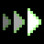Accelerating shot (ACCELERATING_SHOT) [[toc](#ACCELERATING_SHOT_CONTENTS)]

* **description**: Causes a projectile to accelerate as it flies
* **type**: ACTION_TYPE_MODIFIER
* **spawn_level**: [2, 3, 4]
* **spawn_probability**: [0.5, 0.5, 1.0]
* **price**: 190
* **mana**: 20
* **max_uses**: 0
* **never_unlimited**: false
* **spawn_manual_unlock**: false
* **recursive**: false
* **ai_never_uses**: false
* **is_dangerous_blast**: false
* **related_projectiles**: 
* **spawn_requires_flag**: 
* **related_extra_entities**: { "data/entities/misc/accelerating_shot.xml" }
* **action**:

```lua
 function()
      c.fire_rate_wait    = c.fire_rate_wait + 8
      c.speed_multiplier = c.speed_multiplier * 0.32
      shot_effects.recoil_knockback = shot_effects.recoil_knockback + 10.0
      c.extra_entities = c.extra_entities .. "data/entities/misc/accelerating_shot.xml,"
      
      if ( c.speed_multiplier >= 20 ) then
        c.speed_multiplier = math.min( c.speed_multiplier, 20 )
      elseif ( c.speed_multiplier < 0 ) then
        c.speed_multiplier = 0
      end
      
      draw_actions( 1, true )
    end,
```


### <a id="ACIDSHOT"></a>Acid ball (ACIDSHOT) [[toc](#ACIDSHOT_CONTENTS)]

* **description**: A terrifying acidic projectile
* **type**: ACTION_TYPE_PROJECTILE
* **spawn_level**: [1, 2, 3, 4]
* **spawn_probability**: [1.0, 1.0, 1.0, 1.0]
* **price**: 180
* **mana**: 20
* **max_uses**: 20
* **never_unlimited**: false
* **spawn_manual_unlock**: false
* **recursive**: false
* **ai_never_uses**: false
* **is_dangerous_blast**: false
* **related_projectiles**: {"data/entities/projectiles/deck/acidshot.xml"}
* **spawn_requires_flag**: 
* **related_extra_entities**: 
* **action**:

```lua
 function()
      add_projectile("data/entities/projectiles/deck/acidshot.xml")
      c.fire_rate_wait = c.fire_rate_wait + 10
    end,
```


### <a id="ACID_TRAIL"></a>Acid trail (ACID_TRAIL) [[toc](#ACID_TRAIL_CONTENTS)]

* **description**: Gives a projectile a trail of acid
* **type**: ACTION_TYPE_MODIFIER
* **spawn_level**: [1, 2, 3, 4, 5]
* **spawn_probability**: [0.3, 0.3, 0.3, 0.3, 0.3]
* **price**: 160
* **mana**: 15
* **max_uses**: 0
* **never_unlimited**: false
* **spawn_manual_unlock**: false
* **recursive**: false
* **ai_never_uses**: false
* **is_dangerous_blast**: false
* **related_projectiles**: 
* **spawn_requires_flag**: 
* **related_extra_entities**: 
* **action**:

```lua
 function()
      c.trail_material = c.trail_material .. "acid,"
      c.trail_material_amount = c.trail_material_amount + 5
      draw_actions( 1, true )
    end,
```


### <a id="ADD_DEATH_TRIGGER"></a>Add expiration trigger (ADD_DEATH_TRIGGER) [[toc](#ADD_DEATH_TRIGGER_CONTENTS)]

* **description**: Makes a projectile cast another spell upon expiring
* **type**: ACTION_TYPE_OTHER
* **spawn_level**: [3, 4, 5, 10]
* **spawn_probability**: [0.3, 0.6, 0.6, 1.0]
* **price**: 150
* **mana**: 20
* **max_uses**: 0
* **never_unlimited**: false
* **spawn_manual_unlock**: false
* **recursive**: false
* **ai_never_uses**: false
* **is_dangerous_blast**: false
* **related_projectiles**: 
* **spawn_requires_flag**: card_unlocked_mestari
* **related_extra_entities**: 
* **action**:

```lua
 function()
      local data = {}
      
      local how_many = 1
      
      if ( #deck > 0 ) then
        data = deck[1]
      else
        data = nil
      end
      
      if ( data ~= nil ) then
        while ( #deck >= how_many ) and ( ( data.type == ACTION_TYPE_MODIFIER ) or ( data.type == ACTION_TYPE_PASSIVE ) or ( data.type == ACTION_TYPE_OTHER ) or ( data.type == ACTION_TYPE_DRAW_MANY ) ) do
          if ( ( data.uses_remaining == nil ) or ( data.uses_remaining ~= 0 ) ) and ( data.id ~= "ADD_TRIGGER" ) and ( data.id ~= "ADD_TIMER" ) and ( data.id ~= "ADD_DEATH_TRIGGER" ) then
            if ( data.type == ACTION_TYPE_MODIFIER ) then
              dont_draw_actions = true
              data.action()
              dont_draw_actions = false
            end
          end
          how_many = how_many + 1
          data = deck[how_many]
        end
        
        if ( data ~= nil ) and ( data.related_projectiles ~= nil ) and ( ( data.uses_remaining == nil ) or ( data.uses_remaining ~= 0 ) ) then
          local target = data.related_projectiles[1]
          local count = data.related_projectiles[2] or 1
          
          for i=1,how_many do
            data = deck[1]
            table.insert( discarded, data )
            table.remove( deck, 1 )
          end
          
          local valid = false
          
          for i=1,#deck do
            local check = deck[i]
            
            if ( check ~= nil ) and ( ( check.type == ACTION_TYPE_PROJECTILE ) or ( check.type == ACTION_TYPE_STATIC_PROJECTILE ) or ( check.type == ACTION_TYPE_MATERIAL ) or ( check.type == ACTION_TYPE_UTILITY ) ) then
              valid = true
              break
            end
          end
          
          if ( data.uses_remaining ~= nil ) and ( data.uses_remaining > 0 ) then
            data.uses_remaining = data.uses_remaining - 1
            
            local reduce_uses = ActionUsesRemainingChanged( data.inventoryitem_id, data.uses_remaining )
            if not reduce_uses then
              data.uses_remaining = data.uses_remaining + 1 -- cancel the reduction
            end
          end
          
          if valid then
            for i=1,count do
              add_projectile_trigger_death(target, 1)
            end
          else
            dont_draw_actions = true
            data.action()
            dont_draw_actions = false
          end
        end
      end
    end,
```


### <a id="ADD_TIMER"></a>Add timer (ADD_TIMER) [[toc](#ADD_TIMER_CONTENTS)]

* **description**: Makes a projectile cast another spell after a short time
* **type**: ACTION_TYPE_OTHER
* **spawn_level**: [3, 4, 5, 10]
* **spawn_probability**: [0.3, 0.6, 0.6, 1.0]
* **price**: 150
* **mana**: 20
* **max_uses**: 0
* **never_unlimited**: false
* **spawn_manual_unlock**: false
* **recursive**: false
* **ai_never_uses**: false
* **is_dangerous_blast**: false
* **related_projectiles**: 
* **spawn_requires_flag**: card_unlocked_mestari
* **related_extra_entities**: 
* **action**:

```lua
 function()
      local data = {}
      
      local how_many = 1
      
      if ( #deck > 0 ) then
        data = deck[1]
      else
        data = nil
      end
      
      if ( data ~= nil ) then
        while ( #deck >= how_many ) and ( ( data.type == ACTION_TYPE_MODIFIER ) or ( data.type == ACTION_TYPE_PASSIVE ) or ( data.type == ACTION_TYPE_OTHER ) or ( data.type == ACTION_TYPE_DRAW_MANY ) ) do
          if ( ( data.uses_remaining == nil ) or ( data.uses_remaining ~= 0 ) ) and ( data.id ~= "ADD_TRIGGER" ) and ( data.id ~= "ADD_TIMER" ) and ( data.id ~= "ADD_DEATH_TRIGGER" ) then
            if ( data.type == ACTION_TYPE_MODIFIER ) then
              dont_draw_actions = true
              data.action()
              dont_draw_actions = false
            end
          end
          how_many = how_many + 1
          data = deck[how_many]
        end
        
        if ( data ~= nil ) and ( data.related_projectiles ~= nil ) and ( ( data.uses_remaining == nil ) or ( data.uses_remaining ~= 0 ) ) then
          local target = data.related_projectiles[1]
          local count = data.related_projectiles[2] or 1
          
          for i=1,how_many do
            data = deck[1]
            table.insert( discarded, data )
            table.remove( deck, 1 )
          end
          
          local valid = false
          
          for i=1,#deck do
            local check = deck[i]
            
            if ( check ~= nil ) and ( ( check.type == ACTION_TYPE_PROJECTILE ) or ( check.type == ACTION_TYPE_STATIC_PROJECTILE ) or ( check.type == ACTION_TYPE_MATERIAL ) or ( check.type == ACTION_TYPE_UTILITY ) ) then
              valid = true
              break
            end
          end
          
          if ( data.uses_remaining ~= nil ) and ( data.uses_remaining > 0 ) then
            data.uses_remaining = data.uses_remaining - 1
            
            local reduce_uses = ActionUsesRemainingChanged( data.inventoryitem_id, data.uses_remaining )
            if not reduce_uses then
              data.uses_remaining = data.uses_remaining + 1 -- cancel the reduction
            end
          end
          
          if valid then
            for i=1,count do
              add_projectile_trigger_timer(target, 20, 1)
            end
          else
            dont_draw_actions = true
            data.action()
            dont_draw_actions = false
          end
        end
      end
    end,
```


### <a id="ADD_TRIGGER"></a>Add trigger (ADD_TRIGGER) [[toc](#ADD_TRIGGER_CONTENTS)]

* **description**: Makes a projectile cast another spell upon collision
* **type**: ACTION_TYPE_OTHER
* **spawn_level**: [3, 4, 5, 10]
* **spawn_probability**: [0.3, 0.6, 0.6, 1.0]
* **price**: 100
* **mana**: 10
* **max_uses**: 0
* **never_unlimited**: false
* **spawn_manual_unlock**: false
* **recursive**: false
* **ai_never_uses**: false
* **is_dangerous_blast**: false
* **related_projectiles**: 
* **spawn_requires_flag**: card_unlocked_mestari
* **related_extra_entities**: 
* **action**:

```lua
 function()
      local data = {}
      
      local how_many = 1
      
      if ( #deck > 0 ) then
        data = deck[1]
      else
        data = nil
      end
      
      if ( data ~= nil ) then
        while ( #deck >= how_many ) and ( ( data.type == ACTION_TYPE_MODIFIER ) or ( data.type == ACTION_TYPE_PASSIVE ) or ( data.type == ACTION_TYPE_OTHER ) or ( data.type == ACTION_TYPE_DRAW_MANY ) ) do
          if ( ( data.uses_remaining == nil ) or ( data.uses_remaining ~= 0 ) ) and ( data.id ~= "ADD_TRIGGER" ) and ( data.id ~= "ADD_TIMER" ) and ( data.id ~= "ADD_DEATH_TRIGGER" ) then
            if ( data.type == ACTION_TYPE_MODIFIER ) then
              dont_draw_actions = true
              data.action()
              dont_draw_actions = false
            end
          end
          how_many = how_many + 1
          data = deck[how_many]
        end
        
        if ( data ~= nil ) and ( data.related_projectiles ~= nil ) and ( ( data.uses_remaining == nil ) or ( data.uses_remaining ~= 0 ) ) then
          local target = data.related_projectiles[1]
          local count = data.related_projectiles[2] or 1
          
          for i=1,how_many do
            data = deck[1]
            table.insert( discarded, data )
            table.remove( deck, 1 )
          end
          
          local valid = false
          
          for i=1,#deck do
            local check = deck[i]
            
            if ( check ~= nil ) and ( ( check.type == ACTION_TYPE_PROJECTILE ) or ( check.type == ACTION_TYPE_STATIC_PROJECTILE ) or ( check.type == ACTION_TYPE_MATERIAL ) or ( check.type == ACTION_TYPE_UTILITY ) ) then
              valid = true
              break
            end
          end
          
          if ( data.uses_remaining ~= nil ) and ( data.uses_remaining > 0 ) then
            data.uses_remaining = data.uses_remaining - 1
            
            local reduce_uses = ActionUsesRemainingChanged( data.inventoryitem_id, data.uses_remaining )
            if not reduce_uses then
              data.uses_remaining = data.uses_remaining + 1 -- cancel the reduction
            end
          end
          
          if valid then
            for i=1,count do
              add_projectile_trigger_hit_world(target, 1)
            end
          else
            dont_draw_actions = true
            data.action()
            dont_draw_actions = false
          end
        end
      end
    end,
```


### <a id="AIR_BULLET"></a>Burst of air (AIR_BULLET) [[toc](#AIR_BULLET_CONTENTS)]

* **description**: A brittle burst of air capable of greatly pushing objects
* **type**: ACTION_TYPE_PROJECTILE
* **spawn_level**: [1, 2]
* **spawn_probability**: [1.0, 1.0]
* **price**: 80
* **mana**: 5
* **max_uses**: 0
* **never_unlimited**: false
* **spawn_manual_unlock**: false
* **recursive**: false
* **ai_never_uses**: false
* **is_dangerous_blast**: false
* **related_projectiles**: {"data/entities/projectiles/deck/light_bullet_air.xml"}
* **spawn_requires_flag**: 
* **related_extra_entities**: 
* **action**:

```lua
 function()
      add_projectile("data/entities/projectiles/deck/light_bullet_air.xml")
      c.fire_rate_wait = c.fire_rate_wait + 3
      c.spread_degrees = c.spread_degrees - 2.0
    end,
```


### <a id="ALCOHOL_BLAST"></a>Explosion of spirits (ALCOHOL_BLAST) [[toc](#ALCOHOL_BLAST_CONTENTS)]

* **description**: An inebriating explosion
* **type**: ACTION_TYPE_STATIC_PROJECTILE
* **spawn_level**: [1, 2, 4, 6]
* **spawn_probability**: [0.5, 0.6, 0.6, 0.5]
* **price**: 140
* **mana**: 30
* **max_uses**: 0
* **never_unlimited**: false
* **spawn_manual_unlock**: false
* **recursive**: false
* **ai_never_uses**: false
* **is_dangerous_blast**: true
* **related_projectiles**: {"data/entities/projectiles/deck/alcohol_blast.xml"}
* **spawn_requires_flag**: 
* **related_extra_entities**: 
* **action**:

```lua
 function()
      add_projectile("data/entities/projectiles/deck/alcohol_blast.xml")
      c.fire_rate_wait = c.fire_rate_wait + 3
      c.screenshake = c.screenshake + 0.5
    end,
```


### <a id="ALL_ACID"></a>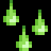Spells to acid (ALL_ACID) [[toc](#ALL_ACID_CONTENTS)]

* **description**: Transforms every projectile currently in the air into a pool of acid
* **type**: ACTION_TYPE_UTILITY
* **spawn_level**: [4, 6, 10]
* **spawn_probability**: [0.1, 0.05, 1.0]
* **price**: 600
* **mana**: 200
* **max_uses**: 0
* **never_unlimited**: false
* **spawn_manual_unlock**: false
* **recursive**: false
* **ai_never_uses**: false
* **is_dangerous_blast**: false
* **related_projectiles**: 
* **spawn_requires_flag**: card_unlocked_alchemy
* **related_extra_entities**: 
* **action**:

```lua
 function()
      add_projectile("data/entities/projectiles/deck/all_acid.xml")
      c.fire_rate_wait = c.fire_rate_wait + 100
      current_reload_time = current_reload_time + 100
    end,
```


### <a id="ALL_BLACKHOLES"></a>Spells to black holes (ALL_BLACKHOLES) [[toc](#ALL_BLACKHOLES_CONTENTS)]

* **description**: Transforms every projectile currently in the air into a black hole
* **type**: ACTION_TYPE_UTILITY
* **spawn_level**: [3, 6, 10]
* **spawn_probability**: [0.1, 0.05, 1.0]
* **price**: 500
* **mana**: 200
* **max_uses**: 10
* **never_unlimited**: true
* **spawn_manual_unlock**: false
* **recursive**: false
* **ai_never_uses**: false
* **is_dangerous_blast**: false
* **related_projectiles**: 
* **spawn_requires_flag**: card_unlocked_alchemy
* **related_extra_entities**: 
* **action**:

```lua
 function()
      add_projectile("data/entities/projectiles/deck/all_blackholes.xml")
      c.fire_rate_wait = c.fire_rate_wait + 100
      current_reload_time = current_reload_time + 100
    end,
```


### <a id="ALL_DEATHCROSSES"></a>Spells to death crosses (ALL_DEATHCROSSES) [[toc](#ALL_DEATHCROSSES_CONTENTS)]

* **description**: Transforms every projectile currently in the air into a death cross
* **type**: ACTION_TYPE_UTILITY
* **spawn_level**: [2, 6, 10]
* **spawn_probability**: [0.1, 0.05, 1.0]
* **price**: 350
* **mana**: 80
* **max_uses**: 15
* **never_unlimited**: true
* **spawn_manual_unlock**: false
* **recursive**: false
* **ai_never_uses**: false
* **is_dangerous_blast**: false
* **related_projectiles**: 
* **spawn_requires_flag**: card_unlocked_alchemy
* **related_extra_entities**: 
* **action**:

```lua
 function()
      add_projectile("data/entities/projectiles/deck/all_deathcrosses.xml")
      c.fire_rate_wait = c.fire_rate_wait + 40
      current_reload_time = current_reload_time + 40
    end,
```


### <a id="ALL_DISCS"></a>Spells to giga sawblades (ALL_DISCS) [[toc](#ALL_DISCS_CONTENTS)]

* **description**: Transforms every projectile currently in the air into a giant sawblade
* **type**: ACTION_TYPE_UTILITY
* **spawn_level**: [0, 6, 10]
* **spawn_probability**: [0.1, 0.05, 1.0]
* **price**: 400
* **mana**: 100
* **max_uses**: 0
* **never_unlimited**: false
* **spawn_manual_unlock**: false
* **recursive**: false
* **ai_never_uses**: false
* **is_dangerous_blast**: false
* **related_projectiles**: 
* **spawn_requires_flag**: card_unlocked_alchemy
* **related_extra_entities**: 
* **action**:

```lua
 function()
      add_projectile("data/entities/projectiles/deck/all_discs.xml")
      c.fire_rate_wait = c.fire_rate_wait + 50
      current_reload_time = current_reload_time + 50
    end,
```


### <a id="ALL_NUKES"></a>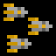Spells to nukes (ALL_NUKES) [[toc](#ALL_NUKES_CONTENTS)]

* **description**: Transforms every projectile currently in the air into a nuke; not a good idea
* **type**: ACTION_TYPE_UTILITY
* **spawn_level**: [6, 10]
* **spawn_probability**: [0.1, 1.0]
* **price**: 600
* **mana**: 600
* **max_uses**: 2
* **never_unlimited**: true
* **spawn_manual_unlock**: false
* **recursive**: false
* **ai_never_uses**: true
* **is_dangerous_blast**: false
* **related_projectiles**: 
* **spawn_requires_flag**: card_unlocked_alchemy
* **related_extra_entities**: 
* **action**:

```lua
 function()
      add_projectile("data/entities/projectiles/deck/all_nukes.xml")
      c.fire_rate_wait = c.fire_rate_wait + 100
      current_reload_time = current_reload_time + 100
    end,
```


### <a id="ALL_ROCKETS"></a>Spells to magic missiles (ALL_ROCKETS) [[toc](#ALL_ROCKETS_CONTENTS)]

* **description**: Transforms every projectile currently in the air into a magic missile
* **type**: ACTION_TYPE_UTILITY
* **spawn_level**: [1, 6, 10]
* **spawn_probability**: [0.1, 0.05, 1.0]
* **price**: 400
* **mana**: 100
* **max_uses**: 10
* **never_unlimited**: true
* **spawn_manual_unlock**: false
* **recursive**: false
* **ai_never_uses**: false
* **is_dangerous_blast**: false
* **related_projectiles**: 
* **spawn_requires_flag**: card_unlocked_alchemy
* **related_extra_entities**: 
* **action**:

```lua
 function()
      add_projectile("data/entities/projectiles/deck/all_rockets.xml")
      c.fire_rate_wait = c.fire_rate_wait + 50
      current_reload_time = current_reload_time + 50
    end,
```


### <a id="ALL_SPELLS"></a>The end of everything (ALL_SPELLS) [[toc](#ALL_SPELLS_CONTENTS)]

* **description**: You're heavily advised not to cast this spell.
* **type**: ACTION_TYPE_OTHER
* **spawn_level**: [10]
* **spawn_probability**: [1.0]
* **price**: 1000
* **mana**: 600
* **max_uses**: 1
* **never_unlimited**: true
* **spawn_manual_unlock**: true
* **recursive**: true
* **ai_never_uses**: true
* **is_dangerous_blast**: false
* **related_projectiles**: 
* **spawn_requires_flag**: card_unlocked_everything
* **related_extra_entities**: 
* **action**:

```lua
 function()
      local players = EntityGetWithTag( "player_unit" )
      for i,v in ipairs( players ) do
        local x,y = EntityGetTransform( v )
        local eid = EntityLoad("data/entities/projectiles/deck/all_spells_loader.xml", x, y)
      end
      c.fire_rate_wait = c.fire_rate_wait + 100
      current_reload_time = current_reload_time + 100
    end,
```


### <a id="ALPHA"></a>Alpha (ALPHA) [[toc](#ALPHA_CONTENTS)]

* **description**: Casts a copy of the first spell in your wand
* **type**: ACTION_TYPE_OTHER
* **spawn_level**: [5, 6, 10]
* **spawn_probability**: [0.1, 0.1, 1.0]
* **price**: 200
* **mana**: 30
* **max_uses**: 0
* **never_unlimited**: false
* **spawn_manual_unlock**: false
* **recursive**: true
* **ai_never_uses**: false
* **is_dangerous_blast**: false
* **related_projectiles**: 
* **spawn_requires_flag**: card_unlocked_duplicate
* **related_extra_entities**: 
* **action**:

```lua
 function( recursion_level, iteration )
      c.fire_rate_wait = c.fire_rate_wait + 15
      
      local data = {}
      
      if ( #discarded > 0 ) then
        data = discarded[1]
      elseif ( #hand > 0 ) then
        data = hand[1]
      elseif ( #deck > 0 ) then
        data = deck[1]
      else
        data = nil
      end
      
      local rec = check_recursion( data, recursion_level )
      
      if ( data ~= nil ) and ( rec > -1 ) then
        data.action( rec )
      end
      
    end,
```


### <a id="ARC_ELECTRIC"></a>Electric Arc (ARC_ELECTRIC) [[toc](#ARC_ELECTRIC_CONTENTS)]

* **description**: Creates arcs of lightning between projectiles (requires 2 projectile spells)
* **type**: ACTION_TYPE_MODIFIER
* **spawn_level**: [2, 3, 4, 5, 6]
* **spawn_probability**: [0.4, 0.4, 0.4, 0.4, 0.8]
* **price**: 170
* **mana**: 15
* **max_uses**: 0
* **never_unlimited**: false
* **spawn_manual_unlock**: false
* **recursive**: false
* **ai_never_uses**: false
* **is_dangerous_blast**: false
* **related_projectiles**: 
* **spawn_requires_flag**: 
* **related_extra_entities**: { "data/entities/misc/arc_electric.xml" }
* **action**:

```lua
 function()
      c.extra_entities = c.extra_entities .. "data/entities/misc/arc_electric.xml,"
      draw_actions( 1, true )
    end,
```


### <a id="ARC_FIRE"></a>Fire Arc (ARC_FIRE) [[toc](#ARC_FIRE_CONTENTS)]

* **description**: Creates arcs of fire between projectiles (requires 2 projectile spells)
* **type**: ACTION_TYPE_MODIFIER
* **spawn_level**: [1, 2, 3, 4, 5]
* **spawn_probability**: [0.4, 0.4, 0.4, 0.4, 0.4]
* **price**: 160
* **mana**: 15
* **max_uses**: 0
* **never_unlimited**: false
* **spawn_manual_unlock**: false
* **recursive**: false
* **ai_never_uses**: false
* **is_dangerous_blast**: false
* **related_projectiles**: 
* **spawn_requires_flag**: 
* **related_extra_entities**: { "data/entities/misc/arc_fire.xml" }
* **action**:

```lua
 function()
      c.extra_entities = c.extra_entities .. "data/entities/misc/arc_fire.xml,"
      draw_actions( 1, true )
    end,
```


### <a id="ARC_GUNPOWDER"></a>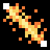Gunpowder Arc (ARC_GUNPOWDER) [[toc](#ARC_GUNPOWDER_CONTENTS)]

* **description**: Creates arcs of gunpowder between projectiles (requires 2 projectile spells)
* **type**: ACTION_TYPE_MODIFIER
* **spawn_level**: [1, 2, 3, 4, 5]
* **spawn_probability**: [0.4, 0.4, 0.4, 0.4, 0.4]
* **price**: 160
* **mana**: 15
* **max_uses**: 0
* **never_unlimited**: false
* **spawn_manual_unlock**: false
* **recursive**: false
* **ai_never_uses**: false
* **is_dangerous_blast**: false
* **related_projectiles**: 
* **spawn_requires_flag**: 
* **related_extra_entities**: { "data/entities/misc/arc_gunpowder.xml" }
* **action**:

```lua
 function()
      c.extra_entities = c.extra_entities .. "data/entities/misc/arc_gunpowder.xml,"
      draw_actions( 1, true )
    end,
```


### <a id="ARC_POISON"></a>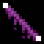Poison Arc (ARC_POISON) [[toc](#ARC_POISON_CONTENTS)]

* **description**: Creates arcs of poison between projectiles (requires 2 projectile spells)
* **type**: ACTION_TYPE_MODIFIER
* **spawn_level**: [1, 2, 3, 4, 5]
* **spawn_probability**: [0.4, 0.4, 0.4, 0.4, 0.4]
* **price**: 160
* **mana**: 15
* **max_uses**: 0
* **never_unlimited**: false
* **spawn_manual_unlock**: false
* **recursive**: false
* **ai_never_uses**: false
* **is_dangerous_blast**: false
* **related_projectiles**: 
* **spawn_requires_flag**: 
* **related_extra_entities**: { "data/entities/misc/arc_poison.xml" }
* **action**:

```lua
 function()
      c.extra_entities = c.extra_entities .. "data/entities/misc/arc_poison.xml,"
      draw_actions( 1, true )
    end,
```


### <a id="AREA_DAMAGE"></a>Damage field (AREA_DAMAGE) [[toc](#AREA_DAMAGE_CONTENTS)]

* **description**: Gives a projectile an energy field that constantly deals 3.5 damage to nearby creatures
* **type**: ACTION_TYPE_MODIFIER
* **spawn_level**: [2, 3, 4, 5, 6]
* **spawn_probability**: [0.5, 0.5, 0.5, 0.5, 0.5]
* **price**: 140
* **mana**: 30
* **max_uses**: 0
* **never_unlimited**: false
* **spawn_manual_unlock**: false
* **recursive**: false
* **ai_never_uses**: false
* **is_dangerous_blast**: false
* **related_projectiles**: 
* **spawn_requires_flag**: 
* **related_extra_entities**: { "data/entities/misc/area_damage.xml" }
* **action**:

```lua
 function()
      c.extra_entities = c.extra_entities .. "data/entities/misc/area_damage.xml,"
      draw_actions( 1, true )
    end,
```


### <a id="ARROW"></a>Arrow (ARROW) [[toc](#ARROW_CONTENTS)]

* **description**: Summons an arrow
* **type**: ACTION_TYPE_PROJECTILE
* **spawn_level**: [1, 2, 4, 5]
* **spawn_probability**: [1.0, 1.0, 1.0, 1.0]
* **price**: 140
* **mana**: 15
* **max_uses**: 0
* **never_unlimited**: false
* **spawn_manual_unlock**: false
* **recursive**: false
* **ai_never_uses**: false
* **is_dangerous_blast**: false
* **related_projectiles**: {"data/entities/projectiles/deck/arrow.xml"}
* **spawn_requires_flag**: 
* **related_extra_entities**: 
* **action**:

```lua
 function()
      add_projectile("data/entities/projectiles/deck/arrow.xml")
      c.fire_rate_wait = c.fire_rate_wait + 10
      c.spread_degrees = c.spread_degrees - 20
      shot_effects.recoil_knockback = 30.0
    end,
```


### <a id="AUTOAIM"></a>Auto-Aim (AUTOAIM) [[toc](#AUTOAIM_CONTENTS)]

* **description**: Makes a projectile turns towards the nearest visible enemy
* **type**: ACTION_TYPE_MODIFIER
* **spawn_level**: [2, 3, 4, 5, 6]
* **spawn_probability**: [0.4, 0.4, 0.4, 0.4, 0.4]
* **price**: 150
* **mana**: 25
* **max_uses**: 0
* **never_unlimited**: false
* **spawn_manual_unlock**: false
* **recursive**: false
* **ai_never_uses**: false
* **is_dangerous_blast**: false
* **related_projectiles**: 
* **spawn_requires_flag**: 
* **related_extra_entities**: { "data/entities/misc/autoaim.xml" }
* **action**:

```lua
 function()
      c.extra_entities = c.extra_entities .. "data/entities/misc/autoaim.xml,"
      draw_actions( 1, true )
    end,
```


### <a id="AVOIDING_ARC"></a>Avoiding arc (AVOIDING_ARC) [[toc](#AVOIDING_ARC_CONTENTS)]

* **description**: Makes a projectile shy away from obstacles
* **type**: ACTION_TYPE_MODIFIER
* **spawn_level**: [2, 4, 6]
* **spawn_probability**: [0.4, 0.4, 0.4]
* **price**: 30
* **mana**: 0
* **max_uses**: 0
* **never_unlimited**: false
* **spawn_manual_unlock**: false
* **recursive**: false
* **ai_never_uses**: false
* **is_dangerous_blast**: false
* **related_projectiles**: 
* **spawn_requires_flag**: 
* **related_extra_entities**: { "data/entities/misc/avoiding_arc.xml" }
* **action**:

```lua
 function()
      c.extra_entities = c.extra_entities .. "data/entities/misc/avoiding_arc.xml,"
      c.fire_rate_wait    = c.fire_rate_wait + 10
      draw_actions( 1, true )
    end,
```


### <a id="BALL_LIGHTNING"></a>Ball Lightning (BALL_LIGHTNING) [[toc](#BALL_LIGHTNING_CONTENTS)]

* **description**: Summons three short range electrical orbs
* **type**: ACTION_TYPE_PROJECTILE
* **spawn_level**: [1, 2, 4, 5]
* **spawn_probability**: [0.2, 0.2, 1.0, 1.0]
* **price**: 250
* **mana**: 70
* **max_uses**: 0
* **never_unlimited**: false
* **spawn_manual_unlock**: false
* **recursive**: false
* **ai_never_uses**: false
* **is_dangerous_blast**: false
* **related_projectiles**: {"data/entities/projectiles/deck/ball_lightning.xml",3}
* **spawn_requires_flag**: 
* **related_extra_entities**: 
* **action**:

```lua
 function()
      add_projectile("data/entities/projectiles/deck/ball_lightning.xml")
      add_projectile("data/entities/projectiles/deck/ball_lightning.xml")
      add_projectile("data/entities/projectiles/deck/ball_lightning.xml")
      c.fire_rate_wait = c.fire_rate_wait + 50
      shot_effects.recoil_knockback = 120.0
    end,
```


### <a id="BERSERK_FIELD"></a>Circle of fervour (BERSERK_FIELD) [[toc](#BERSERK_FIELD_CONTENTS)]

* **description**: A field of berserk magic
* **type**: ACTION_TYPE_STATIC_PROJECTILE
* **spawn_level**: [2, 3, 4]
* **spawn_probability**: [0.3, 0.6, 0.3]
* **price**: 200
* **mana**: 30
* **max_uses**: 15
* **never_unlimited**: false
* **spawn_manual_unlock**: false
* **recursive**: false
* **ai_never_uses**: false
* **is_dangerous_blast**: false
* **related_projectiles**: {"data/entities/projectiles/deck/berserk_field.xml"}
* **spawn_requires_flag**: 
* **related_extra_entities**: 
* **action**:

```lua
 function()
      add_projectile("data/entities/projectiles/deck/berserk_field.xml")
      c.fire_rate_wait = c.fire_rate_wait + 15
    end,
```


### <a id="BIG_MAGIC_SHIELD"></a>Big magic guard (BIG_MAGIC_SHIELD) [[toc](#BIG_MAGIC_SHIELD_CONTENTS)]

* **description**: Eight guarding lights rotate around you for a time
* **type**: ACTION_TYPE_PROJECTILE
* **spawn_level**: [2, 4, 5, 6, 10]
* **spawn_probability**: [0.2, 0.2, 0.5, 0.5, 0.1]
* **price**: 120
* **mana**: 60
* **max_uses**: 0
* **never_unlimited**: false
* **spawn_manual_unlock**: false
* **recursive**: false
* **ai_never_uses**: false
* **is_dangerous_blast**: false
* **related_projectiles**: {"data/entities/projectiles/deck/big_magic_shield_start.xml"}
* **spawn_requires_flag**: 
* **related_extra_entities**: 
* **action**:

```lua
 function()
      add_projectile("data/entities/projectiles/deck/big_magic_shield_start.xml")
      c.fire_rate_wait = c.fire_rate_wait + 30
    end,
```


### <a id="BLACK_HOLE"></a>Black hole (BLACK_HOLE) [[toc](#BLACK_HOLE_CONTENTS)]

* **description**: A slow orb of void that eats through all obstacles
* **type**: ACTION_TYPE_PROJECTILE
* **spawn_level**: [0, 2, 4, 5]
* **spawn_probability**: [0.8, 0.8, 0.8, 0.8]
* **price**: 200
* **mana**: 180
* **max_uses**: 3
* **never_unlimited**: true
* **spawn_manual_unlock**: false
* **recursive**: false
* **ai_never_uses**: false
* **is_dangerous_blast**: false
* **related_projectiles**: {"data/entities/projectiles/deck/black_hole.xml"}
* **spawn_requires_flag**: 
* **related_extra_entities**: 
* **action**:

```lua
 function()
      add_projectile("data/entities/projectiles/deck/black_hole.xml")
      c.fire_rate_wait = c.fire_rate_wait + 80
      c.screenshake = c.screenshake + 20
    end,
```


### <a id="BLACK_HOLE_BIG"></a>Giga black hole (BLACK_HOLE_BIG) [[toc](#BLACK_HOLE_BIG_CONTENTS)]

* **description**: A growing orb of negative energy that destroys everything in its reach
* **type**: ACTION_TYPE_STATIC_PROJECTILE
* **spawn_level**: [1, 3, 5, 6, 10]
* **spawn_probability**: [0.8, 0.8, 0.8, 0.8, 0.5]
* **price**: 320
* **mana**: 240
* **max_uses**: 6
* **never_unlimited**: false
* **spawn_manual_unlock**: false
* **recursive**: false
* **ai_never_uses**: false
* **is_dangerous_blast**: false
* **related_projectiles**: {"data/entities/projectiles/deck/black_hole_big.xml"}
* **spawn_requires_flag**: 
* **related_extra_entities**: 
* **action**:

```lua
 function()
      add_projectile("data/entities/projectiles/deck/black_hole_big.xml")
      c.fire_rate_wait = c.fire_rate_wait + 80
      c.screenshake = c.screenshake + 10
    end,
```


### <a id="BLACK_HOLE_DEATH_TRIGGER"></a>Black Hole with Death Trigger (BLACK_HOLE_DEATH_TRIGGER) [[toc](#BLACK_HOLE_DEATH_TRIGGER_CONTENTS)]

* **description**: A slow orb of void that eats through all obstacles and casts another spell as it expires
* **type**: ACTION_TYPE_PROJECTILE
* **spawn_level**: [2, 4, 5, 6]
* **spawn_probability**: [0.5, 0.5, 0.5, 0.5]
* **price**: 220
* **mana**: 200
* **max_uses**: 3
* **never_unlimited**: true
* **spawn_manual_unlock**: false
* **recursive**: false
* **ai_never_uses**: false
* **is_dangerous_blast**: false
* **related_projectiles**: {"data/entities/projectiles/deck/black_hole.xml"}
* **spawn_requires_flag**: 
* **related_extra_entities**: 
* **action**:

```lua
 function()
      add_projectile_trigger_death("data/entities/projectiles/deck/black_hole.xml", 1)
      c.fire_rate_wait = c.fire_rate_wait + 90
      c.screenshake = c.screenshake + 20
    end,
```


### <a id="BLACK_HOLE_GIGA"></a>Omega Black Hole (BLACK_HOLE_GIGA) [[toc](#BLACK_HOLE_GIGA_CONTENTS)]

* **description**: Even light dies eventually...
* **type**: ACTION_TYPE_STATIC_PROJECTILE
* **spawn_level**: [10]
* **spawn_probability**: [1.0]
* **price**: 600
* **mana**: 500
* **max_uses**: 6
* **never_unlimited**: true
* **spawn_manual_unlock**: false
* **recursive**: false
* **ai_never_uses**: false
* **is_dangerous_blast**: false
* **related_projectiles**: {"data/entities/projectiles/deck/black_hole_giga.xml"}
* **spawn_requires_flag**: card_unlocked_black_hole
* **related_extra_entities**: 
* **action**:

```lua
 function()
      local black_holes = EntityGetWithTag( "black_hole_giga" )
      
      if ( #black_holes < 3 ) then
        add_projectile("data/entities/projectiles/deck/black_hole_giga.xml")
        c.fire_rate_wait = c.fire_rate_wait + 120
        current_reload_time = current_reload_time + 100
        c.screenshake = c.screenshake + 40
      end
    end,
```


### <a id="BLOODLUST"></a>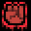Bloodlust (BLOODLUST) [[toc](#BLOODLUST_CONTENTS)]

* **description**: A projectile gains a hefty damage boost, but is also able to hurt you
* **type**: ACTION_TYPE_MODIFIER
* **spawn_level**: [1, 3, 4, 5, 6]
* **spawn_probability**: [0.2, 0.3, 0.6, 0.6, 0.3]
* **price**: 160
* **mana**: 2
* **max_uses**: 0
* **never_unlimited**: false
* **spawn_manual_unlock**: false
* **recursive**: false
* **ai_never_uses**: false
* **is_dangerous_blast**: false
* **related_projectiles**: 
* **spawn_requires_flag**: 
* **related_extra_entities**: { "data/entities/particles/tinyspark_red.xml" }
* **action**:

```lua
 function()
      c.damage_projectile_add = c.damage_projectile_add + 1.3
      c.gore_particles    = c.gore_particles + 15
      c.fire_rate_wait    = c.fire_rate_wait + 8
      c.friendly_fire    = true
      shot_effects.recoil_knockback = shot_effects.recoil_knockback + 30.0
      c.spread_degrees = c.spread_degrees + 6
      c.extra_entities    = c.extra_entities .. "data/entities/particles/tinyspark_red.xml,"
      draw_actions( 1, true )
    end,
```


### <a id="BLOOD_MAGIC"></a>Blood magic (BLOOD_MAGIC) [[toc](#BLOOD_MAGIC_CONTENTS)]

* **description**: Reduces a spell's mana cost and recharge time greatly, at the costs of four health points
* **type**: ACTION_TYPE_UTILITY
* **spawn_level**: [5, 6, 10]
* **spawn_probability**: [0.1, 0.7, 0.5]
* **price**: 150
* **mana**: -100
* **max_uses**: 0
* **never_unlimited**: false
* **spawn_manual_unlock**: false
* **recursive**: false
* **ai_never_uses**: false
* **is_dangerous_blast**: false
* **related_projectiles**: 
* **spawn_requires_flag**: 
* **related_extra_entities**: { "data/entities/particles/blood_sparks.xml" }
* **action**:

```lua
 function()
      c.extra_entities = c.extra_entities .. "data/entities/particles/blood_sparks.xml,"
      c.fire_rate_wait = c.fire_rate_wait - 20
      current_reload_time = current_reload_time - 20
      draw_actions( 1, true )
      
      local entity_id = GetUpdatedEntityID()
      
      local dcomps = EntityGetComponent( entity_id, "DamageModelComponent" )
      
      if ( dcomps ~= nil ) and ( #dcomps > 0 ) then
        for a,b in ipairs( dcomps ) do
          local hp = ComponentGetValue2( b, "hp" )
          hp = math.max( hp - 0.16, 0.04 )
          ComponentSetValue2( b, "hp", hp )
        end
      end
    end,
```


### <a id="BLOOD_TO_ACID"></a>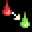Blood to acid (BLOOD_TO_ACID) [[toc](#BLOOD_TO_ACID_CONTENTS)]

* **description**: Makes any blood within a projectile's range turns into acid
* **type**: ACTION_TYPE_MODIFIER
* **spawn_level**: [2, 3, 4]
* **spawn_probability**: [0.3, 0.3, 0.3]
* **price**: 80
* **mana**: 30
* **max_uses**: 0
* **never_unlimited**: false
* **spawn_manual_unlock**: false
* **recursive**: false
* **ai_never_uses**: false
* **is_dangerous_blast**: false
* **related_projectiles**: 
* **spawn_requires_flag**: 
* **related_extra_entities**: { "data/entities/misc/blood_to_acid.xml", "data/entities/particles/tinyspark_red.xml" }
* **action**:

```lua
 function()
      c.extra_entities = c.extra_entities .. "data/entities/misc/blood_to_acid.xml,data/entities/particles/tinyspark_red.xml,"
      c.fire_rate_wait = c.fire_rate_wait + 10
      draw_actions( 1, true )
    end,
```


### <a id="BLOOD_TO_POWER"></a>Blood to Power (BLOOD_TO_POWER) [[toc](#BLOOD_TO_POWER_CONTENTS)]

* **description**: A projectile gains additional damage at the cost of 20% of your health
* **type**: ACTION_TYPE_UTILITY
* **spawn_level**: [2, 5, 6, 10]
* **spawn_probability**: [0.2, 0.8, 0.1, 0.5]
* **price**: 150
* **mana**: 20
* **max_uses**: 0
* **never_unlimited**: false
* **spawn_manual_unlock**: false
* **recursive**: false
* **ai_never_uses**: false
* **is_dangerous_blast**: false
* **related_projectiles**: 
* **spawn_requires_flag**: 
* **related_extra_entities**: { "data/entities/particles/blood_sparks.xml" }
* **action**:

```lua
 function()
      local entity_id = GetUpdatedEntityID()
      
      local dcomp = EntityGetFirstComponent( entity_id, "DamageModelComponent" )
      
      if ( dcomp ~= nil ) then
        local hp = ComponentGetValue2( dcomp, "hp" )
        local damage = math.min( hp * 0.44, 960 )
        local self_damage = hp * 0.2
        
        if ( hp >= 0.4 ) and ( self_damage > 0.2 ) then
          c.extra_entities = c.extra_entities .. "data/entities/particles/blood_sparks.xml,"
          
          EntityInflictDamage( entity_id, self_damage, "DAMAGE_CURSE", "$action_blood_to_power", "NONE", 0, 0, entity_id )
          
          
          c.damage_projectile_add = c.damage_projectile_add + damage
        end
      end
      
      draw_actions( 1, true )
    end,
```


### <a id="BOMB"></a>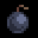Bomb (BOMB) [[toc](#BOMB_CONTENTS)]

* **description**: Summons a bomb that destroys ground very efficiently
* **type**: ACTION_TYPE_PROJECTILE
* **spawn_level**: [0, 1, 2, 3, 4, 5, 6]
* **spawn_probability**: [1.0, 1.0, 1.0, 1.0, 1.0, 1.0, 1.0]
* **price**: 200
* **mana**: 25
* **max_uses**: 3
* **never_unlimited**: false
* **spawn_manual_unlock**: false
* **recursive**: false
* **ai_never_uses**: false
* **is_dangerous_blast**: false
* **related_projectiles**: {"data/entities/projectiles/bomb.xml"}
* **spawn_requires_flag**: 
* **related_extra_entities**: 
* **action**:

```lua
 function()
      add_projectile("data/entities/projectiles/bomb.xml")
      c.fire_rate_wait = c.fire_rate_wait + 100
    end,
```


### <a id="BOMB_CART"></a>Bomb cart (BOMB_CART) [[toc](#BOMB_CART_CONTENTS)]

* **description**: Summons a self-propeled mine cart loaded with explosives
* **type**: ACTION_TYPE_PROJECTILE
* **spawn_level**: [0, 1, 2, 3, 4, 5, 6]
* **spawn_probability**: [0.0, 0.0, 0.6, 0.6, 0.6, 0.6, 0.6]
* **price**: 200
* **mana**: 75
* **max_uses**: 6
* **never_unlimited**: false
* **spawn_manual_unlock**: false
* **recursive**: false
* **ai_never_uses**: false
* **is_dangerous_blast**: false
* **related_projectiles**: {"data/entities/projectiles/bomb_cart.xml"}
* **spawn_requires_flag**: 
* **related_extra_entities**: 
* **action**:

```lua
 function()
      add_projectile("data/entities/projectiles/bomb_cart.xml")
      shot_effects.recoil_knockback = shot_effects.recoil_knockback + 200.0
      c.fire_rate_wait = c.fire_rate_wait + 60
    end,
```


### <a id="BOMB_DETONATOR"></a>Explosive Detonator (BOMB_DETONATOR) [[toc](#BOMB_DETONATOR_CONTENTS)]

* **description**: All nearby explosive spells cast by you instantly detonate
* **type**: ACTION_TYPE_STATIC_PROJECTILE
* **spawn_level**: [2, 3, 4, 5, 6]
* **spawn_probability**: [1.0, 1.0, 1.0, 1.0, 1.0]
* **price**: 120
* **mana**: 50
* **max_uses**: 0
* **never_unlimited**: false
* **spawn_manual_unlock**: false
* **recursive**: false
* **ai_never_uses**: false
* **is_dangerous_blast**: false
* **related_projectiles**: {"data/entities/projectiles/deck/bomb_detonator.xml"}
* **spawn_requires_flag**: 
* **related_extra_entities**: 
* **action**:

```lua
 function()
      add_projectile("data/entities/projectiles/deck/bomb_detonator.xml")
    end,
```


### <a id="BOMB_HOLY"></a>Holy Bomb (BOMB_HOLY) [[toc](#BOMB_HOLY_CONTENTS)]

* **description**: Summons a bomb that... well...
* **type**: ACTION_TYPE_PROJECTILE
* **spawn_level**: [2, 3, 4, 5, 6, 10]
* **spawn_probability**: [0.2, 0.2, 0.2, 0.2, 0.2, 0.5]
* **price**: 400
* **mana**: 300
* **max_uses**: 2
* **never_unlimited**: false
* **spawn_manual_unlock**: false
* **recursive**: false
* **ai_never_uses**: false
* **is_dangerous_blast**: false
* **related_projectiles**: {"data/entities/projectiles/bomb_holy.xml"}
* **spawn_requires_flag**: card_unlocked_bomb_holy
* **related_extra_entities**: 
* **action**:

```lua
 function()
      add_projectile("data/entities/projectiles/bomb_holy.xml")
      current_reload_time = current_reload_time + 80
      shot_effects.recoil_knockback = shot_effects.recoil_knockback + 100.0
      c.fire_rate_wait = c.fire_rate_wait + 40
    end,
```


### <a id="BOMB_HOLY_GIGA"></a>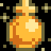Giga Holy Bomb (BOMB_HOLY_GIGA) [[toc](#BOMB_HOLY_GIGA_CONTENTS)]

* **description**: Bigger and therefore holier
* **type**: ACTION_TYPE_PROJECTILE
* **spawn_level**: [10]
* **spawn_probability**: [1.0]
* **price**: 600
* **mana**: 600
* **max_uses**: 2
* **never_unlimited**: true
* **spawn_manual_unlock**: false
* **recursive**: false
* **ai_never_uses**: false
* **is_dangerous_blast**: false
* **related_projectiles**: {"data/entities/projectiles/bomb_holy_giga.xml"}
* **spawn_requires_flag**: card_unlocked_bomb_holy_giga
* **related_extra_entities**: 
* **action**:

```lua
 function()
      add_projectile("data/entities/projectiles/bomb_holy_giga.xml")
      current_reload_time = current_reload_time + 160
      shot_effects.recoil_knockback = shot_effects.recoil_knockback + 100.0
      c.fire_rate_wait = c.fire_rate_wait + 120
    end,
```


### <a id="BOUNCE"></a>Bounce (BOUNCE) [[toc](#BOUNCE_CONTENTS)]

* **description**: Makes a projectile bounce on impact
* **type**: ACTION_TYPE_MODIFIER
* **spawn_level**: [2, 3, 4, 5, 6]
* **spawn_probability**: [1.0, 1.0, 0.4, 0.2, 0.2]
* **price**: 50
* **mana**: 0
* **max_uses**: 0
* **never_unlimited**: false
* **spawn_manual_unlock**: false
* **recursive**: false
* **ai_never_uses**: false
* **is_dangerous_blast**: false
* **related_projectiles**: 
* **spawn_requires_flag**: 
* **related_extra_entities**: 
* **action**:

```lua
 function()
      c.bounces = c.bounces + 10
      draw_actions( 1, true )
    end,
```


### <a id="BOUNCE_EXPLOSION"></a>Explosive bounce (BOUNCE_EXPLOSION) [[toc](#BOUNCE_EXPLOSION_CONTENTS)]

* **description**: Makes a projectile explode as it bounces
* **type**: ACTION_TYPE_MODIFIER
* **spawn_level**: [2, 3, 4, 5]
* **spawn_probability**: [0.2, 0.6, 0.8, 0.8]
* **price**: 180
* **mana**: 20
* **max_uses**: 0
* **never_unlimited**: false
* **spawn_manual_unlock**: false
* **recursive**: false
* **ai_never_uses**: false
* **is_dangerous_blast**: false
* **related_projectiles**: 
* **spawn_requires_flag**: 
* **related_extra_entities**: { "data/entities/misc/bounce_explosion.xml" }
* **action**:

```lua
 function()
      c.extra_entities = c.extra_entities .. "data/entities/misc/bounce_explosion.xml,"
      c.bounces = c.bounces + 1
      c.fire_rate_wait = c.fire_rate_wait + 25
      shot_effects.recoil_knockback = shot_effects.recoil_knockback + 20.0
      draw_actions( 1, true )
    end,
```


### <a id="BOUNCE_LARPA"></a>Larpa Bounce (BOUNCE_LARPA) [[toc](#BOUNCE_LARPA_CONTENTS)]

* **description**: A projectile will launch a copy of itself when it bounces
* **type**: ACTION_TYPE_MODIFIER
* **spawn_level**: [4, 5, 6]
* **spawn_probability**: [0.4, 0.6, 0.4]
* **price**: 250
* **mana**: 80
* **max_uses**: 0
* **never_unlimited**: false
* **spawn_manual_unlock**: false
* **recursive**: false
* **ai_never_uses**: false
* **is_dangerous_blast**: false
* **related_projectiles**: 
* **spawn_requires_flag**: 
* **related_extra_entities**: { "data/entities/misc/bounce_larpa.xml" }
* **action**:

```lua
 function()
      c.extra_entities = c.extra_entities .. "data/entities/misc/bounce_larpa.xml,"
      c.bounces = c.bounces + 1
      c.fire_rate_wait = c.fire_rate_wait + 32
      shot_effects.recoil_knockback = shot_effects.recoil_knockback + 10.0
      draw_actions( 1, true )
    end,
```


### <a id="BOUNCE_LASER"></a>Concentrated light bounce (BOUNCE_LASER) [[toc](#BOUNCE_LASER_CONTENTS)]

* **description**: Makes a projectile release a bundle of concentrated light as it bounces
* **type**: ACTION_TYPE_MODIFIER
* **spawn_level**: [3, 4, 5]
* **spawn_probability**: [0.4, 0.8, 0.4]
* **price**: 180
* **mana**: 30
* **max_uses**: 0
* **never_unlimited**: false
* **spawn_manual_unlock**: false
* **recursive**: false
* **ai_never_uses**: false
* **is_dangerous_blast**: false
* **related_projectiles**: 
* **spawn_requires_flag**: 
* **related_extra_entities**: { "data/entities/misc/bounce_laser.xml" }
* **action**:

```lua
 function()
      c.extra_entities = c.extra_entities .. "data/entities/misc/bounce_laser.xml,"
      c.bounces = c.bounces + 1
      c.fire_rate_wait = c.fire_rate_wait + 12
      shot_effects.recoil_knockback = shot_effects.recoil_knockback + 5.0
      draw_actions( 1, true )
    end,
```


### <a id="BOUNCE_LASER_EMITTER"></a>Plasma Beam Bounce (BOUNCE_LASER_EMITTER) [[toc](#BOUNCE_LASER_EMITTER_CONTENTS)]

* **description**: A projectile launches a plasma beam upon bouncing
* **type**: ACTION_TYPE_MODIFIER
* **spawn_level**: [3, 4, 5]
* **spawn_probability**: [0.4, 0.8, 0.4]
* **price**: 180
* **mana**: 40
* **max_uses**: 0
* **never_unlimited**: false
* **spawn_manual_unlock**: false
* **recursive**: false
* **ai_never_uses**: false
* **is_dangerous_blast**: false
* **related_projectiles**: 
* **spawn_requires_flag**: 
* **related_extra_entities**: { "data/entities/misc/bounce_laser_emitter.xml" }
* **action**:

```lua
 function()
      c.extra_entities = c.extra_entities .. "data/entities/misc/bounce_laser_emitter.xml,"
      c.bounces = c.bounces + 1
      c.fire_rate_wait = c.fire_rate_wait + 12
      shot_effects.recoil_knockback = shot_effects.recoil_knockback + 5.0
      draw_actions( 1, true )
    end,
```


### <a id="BOUNCE_SPARK"></a>Bubbly bounce (BOUNCE_SPARK) [[toc](#BOUNCE_SPARK_CONTENTS)]

* **description**: Makes a projectile shoot bubble sparks as it bounces
* **type**: ACTION_TYPE_MODIFIER
* **spawn_level**: [1, 2, 3, 4]
* **spawn_probability**: [0.2, 0.6, 0.6, 0.6]
* **price**: 120
* **mana**: 20
* **max_uses**: 0
* **never_unlimited**: false
* **spawn_manual_unlock**: false
* **recursive**: false
* **ai_never_uses**: false
* **is_dangerous_blast**: false
* **related_projectiles**: 
* **spawn_requires_flag**: 
* **related_extra_entities**: { "data/entities/misc/bounce_spark.xml" }
* **action**:

```lua
 function()
      c.extra_entities = c.extra_entities .. "data/entities/misc/bounce_spark.xml,"
      c.bounces = c.bounces + 1
      c.fire_rate_wait = c.fire_rate_wait + 8
      shot_effects.recoil_knockback = shot_effects.recoil_knockback + 5.0
      draw_actions( 1, true )
    end,
```


### <a id="BOUNCY_ORB"></a>Energy sphere (BOUNCY_ORB) [[toc](#BOUNCY_ORB_CONTENTS)]

* **description**: A fast, arcing projectile
* **type**: ACTION_TYPE_PROJECTILE
* **spawn_level**: [0, 2, 4]
* **spawn_probability**: [1.0, 1.0, 1.0]
* **price**: 120
* **mana**: 20
* **max_uses**: 0
* **never_unlimited**: false
* **spawn_manual_unlock**: false
* **recursive**: false
* **ai_never_uses**: false
* **is_dangerous_blast**: false
* **related_projectiles**: {"data/entities/projectiles/deck/bouncy_orb.xml"}
* **spawn_requires_flag**: 
* **related_extra_entities**: 
* **action**:

```lua
 function()
      add_projectile("data/entities/projectiles/deck/bouncy_orb.xml")
      c.fire_rate_wait = c.fire_rate_wait + 10
      shot_effects.recoil_knockback = 20.0
    end,
```


### <a id="BOUNCY_ORB_TIMER"></a>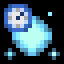Energy sphere with timer (BOUNCY_ORB_TIMER) [[toc](#BOUNCY_ORB_TIMER_CONTENTS)]

* **description**: A fast, arcing projectile that casts another spell after a timer runs out
* **type**: ACTION_TYPE_PROJECTILE
* **spawn_level**: [0, 2, 4]
* **spawn_probability**: [0.5, 0.5, 0.5]
* **price**: 150
* **mana**: 50
* **max_uses**: 0
* **never_unlimited**: false
* **spawn_manual_unlock**: false
* **recursive**: false
* **ai_never_uses**: false
* **is_dangerous_blast**: false
* **related_projectiles**: {"data/entities/projectiles/deck/bouncy_orb.xml"}
* **spawn_requires_flag**: 
* **related_extra_entities**: 
* **action**:

```lua
 function()
      add_projectile_trigger_timer("data/entities/projectiles/deck/bouncy_orb.xml",200,1)
      c.fire_rate_wait = c.fire_rate_wait + 10
      shot_effects.recoil_knockback = 20.0
    end,
```


### <a id="BUBBLESHOT"></a>Bubble spark (BUBBLESHOT) [[toc](#BUBBLESHOT_CONTENTS)]

* **description**: A bouncy, inaccurate spell
* **type**: ACTION_TYPE_PROJECTILE
* **spawn_level**: [0, 1, 2, 3]
* **spawn_probability**: [1.0, 1.0, 1.0, 0.5]
* **price**: 100
* **mana**: 5
* **max_uses**: 0
* **never_unlimited**: false
* **spawn_manual_unlock**: false
* **recursive**: false
* **ai_never_uses**: false
* **is_dangerous_blast**: false
* **related_projectiles**: {"data/entities/projectiles/deck/bubbleshot.xml"}
* **spawn_requires_flag**: 
* **related_extra_entities**: 
* **action**:

```lua
 function()
      add_projectile("data/entities/projectiles/deck/bubbleshot.xml")
      c.fire_rate_wait = c.fire_rate_wait - 5
      c.dampening = 0.1
    end,
```


### <a id="BUBBLESHOT_TRIGGER"></a>Bubble spark with trigger (BUBBLESHOT_TRIGGER) [[toc](#BUBBLESHOT_TRIGGER_CONTENTS)]

* **description**: A bouncy, inaccurate spell that casts another spell upon collision
* **type**: ACTION_TYPE_PROJECTILE
* **spawn_level**: [1, 2, 3]
* **spawn_probability**: [0.5, 0.5, 1.0]
* **price**: 120
* **mana**: 16
* **max_uses**: 0
* **never_unlimited**: false
* **spawn_manual_unlock**: false
* **recursive**: false
* **ai_never_uses**: false
* **is_dangerous_blast**: false
* **related_projectiles**: {"data/entities/projectiles/deck/bubbleshot.xml"}
* **spawn_requires_flag**: 
* **related_extra_entities**: 
* **action**:

```lua
 function()
      c.fire_rate_wait = c.fire_rate_wait - 5
      c.dampening = 0.1
      add_projectile_trigger_hit_world("data/entities/projectiles/deck/bubbleshot.xml", 1)
    end,
```


### <a id="BUCKSHOT"></a>Triplicate bolt (BUCKSHOT) [[toc](#BUCKSHOT_CONTENTS)]

* **description**: A formation of three small, fast bolts
* **type**: ACTION_TYPE_PROJECTILE
* **spawn_level**: [0, 1, 2, 3, 4]
* **spawn_probability**: [1.0, 1.0, 1.0, 1.0, 1.0]
* **price**: 160
* **mana**: 25
* **max_uses**: 0
* **never_unlimited**: false
* **spawn_manual_unlock**: false
* **recursive**: false
* **ai_never_uses**: false
* **is_dangerous_blast**: false
* **related_projectiles**: {"data/entities/projectiles/deck/buckshot_player.xml",3}
* **spawn_requires_flag**: 
* **related_extra_entities**: 
* **action**:

```lua
 function()
      add_projectile("data/entities/projectiles/deck/buckshot_player.xml")
      add_projectile("data/entities/projectiles/deck/buckshot_player.xml")
      add_projectile("data/entities/projectiles/deck/buckshot_player.xml")
      c.fire_rate_wait = c.fire_rate_wait + 8
      c.spread_degrees = c.spread_degrees + 14.0
    end,
```


### <a id="BULLET"></a>Magic arrow (BULLET) [[toc](#BULLET_CONTENTS)]

* **description**: A handy magical arrow
* **type**: ACTION_TYPE_PROJECTILE
* **spawn_level**: [1, 2, 3, 4, 5]
* **spawn_probability**: [1.0, 1.0, 1.0, 1.0, 1.0]
* **price**: 150
* **mana**: 20
* **max_uses**: 0
* **never_unlimited**: false
* **spawn_manual_unlock**: false
* **recursive**: false
* **ai_never_uses**: false
* **is_dangerous_blast**: false
* **related_projectiles**: {"data/entities/projectiles/deck/bullet.xml"}
* **spawn_requires_flag**: 
* **related_extra_entities**: 
* **action**:

```lua
 function()
      add_projectile("data/entities/projectiles/deck/bullet.xml")
      c.fire_rate_wait = c.fire_rate_wait + 4
      c.screenshake = c.screenshake + 2
      c.spread_degrees = c.spread_degrees + 2.0
      c.damage_critical_chance = c.damage_critical_chance + 5
      shot_effects.recoil_knockback = shot_effects.recoil_knockback + 23.0
    end,
```


### <a id="BULLET_TIMER"></a>Magic arrow with timer (BULLET_TIMER) [[toc](#BULLET_TIMER_CONTENTS)]

* **description**: A magical arrow that casts another spell after a timer runs out
* **type**: ACTION_TYPE_PROJECTILE
* **spawn_level**: [2, 3, 4, 5, 6]
* **spawn_probability**: [0.5, 0.5, 0.5, 0.5, 0.5]
* **price**: 190
* **mana**: 35
* **max_uses**: 0
* **never_unlimited**: false
* **spawn_manual_unlock**: false
* **recursive**: false
* **ai_never_uses**: false
* **is_dangerous_blast**: false
* **related_projectiles**: {"data/entities/projectiles/deck/bullet.xml"}
* **spawn_requires_flag**: 
* **related_extra_entities**: 
* **action**:

```lua
 function()
      c.fire_rate_wait = c.fire_rate_wait + 4
      c.screenshake = c.screenshake + 2
      c.spread_degrees = c.spread_degrees + 2.0
      c.damage_critical_chance = c.damage_critical_chance + 5
      add_projectile_trigger_timer("data/entities/projectiles/deck/bullet.xml", 10, 1)
      shot_effects.recoil_knockback = shot_effects.recoil_knockback + 23.0
    end,
```


### <a id="BULLET_TRIGGER"></a>Magic arrow with trigger (BULLET_TRIGGER) [[toc](#BULLET_TRIGGER_CONTENTS)]

* **description**: A magical arrow that casts another spell upon collision
* **type**: ACTION_TYPE_PROJECTILE
* **spawn_level**: [1, 2, 3, 4, 5]
* **spawn_probability**: [0.5, 0.5, 0.5, 0.5, 0.5]
* **price**: 190
* **mana**: 35
* **max_uses**: 0
* **never_unlimited**: false
* **spawn_manual_unlock**: false
* **recursive**: false
* **ai_never_uses**: false
* **is_dangerous_blast**: false
* **related_projectiles**: {"data/entities/projectiles/deck/bullet.xml"}
* **spawn_requires_flag**: 
* **related_extra_entities**: 
* **action**:

```lua
 function()
      c.fire_rate_wait = c.fire_rate_wait + 4
      c.screenshake = c.screenshake + 2
      c.spread_degrees = c.spread_degrees + 2.0
      c.damage_critical_chance = c.damage_critical_chance + 5
      add_projectile_trigger_hit_world("data/entities/projectiles/deck/bullet.xml", 1)
      shot_effects.recoil_knockback = shot_effects.recoil_knockback + 23.0
    end,
```


### <a id="BURN_TRAIL"></a>Burning trail (BURN_TRAIL) [[toc](#BURN_TRAIL_CONTENTS)]

* **description**: Gives a projectile a tail of fire
* **type**: ACTION_TYPE_MODIFIER
* **spawn_level**: [0, 1, 2]
* **spawn_probability**: [0.3, 0.3, 0.3]
* **price**: 100
* **mana**: 5
* **max_uses**: 0
* **never_unlimited**: false
* **spawn_manual_unlock**: false
* **recursive**: false
* **ai_never_uses**: false
* **is_dangerous_blast**: false
* **related_projectiles**: 
* **spawn_requires_flag**: 
* **related_extra_entities**: { "data/entities/misc/burn.xml" }
* **action**:

```lua
 function()
      c.game_effect_entities = c.game_effect_entities .. "data/entities/misc/effect_apply_on_fire.xml,"
      c.extra_entities = c.extra_entities .. "data/entities/misc/burn.xml,"
      draw_actions( 1, true )
    end,
```


### <a id="BURST_2"></a>Double spell (BURST_2) [[toc](#BURST_2_CONTENTS)]

* **description**: Simultaneously casts 2 spells
* **type**: ACTION_TYPE_DRAW_MANY
* **spawn_level**: [0, 1, 2, 3, 4, 5, 6]
* **spawn_probability**: [0.8, 0.8, 0.8, 0.8, 0.8, 0.8, 0.8]
* **price**: 140
* **mana**: 0
* **max_uses**: 0
* **never_unlimited**: false
* **spawn_manual_unlock**: false
* **recursive**: false
* **ai_never_uses**: false
* **is_dangerous_blast**: false
* **related_projectiles**: 
* **spawn_requires_flag**: 
* **related_extra_entities**: 
* **action**:

```lua
 function()
      draw_actions( 2, true )
    end,
```


### <a id="BURST_3"></a>Triple spell (BURST_3) [[toc](#BURST_3_CONTENTS)]

* **description**: Simultaneously casts 3 spells
* **type**: ACTION_TYPE_DRAW_MANY
* **spawn_level**: [1, 2, 3, 4, 5, 6]
* **spawn_probability**: [0.7, 0.7, 0.7, 0.7, 0.7, 0.7]
* **price**: 160
* **mana**: 2
* **max_uses**: 0
* **never_unlimited**: false
* **spawn_manual_unlock**: false
* **recursive**: false
* **ai_never_uses**: false
* **is_dangerous_blast**: false
* **related_projectiles**: 
* **spawn_requires_flag**: 
* **related_extra_entities**: 
* **action**:

```lua
 function()
      draw_actions( 3, true )
    end,
```


### <a id="BURST_4"></a>Quadruple spell (BURST_4) [[toc](#BURST_4_CONTENTS)]

* **description**: Simultaneously casts 4 spells
* **type**: ACTION_TYPE_DRAW_MANY
* **spawn_level**: [2, 3, 4, 5, 6]
* **spawn_probability**: [0.6, 0.6, 0.6, 0.6, 0.6]
* **price**: 180
* **mana**: 5
* **max_uses**: 0
* **never_unlimited**: false
* **spawn_manual_unlock**: false
* **recursive**: false
* **ai_never_uses**: false
* **is_dangerous_blast**: false
* **related_projectiles**: 
* **spawn_requires_flag**: 
* **related_extra_entities**: 
* **action**:

```lua
 function()
      draw_actions( 4, true )
    end,
```


### <a id="BURST_8"></a>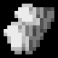Octuple spell (BURST_8) [[toc](#BURST_8_CONTENTS)]

* **description**: Simultaneously cast 8 spells
* **type**: ACTION_TYPE_DRAW_MANY
* **spawn_level**: [5, 6, 10]
* **spawn_probability**: [0.1, 0.1, 0.5]
* **price**: 300
* **mana**: 30
* **max_uses**: 0
* **never_unlimited**: false
* **spawn_manual_unlock**: false
* **recursive**: false
* **ai_never_uses**: false
* **is_dangerous_blast**: false
* **related_projectiles**: 
* **spawn_requires_flag**: card_unlocked_musicbox
* **related_extra_entities**: 
* **action**:

```lua
 function()
      draw_actions( 8, true )
    end,
```


### <a id="BURST_X"></a>Myriad Spell (BURST_X) [[toc](#BURST_X_CONTENTS)]

* **description**: Simultaneously casts as many spells as you have left uncast in your wand
* **type**: ACTION_TYPE_DRAW_MANY
* **spawn_level**: [5, 6, 10]
* **spawn_probability**: [0.1, 0.1, 0.5]
* **price**: 500
* **mana**: 50
* **max_uses**: 30
* **never_unlimited**: false
* **spawn_manual_unlock**: false
* **recursive**: false
* **ai_never_uses**: false
* **is_dangerous_blast**: false
* **related_projectiles**: 
* **spawn_requires_flag**: card_unlocked_musicbox
* **related_extra_entities**: 
* **action**:

```lua
 function()
      if ( #deck > 0 ) then
        draw_actions( #deck, true )
      end
    end,
```


### <a id="CHAINSAW"></a>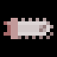Chainsaw (CHAINSAW) [[toc](#CHAINSAW_CONTENTS)]

* **description**: A good tool for cutting meat. Also has some magical properties...
* **type**: ACTION_TYPE_PROJECTILE
* **spawn_level**: [0, 2]
* **spawn_probability**: [1.0, 1.0]
* **price**: 80
* **mana**: 1
* **max_uses**: 0
* **never_unlimited**: false
* **spawn_manual_unlock**: false
* **recursive**: false
* **ai_never_uses**: false
* **is_dangerous_blast**: false
* **related_projectiles**: {"data/entities/projectiles/deck/chainsaw.xml"}
* **spawn_requires_flag**: 
* **related_extra_entities**: 
* **action**:

```lua
 function()
      add_projectile("data/entities/projectiles/deck/chainsaw.xml")
      c.fire_rate_wait = 0
      c.spread_degrees = c.spread_degrees + 6.0
      current_reload_time = current_reload_time - ACTION_DRAW_RELOAD_TIME_INCREASE - 10 -- this is a hack to get the digger reload time back to 0
    end,
```


### <a id="CHAIN_BOLT"></a>Chain bolt (CHAIN_BOLT) [[toc](#CHAIN_BOLT_CONTENTS)]

* **description**: Fires a mysterious bolt that jumps from enemy to enemy
* **type**: ACTION_TYPE_PROJECTILE
* **spawn_level**: [0, 4, 5, 6]
* **spawn_probability**: [1.0, 1.0, 1.0, 1.0]
* **price**: 240
* **mana**: 80
* **max_uses**: 0
* **never_unlimited**: false
* **spawn_manual_unlock**: false
* **recursive**: false
* **ai_never_uses**: false
* **is_dangerous_blast**: false
* **related_projectiles**: {"data/entities/projectiles/deck/chain_bolt.xml"}
* **spawn_requires_flag**: 
* **related_extra_entities**: 
* **action**:

```lua
 function()
      add_projectile("data/entities/projectiles/deck/chain_bolt.xml")
      c.spread_degrees = c.spread_degrees + 14.0
      c.fire_rate_wait = c.fire_rate_wait + 45
    end,
```


### <a id="CHAIN_SHOT"></a>Chain Spell (CHAIN_SHOT) [[toc](#CHAIN_SHOT_CONTENTS)]

* **description**: Causes a projectile to cast a copy of itself upon expiring, up to 5 times
* **type**: ACTION_TYPE_MODIFIER
* **spawn_level**: [2, 4, 5]
* **spawn_probability**: [0.4, 0.6, 0.8]
* **price**: 240
* **mana**: 70
* **max_uses**: 0
* **never_unlimited**: false
* **spawn_manual_unlock**: false
* **recursive**: false
* **ai_never_uses**: false
* **is_dangerous_blast**: false
* **related_projectiles**: 
* **spawn_requires_flag**: 
* **related_extra_entities**: { "data/entities/misc/chain_shot.xml" }
* **action**:

```lua
 function()
      c.extra_entities = c.extra_entities .. "data/entities/misc/chain_shot.xml,"
      c.lifetime_add = c.lifetime_add - 30
      c.damage_projectile_add = c.damage_projectile_add - 0.2
      c.explosion_radius = c.explosion_radius - 5.0
      if (c.explosion_radius < 0) then
        c.explosion_radius = 0
      end
      c.spread_degrees = c.spread_degrees + 10.0
      draw_actions( 1, true )
    end,
```


### <a id="CHAOS_POLYMORPH_FIELD"></a>Circle of unstable metamorphosis (CHAOS_POLYMORPH_FIELD) [[toc](#CHAOS_POLYMORPH_FIELD_CONTENTS)]

* **description**: A field of transformative magic
* **type**: ACTION_TYPE_STATIC_PROJECTILE
* **spawn_level**: [1, 2, 3, 4, 5, 6]
* **spawn_probability**: [0.3, 0.3, 0.5, 0.6, 0.3, 0.3]
* **price**: 200
* **mana**: 20
* **max_uses**: 10
* **never_unlimited**: false
* **spawn_manual_unlock**: false
* **recursive**: false
* **ai_never_uses**: false
* **is_dangerous_blast**: false
* **related_projectiles**: {"data/entities/projectiles/deck/chaos_polymorph_field.xml"}
* **spawn_requires_flag**: 
* **related_extra_entities**: 
* **action**:

```lua
 function()
      add_projectile("data/entities/projectiles/deck/chaos_polymorph_field.xml")
      c.fire_rate_wait = c.fire_rate_wait + 15
    end,
```


### <a id="CHAOTIC_ARC"></a>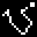Chaotic path (CHAOTIC_ARC) [[toc](#CHAOTIC_ARC_CONTENTS)]

* **description**: Causes a projectile to chaotically fly wherever it wishes
* **type**: ACTION_TYPE_MODIFIER
* **spawn_level**: [1, 3, 5]
* **spawn_probability**: [0.4, 0.4, 0.4]
* **price**: 10
* **mana**: 0
* **max_uses**: 0
* **never_unlimited**: false
* **spawn_manual_unlock**: false
* **recursive**: false
* **ai_never_uses**: false
* **is_dangerous_blast**: false
* **related_projectiles**: 
* **spawn_requires_flag**: 
* **related_extra_entities**: { "data/entities/misc/chaotic_arc.xml" }
* **action**:

```lua
 function()
      c.extra_entities = c.extra_entities .. "data/entities/misc/chaotic_arc.xml,"
      c.speed_multiplier = c.speed_multiplier * 2
      
      if ( c.speed_multiplier >= 20 ) then
        c.speed_multiplier = math.min( c.speed_multiplier, 20 )
      elseif ( c.speed_multiplier < 0 ) then
        c.speed_multiplier = 0
      end
      
      draw_actions( 1, true )
    end,
```


### <a id="CIRCLE_ACID"></a>Circle of acid (CIRCLE_ACID) [[toc](#CIRCLE_ACID_CONTENTS)]

* **description**: An expanding circle of dripping acid
* **type**: ACTION_TYPE_MATERIAL
* **spawn_level**: [1, 2, 3, 4]
* **spawn_probability**: [0.4, 0.4, 0.4, 0.4]
* **price**: 180
* **mana**: 40
* **max_uses**: 4
* **never_unlimited**: false
* **spawn_manual_unlock**: false
* **recursive**: false
* **ai_never_uses**: false
* **is_dangerous_blast**: false
* **related_projectiles**: {"data/entities/projectiles/deck/circle_acid.xml"}
* **spawn_requires_flag**: 
* **related_extra_entities**: 
* **action**:

```lua
 function()
      add_projectile("data/entities/projectiles/deck/circle_acid.xml")
      c.fire_rate_wait = c.fire_rate_wait + 20
    end,
```


### <a id="CIRCLE_FIRE"></a>Circle of fire (CIRCLE_FIRE) [[toc](#CIRCLE_FIRE_CONTENTS)]

* **description**: An expanding circle of burning air
* **type**: ACTION_TYPE_MATERIAL
* **spawn_level**: [1, 2, 3, 4]
* **spawn_probability**: [0.4, 0.4, 0.4, 0.4]
* **price**: 170
* **mana**: 20
* **max_uses**: 15
* **never_unlimited**: false
* **spawn_manual_unlock**: false
* **recursive**: false
* **ai_never_uses**: false
* **is_dangerous_blast**: false
* **related_projectiles**: {"data/entities/projectiles/deck/circle_fire.xml"}
* **spawn_requires_flag**: 
* **related_extra_entities**: 
* **action**:

```lua
 function()
      add_projectile("data/entities/projectiles/deck/circle_fire.xml")
      c.fire_rate_wait = c.fire_rate_wait + 20
    end,
```


### <a id="CIRCLE_OIL"></a>Circle of oil (CIRCLE_OIL) [[toc](#CIRCLE_OIL_CONTENTS)]

* **description**: An expanding circle of slick oil
* **type**: ACTION_TYPE_MATERIAL
* **spawn_level**: [1, 2, 3, 4]
* **spawn_probability**: [0.4, 0.4, 0.4, 0.4]
* **price**: 160
* **mana**: 20
* **max_uses**: 15
* **never_unlimited**: false
* **spawn_manual_unlock**: false
* **recursive**: false
* **ai_never_uses**: false
* **is_dangerous_blast**: false
* **related_projectiles**: {"data/entities/projectiles/deck/circle_oil.xml"}
* **spawn_requires_flag**: 
* **related_extra_entities**: 
* **action**:

```lua
 function()
      add_projectile("data/entities/projectiles/deck/circle_oil.xml")
      c.fire_rate_wait = c.fire_rate_wait + 20
    end,
```


### <a id="CIRCLE_SHAPE"></a>Formation - hexagon (CIRCLE_SHAPE) [[toc](#CIRCLE_SHAPE_CONTENTS)]

* **description**: Casts 6 spells in a hexagonal pattern
* **type**: ACTION_TYPE_DRAW_MANY
* **spawn_level**: [1, 2, 3, 4, 5, 6]
* **spawn_probability**: [0.1, 0.2, 0.3, 0.3, 0.3, 0.3]
* **price**: 150
* **mana**: 6
* **max_uses**: 0
* **never_unlimited**: false
* **spawn_manual_unlock**: false
* **recursive**: false
* **ai_never_uses**: false
* **is_dangerous_blast**: false
* **related_projectiles**: 
* **spawn_requires_flag**: 
* **related_extra_entities**: 
* **action**:

```lua
 function()
      draw_actions(6, true)
      c.pattern_degrees = 180
    end,
```


### <a id="CIRCLE_WATER"></a>Circle of water (CIRCLE_WATER) [[toc](#CIRCLE_WATER_CONTENTS)]

* **description**: An expanding circle of water
* **type**: ACTION_TYPE_MATERIAL
* **spawn_level**: [1, 2, 3, 4]
* **spawn_probability**: [0.4, 0.4, 0.4, 0.4]
* **price**: 160
* **mana**: 20
* **max_uses**: 15
* **never_unlimited**: false
* **spawn_manual_unlock**: false
* **recursive**: false
* **ai_never_uses**: false
* **is_dangerous_blast**: false
* **related_projectiles**: {"data/entities/projectiles/deck/circle_water.xml"}
* **spawn_requires_flag**: 
* **related_extra_entities**: 
* **action**:

```lua
 function()
      add_projectile("data/entities/projectiles/deck/circle_water.xml")
      c.fire_rate_wait = c.fire_rate_wait + 20
    end,
```


### <a id="CLIPPING_SHOT"></a>Drilling shot (CLIPPING_SHOT) [[toc](#CLIPPING_SHOT_CONTENTS)]

* **description**: Gives a projectile the power to go through the ground
* **type**: ACTION_TYPE_MODIFIER
* **spawn_level**: [2, 3, 4, 5, 6]
* **spawn_probability**: [0.6, 0.6, 0.6, 0.6, 0.6]
* **price**: 200
* **mana**: 160
* **max_uses**: 0
* **never_unlimited**: false
* **spawn_manual_unlock**: false
* **recursive**: false
* **ai_never_uses**: false
* **is_dangerous_blast**: false
* **related_projectiles**: 
* **spawn_requires_flag**: 
* **related_extra_entities**: { "data/entities/misc/clipping_shot.xml" }
* **action**:

```lua
 function()
      c.extra_entities = c.extra_entities .. "data/entities/misc/clipping_shot.xml,"
      c.fire_rate_wait = c.fire_rate_wait + 50
      current_reload_time = current_reload_time + 40
      draw_actions( 1, true )
    end,
```


### <a id="CLOUD_ACID"></a>Acid cloud (CLOUD_ACID) [[toc](#CLOUD_ACID_CONTENTS)]

* **description**: Creates a rain of acid
* **type**: ACTION_TYPE_STATIC_PROJECTILE
* **spawn_level**: [0, 1, 2, 3, 4, 5]
* **spawn_probability**: [0.2, 0.2, 0.2, 0.2, 0.2, 0.2]
* **price**: 180
* **mana**: 90
* **max_uses**: 8
* **never_unlimited**: false
* **spawn_manual_unlock**: false
* **recursive**: false
* **ai_never_uses**: false
* **is_dangerous_blast**: false
* **related_projectiles**: {"data/entities/projectiles/deck/cloud_acid.xml"}
* **spawn_requires_flag**: 
* **related_extra_entities**: 
* **action**:

```lua
 function()
      add_projectile("data/entities/projectiles/deck/cloud_acid.xml")
      c.fire_rate_wait = c.fire_rate_wait + 15
    end,
```


### <a id="CLOUD_BLOOD"></a>Blood cloud (CLOUD_BLOOD) [[toc](#CLOUD_BLOOD_CONTENTS)]

* **description**: Creates a rain of blood
* **type**: ACTION_TYPE_STATIC_PROJECTILE
* **spawn_level**: [0, 1, 2, 3, 4, 5]
* **spawn_probability**: [0.3, 0.3, 0.3, 0.3, 0.3, 0.3]
* **price**: 200
* **mana**: 60
* **max_uses**: 3
* **never_unlimited**: false
* **spawn_manual_unlock**: false
* **recursive**: false
* **ai_never_uses**: false
* **is_dangerous_blast**: false
* **related_projectiles**: {"data/entities/projectiles/deck/cloud_blood.xml"}
* **spawn_requires_flag**: 
* **related_extra_entities**: 
* **action**:

```lua
 function()
      add_projectile("data/entities/projectiles/deck/cloud_blood.xml")
      c.fire_rate_wait = c.fire_rate_wait + 30
    end,
```


### <a id="CLOUD_OIL"></a>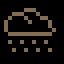Oil cloud (CLOUD_OIL) [[toc](#CLOUD_OIL_CONTENTS)]

* **description**: Creates a rain of oil
* **type**: ACTION_TYPE_STATIC_PROJECTILE
* **spawn_level**: [0, 1, 2, 3, 4, 5]
* **spawn_probability**: [0.4, 0.4, 0.4, 0.4, 0.4, 0.4]
* **price**: 100
* **mana**: 20
* **max_uses**: 15
* **never_unlimited**: false
* **spawn_manual_unlock**: false
* **recursive**: false
* **ai_never_uses**: false
* **is_dangerous_blast**: false
* **related_projectiles**: {"data/entities/projectiles/deck/cloud_oil.xml"}
* **spawn_requires_flag**: 
* **related_extra_entities**: 
* **action**:

```lua
 function()
      add_projectile("data/entities/projectiles/deck/cloud_oil.xml")
      c.fire_rate_wait = c.fire_rate_wait + 15
    end,
```


### <a id="CLOUD_THUNDER"></a>Thundercloud (CLOUD_THUNDER) [[toc](#CLOUD_THUNDER_CONTENTS)]

* **description**: Creates a stormy cloud
* **type**: ACTION_TYPE_STATIC_PROJECTILE
* **spawn_level**: [0, 1, 2, 3, 4, 5]
* **spawn_probability**: [0.3, 0.3, 0.3, 0.3, 0.3, 0.3]
* **price**: 190
* **mana**: 90
* **max_uses**: 5
* **never_unlimited**: false
* **spawn_manual_unlock**: false
* **recursive**: false
* **ai_never_uses**: false
* **is_dangerous_blast**: false
* **related_projectiles**: {"data/entities/projectiles/deck/cloud_thunder.xml"}
* **spawn_requires_flag**: card_unlocked_cloud_thunder
* **related_extra_entities**: 
* **action**:

```lua
 function()
      add_projectile("data/entities/projectiles/deck/cloud_thunder.xml")
      c.fire_rate_wait = c.fire_rate_wait + 30
    end,
```


### <a id="CLOUD_WATER"></a>Rain cloud (CLOUD_WATER) [[toc](#CLOUD_WATER_CONTENTS)]

* **description**: Creates a watery weather phenomenon
* **type**: ACTION_TYPE_STATIC_PROJECTILE
* **spawn_level**: [0, 1, 2, 3, 4, 5]
* **spawn_probability**: [0.4, 0.4, 0.4, 0.4, 0.4, 0.4]
* **price**: 140
* **mana**: 30
* **max_uses**: 10
* **never_unlimited**: false
* **spawn_manual_unlock**: false
* **recursive**: false
* **ai_never_uses**: false
* **is_dangerous_blast**: false
* **related_projectiles**: {"data/entities/projectiles/deck/cloud_water.xml"}
* **spawn_requires_flag**: 
* **related_extra_entities**: 
* **action**:

```lua
 function()
      add_projectile("data/entities/projectiles/deck/cloud_water.xml")
      c.fire_rate_wait = c.fire_rate_wait + 15
    end,
```


### <a id="COLOUR_BLUE"></a>Blue Glimmer (COLOUR_BLUE) [[toc](#COLOUR_BLUE_CONTENTS)]

* **description**: Gives a projectile a blue sparkly trail
* **type**: ACTION_TYPE_MODIFIER
* **spawn_level**: [2, 3, 4]
* **spawn_probability**: [0.1, 0.1, 0.1]
* **price**: 40
* **mana**: 0
* **max_uses**: 0
* **never_unlimited**: false
* **spawn_manual_unlock**: false
* **recursive**: false
* **ai_never_uses**: false
* **is_dangerous_blast**: false
* **related_projectiles**: 
* **spawn_requires_flag**: card_unlocked_paint
* **related_extra_entities**: { "data/entities/particles/tinyspark_red.xml", "data/entities/misc/colour_blue.xml" }
* **action**:

```lua
 function()
      c.extra_entities = c.extra_entities .. "data/entities/particles/tinyspark_red.xml,data/entities/misc/colour_blue.xml,"
      c.fire_rate_wait = c.fire_rate_wait - 8
      c.screenshake = c.screenshake - 2.5
      if ( c.screenshake < 0 ) then
        c.screenshake = 0
      end
      draw_actions( 1, true )
    end,
```


### <a id="COLOUR_GREEN"></a>Green Glimmer (COLOUR_GREEN) [[toc](#COLOUR_GREEN_CONTENTS)]

* **description**: Gives a projectile a green sparkly trail
* **type**: ACTION_TYPE_MODIFIER
* **spawn_level**: [2, 3, 4]
* **spawn_probability**: [0.1, 0.1, 0.1]
* **price**: 40
* **mana**: 0
* **max_uses**: 0
* **never_unlimited**: false
* **spawn_manual_unlock**: false
* **recursive**: false
* **ai_never_uses**: false
* **is_dangerous_blast**: false
* **related_projectiles**: 
* **spawn_requires_flag**: card_unlocked_paint
* **related_extra_entities**: { "data/entities/particles/tinyspark_red.xml", "data/entities/misc/colour_green.xml" }
* **action**:

```lua
 function()
      c.extra_entities = c.extra_entities .. "data/entities/particles/tinyspark_red.xml,data/entities/misc/colour_green.xml,"
      c.fire_rate_wait = c.fire_rate_wait - 8
      c.screenshake = c.screenshake - 2.5
      if ( c.screenshake < 0 ) then
        c.screenshake = 0
      end
      draw_actions( 1, true )
    end,
```


### <a id="COLOUR_INVIS"></a>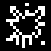Invisible Spell (COLOUR_INVIS) [[toc](#COLOUR_INVIS_CONTENTS)]

* **description**: Turns a projectile invisible
* **type**: ACTION_TYPE_MODIFIER
* **spawn_level**: [2, 3, 4]
* **spawn_probability**: [0.1, 0.1, 0.1]
* **price**: 40
* **mana**: 0
* **max_uses**: 0
* **never_unlimited**: false
* **spawn_manual_unlock**: false
* **recursive**: false
* **ai_never_uses**: false
* **is_dangerous_blast**: false
* **related_projectiles**: 
* **spawn_requires_flag**: card_unlocked_paint
* **related_extra_entities**: { "data/entities/misc/colour_invis.xml" }
* **action**:

```lua
 function()
      c.extra_entities = c.extra_entities .. "data/entities/misc/colour_invis.xml,"
      c.fire_rate_wait = c.fire_rate_wait - 8
      c.screenshake = c.screenshake - 2.5
      if ( c.screenshake < 0 ) then
        c.screenshake = 0
      end
      draw_actions( 1, true )
    end,
```


### <a id="COLOUR_ORANGE"></a>Orange Glimmer (COLOUR_ORANGE) [[toc](#COLOUR_ORANGE_CONTENTS)]

* **description**: Gives a projectile a orange sparkly trail
* **type**: ACTION_TYPE_MODIFIER
* **spawn_level**: [2, 3, 4]
* **spawn_probability**: [0.1, 0.1, 0.1]
* **price**: 40
* **mana**: 0
* **max_uses**: 0
* **never_unlimited**: false
* **spawn_manual_unlock**: false
* **recursive**: false
* **ai_never_uses**: false
* **is_dangerous_blast**: false
* **related_projectiles**: 
* **spawn_requires_flag**: card_unlocked_paint
* **related_extra_entities**: { "data/entities/particles/tinyspark_red.xml", "data/entities/misc/colour_orange.xml" }
* **action**:

```lua
 function()
      c.extra_entities = c.extra_entities .. "data/entities/particles/tinyspark_red.xml,data/entities/misc/colour_orange.xml,"
      c.fire_rate_wait = c.fire_rate_wait - 8
      c.screenshake = c.screenshake - 2.5
      if ( c.screenshake < 0 ) then
        c.screenshake = 0
      end
      draw_actions( 1, true )
    end,
```


### <a id="COLOUR_PURPLE"></a>Purple Glimmer (COLOUR_PURPLE) [[toc](#COLOUR_PURPLE_CONTENTS)]

* **description**: Gives a projectile a purple sparkly trail
* **type**: ACTION_TYPE_MODIFIER
* **spawn_level**: [2, 3, 4]
* **spawn_probability**: [0.1, 0.1, 0.1]
* **price**: 40
* **mana**: 0
* **max_uses**: 0
* **never_unlimited**: false
* **spawn_manual_unlock**: false
* **recursive**: false
* **ai_never_uses**: false
* **is_dangerous_blast**: false
* **related_projectiles**: 
* **spawn_requires_flag**: card_unlocked_paint
* **related_extra_entities**: { "data/entities/particles/tinyspark_red.xml", "data/entities/misc/colour_purple.xml" }
* **action**:

```lua
 function()
      c.extra_entities = c.extra_entities .. "data/entities/particles/tinyspark_red.xml,data/entities/misc/colour_purple.xml,"
      c.fire_rate_wait = c.fire_rate_wait - 8
      c.screenshake = c.screenshake - 2.5
      if ( c.screenshake < 0 ) then
        c.screenshake = 0
      end
      draw_actions( 1, true )
    end,
```


### <a id="COLOUR_RAINBOW"></a>Rainbow Glimmer (COLOUR_RAINBOW) [[toc](#COLOUR_RAINBOW_CONTENTS)]

* **description**: Gives a projectile a randomly colored sparkly trail
* **type**: ACTION_TYPE_MODIFIER
* **spawn_level**: [2, 3, 4]
* **spawn_probability**: [0.1, 0.1, 0.1]
* **price**: 40
* **mana**: 0
* **max_uses**: 0
* **never_unlimited**: false
* **spawn_manual_unlock**: false
* **recursive**: false
* **ai_never_uses**: false
* **is_dangerous_blast**: false
* **related_projectiles**: 
* **spawn_requires_flag**: card_unlocked_paint
* **related_extra_entities**: { "data/entities/particles/tinyspark_red.xml", "data/entities/misc/colour_rainbow.xml" }
* **action**:

```lua
 function()
      c.extra_entities = c.extra_entities .. "data/entities/particles/tinyspark_red.xml,data/entities/misc/colour_rainbow.xml,"
      c.fire_rate_wait = c.fire_rate_wait - 8
      c.screenshake = c.screenshake - 2.5
      if ( c.screenshake < 0 ) then
        c.screenshake = 0
      end
      draw_actions( 1, true )
    end,
```


### <a id="COLOUR_RED"></a>Red Glimmer (COLOUR_RED) [[toc](#COLOUR_RED_CONTENTS)]

* **description**: Gives a projectile a red sparkly trail
* **type**: ACTION_TYPE_MODIFIER
* **spawn_level**: [1, 2, 3, 4, 5, 6]
* **spawn_probability**: [0.2, 0.2, 0.2, 0.2, 0.2, 0.2]
* **price**: 40
* **mana**: 0
* **max_uses**: 0
* **never_unlimited**: false
* **spawn_manual_unlock**: false
* **recursive**: false
* **ai_never_uses**: false
* **is_dangerous_blast**: false
* **related_projectiles**: 
* **spawn_requires_flag**: card_unlocked_paint
* **related_extra_entities**: { "data/entities/particles/tinyspark_red.xml", "data/entities/misc/colour_red.xml" }
* **action**:

```lua
 function()
      c.extra_entities = c.extra_entities .. "data/entities/particles/tinyspark_red.xml,data/entities/misc/colour_red.xml,"
      c.fire_rate_wait = c.fire_rate_wait - 8
      c.screenshake = c.screenshake - 2.5
      if ( c.screenshake < 0 ) then
        c.screenshake = 0
      end
      draw_actions( 1, true )
    end,
```


### <a id="COLOUR_YELLOW"></a>Yellow Glimmer (COLOUR_YELLOW) [[toc](#COLOUR_YELLOW_CONTENTS)]

* **description**: Gives a projectile a yellow sparkly trail
* **type**: ACTION_TYPE_MODIFIER
* **spawn_level**: [2, 3, 4]
* **spawn_probability**: [0.1, 0.1, 0.1]
* **price**: 40
* **mana**: 0
* **max_uses**: 0
* **never_unlimited**: false
* **spawn_manual_unlock**: false
* **recursive**: false
* **ai_never_uses**: false
* **is_dangerous_blast**: false
* **related_projectiles**: 
* **spawn_requires_flag**: card_unlocked_paint
* **related_extra_entities**: { "data/entities/particles/tinyspark_red.xml", "data/entities/misc/colour_yellow.xml" }
* **action**:

```lua
 function()
      c.extra_entities = c.extra_entities .. "data/entities/particles/tinyspark_red.xml,data/entities/misc/colour_yellow.xml,"
      c.fire_rate_wait = c.fire_rate_wait - 8
      c.screenshake = c.screenshake - 2.5
      if ( c.screenshake < 0 ) then
        c.screenshake = 0
      end
      draw_actions( 1, true )
    end,
```


### <a id="CRITICAL_HIT"></a>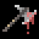Critical Plus (CRITICAL_HIT) [[toc](#CRITICAL_HIT_CONTENTS)]

* **description**: Gives a projectile +15% chance of a critical hit
* **type**: ACTION_TYPE_MODIFIER
* **spawn_level**: [1, 2, 3, 4, 5]
* **spawn_probability**: [0.6, 0.6, 0.6, 0.6, 0.6]
* **price**: 140
* **mana**: 5
* **max_uses**: 0
* **never_unlimited**: false
* **spawn_manual_unlock**: false
* **recursive**: false
* **ai_never_uses**: false
* **is_dangerous_blast**: false
* **related_projectiles**: 
* **spawn_requires_flag**: 
* **related_extra_entities**: 
* **action**:

```lua
 function()
      c.damage_critical_chance = c.damage_critical_chance + 15
      draw_actions( 1, true )
    end,
```


### <a id="CRUMBLING_EARTH"></a>Earthquake (CRUMBLING_EARTH) [[toc](#CRUMBLING_EARTH_CONTENTS)]

* **description**: Calls the anger of the earth
* **type**: ACTION_TYPE_PROJECTILE
* **spawn_level**: [2, 3, 4, 5, 6]
* **spawn_probability**: [0.6, 0.6, 0.6, 0.6, 0.6]
* **price**: 300
* **mana**: 240
* **max_uses**: 3
* **never_unlimited**: false
* **spawn_manual_unlock**: false
* **recursive**: false
* **ai_never_uses**: false
* **is_dangerous_blast**: false
* **related_projectiles**: {"data/entities/projectiles/deck/crumbling_earth.xml"}
* **spawn_requires_flag**: card_unlocked_crumbling_earth
* **related_extra_entities**: 
* **action**:

```lua
 function()
      add_projectile("data/entities/projectiles/deck/crumbling_earth.xml")
    end,
```


### <a id="CRUMBLING_EARTH_PROJECTILE"></a>Earthquake shot (CRUMBLING_EARTH_PROJECTILE) [[toc](#CRUMBLING_EARTH_PROJECTILE_CONTENTS)]

* **description**: Makes a projectile crumble the earth it hits
* **type**: ACTION_TYPE_MODIFIER
* **spawn_level**: [1, 2, 3, 4, 5]
* **spawn_probability**: [0.4, 0.4, 0.4, 0.4, 0.4]
* **price**: 200
* **mana**: 45
* **max_uses**: 15
* **never_unlimited**: false
* **spawn_manual_unlock**: false
* **recursive**: false
* **ai_never_uses**: false
* **is_dangerous_blast**: false
* **related_projectiles**: 
* **spawn_requires_flag**: 
* **related_extra_entities**: { "data/entities/misc/crumbling_earth_projectile.xml" }
* **action**:

```lua
 function()
      c.extra_entities = c.extra_entities .. "data/entities/misc/crumbling_earth_projectile.xml,"
      draw_actions( 1, true )
    end,
```


### <a id="CURSE"></a>Venomous Curse (CURSE) [[toc](#CURSE_CONTENTS)]

* **description**: Imbues a projectile with a curse that makes the target hit by the projectile to waste away
* **type**: ACTION_TYPE_MODIFIER
* **spawn_level**: [2, 3, 5]
* **spawn_probability**: [0.6, 0.8, 0.4]
* **price**: 140
* **mana**: 30
* **max_uses**: 0
* **never_unlimited**: false
* **spawn_manual_unlock**: false
* **recursive**: false
* **ai_never_uses**: false
* **is_dangerous_blast**: false
* **related_projectiles**: 
* **spawn_requires_flag**: 
* **related_extra_entities**: { "data/entities/misc/hitfx_curse.xml" }
* **action**:

```lua
 function()
      c.extra_entities = c.extra_entities .. "data/entities/misc/hitfx_curse.xml,"
      draw_actions( 1, true )
    end,
```


### <a id="CURSED_ORB"></a>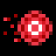Cursed sphere (CURSED_ORB) [[toc](#CURSED_ORB_CONTENTS)]

* **description**: A projectile that brings bad luck to anyone it hits
* **type**: ACTION_TYPE_PROJECTILE
* **spawn_level**: [1, 2, 3]
* **spawn_probability**: [0.3, 0.2, 0.1]
* **price**: 200
* **mana**: 40
* **max_uses**: 0
* **never_unlimited**: false
* **spawn_manual_unlock**: false
* **recursive**: false
* **ai_never_uses**: false
* **is_dangerous_blast**: false
* **related_projectiles**: {"data/entities/projectiles/orb_cursed.xml"}
* **spawn_requires_flag**: 
* **related_extra_entities**: 
* **action**:

```lua
 function()
      add_projectile("data/entities/projectiles/orb_cursed.xml")
      c.fire_rate_wait = c.fire_rate_wait + 20
      shot_effects.recoil_knockback = 40.0
    end,
```


### <a id="CURSE_WITHER_ELECTRICITY"></a>Weakening Curse - Electricity (CURSE_WITHER_ELECTRICITY) [[toc](#CURSE_WITHER_ELECTRICITY_CONTENTS)]

* **description**: Target hit by a projectile takes 25% extra electricity damage for a time
* **type**: ACTION_TYPE_MODIFIER
* **spawn_level**: [1, 4, 5, 6]
* **spawn_probability**: [0.2, 0.4, 0.9, 0.9]
* **price**: 100
* **mana**: 50
* **max_uses**: 0
* **never_unlimited**: false
* **spawn_manual_unlock**: false
* **recursive**: false
* **ai_never_uses**: false
* **is_dangerous_blast**: false
* **related_projectiles**: 
* **spawn_requires_flag**: 
* **related_extra_entities**: { "data/entities/misc/hitfx_curse_wither_electricity.xml" }
* **action**:

```lua
 function()
      c.extra_entities = c.extra_entities .. "data/entities/misc/hitfx_curse_wither_electricity.xml,"
      draw_actions( 1, true )
    end,
```


### <a id="CURSE_WITHER_EXPLOSION"></a>Weakening Curse - Explosives (CURSE_WITHER_EXPLOSION) [[toc](#CURSE_WITHER_EXPLOSION_CONTENTS)]

* **description**: Target hit by a projectile takes 25% extra explosion damage for a time
* **type**: ACTION_TYPE_MODIFIER
* **spawn_level**: [2, 3, 4, 5]
* **spawn_probability**: [0.2, 0.4, 0.9, 0.9]
* **price**: 100
* **mana**: 50
* **max_uses**: 0
* **never_unlimited**: false
* **spawn_manual_unlock**: false
* **recursive**: false
* **ai_never_uses**: false
* **is_dangerous_blast**: false
* **related_projectiles**: 
* **spawn_requires_flag**: 
* **related_extra_entities**: { "data/entities/misc/hitfx_curse_wither_explosion.xml" }
* **action**:

```lua
 function()
      c.extra_entities = c.extra_entities .. "data/entities/misc/hitfx_curse_wither_explosion.xml,"
      draw_actions( 1, true )
    end,
```


### <a id="CURSE_WITHER_MELEE"></a>Weakening Curse - Melee (CURSE_WITHER_MELEE) [[toc](#CURSE_WITHER_MELEE_CONTENTS)]

* **description**: Target hit by a projectile takes 25% extra melee damage for a time
* **type**: ACTION_TYPE_MODIFIER
* **spawn_level**: [3, 4, 5, 6]
* **spawn_probability**: [0.2, 0.4, 0.9, 0.9]
* **price**: 100
* **mana**: 50
* **max_uses**: 0
* **never_unlimited**: false
* **spawn_manual_unlock**: false
* **recursive**: false
* **ai_never_uses**: false
* **is_dangerous_blast**: false
* **related_projectiles**: 
* **spawn_requires_flag**: 
* **related_extra_entities**: { "data/entities/misc/hitfx_curse_wither_melee.xml" }
* **action**:

```lua
 function()
      c.extra_entities = c.extra_entities .. "data/entities/misc/hitfx_curse_wither_melee.xml,"
      draw_actions( 1, true )
    end,
```


### <a id="CURSE_WITHER_PROJECTILE"></a>Weakening Curse - Projectiles (CURSE_WITHER_PROJECTILE) [[toc](#CURSE_WITHER_PROJECTILE_CONTENTS)]

* **description**: Target hit by a projectile takes 25% extra projectile damage for a time
* **type**: ACTION_TYPE_MODIFIER
* **spawn_level**: [3, 4, 5, 6]
* **spawn_probability**: [0.2, 0.4, 0.9, 0.9]
* **price**: 100
* **mana**: 50
* **max_uses**: 0
* **never_unlimited**: false
* **spawn_manual_unlock**: false
* **recursive**: false
* **ai_never_uses**: false
* **is_dangerous_blast**: false
* **related_projectiles**: 
* **spawn_requires_flag**: 
* **related_extra_entities**: { "data/entities/misc/hitfx_curse_wither_projectile.xml" }
* **action**:

```lua
 function()
      c.extra_entities = c.extra_entities .. "data/entities/misc/hitfx_curse_wither_projectile.xml,"
      draw_actions( 1, true )
    end,
```


### <a id="DAMAGE"></a>Damage Plus (DAMAGE) [[toc](#DAMAGE_CONTENTS)]

* **description**: Increases the damage done by a projectile
* **type**: ACTION_TYPE_MODIFIER
* **spawn_level**: [1, 2, 3, 4, 5]
* **spawn_probability**: [0.6, 0.6, 0.6, 0.6, 0.6]
* **price**: 140
* **mana**: 5
* **max_uses**: 0
* **never_unlimited**: false
* **spawn_manual_unlock**: false
* **recursive**: false
* **ai_never_uses**: false
* **is_dangerous_blast**: false
* **related_projectiles**: 
* **spawn_requires_flag**: 
* **related_extra_entities**: { "data/entities/particles/tinyspark_yellow.xml" }
* **action**:

```lua
 function()
      c.damage_projectile_add = c.damage_projectile_add + 0.4
      c.gore_particles    = c.gore_particles + 5
      c.fire_rate_wait    = c.fire_rate_wait + 5
      c.extra_entities    = c.extra_entities .. "data/entities/particles/tinyspark_yellow.xml,"
      shot_effects.recoil_knockback = shot_effects.recoil_knockback + 10.0
      draw_actions( 1, true )
    end,
```


### <a id="DAMAGE_FOREVER"></a>Mana To Damage (DAMAGE_FOREVER) [[toc](#DAMAGE_FOREVER_CONTENTS)]

* **description**: If the wand has more than 50 mana, all mana over that is converted into additional damage
* **type**: ACTION_TYPE_MODIFIER
* **spawn_level**: [2, 3, 4, 5, 6]
* **spawn_probability**: [0.2, 0.4, 0.6, 0.4, 0.2]
* **price**: 240
* **mana**: 0
* **max_uses**: 20
* **never_unlimited**: true
* **spawn_manual_unlock**: false
* **recursive**: false
* **ai_never_uses**: false
* **is_dangerous_blast**: false
* **related_projectiles**: 
* **spawn_requires_flag**: 
* **related_extra_entities**: { "data/entities/particles/tinyspark_red.xml" }
* **action**:

```lua
 function()
      if ( mana > 50 ) then
        local manaforspell = mana - 50
        c.damage_projectile_add = c.damage_projectile_add + 0.025 * manaforspell
        mana = 50
      end
      
      c.gore_particles    = c.gore_particles + 15
      c.fire_rate_wait    = c.fire_rate_wait + 15
      current_reload_time = current_reload_time + 10
      c.extra_entities    = c.extra_entities .. "data/entities/particles/tinyspark_red.xml,"
      shot_effects.recoil_knockback = shot_effects.recoil_knockback + 10.0
      draw_actions( 1, true )
    end,
```


### <a id="DAMAGE_RANDOM"></a>Random damage (DAMAGE_RANDOM) [[toc](#DAMAGE_RANDOM_CONTENTS)]

* **description**: Randomly increases or lowers the damage done by projectiles
* **type**: ACTION_TYPE_MODIFIER
* **spawn_level**: [3, 4, 5]
* **spawn_probability**: [0.6, 0.6, 0.6]
* **price**: 200
* **mana**: 15
* **max_uses**: 0
* **never_unlimited**: false
* **spawn_manual_unlock**: false
* **recursive**: false
* **ai_never_uses**: false
* **is_dangerous_blast**: false
* **related_projectiles**: 
* **spawn_requires_flag**: card_unlocked_pyramid
* **related_extra_entities**: { "data/entities/particles/tinyspark_yellow.xml" }
* **action**:

```lua
 function()
      SetRandomSeed( GameGetFrameNum(), GameGetFrameNum() + 253 )
      local multiplier = 0
      multiplier = Random( -3, 4 ) * Random( 0, 2 )
      local result = 0
      result = c.damage_projectile_add + 0.4 * multiplier
      c.damage_projectile_add = result
      c.gore_particles    = c.gore_particles + 5 * multiplier
      c.fire_rate_wait    = c.fire_rate_wait + 5
      c.extra_entities    = c.extra_entities .. "data/entities/particles/tinyspark_yellow.xml,"
      shot_effects.recoil_knockback = shot_effects.recoil_knockback + 10.0 * multiplier
      draw_actions( 1, true )
    end,
```


### <a id="DARKFLAME"></a>Path of dark flame (DARKFLAME) [[toc](#DARKFLAME_CONTENTS)]

* **description**: A trail of dark, deadly flames
* **type**: ACTION_TYPE_PROJECTILE
* **spawn_level**: [3, 5, 6]
* **spawn_probability**: [1.0, 1.0, 1.0]
* **price**: 180
* **mana**: 90
* **max_uses**: 60
* **never_unlimited**: false
* **spawn_manual_unlock**: false
* **recursive**: false
* **ai_never_uses**: false
* **is_dangerous_blast**: false
* **related_projectiles**: {"data/entities/projectiles/deck/darkflame.xml"}
* **spawn_requires_flag**: 
* **related_extra_entities**: 
* **action**:

```lua
 function()
      add_projectile("data/entities/projectiles/darkflame.xml")
      c.fire_rate_wait = c.fire_rate_wait + 20
    end,
```


### <a id="DEATH_CROSS"></a>Death cross (DEATH_CROSS) [[toc](#DEATH_CROSS_CONTENTS)]

* **description**: A deadly energy cross that explodes after a short time
* **type**: ACTION_TYPE_PROJECTILE
* **spawn_level**: [1, 2, 3, 4, 5, 6]
* **spawn_probability**: [1.0, 0.6, 0.6, 0.6, 0.6, 0.6]
* **price**: 210
* **mana**: 80
* **max_uses**: 0
* **never_unlimited**: false
* **spawn_manual_unlock**: false
* **recursive**: false
* **ai_never_uses**: false
* **is_dangerous_blast**: false
* **related_projectiles**: {"data/entities/projectiles/deck/death_cross.xml"}
* **spawn_requires_flag**: 
* **related_extra_entities**: 
* **action**:

```lua
 function()
      add_projectile("data/entities/projectiles/deck/death_cross.xml")
      c.fire_rate_wait = c.fire_rate_wait + 40
    end,
```


### <a id="DEATH_CROSS_BIG"></a>Giga death cross (DEATH_CROSS_BIG) [[toc](#DEATH_CROSS_BIG_CONTENTS)]

* **description**: A giant, deadly energy cross that explodes after a short time
* **type**: ACTION_TYPE_PROJECTILE
* **spawn_level**: [2, 3, 4, 5, 6, 10]
* **spawn_probability**: [0.4, 0.4, 0.4, 0.4, 0.4, 0.2]
* **price**: 310
* **mana**: 150
* **max_uses**: 8
* **never_unlimited**: false
* **spawn_manual_unlock**: false
* **recursive**: false
* **ai_never_uses**: false
* **is_dangerous_blast**: false
* **related_projectiles**: {"data/entities/projectiles/deck/death_cross_big.xml"}
* **spawn_requires_flag**: 
* **related_extra_entities**: 
* **action**:

```lua
 function()
      add_projectile("data/entities/projectiles/deck/death_cross_big.xml")
      c.fire_rate_wait = c.fire_rate_wait + 70
      shot_effects.recoil_knockback = shot_effects.recoil_knockback + 30.0
    end,
```


### <a id="DECELERATING_SHOT"></a>Decelerating shot (DECELERATING_SHOT) [[toc](#DECELERATING_SHOT_CONTENTS)]

* **description**: Makes a projectile decelerate as it flies
* **type**: ACTION_TYPE_MODIFIER
* **spawn_level**: [2, 3, 4]
* **spawn_probability**: [0.3, 0.3, 0.5]
* **price**: 80
* **mana**: 10
* **max_uses**: 0
* **never_unlimited**: false
* **spawn_manual_unlock**: false
* **recursive**: false
* **ai_never_uses**: false
* **is_dangerous_blast**: false
* **related_projectiles**: 
* **spawn_requires_flag**: 
* **related_extra_entities**: { "data/entities/misc/decelerating_shot.xml" }
* **action**:

```lua
 function()
      c.fire_rate_wait    = c.fire_rate_wait - 8
      c.speed_multiplier = c.speed_multiplier * 1.68
      shot_effects.recoil_knockback = shot_effects.recoil_knockback - 10.0
      c.extra_entities = c.extra_entities .. "data/entities/misc/decelerating_shot.xml,"
      
      if ( c.speed_multiplier >= 20 ) then
        c.speed_multiplier = math.min( c.speed_multiplier, 20 )
      elseif ( c.speed_multiplier < 0 ) then
        c.speed_multiplier = 0
      end
      
      draw_actions( 1, true )
    end,
```


### <a id="DELAYED_SPELL"></a>Delayed spellcast (DELAYED_SPELL) [[toc](#DELAYED_SPELL_CONTENTS)]

* **description**: A static, magical phenomenon that casts 3 extra spells after a short while
* **type**: ACTION_TYPE_STATIC_PROJECTILE
* **spawn_level**: [0, 1, 2, 4, 5, 6]
* **spawn_probability**: [1.0, 1.0, 1.0, 1.0, 1.0, 1.0]
* **price**: 240
* **mana**: 20
* **max_uses**: 0
* **never_unlimited**: false
* **spawn_manual_unlock**: false
* **recursive**: false
* **ai_never_uses**: false
* **is_dangerous_blast**: false
* **related_projectiles**: {"data/entities/projectiles/deck/delayed_spell.xml"}
* **spawn_requires_flag**: 
* **related_extra_entities**: 
* **action**:

```lua
 function()
      add_projectile_trigger_death("data/entities/projectiles/deck/delayed_spell.xml", 3)
      c.fire_rate_wait = c.fire_rate_wait + 10
    end,
```


### <a id="DESTRUCTION"></a>Destruction (DESTRUCTION) [[toc](#DESTRUCTION_CONTENTS)]

* **description**: Instantly decimates foes around you, at the cost of your HP
* **type**: ACTION_TYPE_STATIC_PROJECTILE
* **spawn_level**: [10]
* **spawn_probability**: [1.0]
* **price**: 600
* **mana**: 600
* **max_uses**: 5
* **never_unlimited**: false
* **spawn_manual_unlock**: false
* **recursive**: false
* **ai_never_uses**: true
* **is_dangerous_blast**: false
* **related_projectiles**: {"data/entities/projectiles/deck/destruction.xml"}
* **spawn_requires_flag**: card_unlocked_destruction
* **related_extra_entities**: 
* **action**:

```lua
 function()
      add_projectile("data/entities/projectiles/deck/destruction.xml")
      c.fire_rate_wait = c.fire_rate_wait + 100
      current_reload_time = current_reload_time + 300
    end,
```


### <a id="DIGGER"></a>Digging bolt (DIGGER) [[toc](#DIGGER_CONTENTS)]

* **description**: A bolt that is ideal for mining operations
* **type**: ACTION_TYPE_PROJECTILE
* **spawn_level**: [1, 2]
* **spawn_probability**: [1.0, 0.5]
* **price**: 70
* **mana**: 0
* **max_uses**: 0
* **never_unlimited**: false
* **spawn_manual_unlock**: false
* **recursive**: false
* **ai_never_uses**: false
* **is_dangerous_blast**: false
* **related_projectiles**: {"data/entities/projectiles/deck/digger.xml"}
* **spawn_requires_flag**: 
* **related_extra_entities**: 
* **action**:

```lua
 function()
      add_projectile("data/entities/projectiles/deck/digger.xml")
      c.fire_rate_wait = c.fire_rate_wait + 1
      current_reload_time = current_reload_time - ACTION_DRAW_RELOAD_TIME_INCREASE - 10 -- this is a hack to get the digger reload time back to 0
    end,
```


### <a id="DISC_BULLET"></a>Disc projectile (DISC_BULLET) [[toc](#DISC_BULLET_CONTENTS)]

* **description**: Summons a sharp disc projectile
* **type**: ACTION_TYPE_PROJECTILE
* **spawn_level**: [0, 2, 4]
* **spawn_probability**: [1.0, 1.0, 1.0]
* **price**: 120
* **mana**: 20
* **max_uses**: 0
* **never_unlimited**: false
* **spawn_manual_unlock**: false
* **recursive**: false
* **ai_never_uses**: false
* **is_dangerous_blast**: false
* **related_projectiles**: {"data/entities/projectiles/deck/disc_bullet.xml"}
* **spawn_requires_flag**: 
* **related_extra_entities**: 
* **action**:

```lua
 function()
      add_projectile("data/entities/projectiles/deck/disc_bullet.xml")
      c.fire_rate_wait = c.fire_rate_wait + 10
      c.spread_degrees = c.spread_degrees + 2.0
      shot_effects.recoil_knockback = 20.0
    end,
```


### <a id="DISC_BULLET_BIG"></a>Giga disc projectile (DISC_BULLET_BIG) [[toc](#DISC_BULLET_BIG_CONTENTS)]

* **description**: Summons a large, serrated disc with a curious flight pattern
* **type**: ACTION_TYPE_PROJECTILE
* **spawn_level**: [0, 2, 4, 10]
* **spawn_probability**: [0.6, 0.6, 0.6, 0.1]
* **price**: 180
* **mana**: 38
* **max_uses**: 0
* **never_unlimited**: false
* **spawn_manual_unlock**: false
* **recursive**: false
* **ai_never_uses**: false
* **is_dangerous_blast**: false
* **related_projectiles**: {"data/entities/projectiles/deck/disc_bullet_big.xml"}
* **spawn_requires_flag**: 
* **related_extra_entities**: 
* **action**:

```lua
 function()
      add_projectile("data/entities/projectiles/deck/disc_bullet_big.xml")
      c.fire_rate_wait = c.fire_rate_wait + 20
      c.spread_degrees = c.spread_degrees + 3.4
      shot_effects.recoil_knockback = shot_effects.recoil_knockback + 20.0
    end,
```


### <a id="DISC_BULLET_BIGGER"></a>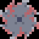Summon Omega Sawblade (DISC_BULLET_BIGGER) [[toc](#DISC_BULLET_BIGGER_CONTENTS)]

* **description**: That's a lot of sawblade
* **type**: ACTION_TYPE_PROJECTILE
* **spawn_level**: [2, 3, 5, 10]
* **spawn_probability**: [0.1, 0.6, 1.0, 0.1]
* **price**: 270
* **mana**: 70
* **max_uses**: 0
* **never_unlimited**: false
* **spawn_manual_unlock**: false
* **recursive**: false
* **ai_never_uses**: false
* **is_dangerous_blast**: false
* **related_projectiles**: {"data/entities/projectiles/deck/disc_bullet_bigger.xml"}
* **spawn_requires_flag**: card_unlocked_everything
* **related_extra_entities**: 
* **action**:

```lua
 function()
      add_projectile("data/entities/projectiles/deck/disc_bullet_bigger.xml")
      c.fire_rate_wait = c.fire_rate_wait + 40
      c.spread_degrees = c.spread_degrees + 6.4
      shot_effects.recoil_knockback = shot_effects.recoil_knockback + 30.0
      c.damage_projectile_add = c.damage_projectile_add + 0.2
    end,
```


### <a id="DIVIDE_10"></a>Divide by 10 (DIVIDE_10) [[toc](#DIVIDE_10_CONTENTS)]

* **description**: Casts the next spell 10 times, but with reduced damage
* **type**: ACTION_TYPE_OTHER
* **spawn_level**: [10]
* **spawn_probability**: [1.0]
* **price**: 400
* **mana**: 200
* **max_uses**: 5
* **never_unlimited**: false
* **spawn_manual_unlock**: false
* **recursive**: false
* **ai_never_uses**: false
* **is_dangerous_blast**: false
* **related_projectiles**: 
* **spawn_requires_flag**: card_unlocked_divide
* **related_extra_entities**: 
* **action**:

```lua
 function( recursion_level, iteration )
      c.fire_rate_wait = c.fire_rate_wait + 80
      current_reload_time = current_reload_time + 20
      
      local data = {}
      
      local iter = iteration or 1
      local iter_max = iteration or 1
      
      if ( #deck > 0 ) then
        data = deck[iter] or nil
      else
        data = nil
      end
      
      local count = 10
      if ( iter >= 3 ) then
        count = 1
      end
      
      local rec = check_recursion( data, recursion_level )
      
      if ( data ~= nil ) and ( rec > -1 ) and ( ( data.uses_remaining == nil ) or ( data.uses_remaining ~= 0 ) ) then
        local firerate = c.fire_rate_wait
        local reload = current_reload_time
        
        for i=1,count do
          if ( i == 1 ) then
            dont_draw_actions = true
          end
          local imax = data.action( rec, iter + 1 )
          dont_draw_actions = false
          if (imax ~= nil) then
            iter_max = imax
          end
        end
        
        if ( data.uses_remaining ~= nil ) and ( data.uses_remaining > 0 ) then
          data.uses_remaining = data.uses_remaining - 1
          
          local reduce_uses = ActionUsesRemainingChanged( data.inventoryitem_id, data.uses_remaining )
          if not reduce_uses then
            data.uses_remaining = data.uses_remaining + 1 -- cancel the reduction
          end
        end
        
        if (iter == 1) then
          c.fire_rate_wait = firerate
          current_reload_time = reload
          
          for i=1,iter_max do
            if (#deck > 0) then
              local d = deck[1]
              table.insert( discarded, d )
              table.remove( deck, 1 )
            end
          end
        end
      end
      
      c.damage_projectile_add = c.damage_projectile_add - 1.5
      c.explosion_radius = c.explosion_radius - 40.0
      if (c.explosion_radius < 0) then
        c.explosion_radius = 0
      end
      
      c.pattern_degrees = 5
      
      return iter_max
    end,
```


### <a id="DIVIDE_2"></a>Divide by 2 (DIVIDE_2) [[toc](#DIVIDE_2_CONTENTS)]

* **description**: Casts the next spell twice, but with reduced damage
* **type**: ACTION_TYPE_OTHER
* **spawn_level**: [3, 5, 6, 10]
* **spawn_probability**: [0.2, 0.3, 0.2, 1.0]
* **price**: 200
* **mana**: 35
* **max_uses**: 0
* **never_unlimited**: false
* **spawn_manual_unlock**: false
* **recursive**: false
* **ai_never_uses**: false
* **is_dangerous_blast**: false
* **related_projectiles**: 
* **spawn_requires_flag**: card_unlocked_musicbox
* **related_extra_entities**: 
* **action**:

```lua
 function( recursion_level, iteration )
      c.fire_rate_wait = c.fire_rate_wait + 20
      
      local data = {}
      
      local iter = iteration or 1
      local iter_max = iteration or 1
      
      if ( #deck > 0 ) then
        data = deck[iter] or nil
      else
        data = nil
      end
      
      local count = 2
      if ( iter >= 5 ) then
        count = 1
      end
      
      local rec = check_recursion( data, recursion_level )
      
      if ( data ~= nil ) and ( rec > -1 ) and ( ( data.uses_remaining == nil ) or ( data.uses_remaining ~= 0 ) ) then
        local firerate = c.fire_rate_wait
        local reload = current_reload_time
        
        for i=1,count do
          if ( i == 1 ) then
            dont_draw_actions = true
          end
          local imax = data.action( rec, iter + 1 )
          dont_draw_actions = false
          if (imax ~= nil) then
            iter_max = imax
          end
        end
        
        if ( data.uses_remaining ~= nil ) and ( data.uses_remaining > 0 ) then
          data.uses_remaining = data.uses_remaining - 1
          
          local reduce_uses = ActionUsesRemainingChanged( data.inventoryitem_id, data.uses_remaining )
          if not reduce_uses then
            data.uses_remaining = data.uses_remaining + 1 -- cancel the reduction
          end
        end
        
        if (iter == 1) then
          c.fire_rate_wait = firerate
          current_reload_time = reload
          
          for i=1,iter_max do
            if (#deck > 0) then
              local d = deck[1]
              table.insert( discarded, d )
              table.remove( deck, 1 )
            end
          end
        end
      end
      
      c.damage_projectile_add = c.damage_projectile_add - 0.2
      c.explosion_radius = c.explosion_radius - 5.0
      if (c.explosion_radius < 0) then
        c.explosion_radius = 0
      end
      
      c.pattern_degrees = 5
      
      return iter_max
    end,
```


### <a id="DIVIDE_3"></a>Divide by 3 (DIVIDE_3) [[toc](#DIVIDE_3_CONTENTS)]

* **description**: Casts the next spell 3 times, but with reduced damage
* **type**: ACTION_TYPE_OTHER
* **spawn_level**: [4, 5, 6, 10]
* **spawn_probability**: [0.1, 0.1, 0.2, 1.0]
* **price**: 250
* **mana**: 50
* **max_uses**: 0
* **never_unlimited**: false
* **spawn_manual_unlock**: false
* **recursive**: false
* **ai_never_uses**: false
* **is_dangerous_blast**: false
* **related_projectiles**: 
* **spawn_requires_flag**: card_unlocked_musicbox
* **related_extra_entities**: 
* **action**:

```lua
 function( recursion_level, iteration )
      c.fire_rate_wait = c.fire_rate_wait + 35
      
      local data = {}
      
      local iter = iteration or 1
      local iter_max = iteration or 1
      
      if ( #deck > 0 ) then
        data = deck[iter] or nil
      else
        data = nil
      end
      
      local count = 3
      if ( iter >= 4 ) then
        count = 1
      end
      
      local rec = check_recursion( data, recursion_level )
      
      if ( data ~= nil ) and ( rec > -1 ) and ( ( data.uses_remaining == nil ) or ( data.uses_remaining ~= 0 ) ) then
        local firerate = c.fire_rate_wait
        local reload = current_reload_time
        
        for i=1,count do
          if ( i == 1 ) then
            dont_draw_actions = true
          end
          local imax = data.action( rec, iter + 1 )
          dont_draw_actions = false
          if (imax ~= nil) then
            iter_max = imax
          end
        end
        
        if ( data.uses_remaining ~= nil ) and ( data.uses_remaining > 0 ) then
          data.uses_remaining = data.uses_remaining - 1
          
          local reduce_uses = ActionUsesRemainingChanged( data.inventoryitem_id, data.uses_remaining )
          if not reduce_uses then
            data.uses_remaining = data.uses_remaining + 1 -- cancel the reduction
          end
        end
        
        if (iter == 1) then
          c.fire_rate_wait = firerate
          current_reload_time = reload
          
          for i=1,iter_max do
            if (#deck > 0) then
              local d = deck[1]
              table.insert( discarded, d )
              table.remove( deck, 1 )
            end
          end
        end
      end
      
      c.damage_projectile_add = c.damage_projectile_add - 0.4
      c.explosion_radius = c.explosion_radius - 10.0
      if (c.explosion_radius < 0) then
        c.explosion_radius = 0
      end
      
      c.pattern_degrees = 5
      
      return iter_max
    end,
```


### <a id="DIVIDE_4"></a>Divide by 4 (DIVIDE_4) [[toc](#DIVIDE_4_CONTENTS)]

* **description**: Casts the next spell 4 times, but with reduced damage
* **type**: ACTION_TYPE_OTHER
* **spawn_level**: [5, 6, 10]
* **spawn_probability**: [0.1, 0.1, 1.0]
* **price**: 300
* **mana**: 70
* **max_uses**: 0
* **never_unlimited**: false
* **spawn_manual_unlock**: false
* **recursive**: false
* **ai_never_uses**: false
* **is_dangerous_blast**: false
* **related_projectiles**: 
* **spawn_requires_flag**: card_unlocked_musicbox
* **related_extra_entities**: 
* **action**:

```lua
 function( recursion_level, iteration )
      c.fire_rate_wait = c.fire_rate_wait + 50
      
      local data = {}
      
      local iter = iteration or 1
      local iter_max = iteration or 1
      
      if ( #deck > 0 ) then
        data = deck[iter] or nil
      else
        data = nil
      end
      
      local count = 4
      if ( iter >= 4 ) then
        count = 1
      end
      
      local rec = check_recursion( data, recursion_level )
      
      if ( data ~= nil ) and ( rec > -1 ) and ( ( data.uses_remaining == nil ) or ( data.uses_remaining ~= 0 ) ) then
        local firerate = c.fire_rate_wait
        local reload = current_reload_time
        
        for i=1,count do
          if ( i == 1 ) then
            dont_draw_actions = true
          end
          local imax = data.action( rec, iter + 1 )
          dont_draw_actions = false
          if (imax ~= nil) then
            iter_max = imax
          end
        end
        
        if ( data.uses_remaining ~= nil ) and ( data.uses_remaining > 0 ) then
          data.uses_remaining = data.uses_remaining - 1
          
          local reduce_uses = ActionUsesRemainingChanged( data.inventoryitem_id, data.uses_remaining )
          if not reduce_uses then
            data.uses_remaining = data.uses_remaining + 1 -- cancel the reduction
          end
        end
        
        if (iter == 1) then
          c.fire_rate_wait = firerate
          current_reload_time = reload
          
          for i=1,iter_max do
            if (#deck > 0) then
              local d = deck[1]
              table.insert( discarded, d )
              table.remove( deck, 1 )
            end
          end
        end
      end
      
      c.damage_projectile_add = c.damage_projectile_add - 0.6
      c.explosion_radius = c.explosion_radius - 20.0
      if (c.explosion_radius < 0) then
        c.explosion_radius = 0
      end
      
      c.pattern_degrees = 5
      
      return iter_max
    end,
```


### <a id="DRAW_3_RANDOM"></a>Copy three random spells (DRAW_3_RANDOM) [[toc](#DRAW_3_RANDOM_CONTENTS)]

* **description**: Casts three random spells among the spells in your wand
* **type**: ACTION_TYPE_OTHER
* **spawn_level**: [2, 3, 5, 6, 10]
* **spawn_probability**: [0.1, 0.2, 0.1, 0.1, 1.0]
* **price**: 200
* **mana**: 40
* **max_uses**: 0
* **never_unlimited**: false
* **spawn_manual_unlock**: false
* **recursive**: true
* **ai_never_uses**: false
* **is_dangerous_blast**: false
* **related_projectiles**: 
* **spawn_requires_flag**: card_unlocked_pyramid
* **related_extra_entities**: 
* **action**:

```lua
 function( recursion_level, iteration )
      SetRandomSeed( GameGetFrameNum() + #deck, GameGetFrameNum() - 325 + #discarded )
      local datasize = #deck + #discarded
      
      for i=1,3 do
        local rnd = Random( 1, datasize )
        
        local data = {}
        
        if ( rnd <= #deck ) then
          data = deck[rnd]
        else
          data = discarded[rnd - #deck]
        end
        
        local checks = 0
        local rec = check_recursion( data, recursion_level )
        
        while ( data ~= nil ) and ( ( rec == -1 ) or ( ( data.uses_remaining ~= nil ) and ( data.uses_remaining == 0 ) ) ) and ( checks < datasize ) do
          rnd = ( rnd % datasize ) + 1
          checks = checks + 1
          
          if ( rnd <= #deck ) then
            data = deck[rnd]
          else
            data = discarded[rnd - #deck]
          end
          
          rec = check_recursion( data, recursion_level )
        end
        
        if ( data ~= nil ) and ( rec > -1 ) and ( ( data.uses_remaining == nil ) or ( data.uses_remaining ~= 0 ) ) then
          data.action( rec )
          
          if ( data.uses_remaining ~= nil ) and ( data.uses_remaining > 0 ) then
            data.uses_remaining = data.uses_remaining - 1
            
            local reduce_uses = ActionUsesRemainingChanged( data.inventoryitem_id, data.uses_remaining )
            if not reduce_uses then
              data.uses_remaining = data.uses_remaining + 1 -- cancel the reduction
            end
          end
        end
      end
    end,
```


### <a id="DRAW_RANDOM"></a>Copy random spell (DRAW_RANDOM) [[toc](#DRAW_RANDOM_CONTENTS)]

* **description**: Casts a random spell among the spells in your wand
* **type**: ACTION_TYPE_OTHER
* **spawn_level**: [2, 3, 4, 5, 6, 10]
* **spawn_probability**: [0.3, 0.2, 0.2, 0.1, 0.1, 1.0]
* **price**: 150
* **mana**: 20
* **max_uses**: 0
* **never_unlimited**: false
* **spawn_manual_unlock**: false
* **recursive**: true
* **ai_never_uses**: false
* **is_dangerous_blast**: false
* **related_projectiles**: 
* **spawn_requires_flag**: card_unlocked_pyramid
* **related_extra_entities**: 
* **action**:

```lua
 function( recursion_level, iteration )
      SetRandomSeed( GameGetFrameNum() + #deck, GameGetFrameNum() - 325 + #discarded )
      local datasize = #deck + #discarded
      local rnd = Random( 1, datasize )
      
      local data = {}
        
      if ( rnd <= #deck ) then
        data = deck[rnd]
      else
        data = discarded[rnd - #deck]
      end
      
      local checks = 0
      local rec = check_recursion( data, recursion_level )
      
      while ( data ~= nil ) and ( ( rec == -1 ) or ( ( data.uses_remaining ~= nil ) and ( data.uses_remaining == 0 ) ) ) and ( checks < datasize ) do
        rnd = ( rnd % datasize ) + 1
        checks = checks + 1
        
        if ( rnd <= #deck ) then
          data = deck[rnd]
        else
          data = discarded[rnd - #deck]
        end
        
        rec = check_recursion( data, recursion_level )
      end
      
      if ( data ~= nil ) and ( rec > -1 ) and ( ( data.uses_remaining == nil ) or ( data.uses_remaining ~= 0 ) ) then
        data.action( rec )
        
        if ( data.uses_remaining ~= nil ) and ( data.uses_remaining > 0 ) then
          data.uses_remaining = data.uses_remaining - 1
          
          local reduce_uses = ActionUsesRemainingChanged( data.inventoryitem_id, data.uses_remaining )
          if not reduce_uses then
            data.uses_remaining = data.uses_remaining + 1 -- cancel the reduction
          end
        end
      end
    end,
```


### <a id="DRAW_RANDOM_X3"></a>Copy random spell thrice (DRAW_RANDOM_X3) [[toc](#DRAW_RANDOM_X3_CONTENTS)]

* **description**: Casts a random spell among the spells in your wand three times!
* **type**: ACTION_TYPE_OTHER
* **spawn_level**: [3, 4, 5, 6, 10]
* **spawn_probability**: [0.1, 0.3, 0.1, 0.1, 1.0]
* **price**: 250
* **mana**: 50
* **max_uses**: 0
* **never_unlimited**: false
* **spawn_manual_unlock**: false
* **recursive**: true
* **ai_never_uses**: false
* **is_dangerous_blast**: false
* **related_projectiles**: 
* **spawn_requires_flag**: card_unlocked_pyramid
* **related_extra_entities**: 
* **action**:

```lua
 function( recursion_level, iteration )
      SetRandomSeed( GameGetFrameNum() + #deck, GameGetFrameNum() - 325 + #discarded )
      local datasize = #deck + #discarded
      local rnd = Random( 1, datasize )
      
      local data = {}
        
      if ( rnd <= #deck ) then
        data = deck[rnd]
      else
        data = discarded[rnd - #deck]
      end
      
      local checks = 0
      local rec = check_recursion( data, recursion_level )
      
      while ( data ~= nil ) and ( ( rec == -1 ) or ( ( data.uses_remaining ~= nil ) and ( data.uses_remaining == 0 ) ) ) and ( checks < datasize ) do
        rnd = ( rnd % datasize ) + 1
        checks = checks + 1
        
        if ( rnd <= #deck ) then
          data = deck[rnd]
        else
          data = discarded[rnd - #deck]
        end
        
        rec = check_recursion( data, recursion_level )
      end
      
      if ( data ~= nil ) and ( rec > -1 ) and ( ( data.uses_remaining == nil ) or ( data.uses_remaining ~= 0 ) ) then
        for i=1,3 do
          data.action( rec )
        end
        
        if ( data.uses_remaining ~= nil ) and ( data.uses_remaining > 0 ) then
          data.uses_remaining = data.uses_remaining - 1
          
          local reduce_uses = ActionUsesRemainingChanged( data.inventoryitem_id, data.uses_remaining )
          if not reduce_uses then
            data.uses_remaining = data.uses_remaining + 1 -- cancel the reduction
          end
        end
      end
    end,
```


### <a id="DUPLICATE"></a>Spell duplication (DUPLICATE) [[toc](#DUPLICATE_CONTENTS)]

* **description**: Duplicates every spell cast before it
* **type**: ACTION_TYPE_OTHER
* **spawn_level**: [5, 6, 10]
* **spawn_probability**: [0.1, 0.1, 1.0]
* **price**: 250
* **mana**: 250
* **max_uses**: 0
* **never_unlimited**: false
* **spawn_manual_unlock**: false
* **recursive**: true
* **ai_never_uses**: false
* **is_dangerous_blast**: false
* **related_projectiles**: 
* **spawn_requires_flag**: card_unlocked_mestari
* **related_extra_entities**: 
* **action**:

```lua
 function( recursion_level, iteration )
      local hand_count = #hand
      
      for i,v in ipairs( hand ) do
        local rec = check_recursion( v, recursion_level )
        if ( v.id ~= "DUPLICATE" ) and ( i <= hand_count ) and ( rec > -1 ) then
          v.action( rec )
        end
      end
      
      c.fire_rate_wait = c.fire_rate_wait + 20
      current_reload_time = current_reload_time + 20
      
      draw_actions( 1, true )
    end,
```


### <a id="DYNAMITE"></a>Dynamite (DYNAMITE) [[toc](#DYNAMITE_CONTENTS)]

* **description**: Summons a small explosive
* **type**: ACTION_TYPE_PROJECTILE
* **spawn_level**: [0, 1, 2, 3, 4]
* **spawn_probability**: [1.0, 1.0, 1.0, 1.0, 1.0]
* **price**: 160
* **mana**: 50
* **max_uses**: 16
* **never_unlimited**: false
* **spawn_manual_unlock**: false
* **recursive**: false
* **ai_never_uses**: false
* **is_dangerous_blast**: false
* **related_projectiles**: {"data/entities/projectiles/deck/tnt.xml"}
* **spawn_requires_flag**: 
* **related_extra_entities**: 
* **action**:

```lua
 function()
      add_projectile("data/entities/projectiles/deck/tnt.xml")
      c.fire_rate_wait = c.fire_rate_wait + 50
      c.spread_degrees = c.spread_degrees + 6.0
    end,
```


### <a id="ELECTRIC_CHARGE"></a>Electric charge (ELECTRIC_CHARGE) [[toc](#ELECTRIC_CHARGE_CONTENTS)]

* **description**: Gives a projectile an electric charge, that it will release on impact
* **type**: ACTION_TYPE_MODIFIER
* **spawn_level**: [1, 2, 4, 5]
* **spawn_probability**: [1.0, 1.0, 1.0, 1.0]
* **price**: 150
* **mana**: 8
* **max_uses**: 0
* **never_unlimited**: false
* **spawn_manual_unlock**: false
* **recursive**: false
* **ai_never_uses**: false
* **is_dangerous_blast**: false
* **related_projectiles**: 
* **spawn_requires_flag**: 
* **related_extra_entities**: { "data/entities/particles/electricity.xml" }
* **action**:

```lua
 function()
      c.lightning_count = c.lightning_count + 1
      c.damage_electricity_add = c.damage_electricity_add + 0.1
      c.extra_entities = c.extra_entities .. "data/entities/particles/electricity.xml,"
      draw_actions( 1, true )
    end,
```


### <a id="ELECTROCUTION_FIELD"></a>Circle of thunder (ELECTROCUTION_FIELD) [[toc](#ELECTROCUTION_FIELD_CONTENTS)]

* **description**: A field of electrifying magic
* **type**: ACTION_TYPE_STATIC_PROJECTILE
* **spawn_level**: [1, 3, 5, 6]
* **spawn_probability**: [0.3, 0.6, 0.8, 0.3]
* **price**: 200
* **mana**: 60
* **max_uses**: 15
* **never_unlimited**: false
* **spawn_manual_unlock**: false
* **recursive**: false
* **ai_never_uses**: false
* **is_dangerous_blast**: false
* **related_projectiles**: {"data/entities/projectiles/deck/electrocution_field.xml"}
* **spawn_requires_flag**: 
* **related_extra_entities**: 
* **action**:

```lua
 function()
      add_projectile("data/entities/projectiles/deck/electrocution_field.xml")
      c.fire_rate_wait = c.fire_rate_wait + 15
    end,
```


### <a id="ENERGY_SHIELD"></a>Energy shield (ENERGY_SHIELD) [[toc](#ENERGY_SHIELD_CONTENTS)]

* **description**: Deflects incoming projectiles
* **type**: ACTION_TYPE_PASSIVE
* **spawn_level**: [1, 2, 3, 4, 5, 6]
* **spawn_probability**: [0.05, 0.6, 0.6, 0.6, 0.6, 0.6]
* **price**: 220
* **mana**: 0
* **max_uses**: 0
* **never_unlimited**: false
* **spawn_manual_unlock**: false
* **recursive**: false
* **ai_never_uses**: false
* **is_dangerous_blast**: false
* **related_projectiles**: 
* **spawn_requires_flag**: 
* **related_extra_entities**: 
* **action**:

```lua
 function()
      draw_actions( 1, true )
    end,
```


### <a id="ENERGY_SHIELD_SECTOR"></a>Energy shield sector (ENERGY_SHIELD_SECTOR) [[toc](#ENERGY_SHIELD_SECTOR_CONTENTS)]

* **description**: Deflects incoming projectiles
* **type**: ACTION_TYPE_PASSIVE
* **spawn_level**: [0, 1, 2, 3, 4, 5]
* **spawn_probability**: [0.05, 0.6, 0.6, 0.6, 0.6, 0.6]
* **price**: 160
* **mana**: 0
* **max_uses**: 0
* **never_unlimited**: false
* **spawn_manual_unlock**: false
* **recursive**: false
* **ai_never_uses**: false
* **is_dangerous_blast**: false
* **related_projectiles**: 
* **spawn_requires_flag**: 
* **related_extra_entities**: 
* **action**:

```lua
 function()
      draw_actions( 1, true )
    end,
```


### <a id="ENERGY_SHIELD_SHOT"></a>Projectile energy shield (ENERGY_SHIELD_SHOT) [[toc](#ENERGY_SHIELD_SHOT_CONTENTS)]

* **description**: Gives a projectile a shield that deflects other projectiles
* **type**: ACTION_TYPE_MODIFIER
* **spawn_level**: [2, 3, 4, 5, 6]
* **spawn_probability**: [0.3, 0.3, 0.3, 0.3, 0.3]
* **price**: 180
* **mana**: 5
* **max_uses**: 0
* **never_unlimited**: false
* **spawn_manual_unlock**: false
* **recursive**: false
* **ai_never_uses**: false
* **is_dangerous_blast**: false
* **related_projectiles**: 
* **spawn_requires_flag**: 
* **related_extra_entities**: { "data/entities/misc/energy_shield_shot.xml" }
* **action**:

```lua
 function()
      c.speed_multiplier = c.speed_multiplier * 0.4
      c.extra_entities = c.extra_entities .. "data/entities/misc/energy_shield_shot.xml,"
      
      if ( c.speed_multiplier >= 20 ) then
        c.speed_multiplier = math.min( c.speed_multiplier, 20 )
      elseif ( c.speed_multiplier < 0 ) then
        c.speed_multiplier = 0
      end
      
      draw_actions( 1, true )
    end,
```


### <a id="ESSENCE_TO_POWER"></a>Essence to Power (ESSENCE_TO_POWER) [[toc](#ESSENCE_TO_POWER_CONTENTS)]

* **description**: Increases a projectile's damage based on the number of creatures nearby
* **type**: ACTION_TYPE_MODIFIER
* **spawn_level**: [1, 2, 3, 10]
* **spawn_probability**: [0.2, 0.5, 0.5, 0.1]
* **price**: 120
* **mana**: 110
* **max_uses**: 0
* **never_unlimited**: false
* **spawn_manual_unlock**: false
* **recursive**: false
* **ai_never_uses**: false
* **is_dangerous_blast**: false
* **related_projectiles**: 
* **spawn_requires_flag**: 
* **related_extra_entities**: { "data/entities/misc/essence_to_power.xml" }
* **action**:

```lua
 function()
      c.extra_entities = c.extra_entities .. "data/entities/misc/essence_to_power.xml,"
      c.fire_rate_wait    = c.fire_rate_wait + 20
      draw_actions( 1, true )
    end,
```


### <a id="EXPANDING_ORB"></a>Expanding Sphere (EXPANDING_ORB) [[toc](#EXPANDING_ORB_CONTENTS)]

* **description**: A slow projectile that increases its damage over time
* **type**: ACTION_TYPE_PROJECTILE
* **spawn_level**: [2, 3, 4, 5, 6]
* **spawn_probability**: [0.5, 0.5, 1.0, 1.0, 1.0]
* **price**: 200
* **mana**: 70
* **max_uses**: 0
* **never_unlimited**: false
* **spawn_manual_unlock**: false
* **recursive**: false
* **ai_never_uses**: false
* **is_dangerous_blast**: false
* **related_projectiles**: {"data/entities/projectiles/orb_expanding.xml"}
* **spawn_requires_flag**: 
* **related_extra_entities**: 
* **action**:

```lua
 function()
      add_projectile("data/entities/projectiles/orb_expanding.xml")
      c.fire_rate_wait = c.fire_rate_wait + 30
      shot_effects.recoil_knockback = 20.0
    end,
```


### <a id="EXPLODING_DEER"></a>Summon deercoy (EXPLODING_DEER) [[toc](#EXPLODING_DEER_CONTENTS)]

* **description**: Summons a seemingly-innocuous deer
* **type**: ACTION_TYPE_PROJECTILE
* **spawn_level**: [3, 4, 5]
* **spawn_probability**: [0.6, 0.6, 0.6]
* **price**: 170
* **mana**: 120
* **max_uses**: 10
* **never_unlimited**: false
* **spawn_manual_unlock**: false
* **recursive**: false
* **ai_never_uses**: false
* **is_dangerous_blast**: false
* **related_projectiles**: {"data/entities/projectiles/deck/exploding_deer.xml"}
* **spawn_requires_flag**: card_unlocked_exploding_deer
* **related_extra_entities**: 
* **action**:

```lua
 function()
      add_projectile("data/entities/projectiles/deck/exploding_deer.xml")
      c.fire_rate_wait = c.fire_rate_wait + 80
    end,
```


### <a id="EXPLODING_DUCKS"></a>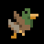Flock of Ducks (EXPLODING_DUCKS) [[toc](#EXPLODING_DUCKS_CONTENTS)]

* **description**: Summons a chaotic flock of spicy ducks
* **type**: ACTION_TYPE_PROJECTILE
* **spawn_level**: [3, 4, 5]
* **spawn_probability**: [0.6, 0.8, 0.6]
* **price**: 200
* **mana**: 100
* **max_uses**: 20
* **never_unlimited**: false
* **spawn_manual_unlock**: false
* **recursive**: false
* **ai_never_uses**: false
* **is_dangerous_blast**: false
* **related_projectiles**: {"data/entities/projectiles/deck/duck.xml", 3}
* **spawn_requires_flag**: card_unlocked_exploding_deer
* **related_extra_entities**: 
* **action**:

```lua
 function()
      add_projectile("data/entities/projectiles/deck/duck.xml")
      add_projectile("data/entities/projectiles/deck/duck.xml")
      add_projectile("data/entities/projectiles/deck/duck.xml")
      c.fire_rate_wait = c.fire_rate_wait + 60
      current_reload_time = current_reload_time + 20
    end,
```


### <a id="EXPLOSION"></a>Explosion (EXPLOSION) [[toc](#EXPLOSION_CONTENTS)]

* **description**: A powerful explosion
* **type**: ACTION_TYPE_STATIC_PROJECTILE
* **spawn_level**: [0, 2, 4, 5]
* **spawn_probability**: [0.5, 1.0, 1.0, 1.0]
* **price**: 160
* **mana**: 80
* **max_uses**: 0
* **never_unlimited**: false
* **spawn_manual_unlock**: false
* **recursive**: false
* **ai_never_uses**: false
* **is_dangerous_blast**: true
* **related_projectiles**: {"data/entities/projectiles/deck/explosion.xml"}
* **spawn_requires_flag**: 
* **related_extra_entities**: 
* **action**:

```lua
 function()
      add_projectile("data/entities/projectiles/deck/explosion.xml")
      c.fire_rate_wait = c.fire_rate_wait + 3
      c.screenshake = c.screenshake + 2.5
    end,
```


### <a id="EXPLOSION_LIGHT"></a>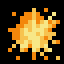Magical Explosion (EXPLOSION_LIGHT) [[toc](#EXPLOSION_LIGHT_CONTENTS)]

* **description**: A large explosion that doesn't damage the ground
* **type**: ACTION_TYPE_STATIC_PROJECTILE
* **spawn_level**: [2, 3, 5, 6]
* **spawn_probability**: [0.5, 1.0, 1.0, 1.0]
* **price**: 160
* **mana**: 80
* **max_uses**: 0
* **never_unlimited**: false
* **spawn_manual_unlock**: false
* **recursive**: false
* **ai_never_uses**: false
* **is_dangerous_blast**: true
* **related_projectiles**: {"data/entities/projectiles/deck/explosion_light.xml"}
* **spawn_requires_flag**: 
* **related_extra_entities**: 
* **action**:

```lua
 function()
      add_projectile("data/entities/projectiles/deck/explosion_light.xml")
      c.fire_rate_wait = c.fire_rate_wait + 3
      c.screenshake = c.screenshake + 2.5
    end,
```


### <a id="EXPLOSION_REMOVE"></a>Remove Explosion (EXPLOSION_REMOVE) [[toc](#EXPLOSION_REMOVE_CONTENTS)]

* **description**: Makes a projectile no longer explode
* **type**: ACTION_TYPE_MODIFIER
* **spawn_level**: [2, 4, 5, 6]
* **spawn_probability**: [0.2, 0.6, 0.7, 0.2]
* **price**: 50
* **mana**: 0
* **max_uses**: 0
* **never_unlimited**: false
* **spawn_manual_unlock**: false
* **recursive**: false
* **ai_never_uses**: false
* **is_dangerous_blast**: false
* **related_projectiles**: 
* **spawn_requires_flag**: 
* **related_extra_entities**: { "data/entities/misc/explosion_remove.xml" }
* **action**:

```lua
 function()
      c.extra_entities = c.extra_entities .. "data/entities/misc/explosion_remove.xml,"
      c.fire_rate_wait = c.fire_rate_wait - 15
      c.explosion_radius = c.explosion_radius - 30.0
      c.damage_explosion_add = c.damage_explosion_add - 0.8
      draw_actions( 1, true )
    end,
```


### <a id="EXPLOSION_TINY"></a>Concentrated Explosion (EXPLOSION_TINY) [[toc](#EXPLOSION_TINY_CONTENTS)]

* **description**: Limits the radius of a projectile's explosion heavily
* **type**: ACTION_TYPE_MODIFIER
* **spawn_level**: [2, 4, 5, 6]
* **spawn_probability**: [0.2, 0.6, 0.7, 0.2]
* **price**: 160
* **mana**: 40
* **max_uses**: 0
* **never_unlimited**: false
* **spawn_manual_unlock**: false
* **recursive**: false
* **ai_never_uses**: false
* **is_dangerous_blast**: false
* **related_projectiles**: 
* **spawn_requires_flag**: 
* **related_extra_entities**: { "data/entities/misc/explosion_tiny.xml" }
* **action**:

```lua
 function()
      c.extra_entities = c.extra_entities .. "data/entities/misc/explosion_tiny.xml,"
      c.fire_rate_wait = c.fire_rate_wait + 15
      c.explosion_radius = c.explosion_radius - 30.0
      c.damage_explosion_add = c.damage_explosion_add + 0.8
      draw_actions( 1, true )
    end,
```


### <a id="EXPLOSIVE_PROJECTILE"></a>Explosive projectile (EXPLOSIVE_PROJECTILE) [[toc](#EXPLOSIVE_PROJECTILE_CONTENTS)]

* **description**: Makes a projectile more destructive to the environment
* **type**: ACTION_TYPE_MODIFIER
* **spawn_level**: [2, 3, 4]
* **spawn_probability**: [1.0, 1.0, 1.0]
* **price**: 120
* **mana**: 30
* **max_uses**: 0
* **never_unlimited**: false
* **spawn_manual_unlock**: false
* **recursive**: false
* **ai_never_uses**: false
* **is_dangerous_blast**: false
* **related_projectiles**: 
* **spawn_requires_flag**: 
* **related_extra_entities**: 
* **action**:

```lua
 function()
      c.explosion_radius = c.explosion_radius + 15.0
      c.damage_explosion_add = c.damage_explosion_add + 0.2
      c.fire_rate_wait   = c.fire_rate_wait + 40
      c.speed_multiplier = c.speed_multiplier * 0.75
      shot_effects.recoil_knockback = shot_effects.recoil_knockback + 30.0
      
      if ( c.speed_multiplier >= 20 ) then
        c.speed_multiplier = math.min( c.speed_multiplier, 20 )
      elseif ( c.speed_multiplier < 0 ) then
        c.speed_multiplier = 0
      end
      
      draw_actions( 1, true )
    end,
```


### <a id="FIREBALL"></a>Fireball (FIREBALL) [[toc](#FIREBALL_CONTENTS)]

* **description**: A powerful exploding spell
* **type**: ACTION_TYPE_PROJECTILE
* **spawn_level**: [0, 3, 4, 6]
* **spawn_probability**: [1.0, 1.0, 1.0, 1.0]
* **price**: 220
* **mana**: 70
* **max_uses**: 15
* **never_unlimited**: false
* **spawn_manual_unlock**: false
* **recursive**: false
* **ai_never_uses**: false
* **is_dangerous_blast**: false
* **related_projectiles**: {"data/entities/projectiles/deck/fireball.xml"}
* **spawn_requires_flag**: 
* **related_extra_entities**: 
* **action**:

```lua
 function()
      add_projectile("data/entities/projectiles/deck/fireball.xml")
      c.spread_degrees = c.spread_degrees + 4.0
      c.fire_rate_wait = c.fire_rate_wait + 50
      shot_effects.recoil_knockback = shot_effects.recoil_knockback + 20.0
    end,
```


### <a id="FIREBALL_RAY"></a>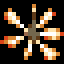Fireball thrower (FIREBALL_RAY) [[toc](#FIREBALL_RAY_CONTENTS)]

* **description**: Makes a projectile cast fireballs in random directions
* **type**: ACTION_TYPE_MODIFIER
* **spawn_level**: [1, 2, 4, 5]
* **spawn_probability**: [0.6, 0.6, 0.4, 0.4]
* **price**: 150
* **mana**: 110
* **max_uses**: 16
* **never_unlimited**: false
* **spawn_manual_unlock**: false
* **recursive**: false
* **ai_never_uses**: false
* **is_dangerous_blast**: false
* **related_projectiles**: 
* **spawn_requires_flag**: 
* **related_extra_entities**: { "data/entities/misc/fireball_ray.xml" }
* **action**:

```lua
 function()
      c.extra_entities = c.extra_entities .. "data/entities/misc/fireball_ray.xml,"
      draw_actions( 1, true )
    end,
```


### <a id="FIREBALL_RAY_ENEMY"></a>Personal fireball thrower (FIREBALL_RAY_ENEMY) [[toc](#FIREBALL_RAY_ENEMY_CONTENTS)]

* **description**: Makes a projectile turn the creatures it hits into living fireball throwers
* **type**: ACTION_TYPE_MODIFIER
* **spawn_level**: [1, 2, 4, 5]
* **spawn_probability**: [0.6, 0.6, 0.4, 0.4]
* **price**: 100
* **mana**: 90
* **max_uses**: 20
* **never_unlimited**: false
* **spawn_manual_unlock**: false
* **recursive**: false
* **ai_never_uses**: false
* **is_dangerous_blast**: false
* **related_projectiles**: 
* **spawn_requires_flag**: 
* **related_extra_entities**: { "data/entities/misc/hitfx_fireball_ray_enemy.xml" }
* **action**:

```lua
 function()
      c.extra_entities = c.extra_entities .. "data/entities/misc/hitfx_fireball_ray_enemy.xml,"
      draw_actions( 1, true )
    end,
```


### <a id="FIREBALL_RAY_LINE"></a>Two-way fireball thrower (FIREBALL_RAY_LINE) [[toc](#FIREBALL_RAY_LINE_CONTENTS)]

* **description**: Makes a projectile fire small fireballs perpendicular to its trajectory
* **type**: ACTION_TYPE_MODIFIER
* **spawn_level**: [2, 3, 4, 5, 6]
* **spawn_probability**: [0.6, 0.4, 0.4, 0.4, 1.0]
* **price**: 120
* **mana**: 130
* **max_uses**: 20
* **never_unlimited**: false
* **spawn_manual_unlock**: false
* **recursive**: false
* **ai_never_uses**: false
* **is_dangerous_blast**: false
* **related_projectiles**: 
* **spawn_requires_flag**: 
* **related_extra_entities**: { "data/entities/misc/fireball_ray_line.xml" }
* **action**:

```lua
 function()
      c.extra_entities = c.extra_entities .. "data/entities/misc/fireball_ray_line.xml,"
      draw_actions( 1, true )
    end,
```


### <a id="FIREBOMB"></a>Firebomb (FIREBOMB) [[toc](#FIREBOMB_CONTENTS)]

* **description**: Slow, fiery bolt
* **type**: ACTION_TYPE_PROJECTILE
* **spawn_level**: [1, 2, 3]
* **spawn_probability**: [1.0, 1.0, 1.0]
* **price**: 90
* **mana**: 10
* **max_uses**: 0
* **never_unlimited**: false
* **spawn_manual_unlock**: false
* **recursive**: false
* **ai_never_uses**: false
* **is_dangerous_blast**: false
* **related_projectiles**: {"data/entities/projectiles/deck/firebomb.xml"}
* **spawn_requires_flag**: 
* **related_extra_entities**: 
* **action**:

```lua
 function()
      add_projectile("data/entities/projectiles/deck/firebomb.xml")
    end,
```


### <a id="FIREWORK"></a>Fireworks! (FIREWORK) [[toc](#FIREWORK_CONTENTS)]

* **description**: A fiery, explosive projectile
* **type**: ACTION_TYPE_PROJECTILE
* **spawn_level**: [1, 2, 3, 4, 5, 6]
* **spawn_probability**: [1.0, 1.0, 1.0, 1.0, 1.0, 1.0]
* **price**: 220
* **mana**: 70
* **max_uses**: 25
* **never_unlimited**: false
* **spawn_manual_unlock**: false
* **recursive**: false
* **ai_never_uses**: false
* **is_dangerous_blast**: false
* **related_projectiles**: {"data/entities/projectiles/deck/fireworks/firework_pink.xml"}
* **spawn_requires_flag**: card_unlocked_firework
* **related_extra_entities**: 
* **action**:

```lua
 function()
      SetRandomSeed( GameGetFrameNum(), GameGetFrameNum() )
      local types = {"pink","green","blue","orange"}
      local rnd = Random(1, #types)
      local firework_name = "firework_" .. tostring(types[rnd]) .. ".xml"
      add_projectile("data/entities/projectiles/deck/fireworks/" .. firework_name)
      c.fire_rate_wait = c.fire_rate_wait + 60
      c.ragdoll_fx = 2
      shot_effects.recoil_knockback = 120.0
    end,
```


### <a id="FIRE_BLAST"></a>Explosion of brimstone (FIRE_BLAST) [[toc](#FIRE_BLAST_CONTENTS)]

* **description**: A fiery explosion
* **type**: ACTION_TYPE_STATIC_PROJECTILE
* **spawn_level**: [0, 1, 3, 5]
* **spawn_probability**: [0.5, 0.5, 0.6, 0.6]
* **price**: 120
* **mana**: 10
* **max_uses**: 0
* **never_unlimited**: false
* **spawn_manual_unlock**: false
* **recursive**: false
* **ai_never_uses**: false
* **is_dangerous_blast**: true
* **related_projectiles**: {"data/entities/projectiles/deck/fireblast.xml"}
* **spawn_requires_flag**: 
* **related_extra_entities**: 
* **action**:

```lua
 function()
      add_projectile("data/entities/projectiles/deck/fireblast.xml")
      c.fire_rate_wait = c.fire_rate_wait + 3
      c.screenshake = c.screenshake + 0.5
    end,
```


### <a id="FIRE_TRAIL"></a>Fire trail (FIRE_TRAIL) [[toc](#FIRE_TRAIL_CONTENTS)]

* **description**: Gives a projectile a trail of fiery particles
* **type**: ACTION_TYPE_MODIFIER
* **spawn_level**: [0, 1, 2, 3, 4]
* **spawn_probability**: [0.3, 0.3, 0.3, 0.3, 0.3]
* **price**: 130
* **mana**: 10
* **max_uses**: 0
* **never_unlimited**: false
* **spawn_manual_unlock**: false
* **recursive**: false
* **ai_never_uses**: false
* **is_dangerous_blast**: false
* **related_projectiles**: 
* **spawn_requires_flag**: 
* **related_extra_entities**: 
* **action**:

```lua
 function()
      c.game_effect_entities = c.game_effect_entities .. "data/entities/misc/effect_apply_on_fire.xml,"
      c.trail_material = c.trail_material .. "fire,"
      c.trail_material_amount = c.trail_material_amount + 10
      draw_actions( 1, true )
    end,
```


### <a id="FIZZLE"></a>Fizzle (FIZZLE) [[toc](#FIZZLE_CONTENTS)]

* **description**: Gives a spell a small probability of short-circuiting
* **type**: ACTION_TYPE_MODIFIER
* **spawn_level**: [3, 4, 5]
* **spawn_probability**: [0.1, 0.1, 0.1]
* **price**: 0
* **mana**: 0
* **max_uses**: 0
* **never_unlimited**: false
* **spawn_manual_unlock**: false
* **recursive**: false
* **ai_never_uses**: false
* **is_dangerous_blast**: false
* **related_projectiles**: 
* **spawn_requires_flag**: 
* **related_extra_entities**: { "data/entities/misc/fizzle.xml" }
* **action**:

```lua
 function()
      c.extra_entities = c.extra_entities .. "data/entities/misc/fizzle.xml,"
      c.speed_multiplier = c.speed_multiplier * 1.2
      c.fire_rate_wait = c.fire_rate_wait - 10
      
      if ( c.speed_multiplier >= 20 ) then
        c.speed_multiplier = math.min( c.speed_multiplier, 20 )
      elseif ( c.speed_multiplier < 0 ) then
        c.speed_multiplier = 0
      end
      
      draw_actions( 1, true )
    end,
```


### <a id="FLAMETHROWER"></a>Flamethrower (FLAMETHROWER) [[toc](#FLAMETHROWER_CONTENTS)]

* **description**: A stream of fire!!
* **type**: ACTION_TYPE_PROJECTILE
* **spawn_level**: [2, 3, 6]
* **spawn_probability**: [1.0, 1.0, 1.0]
* **price**: 220
* **mana**: 20
* **max_uses**: 60
* **never_unlimited**: false
* **spawn_manual_unlock**: false
* **recursive**: false
* **ai_never_uses**: false
* **is_dangerous_blast**: false
* **related_projectiles**: {"data/entities/projectiles/deck/flamethrower.xml"}
* **spawn_requires_flag**: 
* **related_extra_entities**: 
* **action**:

```lua
 function()
      add_projectile("data/entities/projectiles/deck/flamethrower.xml")
      c.spread_degrees = c.spread_degrees + 4.0
    end,
```


### <a id="FLOATING_ARC"></a>Floating arc (FLOATING_ARC) [[toc](#FLOATING_ARC_CONTENTS)]

* **description**: Makes a projectile float above the ground
* **type**: ACTION_TYPE_MODIFIER
* **spawn_level**: [1, 3, 5]
* **spawn_probability**: [0.4, 0.4, 0.4]
* **price**: 30
* **mana**: 0
* **max_uses**: 0
* **never_unlimited**: false
* **spawn_manual_unlock**: false
* **recursive**: false
* **ai_never_uses**: false
* **is_dangerous_blast**: false
* **related_projectiles**: 
* **spawn_requires_flag**: 
* **related_extra_entities**: { "data/entities/misc/floating_arc.xml" }
* **action**:

```lua
 function()
      c.extra_entities = c.extra_entities .. "data/entities/misc/floating_arc.xml,"
      c.fire_rate_wait    = c.fire_rate_wait + 10
      draw_actions( 1, true )
    end,
```


### <a id="FLY_DOWNWARDS"></a>Fly downwards (FLY_DOWNWARDS) [[toc](#FLY_DOWNWARDS_CONTENTS)]

* **description**: Causes a projectile to aim straight downwards a short time after casting
* **type**: ACTION_TYPE_MODIFIER
* **spawn_level**: [1, 3, 5]
* **spawn_probability**: [0.4, 0.4, 0.4]
* **price**: 30
* **mana**: 0
* **max_uses**: 0
* **never_unlimited**: false
* **spawn_manual_unlock**: false
* **recursive**: false
* **ai_never_uses**: false
* **is_dangerous_blast**: false
* **related_projectiles**: 
* **spawn_requires_flag**: 
* **related_extra_entities**: { "data/entities/misc/fly_downwards.xml" }
* **action**:

```lua
 function()
      c.extra_entities = c.extra_entities .. "data/entities/misc/fly_downwards.xml,"
      draw_actions( 1, true )
      c.fire_rate_wait    = c.fire_rate_wait - 3
    end,
```


### <a id="FLY_UPWARDS"></a>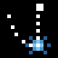Fly upwards (FLY_UPWARDS) [[toc](#FLY_UPWARDS_CONTENTS)]

* **description**: Causes a projectile to aim straight upwards a short time after casting
* **type**: ACTION_TYPE_MODIFIER
* **spawn_level**: [2, 4, 6]
* **spawn_probability**: [0.4, 0.4, 0.4]
* **price**: 20
* **mana**: 0
* **max_uses**: 0
* **never_unlimited**: false
* **spawn_manual_unlock**: false
* **recursive**: false
* **ai_never_uses**: false
* **is_dangerous_blast**: false
* **related_projectiles**: 
* **spawn_requires_flag**: 
* **related_extra_entities**: { "data/entities/misc/fly_upwards.xml" }
* **action**:

```lua
 function()
      c.extra_entities = c.extra_entities .. "data/entities/misc/fly_upwards.xml,"
      draw_actions( 1, true )
      c.fire_rate_wait    = c.fire_rate_wait - 3
    end,
```


### <a id="FREEZE"></a>Freeze charge (FREEZE) [[toc](#FREEZE_CONTENTS)]

* **description**: Gives a projectile a frozen charge, that it will release on impact
* **type**: ACTION_TYPE_MODIFIER
* **spawn_level**: [1, 3, 4, 5]
* **spawn_probability**: [1.0, 1.0, 1.0, 1.0]
* **price**: 140
* **mana**: 10
* **max_uses**: 0
* **never_unlimited**: false
* **spawn_manual_unlock**: false
* **recursive**: false
* **ai_never_uses**: false
* **is_dangerous_blast**: false
* **related_projectiles**: 
* **spawn_requires_flag**: 
* **related_extra_entities**: { "data/entities/particles/freeze_charge.xml" }
* **action**:

```lua
 function()
      c.damage_ice_add = c.damage_ice_add + 0.2
      c.game_effect_entities = c.game_effect_entities .. "data/entities/misc/effect_frozen.xml,"
      c.extra_entities = c.extra_entities .. "data/entities/particles/freeze_charge.xml,"
      draw_actions( 1, true )
    end,
```


### <a id="FREEZE_FIELD"></a>Circle of stillness (FREEZE_FIELD) [[toc](#FREEZE_FIELD_CONTENTS)]

* **description**: A field of freezing magic
* **type**: ACTION_TYPE_STATIC_PROJECTILE
* **spawn_level**: [0, 2, 4, 5]
* **spawn_probability**: [0.3, 0.6, 0.7, 0.3]
* **price**: 200
* **mana**: 50
* **max_uses**: 15
* **never_unlimited**: false
* **spawn_manual_unlock**: false
* **recursive**: false
* **ai_never_uses**: false
* **is_dangerous_blast**: false
* **related_projectiles**: {"data/entities/projectiles/deck/freeze_field.xml"}
* **spawn_requires_flag**: 
* **related_extra_entities**: 
* **action**:

```lua
 function()
      add_projectile("data/entities/projectiles/deck/freeze_field.xml")
      c.fire_rate_wait = c.fire_rate_wait + 15
    end,
```


### <a id="FREEZING_GAZE"></a>Freezing gaze (FREEZING_GAZE) [[toc](#FREEZING_GAZE_CONTENTS)]

* **description**: A heart-freezingly sinister aura
* **type**: ACTION_TYPE_PROJECTILE
* **spawn_level**: [2, 3, 4]
* **spawn_probability**: [1.0, 1.0, 1.0]
* **price**: 180
* **mana**: 45
* **max_uses**: 20
* **never_unlimited**: false
* **spawn_manual_unlock**: false
* **recursive**: false
* **ai_never_uses**: false
* **is_dangerous_blast**: false
* **related_projectiles**: {"data/entities/projectiles/deck/freezing_gaze_beam.xml",12}
* **spawn_requires_flag**: 
* **related_extra_entities**: 
* **action**:

```lua
 function()
      add_projectile("data/entities/projectiles/deck/freezing_gaze_beam.xml")
      add_projectile("data/entities/projectiles/deck/freezing_gaze_beam.xml")
      add_projectile("data/entities/projectiles/deck/freezing_gaze_beam.xml")
      add_projectile("data/entities/projectiles/deck/freezing_gaze_beam.xml")
      add_projectile("data/entities/projectiles/deck/freezing_gaze_beam.xml")
      add_projectile("data/entities/projectiles/deck/freezing_gaze_beam.xml")
      add_projectile("data/entities/projectiles/deck/freezing_gaze_beam.xml")
      add_projectile("data/entities/projectiles/deck/freezing_gaze_beam.xml")
      add_projectile("data/entities/projectiles/deck/freezing_gaze_beam.xml")
      add_projectile("data/entities/projectiles/deck/freezing_gaze_beam.xml")
      add_projectile("data/entities/projectiles/deck/freezing_gaze_beam.xml")
      add_projectile("data/entities/projectiles/deck/freezing_gaze_beam.xml")
      c.pattern_degrees = 30
      c.fire_rate_wait = c.fire_rate_wait + 20
    end,
```


### <a id="FRIEND_FLY"></a>Summon Friendly fly (FRIEND_FLY) [[toc](#FRIEND_FLY_CONTENTS)]

* **description**: Summons a friendly fly that attacks your enemies!
* **type**: ACTION_TYPE_STATIC_PROJECTILE
* **spawn_level**: [4, 5, 6]
* **spawn_probability**: [0.2, 0.5, 0.5]
* **price**: 160
* **mana**: 120
* **max_uses**: 0
* **never_unlimited**: false
* **spawn_manual_unlock**: false
* **recursive**: false
* **ai_never_uses**: false
* **is_dangerous_blast**: false
* **related_projectiles**: {"data/entities/projectiles/deck/friend_fly.xml"}
* **spawn_requires_flag**: 
* **related_extra_entities**: 
* **action**:

```lua
 function()
      add_projectile("data/entities/projectiles/deck/friend_fly.xml")
      c.spread_degrees = c.spread_degrees + 24.0
      c.fire_rate_wait = c.fire_rate_wait + 80
      current_reload_time = current_reload_time + 40
    end,
```


### <a id="FUNKY_SPELL"></a>??? (FUNKY_SPELL) [[toc](#FUNKY_SPELL_CONTENTS)]

* **description**: ???
* **type**: ACTION_TYPE_PROJECTILE
* **spawn_level**: [6, 10]
* **spawn_probability**: [0.1, 0.1]
* **price**: 50
* **mana**: 5
* **max_uses**: 0
* **never_unlimited**: false
* **spawn_manual_unlock**: false
* **recursive**: false
* **ai_never_uses**: false
* **is_dangerous_blast**: false
* **related_projectiles**: {"data/entities/projectiles/deck/machinegun_bullet.xml"}
* **spawn_requires_flag**: card_unlocked_funky
* **related_extra_entities**: 
* **action**:

```lua
 function()
      add_projectile("data/entities/projectiles/deck/machinegun_bullet.xml")
      c.fire_rate_wait = c.fire_rate_wait - 3
      c.screenshake = c.screenshake + 0.2
      c.spread_degrees = c.spread_degrees + 2.0
      c.damage_critical_chance = c.damage_critical_chance + 1
    end,
```


### <a id="GAMMA"></a>Gamma (GAMMA) [[toc](#GAMMA_CONTENTS)]

* **description**: Casts a copy of the last spell in your wand
* **type**: ACTION_TYPE_OTHER
* **spawn_level**: [5, 6, 10]
* **spawn_probability**: [0.1, 0.1, 1.0]
* **price**: 200
* **mana**: 30
* **max_uses**: 0
* **never_unlimited**: false
* **spawn_manual_unlock**: false
* **recursive**: true
* **ai_never_uses**: false
* **is_dangerous_blast**: false
* **related_projectiles**: 
* **spawn_requires_flag**: card_unlocked_duplicate
* **related_extra_entities**: 
* **action**:

```lua
 function( recursion_level, iteration )
      c.fire_rate_wait = c.fire_rate_wait + 15
      
      local data = {}
      
      if ( #deck > 0 ) then
        data = deck[#deck]
      elseif ( #hand > 0 ) then
        data = hand[#hand]
      else
        data = nil
      end
      
      local rec = check_recursion( data, recursion_level )
      
      if ( data ~= nil ) and ( rec > -1 ) then
        data.action( rec )
      end
      
    end,
```


### <a id="GLITTER_BOMB"></a>Glitter bomb (GLITTER_BOMB) [[toc](#GLITTER_BOMB_CONTENTS)]

* **description**: Summons a bomb that explodes into volatile fragments
* **type**: ACTION_TYPE_PROJECTILE
* **spawn_level**: [0, 1, 2, 3, 4]
* **spawn_probability**: [0.8, 0.8, 0.8, 0.8, 0.8]
* **price**: 200
* **mana**: 70
* **max_uses**: 16
* **never_unlimited**: false
* **spawn_manual_unlock**: false
* **recursive**: false
* **ai_never_uses**: false
* **is_dangerous_blast**: false
* **related_projectiles**: {"data/entities/projectiles/deck/glitter_bomb.xml"}
* **spawn_requires_flag**: 
* **related_extra_entities**: 
* **action**:

```lua
 function()
      add_projectile("data/entities/projectiles/deck/glitter_bomb.xml")
      c.fire_rate_wait = c.fire_rate_wait + 50
      c.spread_degrees = c.spread_degrees + 12.0
    end,
```


### <a id="GLOWING_BOLT"></a>Pinpoint of light (GLOWING_BOLT) [[toc](#GLOWING_BOLT_CONTENTS)]

* **description**: An extremely concentrated point of light that explodes after a moment
* **type**: ACTION_TYPE_PROJECTILE
* **spawn_level**: [3, 4, 5, 10]
* **spawn_probability**: [1.0, 1.0, 1.0, 0.1]
* **price**: 220
* **mana**: 65
* **max_uses**: 0
* **never_unlimited**: false
* **spawn_manual_unlock**: false
* **recursive**: false
* **ai_never_uses**: false
* **is_dangerous_blast**: false
* **related_projectiles**: {"data/entities/projectiles/deck/glowing_bolt.xml"}
* **spawn_requires_flag**: 
* **related_extra_entities**: 
* **action**:

```lua
 function()
      add_projectile("data/entities/projectiles/deck/glowing_bolt.xml")
      c.fire_rate_wait = c.fire_rate_wait + 40
      c.spread_degrees = c.spread_degrees + 6.0
    end,
```


### <a id="GLUE_SHOT"></a>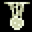Glue Ball (GLUE_SHOT) [[toc](#GLUE_SHOT_CONTENTS)]

* **description**: A projectile that explodes into a sticky mess
* **type**: ACTION_TYPE_PROJECTILE
* **spawn_level**: [2, 3, 4, 5]
* **spawn_probability**: [0.6, 0.2, 0.2, 0.6]
* **price**: 140
* **mana**: 25
* **max_uses**: 0
* **never_unlimited**: false
* **spawn_manual_unlock**: false
* **recursive**: false
* **ai_never_uses**: false
* **is_dangerous_blast**: false
* **related_projectiles**: {"data/entities/projectiles/deck/glue_shot.xml"}
* **spawn_requires_flag**: 
* **related_extra_entities**: 
* **action**:

```lua
 function()
      add_projectile("data/entities/projectiles/deck/glue_shot.xml")
      c.fire_rate_wait = c.fire_rate_wait + 30
      c.spread_degrees = c.spread_degrees + 5.0
    end,
```


### <a id="GRAVITY"></a>Gravity (GRAVITY) [[toc](#GRAVITY_CONTENTS)]

* **description**: Increases the effect gravity has on a projectile
* **type**: ACTION_TYPE_MODIFIER
* **spawn_level**: [2, 3, 4, 5, 6]
* **spawn_probability**: [0.5, 0.5, 0.5, 0.5, 0.5]
* **price**: 50
* **mana**: 1
* **max_uses**: 0
* **never_unlimited**: false
* **spawn_manual_unlock**: false
* **recursive**: false
* **ai_never_uses**: false
* **is_dangerous_blast**: false
* **related_projectiles**: 
* **spawn_requires_flag**: 
* **related_extra_entities**: 
* **action**:

```lua
 function()
      c.gravity = c.gravity + 600.0
      draw_actions( 1, true )
    end,
```


### <a id="GRAVITY_ANTI"></a>Anti-gravity (GRAVITY_ANTI) [[toc](#GRAVITY_ANTI_CONTENTS)]

* **description**: Applies a lifting force to a projectile
* **type**: ACTION_TYPE_MODIFIER
* **spawn_level**: [2, 3, 4, 5, 6]
* **spawn_probability**: [0.5, 0.5, 0.5, 0.5, 0.5]
* **price**: 50
* **mana**: 1
* **max_uses**: 0
* **never_unlimited**: false
* **spawn_manual_unlock**: false
* **recursive**: false
* **ai_never_uses**: false
* **is_dangerous_blast**: false
* **related_projectiles**: 
* **spawn_requires_flag**: 
* **related_extra_entities**: 
* **action**:

```lua
 function()
      c.gravity = c.gravity - 600.0
      draw_actions( 1, true )
    end,
```


### <a id="GRAVITY_FIELD_ENEMY"></a>Personal gravity field (GRAVITY_FIELD_ENEMY) [[toc](#GRAVITY_FIELD_ENEMY_CONTENTS)]

* **description**: Makes creatures hit by a projectile gain a temporary gravity well that draws projectiles in
* **type**: ACTION_TYPE_MODIFIER
* **spawn_level**: [1, 2, 4, 5]
* **spawn_probability**: [0.6, 0.6, 0.4, 0.4]
* **price**: 250
* **mana**: 110
* **max_uses**: 20
* **never_unlimited**: false
* **spawn_manual_unlock**: false
* **recursive**: false
* **ai_never_uses**: false
* **is_dangerous_blast**: false
* **related_projectiles**: 
* **spawn_requires_flag**: 
* **related_extra_entities**: { "data/entities/misc/hitfx_gravity_field_enemy.xml" }
* **action**:

```lua
 function()
      c.extra_entities = c.extra_entities .. "data/entities/misc/hitfx_gravity_field_enemy.xml,"
      draw_actions( 1, true )
    end,
```


### <a id="GRENADE"></a>Firebolt (GRENADE) [[toc](#GRENADE_CONTENTS)]

* **description**: A bouncy, explosive bolt
* **type**: ACTION_TYPE_PROJECTILE
* **spawn_level**: [0, 1, 2, 3, 4]
* **spawn_probability**: [1.0, 1.0, 0.5, 0.25, 0.25]
* **price**: 170
* **mana**: 50
* **max_uses**: 25
* **never_unlimited**: false
* **spawn_manual_unlock**: false
* **recursive**: false
* **ai_never_uses**: false
* **is_dangerous_blast**: false
* **related_projectiles**: {"data/entities/projectiles/deck/grenade.xml"}
* **spawn_requires_flag**: 
* **related_extra_entities**: 
* **action**:

```lua
 function()
      add_projectile("data/entities/projectiles/deck/grenade.xml")
      c.fire_rate_wait = c.fire_rate_wait + 30
      c.screenshake = c.screenshake + 4.0
      c.child_speed_multiplier = c.child_speed_multiplier * 0.75
      shot_effects.recoil_knockback = 80.0
    end,
```


### <a id="GRENADE_ANTI"></a>Odd Firebolt (GRENADE_ANTI) [[toc](#GRENADE_ANTI_CONTENTS)]

* **description**: A somewhat peculiar bouncy, explosive bolt
* **type**: ACTION_TYPE_PROJECTILE
* **spawn_level**: [0, 1, 2, 3, 4, 5]
* **spawn_probability**: [0.4, 0.4, 0.4, 0.4, 0.4, 0.4]
* **price**: 170
* **mana**: 50
* **max_uses**: 25
* **never_unlimited**: false
* **spawn_manual_unlock**: false
* **recursive**: false
* **ai_never_uses**: false
* **is_dangerous_blast**: false
* **related_projectiles**: {"data/entities/projectiles/deck/grenade_anti.xml"}
* **spawn_requires_flag**: 
* **related_extra_entities**: 
* **action**:

```lua
 function()
      add_projectile("data/entities/projectiles/deck/grenade_anti.xml")
      c.fire_rate_wait = c.fire_rate_wait + 30
      c.screenshake = c.screenshake + 4.0
      c.child_speed_multiplier = c.child_speed_multiplier * 0.75
      shot_effects.recoil_knockback = 80.0
    end,
```


### <a id="GRENADE_LARGE"></a>Dropper bolt (GRENADE_LARGE) [[toc](#GRENADE_LARGE_CONTENTS)]

* **description**: A very heavy explosive bolt
* **type**: ACTION_TYPE_PROJECTILE
* **spawn_level**: [0, 1, 2, 3, 4, 5]
* **spawn_probability**: [0.4, 0.4, 0.4, 0.4, 0.4, 0.4]
* **price**: 150
* **mana**: 80
* **max_uses**: 35
* **never_unlimited**: false
* **spawn_manual_unlock**: false
* **recursive**: false
* **ai_never_uses**: false
* **is_dangerous_blast**: false
* **related_projectiles**: {"data/entities/projectiles/deck/grenade_large.xml"}
* **spawn_requires_flag**: 
* **related_extra_entities**: 
* **action**:

```lua
 function()
      add_projectile("data/entities/projectiles/deck/grenade_large.xml")
      c.fire_rate_wait = c.fire_rate_wait + 40
      c.screenshake = c.screenshake + 5.0
      c.child_speed_multiplier = c.child_speed_multiplier * 0.75
      shot_effects.recoil_knockback = 80.0
    end,
```


### <a id="GRENADE_TIER_2"></a>Large firebolt (GRENADE_TIER_2) [[toc](#GRENADE_TIER_2_CONTENTS)]

* **description**: A more powerful version of Firebolt
* **type**: ACTION_TYPE_PROJECTILE
* **spawn_level**: [1, 2, 3, 4, 5]
* **spawn_probability**: [0.5, 1.0, 1.0, 1.0, 1.0]
* **price**: 220
* **mana**: 90
* **max_uses**: 20
* **never_unlimited**: false
* **spawn_manual_unlock**: false
* **recursive**: false
* **ai_never_uses**: false
* **is_dangerous_blast**: false
* **related_projectiles**: {"data/entities/projectiles/deck/grenade_tier_2.xml"}
* **spawn_requires_flag**: 
* **related_extra_entities**: 
* **action**:

```lua
 function()
      add_projectile("data/entities/projectiles/deck/grenade_tier_2.xml")
      c.fire_rate_wait = c.fire_rate_wait + 50
      c.screenshake = c.screenshake + 8.0
      c.child_speed_multiplier = c.child_speed_multiplier * 0.75
      shot_effects.recoil_knockback = 120.0
    end,
```


### <a id="GRENADE_TIER_3"></a>Giant firebolt (GRENADE_TIER_3) [[toc](#GRENADE_TIER_3_CONTENTS)]

* **description**: The most powerful version of Firebolt
* **type**: ACTION_TYPE_PROJECTILE
* **spawn_level**: [1, 2, 3, 4, 5]
* **spawn_probability**: [0.25, 0.5, 0.75, 1.0, 1.0]
* **price**: 220
* **mana**: 90
* **max_uses**: 20
* **never_unlimited**: false
* **spawn_manual_unlock**: false
* **recursive**: false
* **ai_never_uses**: false
* **is_dangerous_blast**: false
* **related_projectiles**: {"data/entities/projectiles/deck/grenade_tier_3.xml"}
* **spawn_requires_flag**: 
* **related_extra_entities**: 
* **action**:

```lua
 function()
      add_projectile("data/entities/projectiles/deck/grenade_tier_3.xml")
      c.fire_rate_wait = c.fire_rate_wait + 80
      c.screenshake = c.screenshake + 15.0
      c.child_speed_multiplier = c.child_speed_multiplier * 0.9
      shot_effects.recoil_knockback = 140.0
    end,
```


### <a id="GRENADE_TRIGGER"></a>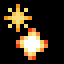Firebolt with trigger (GRENADE_TRIGGER) [[toc](#GRENADE_TRIGGER_CONTENTS)]

* **description**: A bouncy, explosive bolt that that casts another spell upon collision
* **type**: ACTION_TYPE_PROJECTILE
* **spawn_level**: [0, 1, 2, 3, 4, 5]
* **spawn_probability**: [0.5, 0.5, 0.5, 0.5, 0.5, 1.0]
* **price**: 210
* **mana**: 50
* **max_uses**: 25
* **never_unlimited**: false
* **spawn_manual_unlock**: false
* **recursive**: false
* **ai_never_uses**: false
* **is_dangerous_blast**: false
* **related_projectiles**: {"data/entities/projectiles/deck/grenade.xml"}
* **spawn_requires_flag**: 
* **related_extra_entities**: 
* **action**:

```lua
 function()
      c.fire_rate_wait = c.fire_rate_wait + 30
      c.screenshake = c.screenshake + 4.0
      c.child_speed_multiplier = c.child_speed_multiplier * 0.75
      add_projectile_trigger_hit_world("data/entities/projectiles/deck/grenade.xml", 1)
      shot_effects.recoil_knockback = 80.0
    end,
```


### <a id="GUNPOWDER_TRAIL"></a>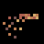Gunpowder trail (GUNPOWDER_TRAIL) [[toc](#GUNPOWDER_TRAIL_CONTENTS)]

* **description**: Gives a projectile a trail of gunpowder
* **type**: ACTION_TYPE_MODIFIER
* **spawn_level**: [2, 3, 4]
* **spawn_probability**: [0.3, 0.3, 0.3]
* **price**: 160
* **mana**: 10
* **max_uses**: 0
* **never_unlimited**: false
* **spawn_manual_unlock**: false
* **recursive**: false
* **ai_never_uses**: false
* **is_dangerous_blast**: false
* **related_projectiles**: 
* **spawn_requires_flag**: 
* **related_extra_entities**: 
* **action**:

```lua
 function()
      c.trail_material = c.trail_material .. "gunpowder,"
      c.trail_material_amount = c.trail_material_amount + 20
      draw_actions( 1, true )
    end,
```


### <a id="HEAL_BULLET"></a>Healing bolt (HEAL_BULLET) [[toc](#HEAL_BULLET_CONTENTS)]

* **description**: A magical bolt with rejuvenative powers
* **type**: ACTION_TYPE_PROJECTILE
* **spawn_level**: [2, 3, 4]
* **spawn_probability**: [1.0, 1.0, 1.0]
* **price**: 60
* **mana**: 15
* **max_uses**: 20
* **never_unlimited**: true
* **spawn_manual_unlock**: false
* **recursive**: false
* **ai_never_uses**: false
* **is_dangerous_blast**: false
* **related_projectiles**: {"data/entities/projectiles/deck/heal_bullet.xml"}
* **spawn_requires_flag**: 
* **related_extra_entities**: 
* **action**:

```lua
 function()
      add_projectile("data/entities/projectiles/deck/heal_bullet.xml")
      c.fire_rate_wait = c.fire_rate_wait + 4
      c.spread_degrees = c.spread_degrees + 2.0
    end,
```


### <a id="HEAVY_BULLET"></a>Magic bolt (HEAVY_BULLET) [[toc](#HEAVY_BULLET_CONTENTS)]

* **description**: A powerful magical bolt
* **type**: ACTION_TYPE_PROJECTILE
* **spawn_level**: [1, 2, 3, 4, 5, 6]
* **spawn_probability**: [0.5, 1.0, 1.0, 1.0, 1.0, 1.0]
* **price**: 200
* **mana**: 30
* **max_uses**: 0
* **never_unlimited**: false
* **spawn_manual_unlock**: false
* **recursive**: false
* **ai_never_uses**: false
* **is_dangerous_blast**: false
* **related_projectiles**: {"data/entities/projectiles/deck/bullet_heavy.xml"}
* **spawn_requires_flag**: 
* **related_extra_entities**: 
* **action**:

```lua
 function()
      add_projectile("data/entities/projectiles/deck/bullet_heavy.xml")
      c.fire_rate_wait = c.fire_rate_wait + 7
      c.screenshake = c.screenshake + 2.5
      c.spread_degrees = c.spread_degrees + 5.0
      c.damage_critical_chance = c.damage_critical_chance + 5
      shot_effects.recoil_knockback = shot_effects.recoil_knockback + 50.0
    end,
```


### <a id="HEAVY_BULLET_TIMER"></a>Magic bolt with timer (HEAVY_BULLET_TIMER) [[toc](#HEAVY_BULLET_TIMER_CONTENTS)]

* **description**: A powerful magical bolt that casts another spell after a timer runs out
* **type**: ACTION_TYPE_PROJECTILE
* **spawn_level**: [2, 3, 4, 5, 6]
* **spawn_probability**: [0.5, 0.5, 0.5, 0.5, 0.5]
* **price**: 240
* **mana**: 40
* **max_uses**: 0
* **never_unlimited**: false
* **spawn_manual_unlock**: false
* **recursive**: false
* **ai_never_uses**: false
* **is_dangerous_blast**: false
* **related_projectiles**: {"data/entities/projectiles/deck/bullet_heavy.xml"}
* **spawn_requires_flag**: 
* **related_extra_entities**: 
* **action**:

```lua
 function()
      c.fire_rate_wait = c.fire_rate_wait + 7
      c.screenshake = c.screenshake + 2.5
      c.spread_degrees = c.spread_degrees + 5.0
      c.damage_critical_chance = c.damage_critical_chance + 5
      add_projectile_trigger_timer("data/entities/projectiles/deck/bullet_heavy.xml", 10, 1)
      shot_effects.recoil_knockback = shot_effects.recoil_knockback + 50.0
    end,
```


### <a id="HEAVY_BULLET_TRIGGER"></a>Magic bolt with trigger (HEAVY_BULLET_TRIGGER) [[toc](#HEAVY_BULLET_TRIGGER_CONTENTS)]

* **description**: A powerful magical bolt that casts another spell upon collision
* **type**: ACTION_TYPE_PROJECTILE
* **spawn_level**: [2, 3, 4, 5, 6]
* **spawn_probability**: [0.5, 0.5, 0.5, 0.5, 0.5]
* **price**: 240
* **mana**: 40
* **max_uses**: 0
* **never_unlimited**: false
* **spawn_manual_unlock**: false
* **recursive**: false
* **ai_never_uses**: false
* **is_dangerous_blast**: false
* **related_projectiles**: {"data/entities/projectiles/deck/bullet_heavy.xml"}
* **spawn_requires_flag**: 
* **related_extra_entities**: 
* **action**:

```lua
 function()
      c.fire_rate_wait = c.fire_rate_wait + 7
      c.screenshake = c.screenshake + 2.5
      c.spread_degrees = c.spread_degrees + 5.0
      c.damage_critical_chance = c.damage_critical_chance + 5
      add_projectile_trigger_hit_world("data/entities/projectiles/deck/bullet_heavy.xml", 1)
      shot_effects.recoil_knockback = shot_effects.recoil_knockback + 50.0
    end,
```


### <a id="HEAVY_SHOT"></a>Heavy Shot (HEAVY_SHOT) [[toc](#HEAVY_SHOT_CONTENTS)]

* **description**: Greatly increases the damage done by a projectile, at the cost of its speed
* **type**: ACTION_TYPE_MODIFIER
* **spawn_level**: [2, 3, 4]
* **spawn_probability**: [0.4, 0.4, 0.4]
* **price**: 150
* **mana**: 7
* **max_uses**: 0
* **never_unlimited**: false
* **spawn_manual_unlock**: false
* **recursive**: false
* **ai_never_uses**: false
* **is_dangerous_blast**: false
* **related_projectiles**: 
* **spawn_requires_flag**: 
* **related_extra_entities**: { "data/entities/particles/heavy_shot.xml" }
* **action**:

```lua
 function()
      c.damage_projectile_add = c.damage_projectile_add + 1.75
      c.fire_rate_wait    = c.fire_rate_wait + 10
      c.gore_particles    = c.gore_particles + 10
      c.speed_multiplier = c.speed_multiplier * 0.3
      shot_effects.recoil_knockback = shot_effects.recoil_knockback + 50.0
      c.extra_entities = c.extra_entities .. "data/entities/particles/heavy_shot.xml,"
      
      if ( c.speed_multiplier >= 20 ) then
        c.speed_multiplier = math.min( c.speed_multiplier, 20 )
      elseif ( c.speed_multiplier < 0 ) then
        c.speed_multiplier = 0
      end
      
      draw_actions( 1, true )
    end,
```


### <a id="HEAVY_SPREAD"></a>Heavy spread (HEAVY_SPREAD) [[toc](#HEAVY_SPREAD_CONTENTS)]

* **description**: Gives a projectile a much lower cast delay, but no respect to your aim
* **type**: ACTION_TYPE_MODIFIER
* **spawn_level**: [0, 1, 2, 4, 5, 6]
* **spawn_probability**: [0.8, 0.8, 0.8, 0.8, 0.8, 0.8]
* **price**: 100
* **mana**: 2
* **max_uses**: 0
* **never_unlimited**: false
* **spawn_manual_unlock**: false
* **recursive**: false
* **ai_never_uses**: false
* **is_dangerous_blast**: false
* **related_projectiles**: 
* **spawn_requires_flag**: 
* **related_extra_entities**: 
* **action**:

```lua
 function()
      c.fire_rate_wait = c.fire_rate_wait - 7
      current_reload_time = current_reload_time - 15
      c.spread_degrees = c.spread_degrees + 720
      draw_actions( 1, true )
    end,
```


### <a id="HITFX_BURNING_CRITICAL_HIT"></a>Critical on burning (HITFX_BURNING_CRITICAL_HIT) [[toc](#HITFX_BURNING_CRITICAL_HIT_CONTENTS)]

* **description**: Makes a projectile always do a critical hit on burning enemies
* **type**: ACTION_TYPE_MODIFIER
* **spawn_level**: [1, 3, 4, 5]
* **spawn_probability**: [0.2, 0.2, 0.2, 0.2]
* **price**: 70
* **mana**: 10
* **max_uses**: 0
* **never_unlimited**: false
* **spawn_manual_unlock**: false
* **recursive**: false
* **ai_never_uses**: false
* **is_dangerous_blast**: false
* **related_projectiles**: 
* **spawn_requires_flag**: 
* **related_extra_entities**: { "data/entities/particles/freeze_charge.xml" }
* **action**:

```lua
 function()
      c.extra_entities = c.extra_entities .. "data/entities/misc/hitfx_burning_critical_hit.xml,"
      draw_actions( 1, true )
    end,
```


### <a id="HITFX_CRITICAL_BLOOD"></a>Critical on bloody enemies (HITFX_CRITICAL_BLOOD) [[toc](#HITFX_CRITICAL_BLOOD_CONTENTS)]

* **description**: Makes a projectile always do a critical hit on bloody enemies
* **type**: ACTION_TYPE_MODIFIER
* **spawn_level**: [1, 3, 4, 5]
* **spawn_probability**: [0.2, 0.2, 0.2, 0.2]
* **price**: 70
* **mana**: 10
* **max_uses**: 0
* **never_unlimited**: false
* **spawn_manual_unlock**: false
* **recursive**: false
* **ai_never_uses**: false
* **is_dangerous_blast**: false
* **related_projectiles**: 
* **spawn_requires_flag**: 
* **related_extra_entities**: { "data/entities/misc/hitfx_critical_blood.xml" }
* **action**:

```lua
 function()
      c.extra_entities = c.extra_entities .. "data/entities/misc/hitfx_critical_blood.xml,"
      draw_actions( 1, true )
    end,
```


### <a id="HITFX_CRITICAL_OIL"></a>Critical on oiled enemies (HITFX_CRITICAL_OIL) [[toc](#HITFX_CRITICAL_OIL_CONTENTS)]

* **description**: Makes a projectile always do a critical hit on oiled enemies
* **type**: ACTION_TYPE_MODIFIER
* **spawn_level**: [1, 3, 4, 5]
* **spawn_probability**: [0.2, 0.2, 0.2, 0.2]
* **price**: 70
* **mana**: 10
* **max_uses**: 0
* **never_unlimited**: false
* **spawn_manual_unlock**: false
* **recursive**: false
* **ai_never_uses**: false
* **is_dangerous_blast**: false
* **related_projectiles**: 
* **spawn_requires_flag**: 
* **related_extra_entities**: { "data/entities/misc/hitfx_critical_oil.xml" }
* **action**:

```lua
 function()
      c.extra_entities = c.extra_entities .. "data/entities/misc/hitfx_critical_oil.xml,"
      draw_actions( 1, true )
    end,
```


### <a id="HITFX_CRITICAL_WATER"></a>Critical on wet (water) enemies (HITFX_CRITICAL_WATER) [[toc](#HITFX_CRITICAL_WATER_CONTENTS)]

* **description**: Makes a projectile always do a critical hit on wet (water) enemies
* **type**: ACTION_TYPE_MODIFIER
* **spawn_level**: [1, 3, 4, 5]
* **spawn_probability**: [0.2, 0.2, 0.2, 0.2]
* **price**: 70
* **mana**: 10
* **max_uses**: 0
* **never_unlimited**: false
* **spawn_manual_unlock**: false
* **recursive**: false
* **ai_never_uses**: false
* **is_dangerous_blast**: false
* **related_projectiles**: 
* **spawn_requires_flag**: 
* **related_extra_entities**: { "data/entities/misc/hitfx_critical_water.xml" }
* **action**:

```lua
 function()
      c.extra_entities = c.extra_entities .. "data/entities/misc/hitfx_critical_water.xml,"
      draw_actions( 1, true )
    end,
```


### <a id="HITFX_EXPLOSION_ALCOHOL"></a>Explosion on drunk enemies (HITFX_EXPLOSION_ALCOHOL) [[toc](#HITFX_EXPLOSION_ALCOHOL_CONTENTS)]

* **description**: Makes a projectile explode upon collision with creatures covered in alcohol
* **type**: ACTION_TYPE_MODIFIER
* **spawn_level**: [1, 3, 4, 5]
* **spawn_probability**: [0.2, 0.2, 0.2, 0.2]
* **price**: 140
* **mana**: 20
* **max_uses**: 0
* **never_unlimited**: false
* **spawn_manual_unlock**: false
* **recursive**: false
* **ai_never_uses**: false
* **is_dangerous_blast**: false
* **related_projectiles**: 
* **spawn_requires_flag**: 
* **related_extra_entities**: { "data/entities/misc/hitfx_explode_alcohol.xml" }
* **action**:

```lua
 function()
      c.extra_entities = c.extra_entities .. "data/entities/misc/hitfx_explode_alcohol.xml,"
      draw_actions( 1, true )
    end,
```


### <a id="HITFX_EXPLOSION_ALCOHOL_GIGA"></a>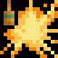Giant explosion on drunk enemies (HITFX_EXPLOSION_ALCOHOL_GIGA) [[toc](#HITFX_EXPLOSION_ALCOHOL_GIGA_CONTENTS)]

* **description**: Makes a projectile explode powerfully upon collision with creatures covered in alcohol
* **type**: ACTION_TYPE_MODIFIER
* **spawn_level**: [1, 3, 4, 5]
* **spawn_probability**: [0.1, 0.1, 0.1, 0.1]
* **price**: 300
* **mana**: 200
* **max_uses**: 20
* **never_unlimited**: false
* **spawn_manual_unlock**: false
* **recursive**: false
* **ai_never_uses**: false
* **is_dangerous_blast**: false
* **related_projectiles**: 
* **spawn_requires_flag**: 
* **related_extra_entities**: { "data/entities/misc/hitfx_explode_alcohol_giga.xml", "data/entities/particles/tinyspark_orange.xml" }
* **action**:

```lua
 function()
      c.extra_entities = c.extra_entities .. "data/entities/misc/hitfx_explode_alcohol_giga.xml,data/entities/particles/tinyspark_orange.xml,"
      draw_actions( 1, true )
    end,
```


### <a id="HITFX_EXPLOSION_SLIME"></a>Explosion on slimy enemies (HITFX_EXPLOSION_SLIME) [[toc](#HITFX_EXPLOSION_SLIME_CONTENTS)]

* **description**: Makes a projectile explode upon collision with creatures covered in slime
* **type**: ACTION_TYPE_MODIFIER
* **spawn_level**: [1, 3, 4, 5]
* **spawn_probability**: [0.2, 0.2, 0.2, 0.2]
* **price**: 140
* **mana**: 20
* **max_uses**: 0
* **never_unlimited**: false
* **spawn_manual_unlock**: false
* **recursive**: false
* **ai_never_uses**: false
* **is_dangerous_blast**: false
* **related_projectiles**: 
* **spawn_requires_flag**: 
* **related_extra_entities**: { "data/entities/misc/hitfx_explode_slime.xml" }
* **action**:

```lua
 function()
      c.extra_entities = c.extra_entities .. "data/entities/misc/hitfx_explode_slime.xml,"
      draw_actions( 1, true )
    end,
```


### <a id="HITFX_EXPLOSION_SLIME_GIGA"></a>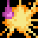Giant explosion on slimy enemies (HITFX_EXPLOSION_SLIME_GIGA) [[toc](#HITFX_EXPLOSION_SLIME_GIGA_CONTENTS)]

* **description**: Makes a projectile explode powerfully upon collision with creatures covered in slime
* **type**: ACTION_TYPE_MODIFIER
* **spawn_level**: [1, 3, 4, 5]
* **spawn_probability**: [0.1, 0.1, 0.1, 0.1]
* **price**: 300
* **mana**: 200
* **max_uses**: 20
* **never_unlimited**: false
* **spawn_manual_unlock**: false
* **recursive**: false
* **ai_never_uses**: false
* **is_dangerous_blast**: false
* **related_projectiles**: 
* **spawn_requires_flag**: 
* **related_extra_entities**: { "data/entities/misc/hitfx_explode_slime_giga.xml", "data/entities/particles/tinyspark_purple.xml" }
* **action**:

```lua
 function()
      c.extra_entities = c.extra_entities .. "data/entities/misc/hitfx_explode_slime_giga.xml,data/entities/particles/tinyspark_purple.xml,"
      draw_actions( 1, true )
    end,
```


### <a id="HITFX_PETRIFY"></a>Petrify (HITFX_PETRIFY) [[toc](#HITFX_PETRIFY_CONTENTS)]

* **description**: Turns a wounded enemy into stone
* **type**: ACTION_TYPE_MODIFIER
* **spawn_level**: [2, 3, 5, 6]
* **spawn_probability**: [0.2, 0.2, 0.2, 0.2]
* **price**: 140
* **mana**: 10
* **max_uses**: 0
* **never_unlimited**: false
* **spawn_manual_unlock**: false
* **recursive**: false
* **ai_never_uses**: false
* **is_dangerous_blast**: false
* **related_projectiles**: 
* **spawn_requires_flag**: 
* **related_extra_entities**: 
* **action**:

```lua
 function()
      c.extra_entities = c.extra_entities .. "data/entities/misc/hitfx_petrify.xml,"
      draw_actions( 1, true )
    end,
```


### <a id="HITFX_TOXIC_CHARM"></a>Charm on toxic sludge (HITFX_TOXIC_CHARM) [[toc](#HITFX_TOXIC_CHARM_CONTENTS)]

* **description**: Makes a projectile charm creatures covered in toxic sludge
* **type**: ACTION_TYPE_MODIFIER
* **spawn_level**: [1, 3, 4, 5]
* **spawn_probability**: [0.2, 0.2, 0.2, 0.2]
* **price**: 150
* **mana**: 70
* **max_uses**: 0
* **never_unlimited**: false
* **spawn_manual_unlock**: false
* **recursive**: false
* **ai_never_uses**: false
* **is_dangerous_blast**: false
* **related_projectiles**: 
* **spawn_requires_flag**: 
* **related_extra_entities**: { "data/entities/misc/hitfx_toxic_charm.xml" }
* **action**:

```lua
 function()
      c.extra_entities = c.extra_entities .. "data/entities/misc/hitfx_toxic_charm.xml,"
      draw_actions( 1, true )
    end,
```


### <a id="HOMING"></a>Homing (HOMING) [[toc](#HOMING_CONTENTS)]

* **description**: Makes a projectile accelerate towards your foes
* **type**: ACTION_TYPE_MODIFIER
* **spawn_level**: [1, 2, 3, 4, 5, 6]
* **spawn_probability**: [0.1, 0.4, 0.4, 0.4, 0.4, 0.4]
* **price**: 220
* **mana**: 70
* **max_uses**: 0
* **never_unlimited**: false
* **spawn_manual_unlock**: false
* **recursive**: false
* **ai_never_uses**: false
* **is_dangerous_blast**: false
* **related_projectiles**: 
* **spawn_requires_flag**: 
* **related_extra_entities**: { "data/entities/misc/homing.xml", "data/entities/particles/tinyspark_white.xml" }
* **action**:

```lua
 function()
      c.extra_entities = c.extra_entities .. "data/entities/misc/homing.xml,data/entities/particles/tinyspark_white.xml,"
      draw_actions( 1, true )
    end,
```


### <a id="HOMING_ACCELERATING"></a>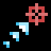Accelerative Homing (HOMING_ACCELERATING) [[toc](#HOMING_ACCELERATING_CONTENTS)]

* **description**: A projectile homes towards enemies at an increasing pace
* **type**: ACTION_TYPE_MODIFIER
* **spawn_level**: [1, 2, 3, 4]
* **spawn_probability**: [0.1, 0.3, 0.3, 0.5]
* **price**: 180
* **mana**: 60
* **max_uses**: 0
* **never_unlimited**: false
* **spawn_manual_unlock**: false
* **recursive**: false
* **ai_never_uses**: false
* **is_dangerous_blast**: false
* **related_projectiles**: 
* **spawn_requires_flag**: 
* **related_extra_entities**: { "data/entities/misc/homing_accelerating.xml", "data/entities/particles/tinyspark_white_small.xml" }
* **action**:

```lua
 function()
      c.extra_entities = c.extra_entities .. "data/entities/misc/homing_accelerating.xml,data/entities/particles/tinyspark_white_small.xml,"
      draw_actions( 1, true )
    end,
```


### <a id="HOMING_AREA"></a>Projectile Area Teleport (HOMING_AREA) [[toc](#HOMING_AREA_CONTENTS)]

* **description**: If a valid target appears somewhere in the proximity of a projectile, the projectile will teleport right on top of the target
* **type**: ACTION_TYPE_MODIFIER
* **spawn_level**: [2, 3, 4, 5, 6]
* **spawn_probability**: [0.2, 0.4, 0.6, 0.7, 0.4]
* **price**: 175
* **mana**: 60
* **max_uses**: 0
* **never_unlimited**: false
* **spawn_manual_unlock**: false
* **recursive**: false
* **ai_never_uses**: false
* **is_dangerous_blast**: false
* **related_projectiles**: 
* **spawn_requires_flag**: 
* **related_extra_entities**: { "data/entities/misc/homing_area.xml", "data/entities/particles/tinyspark_white.xml" }
* **action**:

```lua
 function()
      c.extra_entities = c.extra_entities .. "data/entities/misc/homing_area.xml,data/entities/particles/tinyspark_white.xml,"
      c.fire_rate_wait    = c.fire_rate_wait + 8
      c.spread_degrees = c.spread_degrees + 6
      c.speed_multiplier  = c.speed_multiplier * 0.75
      
      if ( c.speed_multiplier >= 20 ) then
        c.speed_multiplier = math.min( c.speed_multiplier, 20 )
      elseif ( c.speed_multiplier < 0 ) then
        c.speed_multiplier = 0
      end
      
      draw_actions( 1, true )
    end,
```


### <a id="HOMING_CURSOR"></a>Aiming Arc (HOMING_CURSOR) [[toc](#HOMING_CURSOR_CONTENTS)]

* **description**: A projectile rotates towards the direction you're aiming
* **type**: ACTION_TYPE_MODIFIER
* **spawn_level**: [2, 3, 4, 5, 6]
* **spawn_probability**: [0.7, 0.7, 0.4, 0.4, 1.0]
* **price**: 175
* **mana**: 30
* **max_uses**: 0
* **never_unlimited**: false
* **spawn_manual_unlock**: false
* **recursive**: false
* **ai_never_uses**: false
* **is_dangerous_blast**: false
* **related_projectiles**: 
* **spawn_requires_flag**: 
* **related_extra_entities**: { "data/entities/misc/homing_cursor.xml", "data/entities/particles/tinyspark_white.xml" }
* **action**:

```lua
 function()
      c.extra_entities = c.extra_entities .. "data/entities/misc/homing_cursor.xml,data/entities/particles/tinyspark_white.xml,"
      draw_actions( 1, true )
    end,
```


### <a id="HOMING_ROTATE"></a>Rotate towards foes (HOMING_ROTATE) [[toc](#HOMING_ROTATE_CONTENTS)]

* **description**: Makes a projectile turn towards your foes
* **type**: ACTION_TYPE_MODIFIER
* **spawn_level**: [2, 3, 4, 5, 6]
* **spawn_probability**: [0.4, 0.4, 0.4, 0.4, 0.4]
* **price**: 175
* **mana**: 40
* **max_uses**: 0
* **never_unlimited**: false
* **spawn_manual_unlock**: false
* **recursive**: false
* **ai_never_uses**: false
* **is_dangerous_blast**: false
* **related_projectiles**: 
* **spawn_requires_flag**: 
* **related_extra_entities**: { "data/entities/misc/homing_rotate.xml", "data/entities/particles/tinyspark_white.xml" }
* **action**:

```lua
 function()
      c.extra_entities = c.extra_entities .. "data/entities/misc/homing_rotate.xml,data/entities/particles/tinyspark_white.xml,"
      draw_actions( 1, true )
    end,
```


### <a id="HOMING_SHOOTER"></a>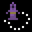Boomerang (HOMING_SHOOTER) [[toc](#HOMING_SHOOTER_CONTENTS)]

* **description**: Gives a projectile a path that curves towards you
* **type**: ACTION_TYPE_MODIFIER
* **spawn_level**: [2, 3, 4, 5, 6]
* **spawn_probability**: [0.2, 0.2, 0.2, 0.2, 0.2]
* **price**: 100
* **mana**: 10
* **max_uses**: 0
* **never_unlimited**: false
* **spawn_manual_unlock**: false
* **recursive**: false
* **ai_never_uses**: false
* **is_dangerous_blast**: false
* **related_projectiles**: 
* **spawn_requires_flag**: 
* **related_extra_entities**: { "data/entities/misc/homing_shooter.xml", "data/entities/particles/tinyspark_white.xml" }
* **action**:

```lua
 function()
      c.extra_entities = c.extra_entities .. "data/entities/misc/homing_shooter.xml,data/entities/particles/tinyspark_white.xml,"
      draw_actions( 1, true )
    end,
```


### <a id="HOMING_SHORT"></a>Short-range Homing (HOMING_SHORT) [[toc](#HOMING_SHORT_CONTENTS)]

* **description**: A projectile flies towards targets when near them
* **type**: ACTION_TYPE_MODIFIER
* **spawn_level**: [1, 2, 3, 4, 5, 6]
* **spawn_probability**: [0.4, 0.8, 1.0, 0.4, 0.1, 0.1]
* **price**: 160
* **mana**: 40
* **max_uses**: 0
* **never_unlimited**: false
* **spawn_manual_unlock**: false
* **recursive**: false
* **ai_never_uses**: false
* **is_dangerous_blast**: false
* **related_projectiles**: 
* **spawn_requires_flag**: 
* **related_extra_entities**: { "data/entities/misc/homing_short.xml", "data/entities/particles/tinyspark_white_weak.xml" }
* **action**:

```lua
 function()
      c.extra_entities = c.extra_entities .. "data/entities/misc/homing_short.xml,data/entities/particles/tinyspark_white_weak.xml,"
      draw_actions( 1, true )
    end,
```


### <a id="HORIZONTAL_ARC"></a>Horizontal path (HORIZONTAL_ARC) [[toc](#HORIZONTAL_ARC_CONTENTS)]

* **description**: Forces a projectile on a horizontal path, but increases its damage
* **type**: ACTION_TYPE_MODIFIER
* **spawn_level**: [1, 3, 5]
* **spawn_probability**: [0.4, 0.4, 0.4]
* **price**: 20
* **mana**: 0
* **max_uses**: 0
* **never_unlimited**: false
* **spawn_manual_unlock**: false
* **recursive**: false
* **ai_never_uses**: false
* **is_dangerous_blast**: false
* **related_projectiles**: 
* **spawn_requires_flag**: 
* **related_extra_entities**: { "data/entities/misc/horizontal_arc.xml" }
* **action**:

```lua
 function()
      c.extra_entities = c.extra_entities .. "data/entities/misc/horizontal_arc.xml,"
      draw_actions( 1, true )
      c.damage_projectile_add = c.damage_projectile_add + 0.3
      c.fire_rate_wait    = c.fire_rate_wait - 6
    end,
```


### <a id="ICEBALL"></a>Iceball (ICEBALL) [[toc](#ICEBALL_CONTENTS)]

* **description**: A magical ball of frozen fire
* **type**: ACTION_TYPE_PROJECTILE
* **spawn_level**: [2, 3, 4, 6]
* **spawn_probability**: [1.0, 1.0, 1.0, 1.0]
* **price**: 260
* **mana**: 90
* **max_uses**: 15
* **never_unlimited**: false
* **spawn_manual_unlock**: false
* **recursive**: false
* **ai_never_uses**: false
* **is_dangerous_blast**: false
* **related_projectiles**: {"data/entities/projectiles/deck/iceball.xml"}
* **spawn_requires_flag**: 
* **related_extra_entities**: 
* **action**:

```lua
 function()
      add_projectile("data/entities/projectiles/deck/iceball.xml")
      c.spread_degrees = c.spread_degrees + 8.0
      c.fire_rate_wait = c.fire_rate_wait + 80
      shot_effects.recoil_knockback = shot_effects.recoil_knockback + 20.0
    end,
```


### <a id="IF_ELSE"></a>Requirement - Otherwise (IF_ELSE) [[toc](#IF_ELSE_CONTENTS)]

* **description**: If a Requirement spell before this succeeds, the next spell is skipped
* **type**: ACTION_TYPE_OTHER
* **spawn_level**: [10]
* **spawn_probability**: [1.0]
* **price**: 10
* **mana**: 0
* **max_uses**: 0
* **never_unlimited**: false
* **spawn_manual_unlock**: false
* **recursive**: false
* **ai_never_uses**: false
* **is_dangerous_blast**: false
* **related_projectiles**: 
* **spawn_requires_flag**: card_unlocked_maths
* **related_extra_entities**: 
* **action**:

```lua
 function( recursion_level, iteration ) 
      draw_actions( 1, true )
    end,
```


### <a id="IF_END"></a>Requirement - Endpoint (IF_END) [[toc](#IF_END_CONTENTS)]

* **description**: Any Requirement spells before this will skip all spells between them and this spell
* **type**: ACTION_TYPE_OTHER
* **spawn_level**: [10]
* **spawn_probability**: [1.0]
* **price**: 10
* **mana**: 0
* **max_uses**: 0
* **never_unlimited**: false
* **spawn_manual_unlock**: false
* **recursive**: false
* **ai_never_uses**: false
* **is_dangerous_blast**: false
* **related_projectiles**: 
* **spawn_requires_flag**: card_unlocked_maths
* **related_extra_entities**: 
* **action**:

```lua
 function( recursion_level, iteration ) 
      draw_actions( 1, true )
    end,
```


### <a id="IF_ENEMY"></a>Requirement - Enemies (IF_ENEMY) [[toc](#IF_ENEMY_CONTENTS)]

* **description**: The next spell is skipped if there are less than 15 enemies nearby
* **type**: ACTION_TYPE_OTHER
* **spawn_level**: [10]
* **spawn_probability**: [1.0]
* **price**: 100
* **mana**: 0
* **max_uses**: 0
* **never_unlimited**: false
* **spawn_manual_unlock**: false
* **recursive**: false
* **ai_never_uses**: false
* **is_dangerous_blast**: false
* **related_projectiles**: 
* **spawn_requires_flag**: card_unlocked_maths
* **related_extra_entities**: 
* **action**:

```lua
 function( recursion_level, iteration )
      local endpoint = -1
      local elsepoint = -1
      local x,y = EntityGetTransform( GetUpdatedEntityID() )
      local enemies = EntityGetInRadiusWithTag( x, y, 240, "homing_target" )
      
      local doskip = false
      if ( #enemies < 15 ) then
        doskip = true
      end
      
      if ( #deck > 0 ) then
        for i,v in ipairs( deck ) do
          if ( v ~= nil ) then
            if ( string.sub( v.id, 1, 3 ) == "IF_" ) and ( v.id ~= "IF_END" ) and ( v.id ~= "IF_ELSE" ) then
              endpoint = -1
              break
            end
            
            if ( v.id == "IF_ELSE" ) then
              endpoint = i
              elsepoint = i
            end
            
            if ( v.id == "IF_END" ) then
              endpoint = i
              break
            end
          end
        end
        
        local envelope_min = 1
        local envelope_max = 1
          
        if doskip then
          if ( elsepoint > 0 ) then
            envelope_max = elsepoint
          elseif ( endpoint > 0 ) then
            envelope_max = endpoint
          end
          
          for i=envelope_min,envelope_max do
            local v = deck[envelope_min]
            
            if ( v ~= nil ) then
              table.insert( discarded, v )
              table.remove( deck, envelope_min )
            end
          end
        else
          if ( elsepoint > 0 ) then
            envelope_min = elsepoint
            
            if ( endpoint > 0 ) then
              envelope_max = endpoint
            else
              envelope_max = #deck
            end
            
            for i=envelope_min,envelope_max do
              local v = deck[envelope_min]
              
              if ( v ~= nil ) then
                table.insert( discarded, v )
                table.remove( deck, envelope_min )
              end
            end
          end
        end
      end
      
      draw_actions( 1, true )
    end,
```


### <a id="IF_HALF"></a>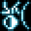Requirement - Every Other (IF_HALF) [[toc](#IF_HALF_CONTENTS)]

* **description**: The next spell is skipped every other time this spell is cast
* **type**: ACTION_TYPE_OTHER
* **spawn_level**: [10]
* **spawn_probability**: [1.0]
* **price**: 100
* **mana**: 0
* **max_uses**: 0
* **never_unlimited**: false
* **spawn_manual_unlock**: false
* **recursive**: false
* **ai_never_uses**: false
* **is_dangerous_blast**: false
* **related_projectiles**: 
* **spawn_requires_flag**: card_unlocked_maths
* **related_extra_entities**: 
* **action**:

```lua
 function( recursion_level, iteration )
      local endpoint = -1
      local elsepoint = -1
      local doskip = false
      
      if ( reflecting == false ) then
        local status = tonumber( GlobalsGetValue( "GUN_ACTION_IF_HALF_STATUS", "0" ) ) or 0
        
        if ( status == 1 ) then
          doskip = true
        end
        
        status = 1 - status
        GlobalsSetValue( "GUN_ACTION_IF_HALF_STATUS", tostring( status ) )
      end
      
      if ( #deck > 0 ) then
        for i,v in ipairs( deck ) do
          if ( v ~= nil ) then
            if ( string.sub( v.id, 1, 3 ) == "IF_" ) and ( v.id ~= "IF_END" ) and ( v.id ~= "IF_ELSE" ) then
              endpoint = -1
              break
            end
            
            if ( v.id == "IF_ELSE" ) then
              endpoint = i
              elsepoint = i
            end
            
            if ( v.id == "IF_END" ) then
              endpoint = i
              break
            end
          end
        end
        
        local envelope_min = 1
        local envelope_max = 1
        
        if doskip then
          if ( elsepoint > 0 ) then
            envelope_max = elsepoint
          elseif ( endpoint > 0 ) then
            envelope_max = endpoint
          end
          
          for i=envelope_min,envelope_max do
            local v = deck[envelope_min]
          
            if ( v ~= nil ) then
              table.insert( discarded, v )
              table.remove( deck, envelope_min )
            end
          end
        else
          if ( elsepoint > 0 ) then
            envelope_min = elsepoint
            
            if ( endpoint > 0 ) then
              envelope_max = endpoint
            else
              envelope_max = #deck
            end
            
            for i=envelope_min,envelope_max do
              local v = deck[envelope_min]
              
              if ( v ~= nil ) then
                table.insert( discarded, v )
                table.remove( deck, envelope_min )
              end
            end
          end
        end
      end
      
      draw_actions( 1, true )
    end,
```


### <a id="IF_HP"></a>Requirement - Low Health (IF_HP) [[toc](#IF_HP_CONTENTS)]

* **description**: The next spell is skipped if you have more than 25% health left
* **type**: ACTION_TYPE_OTHER
* **spawn_level**: [10]
* **spawn_probability**: [1.0]
* **price**: 100
* **mana**: 0
* **max_uses**: 0
* **never_unlimited**: false
* **spawn_manual_unlock**: false
* **recursive**: false
* **ai_never_uses**: false
* **is_dangerous_blast**: false
* **related_projectiles**: 
* **spawn_requires_flag**: card_unlocked_maths
* **related_extra_entities**: 
* **action**:

```lua
 function( recursion_level, iteration )
      local endpoint = -1
      local elsepoint = -1
      local entity_id = GetUpdatedEntityID()
      local comp = EntityGetFirstComponent( entity_id, "DamageModelComponent" )
      local hpdiff = 1.0
      
      if ( comp ~= nil ) then
        local hp = ComponentGetValue2( comp, "hp" )
        local max_hp = ComponentGetValue2( comp, "max_hp" )
        
        hpdiff = hp / max_hp
      end
      
      local doskip = false
      if ( hpdiff > 0.25 ) then
        doskip = true
      end
      
      if ( #deck > 0 ) then
        for i,v in ipairs( deck ) do
          if ( v ~= nil ) then
            if ( string.sub( v.id, 1, 3 ) == "IF_" ) and ( v.id ~= "IF_END" ) and ( v.id ~= "IF_ELSE" ) then
              endpoint = -1
              break
            end
            
            if ( v.id == "IF_ELSE" ) then
              endpoint = i
              elsepoint = i
            end
            
            if ( v.id == "IF_END" ) then
              endpoint = i
              break
            end
          end
        end
        
        local envelope_min = 1
        local envelope_max = 1
          
        if doskip then
          if ( elsepoint > 0 ) then
            envelope_max = elsepoint
          elseif ( endpoint > 0 ) then
            envelope_max = endpoint
          end
          
          for i=envelope_min,envelope_max do
            local v = deck[envelope_min]
            
            if ( v ~= nil ) then
              table.insert( discarded, v )
              table.remove( deck, envelope_min )
            end
          end
        else
          if ( elsepoint > 0 ) then
            envelope_min = elsepoint
            
            if ( endpoint > 0 ) then
              envelope_max = endpoint
            else
              envelope_max = #deck
            end
            
            for i=envelope_min,envelope_max do
              local v = deck[envelope_min]
              
              if ( v ~= nil ) then
                table.insert( discarded, v )
                table.remove( deck, envelope_min )
              end
            end
          end
        end
      end
      
      draw_actions( 1, true )
    end,
```


### <a id="IF_PROJECTILE"></a>Requirement - Projectile Spells (IF_PROJECTILE) [[toc](#IF_PROJECTILE_CONTENTS)]

* **description**: The next spell is skipped if there are less than 20 projectiles nearby
* **type**: ACTION_TYPE_OTHER
* **spawn_level**: [10]
* **spawn_probability**: [1.0]
* **price**: 100
* **mana**: 0
* **max_uses**: 0
* **never_unlimited**: false
* **spawn_manual_unlock**: false
* **recursive**: false
* **ai_never_uses**: false
* **is_dangerous_blast**: false
* **related_projectiles**: 
* **spawn_requires_flag**: card_unlocked_maths
* **related_extra_entities**: 
* **action**:

```lua
 function( recursion_level, iteration )
      local endpoint = -1
      local elsepoint = -1
      local x,y = EntityGetTransform( GetUpdatedEntityID() )
      local enemies = EntityGetInRadiusWithTag( x, y, 160, "projectile" )
      
      local doskip = false
      if ( #enemies < 20 ) then
        doskip = true
      end
      
      if ( #deck > 0 ) then
        for i,v in ipairs( deck ) do
          if ( v ~= nil ) then
            if ( string.sub( v.id, 1, 3 ) == "IF_" ) and ( v.id ~= "IF_END" ) and ( v.id ~= "IF_ELSE" ) then
              endpoint = -1
              break
            end
            
            if ( v.id == "IF_ELSE" ) then
              endpoint = i
              elsepoint = i
            end
            
            if ( v.id == "IF_END" ) then
              endpoint = i
              break
            end
          end
        end
        
        local envelope_min = 1
        local envelope_max = 1
          
        if doskip then
          if ( elsepoint > 0 ) then
            envelope_max = elsepoint
          elseif ( endpoint > 0 ) then
            envelope_max = endpoint
          end
          
          for i=envelope_min,envelope_max do
            local v = deck[envelope_min]
            
            if ( v ~= nil ) then
              table.insert( discarded, v )
              table.remove( deck, envelope_min )
            end
          end
        else
          if ( elsepoint > 0 ) then
            envelope_min = elsepoint
            
            if ( endpoint > 0 ) then
              envelope_max = endpoint
            else
              envelope_max = #deck
            end
            
            for i=envelope_min,envelope_max do
              local v = deck[envelope_min]
              
              if ( v ~= nil ) then
                table.insert( discarded, v )
                table.remove( deck, envelope_min )
              end
            end
          end
        end
      end
      
      draw_actions( 1, true )
    end,
```


### <a id="INFESTATION"></a>Infestation (INFESTATION) [[toc](#INFESTATION_CONTENTS)]

* **description**: A bunch of magical sparks that fly in every direction
* **type**: ACTION_TYPE_PROJECTILE
* **spawn_level**: [2, 3, 4]
* **spawn_probability**: [0.1, 0.3, 0.3]
* **price**: 160
* **mana**: 40
* **max_uses**: 0
* **never_unlimited**: false
* **spawn_manual_unlock**: false
* **recursive**: false
* **ai_never_uses**: false
* **is_dangerous_blast**: false
* **related_projectiles**: {"data/entities/projectiles/deck/infestation.xml",10}
* **spawn_requires_flag**: 
* **related_extra_entities**: 
* **action**:

```lua
 function()
      for i=1,6 do
        add_projectile("data/entities/projectiles/deck/infestation.xml")
      end
      c.fire_rate_wait = c.fire_rate_wait - 2
      c.spread_degrees = c.spread_degrees + 25
    end,
```


### <a id="I_SHAPE"></a>Formation - behind your back (I_SHAPE) [[toc](#I_SHAPE_CONTENTS)]

* **description**: Casts two spells: one ahead of and one behind the caster
* **type**: ACTION_TYPE_DRAW_MANY
* **spawn_level**: [1, 2, 3, 4]
* **spawn_probability**: [0.4, 0.4, 0.4, 0.4]
* **price**: 80
* **mana**: 0
* **max_uses**: 0
* **never_unlimited**: false
* **spawn_manual_unlock**: false
* **recursive**: false
* **ai_never_uses**: false
* **is_dangerous_blast**: false
* **related_projectiles**: 
* **spawn_requires_flag**: 
* **related_extra_entities**: 
* **action**:

```lua
 function()
      draw_actions(2, true)
      c.pattern_degrees = 180
    end,
```


### <a id="KANTELE_A"></a>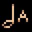Kantele - note A (KANTELE_A) [[toc](#KANTELE_A_CONTENTS)]

* **description**: Music for your ears!
* **type**: ACTION_TYPE_OTHER
* **spawn_level**: [10]
* **spawn_probability**: [0.0]
* **price**: 10
* **mana**: 1
* **max_uses**: 0
* **never_unlimited**: false
* **spawn_manual_unlock**: false
* **recursive**: false
* **ai_never_uses**: false
* **is_dangerous_blast**: false
* **related_projectiles**: {"data/entities/projectiles/deck/kantele/kantele_a.xml"}
* **spawn_requires_flag**: card_unlocked_kantele
* **related_extra_entities**: 
* **action**:

```lua
 function()
      add_projectile("data/entities/projectiles/deck/kantele/kantele_a.xml")
      c.fire_rate_wait = c.fire_rate_wait + 15
    end,
```


### <a id="KANTELE_D"></a>Kantele - note D (KANTELE_D) [[toc](#KANTELE_D_CONTENTS)]

* **description**: Music for your ears!
* **type**: ACTION_TYPE_OTHER
* **spawn_level**: [10]
* **spawn_probability**: [0.0]
* **price**: 10
* **mana**: 1
* **max_uses**: 0
* **never_unlimited**: false
* **spawn_manual_unlock**: false
* **recursive**: false
* **ai_never_uses**: false
* **is_dangerous_blast**: false
* **related_projectiles**: {"data/entities/projectiles/deck/kantele/kantele_d.xml"}
* **spawn_requires_flag**: card_unlocked_kantele
* **related_extra_entities**: 
* **action**:

```lua
 function()
      add_projectile("data/entities/projectiles/deck/kantele/kantele_d.xml")
      c.fire_rate_wait = c.fire_rate_wait + 15
    end,
```


### <a id="KANTELE_DIS"></a>Kantele - note D# (KANTELE_DIS) [[toc](#KANTELE_DIS_CONTENTS)]

* **description**: Music for your ears!
* **type**: ACTION_TYPE_OTHER
* **spawn_level**: [10]
* **spawn_probability**: [0.0]
* **price**: 10
* **mana**: 1
* **max_uses**: 0
* **never_unlimited**: false
* **spawn_manual_unlock**: false
* **recursive**: false
* **ai_never_uses**: false
* **is_dangerous_blast**: false
* **related_projectiles**: {"data/entities/projectiles/deck/kantele/kantele_dis.xml"}
* **spawn_requires_flag**: card_unlocked_kantele
* **related_extra_entities**: 
* **action**:

```lua
 function()
      add_projectile("data/entities/projectiles/deck/kantele/kantele_dis.xml")
      c.fire_rate_wait = c.fire_rate_wait + 15
    end,
```


### <a id="KANTELE_E"></a>Kantele - note E (KANTELE_E) [[toc](#KANTELE_E_CONTENTS)]

* **description**: Music for your ears!
* **type**: ACTION_TYPE_OTHER
* **spawn_level**: [10]
* **spawn_probability**: [0.0]
* **price**: 10
* **mana**: 1
* **max_uses**: 0
* **never_unlimited**: false
* **spawn_manual_unlock**: false
* **recursive**: false
* **ai_never_uses**: false
* **is_dangerous_blast**: false
* **related_projectiles**: {"data/entities/projectiles/deck/kantele/kantele_e.xml"}
* **spawn_requires_flag**: card_unlocked_kantele
* **related_extra_entities**: 
* **action**:

```lua
 function()
      add_projectile("data/entities/projectiles/deck/kantele/kantele_e.xml")
      c.fire_rate_wait = c.fire_rate_wait + 15
    end,
```


### <a id="KANTELE_G"></a>Kantele - note G (KANTELE_G) [[toc](#KANTELE_G_CONTENTS)]

* **description**: Music for your ears!
* **type**: ACTION_TYPE_OTHER
* **spawn_level**: [10]
* **spawn_probability**: [0.0]
* **price**: 10
* **mana**: 1
* **max_uses**: 0
* **never_unlimited**: false
* **spawn_manual_unlock**: false
* **recursive**: false
* **ai_never_uses**: false
* **is_dangerous_blast**: false
* **related_projectiles**: {"data/entities/projectiles/deck/kantele/kantele_g.xml"}
* **spawn_requires_flag**: card_unlocked_kantele
* **related_extra_entities**: 
* **action**:

```lua
 function()
      add_projectile("data/entities/projectiles/deck/kantele/kantele_g.xml")
      c.fire_rate_wait = c.fire_rate_wait + 15
    end,
```


### <a id="KNOCKBACK"></a>Knockback (KNOCKBACK) [[toc](#KNOCKBACK_CONTENTS)]

* **description**: Gives a projectile the power to knock back the foes it hits
* **type**: ACTION_TYPE_MODIFIER
* **spawn_level**: [3, 5]
* **spawn_probability**: [0.6, 0.6]
* **price**: 100
* **mana**: 5
* **max_uses**: 0
* **never_unlimited**: false
* **spawn_manual_unlock**: false
* **recursive**: false
* **ai_never_uses**: false
* **is_dangerous_blast**: false
* **related_projectiles**: 
* **spawn_requires_flag**: 
* **related_extra_entities**: 
* **action**:

```lua
 function()
      c.knockback_force = c.knockback_force + 5
      draw_actions( 1, true )
    end,
```


### <a id="LANCE"></a>Glowing lance (LANCE) [[toc](#LANCE_CONTENTS)]

* **description**: A magical lance that cuts through soft materials
* **type**: ACTION_TYPE_PROJECTILE
* **spawn_level**: [1, 2, 5, 6]
* **spawn_probability**: [1.0, 1.0, 1.0, 1.0]
* **price**: 180
* **mana**: 30
* **max_uses**: 0
* **never_unlimited**: false
* **spawn_manual_unlock**: false
* **recursive**: false
* **ai_never_uses**: false
* **is_dangerous_blast**: false
* **related_projectiles**: {"data/entities/projectiles/deck/lance.xml"}
* **spawn_requires_flag**: 
* **related_extra_entities**: 
* **action**:

```lua
 function()
      add_projectile("data/entities/projectiles/deck/lance.xml")
      c.fire_rate_wait = c.fire_rate_wait + 20
      c.spread_degrees = c.spread_degrees - 20
      shot_effects.recoil_knockback = 60.0
    end,
```


### <a id="LARPA_CHAOS"></a>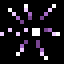Chaos larpa (LARPA_CHAOS) [[toc](#LARPA_CHAOS_CONTENTS)]

* **description**: Makes a projectile cast copies of itself in random directions
* **type**: ACTION_TYPE_MODIFIER
* **spawn_level**: [2, 3, 4, 5, 10]
* **spawn_probability**: [0.1, 0.2, 0.3, 0.4, 0.2]
* **price**: 260
* **mana**: 100
* **max_uses**: 0
* **never_unlimited**: false
* **spawn_manual_unlock**: false
* **recursive**: false
* **ai_never_uses**: false
* **is_dangerous_blast**: false
* **related_projectiles**: 
* **spawn_requires_flag**: 
* **related_extra_entities**: { "data/entities/misc/larpa_chaos.xml" }
* **action**:

```lua
 function()
      c.fire_rate_wait = c.fire_rate_wait + 15
      c.extra_entities = c.extra_entities .. "data/entities/misc/larpa_chaos.xml,"
      draw_actions( 1, true )
    end,
```


### <a id="LARPA_CHAOS_2"></a>Copy trail (LARPA_CHAOS_2) [[toc](#LARPA_CHAOS_2_CONTENTS)]

* **description**: Makes a projectile leave a trail of copies of itself
* **type**: ACTION_TYPE_MODIFIER
* **spawn_level**: [3, 5, 10]
* **spawn_probability**: [0.1, 0.4, 0.1]
* **price**: 300
* **mana**: 150
* **max_uses**: 0
* **never_unlimited**: false
* **spawn_manual_unlock**: false
* **recursive**: false
* **ai_never_uses**: false
* **is_dangerous_blast**: false
* **related_projectiles**: 
* **spawn_requires_flag**: card_unlocked_alchemy
* **related_extra_entities**: { "data/entities/misc/larpa_chaos_2.xml" }
* **action**:

```lua
 function()
      c.fire_rate_wait = c.fire_rate_wait + 20
      c.extra_entities = c.extra_entities .. "data/entities/misc/larpa_chaos_2.xml,"
      draw_actions( 1, true )
    end,
```


### <a id="LARPA_DEATH"></a>Larpa Explosion (LARPA_DEATH) [[toc](#LARPA_DEATH_CONTENTS)]

* **description**: A projectile will shoot out 8 copies of itself when it expires or hits the ground
* **type**: ACTION_TYPE_MODIFIER
* **spawn_level**: [2, 3, 4, 5, 10]
* **spawn_probability**: [0.1, 0.1, 0.3, 0.2, 0.2]
* **price**: 150
* **mana**: 90
* **max_uses**: 30
* **never_unlimited**: false
* **spawn_manual_unlock**: false
* **recursive**: false
* **ai_never_uses**: false
* **is_dangerous_blast**: false
* **related_projectiles**: 
* **spawn_requires_flag**: 
* **related_extra_entities**: { "data/entities/misc/larpa_death.xml" }
* **action**:

```lua
 function()
      c.fire_rate_wait = c.fire_rate_wait + 15
      c.extra_entities = c.extra_entities .. "data/entities/misc/larpa_death.xml,"
      draw_actions( 1, true )
    end,
```


### <a id="LARPA_DOWNWARDS"></a>Downwards larpa (LARPA_DOWNWARDS) [[toc](#LARPA_DOWNWARDS_CONTENTS)]

* **description**: Makes a projectile cast copies of itself with a downwards trajectory
* **type**: ACTION_TYPE_MODIFIER
* **spawn_level**: [2, 3, 4, 5, 10]
* **spawn_probability**: [0.1, 0.3, 0.2, 0.2, 0.2]
* **price**: 290
* **mana**: 120
* **max_uses**: 0
* **never_unlimited**: false
* **spawn_manual_unlock**: false
* **recursive**: false
* **ai_never_uses**: false
* **is_dangerous_blast**: false
* **related_projectiles**: 
* **spawn_requires_flag**: 
* **related_extra_entities**: { "data/entities/misc/larpa_downwards.xml" }
* **action**:

```lua
 function()
      c.fire_rate_wait = c.fire_rate_wait + 15
      c.extra_entities = c.extra_entities .. "data/entities/misc/larpa_downwards.xml,"
      draw_actions( 1, true )
    end,
```


### <a id="LARPA_UPWARDS"></a>Upwards larpa (LARPA_UPWARDS) [[toc](#LARPA_UPWARDS_CONTENTS)]

* **description**: Makes a projectile cast copies of itself with an upwards trajectory
* **type**: ACTION_TYPE_MODIFIER
* **spawn_level**: [2, 3, 4, 5, 10]
* **spawn_probability**: [0.1, 0.1, 0.2, 0.4, 0.2]
* **price**: 290
* **mana**: 120
* **max_uses**: 0
* **never_unlimited**: false
* **spawn_manual_unlock**: false
* **recursive**: false
* **ai_never_uses**: false
* **is_dangerous_blast**: false
* **related_projectiles**: 
* **spawn_requires_flag**: 
* **related_extra_entities**: { "data/entities/misc/larpa_upwards.xml" }
* **action**:

```lua
 function()
      c.fire_rate_wait = c.fire_rate_wait + 15
      c.extra_entities = c.extra_entities .. "data/entities/misc/larpa_upwards.xml,"
      draw_actions( 1, true )
    end,
```


### <a id="LASER"></a>Concentrated light (LASER) [[toc](#LASER_CONTENTS)]

* **description**: A pinpointed beam of light
* **type**: ACTION_TYPE_PROJECTILE
* **spawn_level**: [1, 2, 4]
* **spawn_probability**: [1.0, 1.0, 1.0]
* **price**: 180
* **mana**: 30
* **max_uses**: 0
* **never_unlimited**: false
* **spawn_manual_unlock**: false
* **recursive**: false
* **ai_never_uses**: false
* **is_dangerous_blast**: false
* **related_projectiles**: {"data/entities/projectiles/deck/laser.xml"}
* **spawn_requires_flag**: 
* **related_extra_entities**: 
* **action**:

```lua
 function()
      add_projectile("data/entities/projectiles/deck/laser.xml")
      c.fire_rate_wait = c.fire_rate_wait - 22
      c.game_effect_entities = c.game_effect_entities .. "data/entities/misc/effect_disintegrated.xml,"
      shot_effects.recoil_knockback = shot_effects.recoil_knockback + 20.0
    end,
```


### <a id="LASER_EMITTER"></a>Plasma beam (LASER_EMITTER) [[toc](#LASER_EMITTER_CONTENTS)]

* **description**: An instantaneous, dangerous beam of light
* **type**: ACTION_TYPE_PROJECTILE
* **spawn_level**: [1, 2, 3, 4]
* **spawn_probability**: [0.2, 1.0, 1.0, 0.5]
* **price**: 180
* **mana**: 60
* **max_uses**: 0
* **never_unlimited**: false
* **spawn_manual_unlock**: false
* **recursive**: false
* **ai_never_uses**: false
* **is_dangerous_blast**: false
* **related_projectiles**: {"data/entities/projectiles/deck/orb_laseremitter.xml"}
* **spawn_requires_flag**: 
* **related_extra_entities**: 
* **action**:

```lua
 function()
      add_projectile("data/entities/projectiles/deck/orb_laseremitter.xml")
      shot_effects.recoil_knockback = shot_effects.recoil_knockback + 20.0
      c.fire_rate_wait = c.fire_rate_wait + 6
      c.game_effect_entities = c.game_effect_entities .. "data/entities/misc/effect_disintegrated.xml,"
    end,
```


### <a id="LASER_EMITTER_CUTTER"></a>Plasma Cutter (LASER_EMITTER_CUTTER) [[toc](#LASER_EMITTER_CUTTER_CONTENTS)]

* **description**: A plasma beam specialized in cutting materials!
* **type**: ACTION_TYPE_PROJECTILE
* **spawn_level**: [0, 1, 2, 3, 4]
* **spawn_probability**: [0.2, 0.3, 1.0, 0.5, 0.1]
* **price**: 120
* **mana**: 40
* **max_uses**: 0
* **never_unlimited**: false
* **spawn_manual_unlock**: false
* **recursive**: false
* **ai_never_uses**: false
* **is_dangerous_blast**: false
* **related_projectiles**: {"data/entities/projectiles/deck/orb_laseremitter_cutter.xml"}
* **spawn_requires_flag**: 
* **related_extra_entities**: 
* **action**:

```lua
 function()
      add_projectile("data/entities/projectiles/deck/orb_laseremitter_cutter.xml")
      current_reload_time = current_reload_time + 10
      c.game_effect_entities = c.game_effect_entities .. "data/entities/misc/effect_disintegrated.xml,"
    end,
```


### <a id="LASER_EMITTER_FOUR"></a>Plasma Beam Cross (LASER_EMITTER_FOUR) [[toc](#LASER_EMITTER_FOUR_CONTENTS)]

* **description**: Four deadly plasma beams in a cross-shape. Look out, they can hurt you as well!
* **type**: ACTION_TYPE_PROJECTILE
* **spawn_level**: [1, 2, 3, 4, 5]
* **spawn_probability**: [0.2, 1.0, 0.2, 0.5, 1.0]
* **price**: 200
* **mana**: 80
* **max_uses**: 0
* **never_unlimited**: false
* **spawn_manual_unlock**: false
* **recursive**: false
* **ai_never_uses**: false
* **is_dangerous_blast**: false
* **related_projectiles**: {"data/entities/projectiles/deck/orb_laseremitter.xml"}
* **spawn_requires_flag**: 
* **related_extra_entities**: 
* **action**:

```lua
 function()
      add_projectile("data/entities/projectiles/deck/orb_laseremitter_four.xml")
      shot_effects.recoil_knockback = shot_effects.recoil_knockback + 30.0
      c.fire_rate_wait = c.fire_rate_wait + 15
      c.game_effect_entities = c.game_effect_entities .. "data/entities/misc/effect_disintegrated.xml,"
    end,
```


### <a id="LASER_EMITTER_RAY"></a>Plasma Beam Thrower (LASER_EMITTER_RAY) [[toc](#LASER_EMITTER_RAY_CONTENTS)]

* **description**: A projectile fires plasma beams in all directions!
* **type**: ACTION_TYPE_MODIFIER
* **spawn_level**: [1, 2, 3, 4, 5]
* **spawn_probability**: [0.0, 0.0, 0.4, 0.4, 0.4]
* **price**: 150
* **mana**: 110
* **max_uses**: 16
* **never_unlimited**: false
* **spawn_manual_unlock**: false
* **recursive**: false
* **ai_never_uses**: false
* **is_dangerous_blast**: false
* **related_projectiles**: 
* **spawn_requires_flag**: 
* **related_extra_entities**: { "data/entities/misc/laser_emitter_ray.xml" }
* **action**:

```lua
 function()
      c.extra_entities = c.extra_entities .. "data/entities/misc/laser_emitter_ray.xml,"
      draw_actions( 1, true )
    end,
```


### <a id="LASER_EMITTER_WIDER"></a>Plasma Beam Enhancer (LASER_EMITTER_WIDER) [[toc](#LASER_EMITTER_WIDER_CONTENTS)]

* **description**: Makes plasma beam spell's beam wider
* **type**: ACTION_TYPE_MODIFIER
* **spawn_level**: [2, 3, 4]
* **spawn_probability**: [0.3, 0.3, 0.3]
* **price**: 40
* **mana**: 10
* **max_uses**: 0
* **never_unlimited**: false
* **spawn_manual_unlock**: false
* **recursive**: false
* **ai_never_uses**: false
* **is_dangerous_blast**: false
* **related_projectiles**: 
* **spawn_requires_flag**: 
* **related_extra_entities**: { "data/entities/misc/laser_emitter_wider.xml" }
* **action**:

```lua
 function()
      c.extra_entities = c.extra_entities .. "data/entities/misc/laser_emitter_wider.xml,"
      draw_actions( 1, true )
    end,
```


### <a id="LASER_LUMINOUS_DRILL"></a>Luminous drill with timer (LASER_LUMINOUS_DRILL) [[toc](#LASER_LUMINOUS_DRILL_CONTENTS)]

* **description**: A pinpointed, short-ranged beam of concentrated light that casts another spell after a timer runs out
* **type**: ACTION_TYPE_PROJECTILE
* **spawn_level**: [0, 2]
* **spawn_probability**: [1.0, 1.0]
* **price**: 220
* **mana**: 30
* **max_uses**: 0
* **never_unlimited**: false
* **spawn_manual_unlock**: false
* **recursive**: false
* **ai_never_uses**: false
* **is_dangerous_blast**: false
* **related_projectiles**: {"data/entities/projectiles/deck/luminous_drill.xml"}
* **spawn_requires_flag**: 
* **related_extra_entities**: 
* **action**:

```lua
 function()
      add_projectile_trigger_timer("data/entities/projectiles/deck/luminous_drill.xml",4,1)
      c.fire_rate_wait = c.fire_rate_wait - 35
      current_reload_time = current_reload_time - ACTION_DRAW_RELOAD_TIME_INCREASE - 10 -- this is a hack to get the digger reload time back to 0
    end,
```


### <a id="LAVA_TO_BLOOD"></a>Lava to blood (LAVA_TO_BLOOD) [[toc](#LAVA_TO_BLOOD_CONTENTS)]

* **description**: Makes any lava within a projectile's range turn into blood
* **type**: ACTION_TYPE_MODIFIER
* **spawn_level**: [2, 3, 4]
* **spawn_probability**: [0.3, 0.3, 0.3]
* **price**: 80
* **mana**: 30
* **max_uses**: 0
* **never_unlimited**: false
* **spawn_manual_unlock**: false
* **recursive**: false
* **ai_never_uses**: false
* **is_dangerous_blast**: false
* **related_projectiles**: 
* **spawn_requires_flag**: 
* **related_extra_entities**: { "data/entities/misc/lava_to_blood.xml", "data/entities/particles/tinyspark_orange.xml" }
* **action**:

```lua
 function()
      c.extra_entities = c.extra_entities .. "data/entities/misc/lava_to_blood.xml,data/entities/particles/tinyspark_orange.xml,"
      c.fire_rate_wait = c.fire_rate_wait + 10
      draw_actions( 1, true )
    end,
```


### <a id="LEVITATION_FIELD"></a>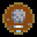Circle of buoyancy (LEVITATION_FIELD) [[toc](#LEVITATION_FIELD_CONTENTS)]

* **description**: A field of levitative magic
* **type**: ACTION_TYPE_STATIC_PROJECTILE
* **spawn_level**: [1, 2, 3, 4]
* **spawn_probability**: [0.3, 0.6, 0.6, 0.3]
* **price**: 120
* **mana**: 10
* **max_uses**: 15
* **never_unlimited**: false
* **spawn_manual_unlock**: false
* **recursive**: false
* **ai_never_uses**: false
* **is_dangerous_blast**: false
* **related_projectiles**: {"data/entities/projectiles/deck/levitation_field.xml"}
* **spawn_requires_flag**: 
* **related_extra_entities**: 
* **action**:

```lua
 function()
      add_projectile("data/entities/projectiles/deck/levitation_field.xml")
      c.fire_rate_wait = c.fire_rate_wait + 15
    end,
```


### <a id="LIFETIME"></a>Increase lifetime (LIFETIME) [[toc](#LIFETIME_CONTENTS)]

* **description**: Increases the lifetime of a spell
* **type**: ACTION_TYPE_MODIFIER
* **spawn_level**: [3, 4, 5, 6, 10]
* **spawn_probability**: [0.5, 0.5, 0.5, 0.5, 0.1]
* **price**: 250
* **mana**: 40
* **max_uses**: 0
* **never_unlimited**: false
* **spawn_manual_unlock**: false
* **recursive**: false
* **ai_never_uses**: false
* **is_dangerous_blast**: false
* **related_projectiles**: 
* **spawn_requires_flag**: 
* **related_extra_entities**: 
* **action**:

```lua
 function()
      c.lifetime_add     = c.lifetime_add + 75
      c.fire_rate_wait = c.fire_rate_wait + 13
      draw_actions( 1, true )
    end,
```


### <a id="LIFETIME_DOWN"></a>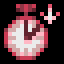Reduce lifetime (LIFETIME_DOWN) [[toc](#LIFETIME_DOWN_CONTENTS)]

* **description**: Reduces the lifetime of a spell
* **type**: ACTION_TYPE_MODIFIER
* **spawn_level**: [3, 4, 5, 6, 10]
* **spawn_probability**: [0.5, 0.5, 0.5, 0.5, 0.1]
* **price**: 90
* **mana**: 10
* **max_uses**: 0
* **never_unlimited**: false
* **spawn_manual_unlock**: false
* **recursive**: false
* **ai_never_uses**: false
* **is_dangerous_blast**: false
* **related_projectiles**: 
* **spawn_requires_flag**: 
* **related_extra_entities**: 
* **action**:

```lua
 function()
      c.lifetime_add     = c.lifetime_add - 42
      c.fire_rate_wait = c.fire_rate_wait - 15
      draw_actions( 1, true )
    end,
```


### <a id="LIGHT"></a>Light (LIGHT) [[toc](#LIGHT_CONTENTS)]

* **description**: Makes a projectile illuminate its surroundings
* **type**: ACTION_TYPE_MODIFIER
* **spawn_level**: [0, 1, 2, 3, 4]
* **spawn_probability**: [1.0, 0.8, 0.6, 0.4, 0.2]
* **price**: 20
* **mana**: 1
* **max_uses**: 0
* **never_unlimited**: false
* **spawn_manual_unlock**: false
* **recursive**: false
* **ai_never_uses**: false
* **is_dangerous_blast**: false
* **related_projectiles**: 
* **spawn_requires_flag**: 
* **related_extra_entities**: { "data/entities/misc/light.xml" }
* **action**:

```lua
 function()
      c.extra_entities = c.extra_entities .. "data/entities/misc/light.xml,"
      draw_actions( 1, true )
    end,
```


### <a id="LIGHTNING"></a>Lightning bolt (LIGHTNING) [[toc](#LIGHTNING_CONTENTS)]

* **description**: The primordial force of nature
* **type**: ACTION_TYPE_PROJECTILE
* **spawn_level**: [1, 2, 5, 6]
* **spawn_probability**: [1.0, 1.0, 1.0, 1.0]
* **price**: 250
* **mana**: 70
* **max_uses**: 0
* **never_unlimited**: false
* **spawn_manual_unlock**: false
* **recursive**: false
* **ai_never_uses**: false
* **is_dangerous_blast**: false
* **related_projectiles**: {"data/entities/projectiles/deck/lightning.xml"}
* **spawn_requires_flag**: 
* **related_extra_entities**: 
* **action**:

```lua
 function()
      add_projectile("data/entities/projectiles/deck/lightning.xml")
      c.fire_rate_wait = c.fire_rate_wait + 50
      shot_effects.recoil_knockback = 180.0
    end,
```


### <a id="LIGHTNING_RAY"></a>Lightning thrower (LIGHTNING_RAY) [[toc](#LIGHTNING_RAY_CONTENTS)]

* **description**: Makes a projectile cast lightning in random directions
* **type**: ACTION_TYPE_MODIFIER
* **spawn_level**: [1, 2, 3, 4, 5]
* **spawn_probability**: [0.0, 0.0, 0.4, 0.4, 0.4]
* **price**: 180
* **mana**: 110
* **max_uses**: 16
* **never_unlimited**: false
* **spawn_manual_unlock**: false
* **recursive**: false
* **ai_never_uses**: false
* **is_dangerous_blast**: false
* **related_projectiles**: 
* **spawn_requires_flag**: 
* **related_extra_entities**: { "data/entities/misc/lightning_ray.xml" }
* **action**:

```lua
 function()
      c.extra_entities = c.extra_entities .. "data/entities/misc/lightning_ray.xml,"
      draw_actions( 1, true )
    end,
```


### <a id="LIGHTNING_RAY_ENEMY"></a>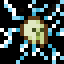Personal lightning caster (LIGHTNING_RAY_ENEMY) [[toc](#LIGHTNING_RAY_ENEMY_CONTENTS)]

* **description**: Makes a projectile turn the creatures it hits into living thunderstorms
* **type**: ACTION_TYPE_MODIFIER
* **spawn_level**: [1, 2, 3, 4, 5]
* **spawn_probability**: [0.0, 0.0, 0.4, 0.4, 0.4]
* **price**: 150
* **mana**: 90
* **max_uses**: 20
* **never_unlimited**: false
* **spawn_manual_unlock**: false
* **recursive**: false
* **ai_never_uses**: false
* **is_dangerous_blast**: false
* **related_projectiles**: 
* **spawn_requires_flag**: 
* **related_extra_entities**: { "data/entities/misc/hitfx_lightning_ray_enemy.xml" }
* **action**:

```lua
 function()
      c.extra_entities = c.extra_entities .. "data/entities/misc/hitfx_lightning_ray_enemy.xml,"
      draw_actions( 1, true )
    end,
```


### <a id="LIGHT_BULLET"></a>Spark bolt (LIGHT_BULLET) [[toc](#LIGHT_BULLET_CONTENTS)]

* **description**: A weak but enchanting sparkling projectile
* **type**: ACTION_TYPE_PROJECTILE
* **spawn_level**: [0, 1, 2]
* **spawn_probability**: [2.0, 1.0, 0.5]
* **price**: 100
* **mana**: 5
* **max_uses**: 0
* **never_unlimited**: false
* **spawn_manual_unlock**: false
* **recursive**: false
* **ai_never_uses**: false
* **is_dangerous_blast**: false
* **related_projectiles**: {"data/entities/projectiles/deck/light_bullet.xml"}
* **spawn_requires_flag**: 
* **related_extra_entities**: 
* **action**:

```lua
 function()
      add_projectile("data/entities/projectiles/deck/light_bullet.xml")
      c.fire_rate_wait = c.fire_rate_wait + 3
      c.screenshake = c.screenshake + 0.5
      c.spread_degrees = c.spread_degrees - 1.0
      c.damage_critical_chance = c.damage_critical_chance + 5
    end,
```


### <a id="LIGHT_BULLET_TIMER"></a>Spark bolt with timer (LIGHT_BULLET_TIMER) [[toc](#LIGHT_BULLET_TIMER_CONTENTS)]

* **description**: A spark bolt that casts another spell after a timer runs out
* **type**: ACTION_TYPE_PROJECTILE
* **spawn_level**: [1, 2, 3]
* **spawn_probability**: [0.5, 0.5, 0.5]
* **price**: 140
* **mana**: 10
* **max_uses**: 0
* **never_unlimited**: false
* **spawn_manual_unlock**: false
* **recursive**: false
* **ai_never_uses**: false
* **is_dangerous_blast**: false
* **related_projectiles**: {"data/entities/projectiles/deck/light_bullet.xml"}
* **spawn_requires_flag**: 
* **related_extra_entities**: 
* **action**:

```lua
 function()
      c.fire_rate_wait = c.fire_rate_wait + 3
      c.screenshake = c.screenshake + 0.5
      c.damage_critical_chance = c.damage_critical_chance + 5
      add_projectile_trigger_timer("data/entities/projectiles/deck/light_bullet.xml", 10, 1)
    end,
```


### <a id="LIGHT_BULLET_TRIGGER"></a>Spark bolt with trigger (LIGHT_BULLET_TRIGGER) [[toc](#LIGHT_BULLET_TRIGGER_CONTENTS)]

* **description**: A spark bolt that casts another spell upon collision
* **type**: ACTION_TYPE_PROJECTILE
* **spawn_level**: [0, 1, 2, 3]
* **spawn_probability**: [1.0, 0.5, 0.5, 0.5]
* **price**: 140
* **mana**: 10
* **max_uses**: 0
* **never_unlimited**: false
* **spawn_manual_unlock**: false
* **recursive**: false
* **ai_never_uses**: false
* **is_dangerous_blast**: false
* **related_projectiles**: {"data/entities/projectiles/deck/light_bullet.xml"}
* **spawn_requires_flag**: 
* **related_extra_entities**: 
* **action**:

```lua
 function()
      c.fire_rate_wait = c.fire_rate_wait + 3
      c.screenshake = c.screenshake + 0.5
      c.damage_critical_chance = c.damage_critical_chance + 5
      add_projectile_trigger_hit_world("data/entities/projectiles/deck/light_bullet.xml", 1)
    end,
```


### <a id="LIGHT_BULLET_TRIGGER_2"></a>Spark bolt with double trigger (LIGHT_BULLET_TRIGGER_2) [[toc](#LIGHT_BULLET_TRIGGER_2_CONTENTS)]

* **description**: A spark bolt that casts two new spells upon collision
* **type**: ACTION_TYPE_PROJECTILE
* **spawn_level**: [2, 3, 5, 6, 10]
* **spawn_probability**: [1.0, 0.5, 1.0, 1.0, 0.2]
* **price**: 250
* **mana**: 15
* **max_uses**: 0
* **never_unlimited**: false
* **spawn_manual_unlock**: false
* **recursive**: false
* **ai_never_uses**: false
* **is_dangerous_blast**: false
* **related_projectiles**: {"data/entities/projectiles/deck/light_bullet_blue.xml"}
* **spawn_requires_flag**: 
* **related_extra_entities**: 
* **action**:

```lua
 function()
      c.fire_rate_wait = c.fire_rate_wait + 4
      c.screenshake = c.screenshake + 1
      c.damage_critical_chance = c.damage_critical_chance + 5
      add_projectile_trigger_hit_world("data/entities/projectiles/deck/light_bullet_blue.xml", 2)
    end,
```


### <a id="LIGHT_SHOT"></a>Light shot (LIGHT_SHOT) [[toc](#LIGHT_SHOT_CONTENTS)]

* **description**: Makes a projectile move considerably faster, but deal less damage
* **type**: ACTION_TYPE_MODIFIER
* **spawn_level**: [2, 3, 4]
* **spawn_probability**: [0.4, 0.4, 0.4]
* **price**: 60
* **mana**: 5
* **max_uses**: 0
* **never_unlimited**: false
* **spawn_manual_unlock**: false
* **recursive**: false
* **ai_never_uses**: false
* **is_dangerous_blast**: false
* **related_projectiles**: 
* **spawn_requires_flag**: 
* **related_extra_entities**: { "data/entities/particles/light_shot.xml" }
* **action**:

```lua
 function()
      c.damage_projectile_add = c.damage_projectile_add - 1.0
      c.explosion_radius = c.explosion_radius - 10.0
      if (c.explosion_radius < 0) then
        c.explosion_radius = 0
      end
      c.fire_rate_wait    = c.fire_rate_wait - 3
      c.speed_multiplier = c.speed_multiplier * 7.5
      c.spread_degrees = c.spread_degrees - 6
      shot_effects.recoil_knockback = shot_effects.recoil_knockback - 10.0
      c.extra_entities = c.extra_entities .. "data/entities/particles/light_shot.xml,"
      
      if ( c.speed_multiplier >= 20 ) then
        c.speed_multiplier = math.min( c.speed_multiplier, 20 )
      elseif ( c.speed_multiplier < 0 ) then
        c.speed_multiplier = 0
      end
      
      draw_actions( 1, true )
    end,
```


### <a id="LINE_ARC"></a>Linear arc (LINE_ARC) [[toc](#LINE_ARC_CONTENTS)]

* **description**: Makes a projectile fly only in cardinal or diagonal lines
* **type**: ACTION_TYPE_MODIFIER
* **spawn_level**: [1, 3, 5]
* **spawn_probability**: [0.4, 0.4, 0.4]
* **price**: 30
* **mana**: 0
* **max_uses**: 0
* **never_unlimited**: false
* **spawn_manual_unlock**: false
* **recursive**: false
* **ai_never_uses**: false
* **is_dangerous_blast**: false
* **related_projectiles**: 
* **spawn_requires_flag**: 
* **related_extra_entities**: { "data/entities/misc/line_arc.xml" }
* **action**:

```lua
 function()
      c.extra_entities = c.extra_entities .. "data/entities/misc/line_arc.xml,"
      draw_actions( 1, true )
      c.damage_projectile_add = c.damage_projectile_add + 0.2
      c.fire_rate_wait    = c.fire_rate_wait - 4
    end,
```


### <a id="LIQUID_TO_EXPLOSION"></a>Liquid Detonation (LIQUID_TO_EXPLOSION) [[toc](#LIQUID_TO_EXPLOSION_CONTENTS)]

* **description**: Converts nearby nonmagical liquids into explosive gunpowder
* **type**: ACTION_TYPE_MODIFIER
* **spawn_level**: [2, 3, 4]
* **spawn_probability**: [0.3, 0.3, 0.3]
* **price**: 120
* **mana**: 40
* **max_uses**: 0
* **never_unlimited**: false
* **spawn_manual_unlock**: false
* **recursive**: false
* **ai_never_uses**: false
* **is_dangerous_blast**: false
* **related_projectiles**: 
* **spawn_requires_flag**: 
* **related_extra_entities**: { "data/entities/misc/liquid_to_explosion.xml", "data/entities/particles/tinyspark_red.xml" }
* **action**:

```lua
 function()
      c.extra_entities = c.extra_entities .. "data/entities/misc/liquid_to_explosion.xml,data/entities/particles/tinyspark_red.xml,"
      c.fire_rate_wait = c.fire_rate_wait + 20
      draw_actions( 1, true )
    end,
```


### <a id="LONG_DISTANCE_CAST"></a>Long-distance cast (LONG_DISTANCE_CAST) [[toc](#LONG_DISTANCE_CAST_CONTENTS)]

* **description**: Casts a spell some distance away from the caster
* **type**: ACTION_TYPE_UTILITY
* **spawn_level**: [0, 1, 2, 4, 5, 6]
* **spawn_probability**: [0.6, 0.6, 0.6, 0.6, 0.6, 0.6]
* **price**: 90
* **mana**: 0
* **max_uses**: 0
* **never_unlimited**: false
* **spawn_manual_unlock**: false
* **recursive**: false
* **ai_never_uses**: false
* **is_dangerous_blast**: false
* **related_projectiles**: {"data/entities/projectiles/deck/long_distance_cast.xml"}
* **spawn_requires_flag**: 
* **related_extra_entities**: 
* **action**:

```lua
 function()
      add_projectile_trigger_death("data/entities/projectiles/deck/long_distance_cast.xml", 1)
      c.fire_rate_wait = c.fire_rate_wait - 5
    end,
```


### <a id="LUMINOUS_DRILL"></a>Luminous drill (LUMINOUS_DRILL) [[toc](#LUMINOUS_DRILL_CONTENTS)]

* **description**: A pinpointed, short-ranged beam of concentrated light
* **type**: ACTION_TYPE_PROJECTILE
* **spawn_level**: [0, 2]
* **spawn_probability**: [1.0, 1.0]
* **price**: 150
* **mana**: 10
* **max_uses**: 0
* **never_unlimited**: false
* **spawn_manual_unlock**: false
* **recursive**: false
* **ai_never_uses**: false
* **is_dangerous_blast**: false
* **related_projectiles**: {"data/entities/projectiles/deck/luminous_drill.xml"}
* **spawn_requires_flag**: 
* **related_extra_entities**: 
* **action**:

```lua
 function()
      add_projectile("data/entities/projectiles/deck/luminous_drill.xml")
      c.fire_rate_wait = c.fire_rate_wait - 35
      current_reload_time = current_reload_time - ACTION_DRAW_RELOAD_TIME_INCREASE - 10 -- this is a hack to get the digger reload time back to 0
    end,
```


### <a id="MAGIC_SHIELD"></a>Magic guard (MAGIC_SHIELD) [[toc](#MAGIC_SHIELD_CONTENTS)]

* **description**: Four guarding lights rotate around you for a time
* **type**: ACTION_TYPE_PROJECTILE
* **spawn_level**: [2, 4, 5, 6]
* **spawn_probability**: [0.5, 0.5, 1.0, 1.0]
* **price**: 100
* **mana**: 40
* **max_uses**: 0
* **never_unlimited**: false
* **spawn_manual_unlock**: false
* **recursive**: false
* **ai_never_uses**: false
* **is_dangerous_blast**: false
* **related_projectiles**: {"data/entities/projectiles/deck/magic_shield_start.xml"}
* **spawn_requires_flag**: 
* **related_extra_entities**: 
* **action**:

```lua
 function()
      add_projectile("data/entities/projectiles/deck/magic_shield_start.xml")
      c.fire_rate_wait = c.fire_rate_wait + 20
    end,
```


### <a id="MANA_REDUCE"></a>Add mana (MANA_REDUCE) [[toc](#MANA_REDUCE_CONTENTS)]

* **description**: Adds 30 mana to the wand
* **type**: ACTION_TYPE_MODIFIER
* **spawn_level**: [1, 2, 3, 4, 5, 6]
* **spawn_probability**: [1.0, 1.0, 1.0, 1.0, 1.0, 1.0]
* **price**: 250
* **mana**: -30
* **max_uses**: 0
* **never_unlimited**: false
* **spawn_manual_unlock**: false
* **recursive**: false
* **ai_never_uses**: false
* **is_dangerous_blast**: false
* **related_projectiles**: 
* **spawn_requires_flag**: 
* **related_extra_entities**: 
* **action**:

```lua
 function()
      c.fire_rate_wait = c.fire_rate_wait + 10
      draw_actions( 1, true )
    end,
```


### <a id="MATERIAL_ACID"></a>Acid (MATERIAL_ACID) [[toc](#MATERIAL_ACID_CONTENTS)]

* **description**: Transmute drops of acid from nothing
* **type**: ACTION_TYPE_MATERIAL
* **spawn_level**: [2, 3, 4, 5, 6]
* **spawn_probability**: [0.4, 0.4, 0.4, 0.4, 0.4]
* **price**: 150
* **mana**: 0
* **max_uses**: 0
* **never_unlimited**: false
* **spawn_manual_unlock**: false
* **recursive**: false
* **ai_never_uses**: false
* **is_dangerous_blast**: false
* **related_projectiles**: {"data/entities/projectiles/deck/material_acid.xml"}
* **spawn_requires_flag**: 
* **related_extra_entities**: 
* **action**:

```lua
 function()
      add_projectile("data/entities/projectiles/deck/material_acid.xml")
      c.fire_rate_wait = c.fire_rate_wait - 15
      current_reload_time = current_reload_time - ACTION_DRAW_RELOAD_TIME_INCREASE - 10 -- this is a hack to get the cement reload time back to 0
    end,
```


### <a id="MATERIAL_BLOOD"></a>Blood (MATERIAL_BLOOD) [[toc](#MATERIAL_BLOOD_CONTENTS)]

* **description**: Blood blood blood
* **type**: ACTION_TYPE_MATERIAL
* **spawn_level**: [1, 2, 3, 4, 5]
* **spawn_probability**: [0.4, 0.4, 0.4, 0.4, 0.4]
* **price**: 130
* **mana**: 0
* **max_uses**: 250
* **never_unlimited**: false
* **spawn_manual_unlock**: false
* **recursive**: false
* **ai_never_uses**: false
* **is_dangerous_blast**: false
* **related_projectiles**: {"data/entities/projectiles/deck/material_blood.xml"}
* **spawn_requires_flag**: 
* **related_extra_entities**: 
* **action**:

```lua
 function()
      add_projectile("data/entities/projectiles/deck/material_blood.xml")
      c.game_effect_entities = c.game_effect_entities .. "data/entities/misc/effect_apply_bloody.xml,"
      c.fire_rate_wait = c.fire_rate_wait - 15
      current_reload_time = current_reload_time - ACTION_DRAW_RELOAD_TIME_INCREASE - 10 -- this is a hack to get the cement reload time back to 0
    end,
```


### <a id="MATERIAL_CEMENT"></a>Cement (MATERIAL_CEMENT) [[toc](#MATERIAL_CEMENT_CONTENTS)]

* **description**: Transmute drops of wet cement from nothing
* **type**: ACTION_TYPE_MATERIAL
* **spawn_level**: [2, 3, 4, 5, 6]
* **spawn_probability**: [0.4, 0.4, 0.4, 0.4, 0.4]
* **price**: 100
* **mana**: 0
* **max_uses**: 0
* **never_unlimited**: false
* **spawn_manual_unlock**: false
* **recursive**: false
* **ai_never_uses**: false
* **is_dangerous_blast**: false
* **related_projectiles**: {"data/entities/projectiles/deck/material_cement.xml"}
* **spawn_requires_flag**: card_unlocked_material_cement
* **related_extra_entities**: 
* **action**:

```lua
 function()
      add_projectile("data/entities/projectiles/deck/material_cement.xml")
      c.fire_rate_wait = c.fire_rate_wait - 15
      current_reload_time = current_reload_time - ACTION_DRAW_RELOAD_TIME_INCREASE - 10 -- this is a hack to get the cement reload time back to 0
    end,
```


### <a id="MATERIAL_OIL"></a>Oil (MATERIAL_OIL) [[toc](#MATERIAL_OIL_CONTENTS)]

* **description**: Transmute drops of oil from nothing
* **type**: ACTION_TYPE_MATERIAL
* **spawn_level**: [1, 2, 3, 4, 5]
* **spawn_probability**: [0.4, 0.4, 0.4, 0.4, 0.4]
* **price**: 140
* **mana**: 0
* **max_uses**: 0
* **never_unlimited**: false
* **spawn_manual_unlock**: false
* **recursive**: false
* **ai_never_uses**: false
* **is_dangerous_blast**: false
* **related_projectiles**: {"data/entities/projectiles/deck/material_oil.xml"}
* **spawn_requires_flag**: 
* **related_extra_entities**: 
* **action**:

```lua
 function()
      add_projectile("data/entities/projectiles/deck/material_oil.xml")
      c.game_effect_entities = c.game_effect_entities .. "data/entities/misc/effect_apply_oiled.xml,"
      c.fire_rate_wait = c.fire_rate_wait - 15
      current_reload_time = current_reload_time - ACTION_DRAW_RELOAD_TIME_INCREASE - 10 -- this is a hack to get the cement reload time back to 0
    end,
```


### <a id="MATERIAL_WATER"></a>Water (MATERIAL_WATER) [[toc](#MATERIAL_WATER_CONTENTS)]

* **description**: Transmute drops of water from nothing
* **type**: ACTION_TYPE_MATERIAL
* **spawn_level**: [1, 2, 3, 4, 5]
* **spawn_probability**: [0.4, 0.4, 0.4, 0.4, 0.4]
* **price**: 110
* **mana**: 0
* **max_uses**: 0
* **never_unlimited**: false
* **spawn_manual_unlock**: false
* **recursive**: false
* **ai_never_uses**: false
* **is_dangerous_blast**: false
* **related_projectiles**: {"data/entities/projectiles/deck/material_water.xml"}
* **spawn_requires_flag**: 
* **related_extra_entities**: 
* **action**:

```lua
 function()
      add_projectile("data/entities/projectiles/deck/material_water.xml")
      c.game_effect_entities = c.game_effect_entities .. "data/entities/misc/effect_apply_wet.xml,"
      c.fire_rate_wait = c.fire_rate_wait - 15
      current_reload_time = current_reload_time - ACTION_DRAW_RELOAD_TIME_INCREASE - 10 -- this is a hack to get the cement reload time back to 0
    end,
```


### <a id="MATTER_EATER"></a>Matter eater (MATTER_EATER) [[toc](#MATTER_EATER_CONTENTS)]

* **description**: Makes a projectile eat the environment as it flies
* **type**: ACTION_TYPE_MODIFIER
* **spawn_level**: [1, 2, 4, 5, 10]
* **spawn_probability**: [0.1, 1.0, 0.1, 0.1, 0.2]
* **price**: 280
* **mana**: 120
* **max_uses**: 10
* **never_unlimited**: true
* **spawn_manual_unlock**: false
* **recursive**: false
* **ai_never_uses**: false
* **is_dangerous_blast**: false
* **related_projectiles**: 
* **spawn_requires_flag**: 
* **related_extra_entities**: { "data/entities/misc/matter_eater.xml" }
* **action**:

```lua
 function()
      c.extra_entities = c.extra_entities .. "data/entities/misc/matter_eater.xml,"
      draw_actions( 1, true )
    end,
```


### <a id="MEGALASER"></a>Intense concentrated light (MEGALASER) [[toc](#MEGALASER_CONTENTS)]

* **description**: A spectral wand is summoned that casts a huge beam of light
* **type**: ACTION_TYPE_PROJECTILE
* **spawn_level**: [3, 4, 5, 6, 10]
* **spawn_probability**: [0.6, 0.6, 0.6, 0.6, 0.1]
* **price**: 300
* **mana**: 110
* **max_uses**: 0
* **never_unlimited**: false
* **spawn_manual_unlock**: false
* **recursive**: false
* **ai_never_uses**: false
* **is_dangerous_blast**: false
* **related_projectiles**: {"data/entities/projectiles/deck/megalaser.xml"}
* **spawn_requires_flag**: 
* **related_extra_entities**: 
* **action**:

```lua
 function()
      add_projectile("data/entities/projectiles/deck/megalaser_beam.xml")
      add_projectile("data/entities/projectiles/deck/megalaser_beam.xml")
      add_projectile("data/entities/projectiles/deck/megalaser_beam.xml")
      add_projectile("data/entities/projectiles/deck/megalaser_beam.xml")
      add_projectile("data/entities/projectiles/deck/megalaser_beam.xml")
      
      add_projectile("data/entities/projectiles/deck/megalaser.xml")
      c.fire_rate_wait = c.fire_rate_wait + 90
      shot_effects.recoil_knockback = shot_effects.recoil_knockback + 20.0
      c.game_effect_entities = c.game_effect_entities .. "data/entities/misc/effect_disintegrated.xml,"
    end,
```


### <a id="METEOR"></a>Meteor (METEOR) [[toc](#METEOR_CONTENTS)]

* **description**: A destructive projectile from the skies!
* **type**: ACTION_TYPE_PROJECTILE
* **spawn_level**: [4, 5, 6, 10]
* **spawn_probability**: [0.6, 0.6, 0.6, 0.5]
* **price**: 280
* **mana**: 150
* **max_uses**: 10
* **never_unlimited**: false
* **spawn_manual_unlock**: false
* **recursive**: false
* **ai_never_uses**: false
* **is_dangerous_blast**: false
* **related_projectiles**: {"data/entities/projectiles/deck/meteor.xml"}
* **spawn_requires_flag**: 
* **related_extra_entities**: 
* **action**:

```lua
 function()
      add_projectile("data/entities/projectiles/deck/meteor.xml")
    end,
```


### <a id="METEOR_RAIN"></a>Meteorisade (METEOR_RAIN) [[toc](#METEOR_RAIN_CONTENTS)]

* **description**: Alea iacta est
* **type**: ACTION_TYPE_STATIC_PROJECTILE
* **spawn_level**: [6, 10]
* **spawn_probability**: [0.1, 1.0]
* **price**: 300
* **mana**: 225
* **max_uses**: 2
* **never_unlimited**: true
* **spawn_manual_unlock**: false
* **recursive**: false
* **ai_never_uses**: false
* **is_dangerous_blast**: false
* **related_projectiles**: { "data/entities/projectiles/deck/meteor_rain_meteor.xml" }
* **spawn_requires_flag**: card_unlocked_rain
* **related_extra_entities**: { "data/entities/misc/effect_meteor_rain.xml" }
* **action**:

```lua
 function()
      add_projectile("data/entities/projectiles/deck/meteor_rain.xml")
      c.extra_entities = c.extra_entities .. "data/entities/misc/effect_meteor_rain.xml,"
      c.fire_rate_wait = c.fire_rate_wait + 100
      current_reload_time = current_reload_time + 60
    end,
```


### <a id="MINE"></a>Unstable crystal (MINE) [[toc](#MINE_CONTENTS)]

* **description**: A crystal that explodes when someone comes nearby
* **type**: ACTION_TYPE_PROJECTILE
* **spawn_level**: [1, 3, 4, 6]
* **spawn_probability**: [1.0, 1.0, 1.0, 1.0]
* **price**: 200
* **mana**: 20
* **max_uses**: 15
* **never_unlimited**: false
* **spawn_manual_unlock**: false
* **recursive**: false
* **ai_never_uses**: false
* **is_dangerous_blast**: false
* **related_projectiles**: {"data/entities/projectiles/deck/mine.xml"}
* **spawn_requires_flag**: 
* **related_extra_entities**: 
* **action**:

```lua
 function()
      add_projectile("data/entities/projectiles/deck/mine.xml")
      c.fire_rate_wait = c.fire_rate_wait + 30
      c.child_speed_multiplier = c.child_speed_multiplier * 0.75
      c.speed_multiplier = c.speed_multiplier * 0.75
      shot_effects.recoil_knockback = 60.0
      
      if ( c.speed_multiplier >= 20 ) then
        c.speed_multiplier = math.min( c.speed_multiplier, 20 )
      elseif ( c.speed_multiplier < 0 ) then
        c.speed_multiplier = 0
      end
    end,
```


### <a id="MINE_DEATH_TRIGGER"></a>Unstable crystal with trigger (MINE_DEATH_TRIGGER) [[toc](#MINE_DEATH_TRIGGER_CONTENTS)]

* **description**: A crystal that explodes and casts another spell when someone comes nearby
* **type**: ACTION_TYPE_PROJECTILE
* **spawn_level**: [2, 6]
* **spawn_probability**: [1.0, 1.0]
* **price**: 240
* **mana**: 20
* **max_uses**: 15
* **never_unlimited**: false
* **spawn_manual_unlock**: false
* **recursive**: false
* **ai_never_uses**: false
* **is_dangerous_blast**: false
* **related_projectiles**: {"data/entities/projectiles/deck/mine.xml"}
* **spawn_requires_flag**: 
* **related_extra_entities**: 
* **action**:

```lua
 function()
      add_projectile_trigger_death("data/entities/projectiles/deck/mine.xml", 1)
      c.fire_rate_wait = c.fire_rate_wait + 30
      c.child_speed_multiplier = c.child_speed_multiplier * 0.75
      c.speed_multiplier = c.speed_multiplier * 0.75
      shot_effects.recoil_knockback = 60.0
      
      if ( c.speed_multiplier >= 20 ) then
        c.speed_multiplier = math.min( c.speed_multiplier, 20 )
      elseif ( c.speed_multiplier < 0 ) then
        c.speed_multiplier = 0
      end
    end,
```


### <a id="MISSILE"></a>Summon missile (MISSILE) [[toc](#MISSILE_CONTENTS)]

* **description**: A missile!!!
* **type**: ACTION_TYPE_PROJECTILE
* **spawn_level**: [1, 2, 3, 5]
* **spawn_probability**: [0.5, 0.5, 1.0, 1.0]
* **price**: 200
* **mana**: 60
* **max_uses**: 20
* **never_unlimited**: false
* **spawn_manual_unlock**: false
* **recursive**: false
* **ai_never_uses**: false
* **is_dangerous_blast**: false
* **related_projectiles**: 
* **spawn_requires_flag**: 
* **related_extra_entities**: 
* **action**:

```lua
 function()
      add_projectile("data/entities/projectiles/deck/rocket_player.xml")
      current_reload_time = current_reload_time + 30
      c.spread_degrees = c.spread_degrees + 3.0
      shot_effects.recoil_knockback = shot_effects.recoil_knockback + 60.0
    end,
```


### <a id="MIST_ALCOHOL"></a>mist of spirits (MIST_ALCOHOL) [[toc](#MIST_ALCOHOL_CONTENTS)]

* **description**: A cloud of potent alcohol
* **type**: ACTION_TYPE_PROJECTILE
* **spawn_level**: [1, 2, 3, 4]
* **spawn_probability**: [0.4, 0.4, 0.4, 0.4]
* **price**: 80
* **mana**: 40
* **max_uses**: 0
* **never_unlimited**: false
* **spawn_manual_unlock**: false
* **recursive**: false
* **ai_never_uses**: false
* **is_dangerous_blast**: false
* **related_projectiles**: {"data/entities/projectiles/deck/mist_alcohol.xml"}
* **spawn_requires_flag**: 
* **related_extra_entities**: 
* **action**:

```lua
 function()
      add_projectile("data/entities/projectiles/deck/mist_alcohol.xml")
      c.fire_rate_wait = c.fire_rate_wait + 10
    end,
```


### <a id="MIST_BLOOD"></a>Blood mist (MIST_BLOOD) [[toc](#MIST_BLOOD_CONTENTS)]

* **description**: A cloud of blood mist
* **type**: ACTION_TYPE_PROJECTILE
* **spawn_level**: [1, 2, 3, 4]
* **spawn_probability**: [0.4, 0.4, 0.4, 0.4]
* **price**: 120
* **mana**: 40
* **max_uses**: 10
* **never_unlimited**: false
* **spawn_manual_unlock**: false
* **recursive**: false
* **ai_never_uses**: false
* **is_dangerous_blast**: false
* **related_projectiles**: {"data/entities/projectiles/deck/mist_blood.xml"}
* **spawn_requires_flag**: 
* **related_extra_entities**: 
* **action**:

```lua
 function()
      add_projectile("data/entities/projectiles/deck/mist_blood.xml")
      c.fire_rate_wait = c.fire_rate_wait + 10
    end,
```


### <a id="MIST_RADIOACTIVE"></a>Toxic mist (MIST_RADIOACTIVE) [[toc](#MIST_RADIOACTIVE_CONTENTS)]

* **description**: A cloud of toxic mist
* **type**: ACTION_TYPE_PROJECTILE
* **spawn_level**: [1, 2, 3, 4]
* **spawn_probability**: [0.4, 0.4, 0.4, 0.4]
* **price**: 80
* **mana**: 40
* **max_uses**: 0
* **never_unlimited**: false
* **spawn_manual_unlock**: false
* **recursive**: false
* **ai_never_uses**: false
* **is_dangerous_blast**: false
* **related_projectiles**: {"data/entities/projectiles/deck/mist_radioactive.xml"}
* **spawn_requires_flag**: 
* **related_extra_entities**: 
* **action**:

```lua
 function()
      add_projectile("data/entities/projectiles/deck/mist_radioactive.xml")
      c.fire_rate_wait = c.fire_rate_wait + 10
    end,
```


### <a id="MIST_SLIME"></a>Slime mist (MIST_SLIME) [[toc](#MIST_SLIME_CONTENTS)]

* **description**: A cloud of slimy mist
* **type**: ACTION_TYPE_PROJECTILE
* **spawn_level**: [1, 2, 3, 4]
* **spawn_probability**: [0.4, 0.4, 0.4, 0.4]
* **price**: 80
* **mana**: 40
* **max_uses**: 0
* **never_unlimited**: false
* **spawn_manual_unlock**: false
* **recursive**: false
* **ai_never_uses**: false
* **is_dangerous_blast**: false
* **related_projectiles**: {"data/entities/projectiles/deck/mist_slime.xml"}
* **spawn_requires_flag**: 
* **related_extra_entities**: 
* **action**:

```lua
 function()
      add_projectile("data/entities/projectiles/deck/mist_slime.xml")
      c.fire_rate_wait = c.fire_rate_wait + 10
    end,
```


### <a id="MONEY_MAGIC"></a>Gold to Power (MONEY_MAGIC) [[toc](#MONEY_MAGIC_CONTENTS)]

* **description**: Spends 5% of your current gold and adds damage to a projectile proportional to the amount spent
* **type**: ACTION_TYPE_UTILITY
* **spawn_level**: [3, 5, 6, 10]
* **spawn_probability**: [0.2, 0.8, 0.1, 0.5]
* **price**: 200
* **mana**: 30
* **max_uses**: 0
* **never_unlimited**: false
* **spawn_manual_unlock**: false
* **recursive**: false
* **ai_never_uses**: false
* **is_dangerous_blast**: false
* **related_projectiles**: 
* **spawn_requires_flag**: 
* **related_extra_entities**: { "data/entities/particles/gold_sparks.xml" }
* **action**:

```lua
 function()
      local entity_id = GetUpdatedEntityID()
      
      local dcomp = EntityGetFirstComponent( entity_id, "WalletComponent" )
      
      if ( dcomp ~= nil ) then
        local money = ComponentGetValue2( dcomp, "money" )
        local moneyspent = ComponentGetValue2( dcomp, "money_spent" )
        local damage = math.min( math.floor( money * 0.05 ), 24000 )
        
        if ( damage > 1 ) and ( money >= 10 ) then
          damage = math.max( damage, 10 )
          
          c.extra_entities = c.extra_entities .. "data/entities/particles/gold_sparks.xml,"
          
          money = money - damage
          moneyspent = moneyspent + damage
          ComponentSetValue2( dcomp, "money", money )
          ComponentSetValue2( dcomp, "money_spent", moneyspent )
          
          
          if ( damage < 120 ) then
            c.damage_projectile_add = c.damage_projectile_add + ( damage / 25 )
          elseif ( damage < 300 ) then
            c.damage_projectile_add = c.damage_projectile_add + ( damage / 35 )
          elseif ( damage < 500 ) then
            c.damage_projectile_add = c.damage_projectile_add + ( damage / 45 )
          else
            c.damage_projectile_add = c.damage_projectile_add + ( damage / 55 )
          end
        end
      end
      
      draw_actions( 1, true )
    end,
```


### <a id="MU"></a>Mu (MU) [[toc](#MU_CONTENTS)]

* **description**: Every modifier-type spell in the current wand is applied to a projectile
* **type**: ACTION_TYPE_OTHER
* **spawn_level**: [5, 6, 10]
* **spawn_probability**: [0.1, 0.1, 1.0]
* **price**: 500
* **mana**: 120
* **max_uses**: 0
* **never_unlimited**: false
* **spawn_manual_unlock**: false
* **recursive**: true
* **ai_never_uses**: false
* **is_dangerous_blast**: false
* **related_projectiles**: 
* **spawn_requires_flag**: card_unlocked_duplicate
* **related_extra_entities**: 
* **action**:

```lua
 function( recursion_level, iteration )
      c.fire_rate_wait = c.fire_rate_wait + 50
      
      local firerate = c.fire_rate_wait
      local reload = current_reload_time
      local mana_ = mana
      
      if ( discarded ~= nil ) then
        for i,data in ipairs( discarded ) do
          local rec = check_recursion( data, recursion_level )
          if ( data ~= nil ) and ( data.type == 2 ) and ( rec > -1 ) then
            dont_draw_actions = true
            data.action( rec )
            dont_draw_actions = false
          end
        end
      end
      
      if ( hand ~= nil ) then
        for i,data in ipairs( hand ) do
          local rec = check_recursion( data, recursion_level )
          if ( data ~= nil ) and ( data.type == 2 ) and ( rec > -1 ) then
            dont_draw_actions = true
            data.action( rec )
            dont_draw_actions = false
          end
        end
      end
      
      if ( deck ~= nil ) then
        for i,data in ipairs( deck ) do
          local rec = check_recursion( data, recursion_level )
          if ( data ~= nil ) and ( data.type == 2 ) and ( rec > -1 ) then
            dont_draw_actions = true
            data.action( rec )
            dont_draw_actions = false
          end
        end
      end
      
      c.fire_rate_wait = firerate
      current_reload_time = reload
      mana = mana_
      
      draw_actions( 1, true )
    end,
```


### <a id="NECROMANCY"></a>Necromancy (NECROMANCY) [[toc](#NECROMANCY_CONTENTS)]

* **description**: Makes corpses of creatures killed by a projectile rise to your aid
* **type**: ACTION_TYPE_MODIFIER
* **spawn_level**: [2, 3, 4, 5]
* **spawn_probability**: [0.6, 0.6, 0.6, 0.6]
* **price**: 80
* **mana**: 20
* **max_uses**: 0
* **never_unlimited**: false
* **spawn_manual_unlock**: false
* **recursive**: false
* **ai_never_uses**: false
* **is_dangerous_blast**: false
* **related_projectiles**: 
* **spawn_requires_flag**: card_unlocked_necromancy
* **related_extra_entities**: 
* **action**:

```lua
 function()
      c.game_effect_entities = c.game_effect_entities .. "data/entities/misc/effect_necromancy.xml,"
      c.fire_rate_wait = c.fire_rate_wait + 10
      draw_actions( 1, true )
    end,
```


### <a id="NOLLA"></a>Nolla (NOLLA) [[toc](#NOLLA_CONTENTS)]

* **description**: The duration of a projectile is set to zero
* **type**: ACTION_TYPE_MODIFIER
* **spawn_level**: [2, 4, 5, 6, 10]
* **spawn_probability**: [0.2, 0.2, 0.5, 0.5, 1.0]
* **price**: 50
* **mana**: 1
* **max_uses**: 0
* **never_unlimited**: false
* **spawn_manual_unlock**: false
* **recursive**: false
* **ai_never_uses**: false
* **is_dangerous_blast**: false
* **related_projectiles**: 
* **spawn_requires_flag**: card_unlocked_pyramid
* **related_extra_entities**: { "data/entities/misc/nolla.xml" }
* **action**:

```lua
 function()
      c.extra_entities = c.extra_entities .. "data/entities/misc/nolla.xml,"
      c.fire_rate_wait = c.fire_rate_wait - 15
      draw_actions( 1, true )
    end,
```


### <a id="NUKE"></a>Nuke (NUKE) [[toc](#NUKE_CONTENTS)]

* **description**: Take cover!
* **type**: ACTION_TYPE_PROJECTILE
* **spawn_level**: [1, 5, 6, 10]
* **spawn_probability**: [0.3, 1.0, 1.0, 0.2]
* **price**: 400
* **mana**: 200
* **max_uses**: 1
* **never_unlimited**: false
* **spawn_manual_unlock**: false
* **recursive**: false
* **ai_never_uses**: false
* **is_dangerous_blast**: false
* **related_projectiles**: {"data/entities/projectiles/deck/nuke.xml"}
* **spawn_requires_flag**: card_unlocked_nuke
* **related_extra_entities**: 
* **action**:

```lua
 function()
      add_projectile("data/entities/projectiles/deck/nuke.xml")
      c.fire_rate_wait = 20
      c.speed_multiplier = c.speed_multiplier * 0.75
      c.material = "fire"
      c.material_amount = c.material_amount + 60
      c.ragdoll_fx = 2
      c.gore_particles = c.gore_particles + 10
      c.screenshake = c.screenshake + 10.5
      current_reload_time = current_reload_time + 600
      shot_effects.recoil_knockback = shot_effects.recoil_knockback + 300.0
      
      if ( c.speed_multiplier >= 20 ) then
        c.speed_multiplier = math.min( c.speed_multiplier, 20 )
      elseif ( c.speed_multiplier < 0 ) then
        c.speed_multiplier = 0
      end
    end,
```


### <a id="NUKE_GIGA"></a>Giga Nuke (NUKE_GIGA) [[toc](#NUKE_GIGA_CONTENTS)]

* **description**: What do you expect?
* **type**: ACTION_TYPE_PROJECTILE
* **spawn_level**: [10]
* **spawn_probability**: [1.0]
* **price**: 800
* **mana**: 500
* **max_uses**: 1
* **never_unlimited**: true
* **spawn_manual_unlock**: true
* **recursive**: true
* **ai_never_uses**: true
* **is_dangerous_blast**: false
* **related_projectiles**: {"data/entities/projectiles/deck/nuke_giga.xml"}
* **spawn_requires_flag**: card_unlocked_nukegiga
* **related_extra_entities**: 
* **action**:

```lua
 function()
      add_projectile("data/entities/projectiles/deck/nuke_giga.xml")
      c.fire_rate_wait = 50
      c.speed_multiplier = c.speed_multiplier * 0.5
      c.material = "fire"
      c.material_amount = c.material_amount + 80
      c.ragdoll_fx = 2
      c.gore_particles = c.gore_particles + 30
      c.screenshake = c.screenshake + 30.5
      current_reload_time = current_reload_time + 800
      shot_effects.recoil_knockback = shot_effects.recoil_knockback + 300.0
      
      if ( c.speed_multiplier >= 20 ) then
        c.speed_multiplier = math.min( c.speed_multiplier, 20 )
      elseif ( c.speed_multiplier < 0 ) then
        c.speed_multiplier = 0
      end
    end,
```


### <a id="OCARINA_A"></a>Ocarina - note A (OCARINA_A) [[toc](#OCARINA_A_CONTENTS)]

* **description**: Music for your ears!
* **type**: ACTION_TYPE_OTHER
* **spawn_level**: [10]
* **spawn_probability**: [0.0]
* **price**: 10
* **mana**: 1
* **max_uses**: 0
* **never_unlimited**: false
* **spawn_manual_unlock**: false
* **recursive**: false
* **ai_never_uses**: false
* **is_dangerous_blast**: false
* **related_projectiles**: {"data/entities/projectiles/deck/ocarina/ocarina_a.xml"}
* **spawn_requires_flag**: card_unlocked_ocarina
* **related_extra_entities**: 
* **action**:

```lua
 function()
      add_projectile("data/entities/projectiles/deck/ocarina/ocarina_a.xml")
      c.fire_rate_wait = c.fire_rate_wait + 15
    end,
```


### <a id="OCARINA_A2"></a>Ocarina - note A2 (OCARINA_A2) [[toc](#OCARINA_A2_CONTENTS)]

* **description**: Music for your ears!
* **type**: ACTION_TYPE_OTHER
* **spawn_level**: [10]
* **spawn_probability**: [0.0]
* **price**: 10
* **mana**: 1
* **max_uses**: 0
* **never_unlimited**: false
* **spawn_manual_unlock**: false
* **recursive**: false
* **ai_never_uses**: false
* **is_dangerous_blast**: false
* **related_projectiles**: {"data/entities/projectiles/deck/ocarina/ocarina_a2.xml"}
* **spawn_requires_flag**: card_unlocked_ocarina
* **related_extra_entities**: 
* **action**:

```lua
 function()
      add_projectile("data/entities/projectiles/deck/ocarina/ocarina_a2.xml")
      c.fire_rate_wait = c.fire_rate_wait + 15
    end,
```


### <a id="OCARINA_B"></a>Ocarina - note B (OCARINA_B) [[toc](#OCARINA_B_CONTENTS)]

* **description**: Music for your ears!
* **type**: ACTION_TYPE_OTHER
* **spawn_level**: [10]
* **spawn_probability**: [0.0]
* **price**: 10
* **mana**: 1
* **max_uses**: 0
* **never_unlimited**: false
* **spawn_manual_unlock**: false
* **recursive**: false
* **ai_never_uses**: false
* **is_dangerous_blast**: false
* **related_projectiles**: {"data/entities/projectiles/deck/ocarina/ocarina_b.xml"}
* **spawn_requires_flag**: card_unlocked_ocarina
* **related_extra_entities**: 
* **action**:

```lua
 function()
      add_projectile("data/entities/projectiles/deck/ocarina/ocarina_b.xml")
      c.fire_rate_wait = c.fire_rate_wait + 15
    end,
```


### <a id="OCARINA_C"></a>Ocarina - note C (OCARINA_C) [[toc](#OCARINA_C_CONTENTS)]

* **description**: Music for your ears!
* **type**: ACTION_TYPE_OTHER
* **spawn_level**: [10]
* **spawn_probability**: [0.0]
* **price**: 10
* **mana**: 1
* **max_uses**: 0
* **never_unlimited**: false
* **spawn_manual_unlock**: false
* **recursive**: false
* **ai_never_uses**: false
* **is_dangerous_blast**: false
* **related_projectiles**: {"data/entities/projectiles/deck/ocarina/ocarina_c.xml"}
* **spawn_requires_flag**: card_unlocked_ocarina
* **related_extra_entities**: 
* **action**:

```lua
 function()
      add_projectile("data/entities/projectiles/deck/ocarina/ocarina_c.xml")
      c.fire_rate_wait = c.fire_rate_wait + 15
    end,
```


### <a id="OCARINA_D"></a>Ocarina - note D (OCARINA_D) [[toc](#OCARINA_D_CONTENTS)]

* **description**: Music for your ears!
* **type**: ACTION_TYPE_OTHER
* **spawn_level**: [10]
* **spawn_probability**: [0.0]
* **price**: 10
* **mana**: 1
* **max_uses**: 0
* **never_unlimited**: false
* **spawn_manual_unlock**: false
* **recursive**: false
* **ai_never_uses**: false
* **is_dangerous_blast**: false
* **related_projectiles**: {"data/entities/projectiles/deck/ocarina/ocarina_d.xml"}
* **spawn_requires_flag**: card_unlocked_ocarina
* **related_extra_entities**: 
* **action**:

```lua
 function()
      add_projectile("data/entities/projectiles/deck/ocarina/ocarina_d.xml")
      c.fire_rate_wait = c.fire_rate_wait + 15
    end,
```


### <a id="OCARINA_E"></a>Ocarina - note E (OCARINA_E) [[toc](#OCARINA_E_CONTENTS)]

* **description**: Music for your ears!
* **type**: ACTION_TYPE_OTHER
* **spawn_level**: [10]
* **spawn_probability**: [0.0]
* **price**: 10
* **mana**: 1
* **max_uses**: 0
* **never_unlimited**: false
* **spawn_manual_unlock**: false
* **recursive**: false
* **ai_never_uses**: false
* **is_dangerous_blast**: false
* **related_projectiles**: {"data/entities/projectiles/deck/ocarina/ocarina_e.xml"}
* **spawn_requires_flag**: card_unlocked_ocarina
* **related_extra_entities**: 
* **action**:

```lua
 function()
      add_projectile("data/entities/projectiles/deck/ocarina/ocarina_e.xml")
      c.fire_rate_wait = c.fire_rate_wait + 15
    end,
```


### <a id="OCARINA_F"></a>Ocarina - note F (OCARINA_F) [[toc](#OCARINA_F_CONTENTS)]

* **description**: Music for your ears!
* **type**: ACTION_TYPE_OTHER
* **spawn_level**: [10]
* **spawn_probability**: [0.0]
* **price**: 10
* **mana**: 1
* **max_uses**: 0
* **never_unlimited**: false
* **spawn_manual_unlock**: false
* **recursive**: false
* **ai_never_uses**: false
* **is_dangerous_blast**: false
* **related_projectiles**: {"data/entities/projectiles/deck/ocarina/ocarina_f.xml"}
* **spawn_requires_flag**: card_unlocked_ocarina
* **related_extra_entities**: 
* **action**:

```lua
 function()
      add_projectile("data/entities/projectiles/deck/ocarina/ocarina_f.xml")
      c.fire_rate_wait = c.fire_rate_wait + 15
    end,
```


### <a id="OCARINA_GSHARP"></a>Ocarina - note G# (OCARINA_GSHARP) [[toc](#OCARINA_GSHARP_CONTENTS)]

* **description**: Music for your ears!
* **type**: ACTION_TYPE_OTHER
* **spawn_level**: [10]
* **spawn_probability**: [0.0]
* **price**: 10
* **mana**: 1
* **max_uses**: 0
* **never_unlimited**: false
* **spawn_manual_unlock**: false
* **recursive**: false
* **ai_never_uses**: false
* **is_dangerous_blast**: false
* **related_projectiles**: {"data/entities/projectiles/deck/ocarina/ocarina_gsharp.xml"}
* **spawn_requires_flag**: card_unlocked_ocarina
* **related_extra_entities**: 
* **action**:

```lua
 function()
      add_projectile("data/entities/projectiles/deck/ocarina/ocarina_gsharp.xml")
      c.fire_rate_wait = c.fire_rate_wait + 15
    end,
```


### <a id="OIL_TRAIL"></a>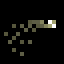Oil trail (OIL_TRAIL) [[toc](#OIL_TRAIL_CONTENTS)]

* **description**: Gives a projectile a trail of oil
* **type**: ACTION_TYPE_MODIFIER
* **spawn_level**: [2, 3, 4]
* **spawn_probability**: [0.3, 0.3, 0.3]
* **price**: 160
* **mana**: 10
* **max_uses**: 0
* **never_unlimited**: false
* **spawn_manual_unlock**: false
* **recursive**: false
* **ai_never_uses**: false
* **is_dangerous_blast**: false
* **related_projectiles**: 
* **spawn_requires_flag**: 
* **related_extra_entities**: 
* **action**:

```lua
 function()
      c.game_effect_entities = c.game_effect_entities .. "data/entities/misc/effect_apply_oiled.xml,"
      c.trail_material = c.trail_material .. "oil,"
      c.trail_material_amount = c.trail_material_amount + 20
      draw_actions( 1, true )
    end,
```


### <a id="OMEGA"></a>Omega (OMEGA) [[toc](#OMEGA_CONTENTS)]

* **description**: Casts copies of every spell in your wand
* **type**: ACTION_TYPE_OTHER
* **spawn_level**: [5, 6, 10]
* **spawn_probability**: [0.1, 0.1, 1.0]
* **price**: 600
* **mana**: 300
* **max_uses**: 0
* **never_unlimited**: false
* **spawn_manual_unlock**: false
* **recursive**: true
* **ai_never_uses**: false
* **is_dangerous_blast**: false
* **related_projectiles**: 
* **spawn_requires_flag**: card_unlocked_duplicate
* **related_extra_entities**: 
* **action**:

```lua
 function( recursion_level, iteration )
      c.fire_rate_wait = c.fire_rate_wait + 50
      
      if ( discarded ~= nil ) then
        for i,data in ipairs( discarded ) do
          local rec = check_recursion( data, recursion_level )
          if ( data ~= nil ) and ( rec > -1 ) and ( data.id ~= "RESET" ) then
            dont_draw_actions = true
            data.action( rec )
            dont_draw_actions = false
          end
        end
      end
      
      if ( hand ~= nil ) then
        for i,data in ipairs( hand ) do
          local rec = check_recursion( data, recursion_level )
          if ( data ~= nil ) and ( ( data.recursive == nil ) or ( data.recursive == false ) ) then
            dont_draw_actions = true
            data.action( rec )
            dont_draw_actions = false
          end
        end
      end
      
      if ( deck ~= nil ) then
        for i,data in ipairs( deck ) do
          local rec = check_recursion( data, recursion_level )
          if ( data ~= nil ) and ( rec > -1 ) and ( data.id ~= "RESET" ) then
            dont_draw_actions = true
            data.action( rec )
            dont_draw_actions = false
          end
        end
      end
    end,
```


### <a id="ORBIT_DISCS"></a>Sawblade Orbit (ORBIT_DISCS) [[toc](#ORBIT_DISCS_CONTENTS)]

* **description**: Makes four sawblades rotate around a projectile
* **type**: ACTION_TYPE_MODIFIER
* **spawn_level**: [1, 2, 4, 5]
* **spawn_probability**: [0.2, 0.8, 0.4, 0.2]
* **price**: 200
* **mana**: 70
* **max_uses**: 0
* **never_unlimited**: false
* **spawn_manual_unlock**: false
* **recursive**: false
* **ai_never_uses**: false
* **is_dangerous_blast**: false
* **related_projectiles**: 
* **spawn_requires_flag**: card_unlocked_dragon
* **related_extra_entities**: { "data/entities/misc/orbit_discs.xml" }
* **action**:

```lua
 function()
      c.extra_entities = c.extra_entities .. "data/entities/misc/orbit_discs.xml,"
      draw_actions( 1, true )
    end,
```


### <a id="ORBIT_FIREBALLS"></a>Fireball Orbit (ORBIT_FIREBALLS) [[toc](#ORBIT_FIREBALLS_CONTENTS)]

* **description**: Makes four fireballs rotate around a projectile
* **type**: ACTION_TYPE_MODIFIER
* **spawn_level**: [0, 1, 2, 4, 5]
* **spawn_probability**: [0.5, 0.2, 0.8, 0.4, 0.2]
* **price**: 140
* **mana**: 40
* **max_uses**: 0
* **never_unlimited**: false
* **spawn_manual_unlock**: false
* **recursive**: false
* **ai_never_uses**: false
* **is_dangerous_blast**: false
* **related_projectiles**: 
* **spawn_requires_flag**: card_unlocked_dragon
* **related_extra_entities**: { "data/entities/misc/orbit_fireballs.xml" }
* **action**:

```lua
 function()
      c.extra_entities = c.extra_entities .. "data/entities/misc/orbit_fireballs.xml,"
      draw_actions( 1, true )
    end,
```


### <a id="ORBIT_LARPA"></a>Orbit Larpa (ORBIT_LARPA) [[toc](#ORBIT_LARPA_CONTENTS)]

* **description**: Makes four copies of a projectile rotate around it
* **type**: ACTION_TYPE_MODIFIER
* **spawn_level**: [3, 4, 6, 10]
* **spawn_probability**: [0.2, 0.2, 0.8, 0.1]
* **price**: 240
* **mana**: 90
* **max_uses**: 0
* **never_unlimited**: false
* **spawn_manual_unlock**: false
* **recursive**: false
* **ai_never_uses**: false
* **is_dangerous_blast**: false
* **related_projectiles**: 
* **spawn_requires_flag**: card_unlocked_dragon
* **related_extra_entities**: { "data/entities/misc/orbit_larpa.xml" }
* **action**:

```lua
 function()
      c.extra_entities = c.extra_entities .. "data/entities/misc/orbit_larpa.xml,"
      draw_actions( 1, true )
    end,
```


### <a id="ORBIT_LASERS"></a>Plasma Beam Orbit (ORBIT_LASERS) [[toc](#ORBIT_LASERS_CONTENTS)]

* **description**: Makes four plasma beams rotate around a projectile
* **type**: ACTION_TYPE_MODIFIER
* **spawn_level**: [1, 2, 4, 5, 10]
* **spawn_probability**: [0.2, 0.8, 0.4, 0.2, 0.2]
* **price**: 200
* **mana**: 100
* **max_uses**: 0
* **never_unlimited**: false
* **spawn_manual_unlock**: false
* **recursive**: false
* **ai_never_uses**: false
* **is_dangerous_blast**: false
* **related_projectiles**: 
* **spawn_requires_flag**: card_unlocked_dragon
* **related_extra_entities**: { "data/entities/misc/orbit_lasers.xml" }
* **action**:

```lua
 function()
      c.extra_entities = c.extra_entities .. "data/entities/misc/orbit_lasers.xml,"
      draw_actions( 1, true )
    end,
```


### <a id="ORBIT_NUKES"></a>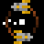Nuke Orbit (ORBIT_NUKES) [[toc](#ORBIT_NUKES_CONTENTS)]

* **description**: Makes four nukes(?!) rotate around a projectile
* **type**: ACTION_TYPE_MODIFIER
* **spawn_level**: [2, 4, 5, 6, 10]
* **spawn_probability**: [0.1, 0.1, 0.1, 0.2, 1.0]
* **price**: 400
* **mana**: 250
* **max_uses**: 3
* **never_unlimited**: false
* **spawn_manual_unlock**: false
* **recursive**: false
* **ai_never_uses**: true
* **is_dangerous_blast**: false
* **related_projectiles**: 
* **spawn_requires_flag**: card_unlocked_dragon
* **related_extra_entities**: { "data/entities/misc/orbit_nukes.xml" }
* **action**:

```lua
 function()
      c.extra_entities = c.extra_entities .. "data/entities/misc/orbit_nukes.xml,"
      draw_actions( 1, true )
    end,
```


### <a id="ORBIT_SHOT"></a>Orbiting Arc (ORBIT_SHOT) [[toc](#ORBIT_SHOT_CONTENTS)]

* **description**: A projectile orbits the point of its origin
* **type**: ACTION_TYPE_MODIFIER
* **spawn_level**: [1, 2, 3, 4]
* **spawn_probability**: [0.2, 0.3, 0.4, 0.1]
* **price**: 30
* **mana**: 0
* **max_uses**: 0
* **never_unlimited**: false
* **spawn_manual_unlock**: false
* **recursive**: false
* **ai_never_uses**: false
* **is_dangerous_blast**: false
* **related_projectiles**: 
* **spawn_requires_flag**: 
* **related_extra_entities**: { "data/entities/misc/spiraling_shot.xml" }
* **action**:

```lua
 function()
      c.extra_entities = c.extra_entities .. "data/entities/misc/spiraling_shot.xml,"
      draw_actions( 1, true )
      c.damage_projectile_add = c.damage_projectile_add + 0.1
      c.fire_rate_wait    = c.fire_rate_wait - 6
      c.lifetime_add     = c.lifetime_add + 25
    end,
```


### <a id="PEBBLE"></a>Summon rock spirit (PEBBLE) [[toc](#PEBBLE_CONTENTS)]

* **description**: Summons an autonomous rock ally
* **type**: ACTION_TYPE_PROJECTILE
* **spawn_level**: [1, 2, 4, 6]
* **spawn_probability**: [1.0, 1.0, 1.0, 1.0]
* **price**: 200
* **mana**: 120
* **max_uses**: 10
* **never_unlimited**: false
* **spawn_manual_unlock**: false
* **recursive**: false
* **ai_never_uses**: false
* **is_dangerous_blast**: false
* **related_projectiles**: {"data/entities/projectiles/deck/pebble_player.xml"}
* **spawn_requires_flag**: 
* **related_extra_entities**: 
* **action**:

```lua
 function()
      add_projectile("data/entities/projectiles/deck/pebble_player.xml")
      c.fire_rate_wait = c.fire_rate_wait + 80
    end,
```


### <a id="PENTAGRAM_SHAPE"></a>Formation - pentagon (PENTAGRAM_SHAPE) [[toc](#PENTAGRAM_SHAPE_CONTENTS)]

* **description**: Casts 5 spells in a pentagonal pattern
* **type**: ACTION_TYPE_DRAW_MANY
* **spawn_level**: [1, 2, 3, 4, 5]
* **spawn_probability**: [0.4, 0.4, 0.3, 0.2, 0.1]
* **price**: 150
* **mana**: 5
* **max_uses**: 0
* **never_unlimited**: false
* **spawn_manual_unlock**: false
* **recursive**: false
* **ai_never_uses**: false
* **is_dangerous_blast**: false
* **related_projectiles**: 
* **spawn_requires_flag**: 
* **related_extra_entities**: 
* **action**:

```lua
 function()
      draw_actions(5, true)
      c.pattern_degrees = 180
    end,
```


### <a id="PHASING_ARC"></a>Phasing Arc (PHASING_ARC) [[toc](#PHASING_ARC_CONTENTS)]

* **description**: Makes a projectile fly much slower, but teleport short distances over its flight
* **type**: ACTION_TYPE_MODIFIER
* **spawn_level**: [2, 3, 4, 5]
* **spawn_probability**: [0.2, 0.3, 0.6, 0.1]
* **price**: 170
* **mana**: 2
* **max_uses**: 0
* **never_unlimited**: false
* **spawn_manual_unlock**: false
* **recursive**: false
* **ai_never_uses**: false
* **is_dangerous_blast**: false
* **related_projectiles**: 
* **spawn_requires_flag**: 
* **related_extra_entities**: { "data/entities/misc/phasing_arc.xml" }
* **action**:

```lua
 function()
      c.extra_entities = c.extra_entities .. "data/entities/misc/phasing_arc.xml,"
      draw_actions( 1, true )
      c.fire_rate_wait    = c.fire_rate_wait - 12
      c.lifetime_add     = c.lifetime_add + 80
      c.speed_multiplier  = c.speed_multiplier * 0.33
      c.child_speed_multiplier  = c.child_speed_multiplier * 0.33
      
      if ( c.speed_multiplier >= 20 ) then
        c.speed_multiplier = math.min( c.speed_multiplier, 20 )
      elseif ( c.speed_multiplier < 0 ) then
        c.speed_multiplier = 0
      end
    end,
```


### <a id="PHI"></a>Phi (PHI) [[toc](#PHI_CONTENTS)]

* **description**: Casts a copy of every projectile-type spell in the current wand
* **type**: ACTION_TYPE_OTHER
* **spawn_level**: [5, 6, 10]
* **spawn_probability**: [0.1, 0.1, 1.0]
* **price**: 500
* **mana**: 120
* **max_uses**: 0
* **never_unlimited**: false
* **spawn_manual_unlock**: false
* **recursive**: true
* **ai_never_uses**: false
* **is_dangerous_blast**: false
* **related_projectiles**: 
* **spawn_requires_flag**: card_unlocked_duplicate
* **related_extra_entities**: 
* **action**:

```lua
 function( recursion_level, iteration )
      c.fire_rate_wait = c.fire_rate_wait + 50
      
      local firerate = c.fire_rate_wait
      local reload = current_reload_time
      local mana_ = mana
      
      if ( discarded ~= nil ) then
        for i,data in ipairs( discarded ) do
          local rec = check_recursion( data, recursion_level )
          if ( data ~= nil ) and ( data.type == 0 ) and ( rec > -1 ) then
            dont_draw_actions = true
            data.action( rec )
            dont_draw_actions = false
          end
        end
      end
      
      if ( hand ~= nil ) then
        for i,data in ipairs( hand ) do
          local rec = check_recursion( data, recursion_level )
          if ( data ~= nil ) and ( data.type == 0 ) and ( rec > -1 ) then
            dont_draw_actions = true
            data.action( rec )
            dont_draw_actions = false
          end
        end
      end
      
      if ( deck ~= nil ) then
        for i,data in ipairs( deck ) do
          local rec = check_recursion( data, recursion_level )
          if ( data ~= nil ) and ( data.type == 0 ) and ( rec > -1 ) then
            dont_draw_actions = true
            data.action( rec )
            dont_draw_actions = false
          end
        end
      end
      
      c.fire_rate_wait = firerate
      current_reload_time = reload
      mana = mana_
    end,
```


### <a id="PIERCING_SHOT"></a>Piercing shot (PIERCING_SHOT) [[toc](#PIERCING_SHOT_CONTENTS)]

* **description**: Makes a projectile fly through enemies, but harmful to the caster
* **type**: ACTION_TYPE_MODIFIER
* **spawn_level**: [2, 3, 4, 5, 6]
* **spawn_probability**: [0.6, 0.6, 0.6, 0.6, 0.6]
* **price**: 190
* **mana**: 140
* **max_uses**: 0
* **never_unlimited**: false
* **spawn_manual_unlock**: false
* **recursive**: false
* **ai_never_uses**: false
* **is_dangerous_blast**: false
* **related_projectiles**: 
* **spawn_requires_flag**: 
* **related_extra_entities**: { "data/entities/misc/piercing_shot.xml" }
* **action**:

```lua
 function()
      c.damage_projectile_add = c.damage_projectile_add - 0.6
      c.extra_entities = c.extra_entities .. "data/entities/misc/piercing_shot.xml,"
      c.friendly_fire    = true
      draw_actions( 1, true )
    end,
```


### <a id="PINGPONG_PATH"></a>Ping-pong path (PINGPONG_PATH) [[toc](#PINGPONG_PATH_CONTENTS)]

* **description**: Makes a projectile fly back and forth
* **type**: ACTION_TYPE_MODIFIER
* **spawn_level**: [1, 3, 5]
* **spawn_probability**: [0.4, 0.4, 0.4]
* **price**: 20
* **mana**: 0
* **max_uses**: 0
* **never_unlimited**: false
* **spawn_manual_unlock**: false
* **recursive**: false
* **ai_never_uses**: false
* **is_dangerous_blast**: false
* **related_projectiles**: 
* **spawn_requires_flag**: 
* **related_extra_entities**: { "data/entities/misc/pingpong_path.xml" }
* **action**:

```lua
 function()
      c.extra_entities = c.extra_entities .. "data/entities/misc/pingpong_path.xml,"
      c.lifetime_add = c.lifetime_add + 25
      draw_actions( 1, true )
    end,
```


### <a id="PIPE_BOMB"></a>Dormant crystal (PIPE_BOMB) [[toc](#PIPE_BOMB_CONTENTS)]

* **description**: A crystal that explodes when caught in an explosion
* **type**: ACTION_TYPE_PROJECTILE
* **spawn_level**: [2, 3, 4]
* **spawn_probability**: [1.0, 1.0, 1.0]
* **price**: 200
* **mana**: 20
* **max_uses**: 20
* **never_unlimited**: false
* **spawn_manual_unlock**: false
* **recursive**: false
* **ai_never_uses**: false
* **is_dangerous_blast**: false
* **related_projectiles**: {"data/entities/projectiles/deck/pipe_bomb.xml"}
* **spawn_requires_flag**: 
* **related_extra_entities**: 
* **action**:

```lua
 function()
      add_projectile("data/entities/projectiles/deck/pipe_bomb.xml")
      c.fire_rate_wait = c.fire_rate_wait + 30
      c.child_speed_multiplier = c.child_speed_multiplier * 0.75
      c.speed_multiplier = c.speed_multiplier * 0.75
      
      if ( c.speed_multiplier >= 20 ) then
        c.speed_multiplier = math.min( c.speed_multiplier, 20 )
      elseif ( c.speed_multiplier < 0 ) then
        c.speed_multiplier = 0
      end
    end,
```


### <a id="PIPE_BOMB_DEATH_TRIGGER"></a>Dormant crystal with trigger (PIPE_BOMB_DEATH_TRIGGER) [[toc](#PIPE_BOMB_DEATH_TRIGGER_CONTENTS)]

* **description**: A crystal that explodes and casts another spell when caught in an explosion
* **type**: ACTION_TYPE_PROJECTILE
* **spawn_level**: [2, 3, 4, 5]
* **spawn_probability**: [1.0, 1.0, 1.0, 1.0]
* **price**: 230
* **mana**: 20
* **max_uses**: 20
* **never_unlimited**: false
* **spawn_manual_unlock**: false
* **recursive**: false
* **ai_never_uses**: false
* **is_dangerous_blast**: false
* **related_projectiles**: {"data/entities/projectiles/deck/pipe_bomb.xml"}
* **spawn_requires_flag**: 
* **related_extra_entities**: 
* **action**:

```lua
 function()
      c.fire_rate_wait = c.fire_rate_wait + 30
      c.child_speed_multiplier = c.child_speed_multiplier * 0.75
      c.speed_multiplier = c.speed_multiplier * 0.75
      add_projectile_trigger_death("data/entities/projectiles/deck/pipe_bomb.xml", 1)
      shot_effects.recoil_knockback = shot_effects.recoil_knockback + 60.0
      
      if ( c.speed_multiplier >= 20 ) then
        c.speed_multiplier = math.min( c.speed_multiplier, 20 )
      elseif ( c.speed_multiplier < 0 ) then
        c.speed_multiplier = 0
      end
    end,
```


### <a id="POISON_BLAST"></a>Explosion of poison (POISON_BLAST) [[toc](#POISON_BLAST_CONTENTS)]

* **description**: An alchemical explosion
* **type**: ACTION_TYPE_STATIC_PROJECTILE
* **spawn_level**: [1, 2, 4, 6]
* **spawn_probability**: [0.5, 0.6, 0.6, 0.5]
* **price**: 140
* **mana**: 30
* **max_uses**: 0
* **never_unlimited**: false
* **spawn_manual_unlock**: false
* **recursive**: false
* **ai_never_uses**: false
* **is_dangerous_blast**: true
* **related_projectiles**: {"data/entities/projectiles/deck/poison_blast.xml"}
* **spawn_requires_flag**: 
* **related_extra_entities**: 
* **action**:

```lua
 function()
      add_projectile("data/entities/projectiles/deck/poison_blast.xml")
      c.fire_rate_wait = c.fire_rate_wait + 3
      c.screenshake = c.screenshake + 0.5
    end,
```


### <a id="POISON_TRAIL"></a>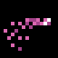Poison trail (POISON_TRAIL) [[toc](#POISON_TRAIL_CONTENTS)]

* **description**: Gives a projectile a trail of poison
* **type**: ACTION_TYPE_MODIFIER
* **spawn_level**: [2, 3, 4]
* **spawn_probability**: [0.3, 0.3, 0.3]
* **price**: 160
* **mana**: 10
* **max_uses**: 0
* **never_unlimited**: false
* **spawn_manual_unlock**: false
* **recursive**: false
* **ai_never_uses**: false
* **is_dangerous_blast**: false
* **related_projectiles**: 
* **spawn_requires_flag**: 
* **related_extra_entities**: 
* **action**:

```lua
 function()
      c.game_effect_entities = c.game_effect_entities .. "data/entities/misc/effect_apply_poison.xml,"
      c.trail_material = c.trail_material .. "poison,"
      c.trail_material_amount = c.trail_material_amount + 9
      draw_actions( 1, true )
    end,
```


### <a id="POLLEN"></a>Pollen (POLLEN) [[toc](#POLLEN_CONTENTS)]

* **description**: A small, floating projectile that homes towards nearby creatures
* **type**: ACTION_TYPE_PROJECTILE
* **spawn_level**: [0, 1, 3, 4]
* **spawn_probability**: [0.6, 1.0, 1.0, 0.8]
* **price**: 110
* **mana**: 10
* **max_uses**: 0
* **never_unlimited**: false
* **spawn_manual_unlock**: false
* **recursive**: false
* **ai_never_uses**: false
* **is_dangerous_blast**: false
* **related_projectiles**: {"data/entities/projectiles/deck/pollen.xml"}
* **spawn_requires_flag**: 
* **related_extra_entities**: 
* **action**:

```lua
 function()
      add_projectile("data/entities/projectiles/deck/pollen.xml")
      c.fire_rate_wait = c.fire_rate_wait + 2
      c.spread_degrees = c.spread_degrees + 20
    end,
```


### <a id="POLYMORPH_FIELD"></a>Circle of transmogrification (POLYMORPH_FIELD) [[toc](#POLYMORPH_FIELD_CONTENTS)]

* **description**: A field of sheep-like magic
* **type**: ACTION_TYPE_STATIC_PROJECTILE
* **spawn_level**: [0, 1, 2, 3, 4, 5, 6]
* **spawn_probability**: [0.3, 0.3, 0.3, 0.8, 0.8, 0.3, 0.3]
* **price**: 200
* **mana**: 50
* **max_uses**: 5
* **never_unlimited**: false
* **spawn_manual_unlock**: false
* **recursive**: false
* **ai_never_uses**: false
* **is_dangerous_blast**: false
* **related_projectiles**: {"data/entities/projectiles/deck/polymorph_field.xml"}
* **spawn_requires_flag**: 
* **related_extra_entities**: 
* **action**:

```lua
 function()
      add_projectile("data/entities/projectiles/deck/polymorph_field.xml")
      c.fire_rate_wait = c.fire_rate_wait + 15
    end,
```


### <a id="POWERDIGGER"></a>Digging blast (POWERDIGGER) [[toc](#POWERDIGGER_CONTENTS)]

* **description**: More powerful digging
* **type**: ACTION_TYPE_PROJECTILE
* **spawn_level**: [2, 3, 4]
* **spawn_probability**: [0.5, 1.0, 1.0]
* **price**: 110
* **mana**: 0
* **max_uses**: 0
* **never_unlimited**: false
* **spawn_manual_unlock**: false
* **recursive**: false
* **ai_never_uses**: false
* **is_dangerous_blast**: false
* **related_projectiles**: {"data/entities/projectiles/deck/powerdigger.xml"}
* **spawn_requires_flag**: 
* **related_extra_entities**: 
* **action**:

```lua
 function()
      add_projectile("data/entities/projectiles/deck/powerdigger.xml")
      c.fire_rate_wait = c.fire_rate_wait + 1
      current_reload_time = current_reload_time - ACTION_DRAW_RELOAD_TIME_INCREASE - 10 -- this is a hack to get the digger reload time back to 0
    end,
```


### <a id="PROJECTILE_GRAVITY_FIELD"></a>Projectile gravity field (PROJECTILE_GRAVITY_FIELD) [[toc](#PROJECTILE_GRAVITY_FIELD_CONTENTS)]

* **description**: Projectiles caught within the field are attracted towards its center
* **type**: ACTION_TYPE_STATIC_PROJECTILE
* **spawn_level**: [2, 5, 6]
* **spawn_probability**: [0.3, 0.3, 0.3]
* **price**: 250
* **mana**: 120
* **max_uses**: 6
* **never_unlimited**: false
* **spawn_manual_unlock**: false
* **recursive**: false
* **ai_never_uses**: false
* **is_dangerous_blast**: false
* **related_projectiles**: {"data/entities/projectiles/deck/projectile_gravity_field.xml"}
* **spawn_requires_flag**: 
* **related_extra_entities**: 
* **action**:

```lua
 function()
      add_projectile("data/entities/projectiles/deck/projectile_gravity_field.xml")
      c.fire_rate_wait = c.fire_rate_wait + 15
    end,
```


### <a id="PROJECTILE_THUNDER_FIELD"></a>Projectile thunder field (PROJECTILE_THUNDER_FIELD) [[toc](#PROJECTILE_THUNDER_FIELD_CONTENTS)]

* **description**: Projectiles caught within the field transform into blasts of lightning
* **type**: ACTION_TYPE_STATIC_PROJECTILE
* **spawn_level**: [3, 4, 5, 6]
* **spawn_probability**: [0.3, 0.3, 0.3, 0.3]
* **price**: 300
* **mana**: 140
* **max_uses**: 6
* **never_unlimited**: false
* **spawn_manual_unlock**: false
* **recursive**: false
* **ai_never_uses**: false
* **is_dangerous_blast**: false
* **related_projectiles**: {"data/entities/projectiles/deck/projectile_thunder_field.xml"}
* **spawn_requires_flag**: 
* **related_extra_entities**: 
* **action**:

```lua
 function()
      add_projectile("data/entities/projectiles/deck/projectile_thunder_field.xml")
      c.fire_rate_wait = c.fire_rate_wait + 15
    end,
```


### <a id="PROJECTILE_TRANSMUTATION_FIELD"></a>Projectile transmutation field (PROJECTILE_TRANSMUTATION_FIELD) [[toc](#PROJECTILE_TRANSMUTATION_FIELD_CONTENTS)]

* **description**: Projectiles caught within the field transform into harmless critters
* **type**: ACTION_TYPE_STATIC_PROJECTILE
* **spawn_level**: [2, 3, 4, 5, 6]
* **spawn_probability**: [0.3, 0.3, 0.3, 0.3, 0.3]
* **price**: 250
* **mana**: 120
* **max_uses**: 6
* **never_unlimited**: false
* **spawn_manual_unlock**: false
* **recursive**: false
* **ai_never_uses**: false
* **is_dangerous_blast**: false
* **related_projectiles**: {"data/entities/projectiles/deck/projectile_transmutation_field.xml"}
* **spawn_requires_flag**: 
* **related_extra_entities**: 
* **action**:

```lua
 function()
      add_projectile("data/entities/projectiles/deck/projectile_transmutation_field.xml")
      c.fire_rate_wait = c.fire_rate_wait + 15
    end,
```


### <a id="PROPANE_TANK"></a>Propane tank (PROPANE_TANK) [[toc](#PROPANE_TANK_CONTENTS)]

* **description**: Summons a propane tank. Be careful what you wish for.
* **type**: ACTION_TYPE_PROJECTILE
* **spawn_level**: [0, 1, 2, 3, 4, 5, 6]
* **spawn_probability**: [0.0, 0.0, 1.0, 1.0, 1.0, 1.0, 1.0]
* **price**: 200
* **mana**: 75
* **max_uses**: 10
* **never_unlimited**: false
* **spawn_manual_unlock**: false
* **recursive**: false
* **ai_never_uses**: false
* **is_dangerous_blast**: false
* **related_projectiles**: {"data/entities/projectiles/propane_tank.xml"}
* **spawn_requires_flag**: 
* **related_extra_entities**: 
* **action**:

```lua
 function()
      add_projectile("data/entities/projectiles/propane_tank.xml")
      c.fire_rate_wait = c.fire_rate_wait + 100
    end,
```


### <a id="PURPLE_EXPLOSION_FIELD"></a>Glittering field (PURPLE_EXPLOSION_FIELD) [[toc](#PURPLE_EXPLOSION_FIELD_CONTENTS)]

* **description**: Small explosions appear randomly over a large area
* **type**: ACTION_TYPE_STATIC_PROJECTILE
* **spawn_level**: [0, 1, 2, 4, 5, 6]
* **spawn_probability**: [1.0, 1.0, 1.0, 1.0, 1.0, 1.0]
* **price**: 160
* **mana**: 90
* **max_uses**: 20
* **never_unlimited**: false
* **spawn_manual_unlock**: false
* **recursive**: false
* **ai_never_uses**: false
* **is_dangerous_blast**: false
* **related_projectiles**: {"data/entities/projectiles/deck/purple_explosion_field.xml"}
* **spawn_requires_flag**: 
* **related_extra_entities**: 
* **action**:

```lua
 function()
      add_projectile("data/entities/projectiles/deck/purple_explosion_field.xml")
      c.fire_rate_wait = c.fire_rate_wait + 10
      c.speed_multiplier = c.speed_multiplier - 2
      
      if ( c.speed_multiplier >= 20 ) then
        c.speed_multiplier = math.min( c.speed_multiplier, 20 )
      elseif ( c.speed_multiplier < 0 ) then
        c.speed_multiplier = 0
      end
    end,
```


### <a id="QUANTUM_SPLIT"></a>Quantum Split (QUANTUM_SPLIT) [[toc](#QUANTUM_SPLIT_CONTENTS)]

* **description**: Makes a projectile split into three projectiles whose existences are entangled
* **type**: ACTION_TYPE_MODIFIER
* **spawn_level**: [2, 3, 4, 5, 6]
* **spawn_probability**: [0.5, 0.5, 0.5, 0.5, 1.0]
* **price**: 200
* **mana**: 10
* **max_uses**: 0
* **never_unlimited**: false
* **spawn_manual_unlock**: false
* **recursive**: false
* **ai_never_uses**: false
* **is_dangerous_blast**: false
* **related_projectiles**: 
* **spawn_requires_flag**: 
* **related_extra_entities**: { "data/entities/misc/quantum_split.xml" }
* **action**:

```lua
 function()
      c.extra_entities = c.extra_entities .. "data/entities/misc/quantum_split.xml,"
      c.fire_rate_wait = c.fire_rate_wait + 5
      draw_actions( 1, true )
    end,
```


### <a id="RAINBOW_TRAIL"></a>Rainbow trail (RAINBOW_TRAIL) [[toc](#RAINBOW_TRAIL_CONTENTS)]

* **description**: Gives a projectile a trail of rainbow
* **type**: ACTION_TYPE_MODIFIER
* **spawn_level**: [10]
* **spawn_probability**: [0.0]
* **price**: 100
* **mana**: 0
* **max_uses**: 0
* **never_unlimited**: false
* **spawn_manual_unlock**: false
* **recursive**: false
* **ai_never_uses**: false
* **is_dangerous_blast**: false
* **related_projectiles**: 
* **spawn_requires_flag**: card_unlocked_rainbow_trail
* **related_extra_entities**: 
* **action**:

```lua
 function()
      c.game_effect_entities = c.game_effect_entities .. "data/entities/misc/effect_rainbow_farts.xml,"
      c.trail_material = c.trail_material .. "material_rainbow,"
      c.trail_material_amount = c.trail_material_amount + 20
      draw_actions( 1, true )
    end,
```


### <a id="RANDOM_EXPLOSION"></a>Chaos magic (RANDOM_EXPLOSION) [[toc](#RANDOM_EXPLOSION_CONTENTS)]

* **description**: Makes a projectile launch a random spell (out of a limited selection) when it hits something
* **type**: ACTION_TYPE_MODIFIER
* **spawn_level**: [3, 5, 6]
* **spawn_probability**: [0.3, 0.6, 1.0]
* **price**: 240
* **mana**: 120
* **max_uses**: 30
* **never_unlimited**: false
* **spawn_manual_unlock**: false
* **recursive**: false
* **ai_never_uses**: false
* **is_dangerous_blast**: false
* **related_projectiles**: 
* **spawn_requires_flag**: 
* **related_extra_entities**: { "data/entities/misc/random_explosion.xml", "data/entities/particles/tinyspark_purple_bright.xml" }
* **action**:

```lua
 function()
      c.extra_entities = c.extra_entities .. "data/entities/misc/random_explosion.xml,data/entities/particles/tinyspark_purple_bright.xml,"
      c.fire_rate_wait = c.fire_rate_wait + 40
      draw_actions( 1, true )
    end,
```


### <a id="RANDOM_MODIFIER"></a>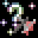Random modifier spell (RANDOM_MODIFIER) [[toc](#RANDOM_MODIFIER_CONTENTS)]

* **description**: Casts one random modifier spell
* **type**: ACTION_TYPE_MODIFIER
* **spawn_level**: [4, 5, 6, 10]
* **spawn_probability**: [0.3, 0.1, 0.1, 0.5]
* **price**: 120
* **mana**: 20
* **max_uses**: 0
* **never_unlimited**: false
* **spawn_manual_unlock**: false
* **recursive**: true
* **ai_never_uses**: false
* **is_dangerous_blast**: false
* **related_projectiles**: 
* **spawn_requires_flag**: card_unlocked_pyramid
* **related_extra_entities**: 
* **action**:

```lua
 function( recursion_level, iteration )
      SetRandomSeed( GameGetFrameNum() + #deck, GameGetFrameNum() + 133 )
      local rnd = Random( 1, #actions )
      local data = actions[rnd]
      
      local safety = 0
      local rec = check_recursion( data, recursion_level )
      
      while ( safety < 100 ) and ( ( data.type ~= 2 ) or ( rec == -1 ) ) do
        rnd = Random( 1, #actions )
        data = actions[rnd]
        rec = check_recursion( data, recursion_level )
        
        safety = safety + 1
      end
      
      data.action( rec )
    end,
```


### <a id="RANDOM_PROJECTILE"></a>Random projectile spell (RANDOM_PROJECTILE) [[toc](#RANDOM_PROJECTILE_CONTENTS)]

* **description**: Casts one random projectile spell
* **type**: ACTION_TYPE_PROJECTILE
* **spawn_level**: [2, 4, 5, 6, 10]
* **spawn_probability**: [0.2, 0.4, 0.1, 0.1, 0.5]
* **price**: 150
* **mana**: 20
* **max_uses**: 0
* **never_unlimited**: false
* **spawn_manual_unlock**: false
* **recursive**: true
* **ai_never_uses**: false
* **is_dangerous_blast**: false
* **related_projectiles**: 
* **spawn_requires_flag**: card_unlocked_pyramid
* **related_extra_entities**: 
* **action**:

```lua
 function( recursion_level, iteration )
      SetRandomSeed( GameGetFrameNum() + #deck, GameGetFrameNum() + 203 )
      local rnd = Random( 1, #actions )
      local data = actions[rnd]
      
      local safety = 0
      local rec = check_recursion( data, recursion_level )
      
      while ( safety < 100 ) and ( ( data.type ~= 0 ) or ( rec == -1 ) ) do
        rnd = Random( 1, #actions )
        data = actions[rnd]
        rec = check_recursion( data, recursion_level )
        
        safety = safety + 1
      end
      
      data.action( rec )
    end,
```


### <a id="RANDOM_SPELL"></a>Random spell (RANDOM_SPELL) [[toc](#RANDOM_SPELL_CONTENTS)]

* **description**: Casts a spell, any spell, at random!
* **type**: ACTION_TYPE_OTHER
* **spawn_level**: [3, 4, 5, 6, 10]
* **spawn_probability**: [0.2, 0.3, 0.1, 0.1, 0.5]
* **price**: 100
* **mana**: 5
* **max_uses**: 0
* **never_unlimited**: false
* **spawn_manual_unlock**: false
* **recursive**: true
* **ai_never_uses**: false
* **is_dangerous_blast**: false
* **related_projectiles**: 
* **spawn_requires_flag**: card_unlocked_pyramid
* **related_extra_entities**: 
* **action**:

```lua
 function( recursion_level, iteration )
      SetRandomSeed( GameGetFrameNum() + #deck, GameGetFrameNum() + 263 )
      local rnd = Random( 1, #actions )
      local data = actions[rnd]
      
      local safety = 0
      local rec = check_recursion( data, recursion_level )
      
      while ( safety < 100 ) and ( rec == -1 ) do
        rnd = Random( 1, #actions )
        data = actions[rnd]
        rec = check_recursion( data, recursion_level )
        
        safety = safety + 1
      end
      
      data.action( rec )
    end,
```


### <a id="RANDOM_STATIC_PROJECTILE"></a>Random static projectile spell (RANDOM_STATIC_PROJECTILE) [[toc](#RANDOM_STATIC_PROJECTILE_CONTENTS)]

* **description**: Casts one random static projectile spell
* **type**: ACTION_TYPE_STATIC_PROJECTILE
* **spawn_level**: [3, 5, 6, 10]
* **spawn_probability**: [0.2, 0.1, 0.1, 0.5]
* **price**: 160
* **mana**: 20
* **max_uses**: 0
* **never_unlimited**: false
* **spawn_manual_unlock**: false
* **recursive**: true
* **ai_never_uses**: false
* **is_dangerous_blast**: false
* **related_projectiles**: 
* **spawn_requires_flag**: card_unlocked_pyramid
* **related_extra_entities**: 
* **action**:

```lua
 function( recursion_level, iteration )
      SetRandomSeed( GameGetFrameNum() + #deck, GameGetFrameNum() + 253 )
      local rnd = Random( 1, #actions )
      local data = actions[rnd]
      
      local safety = 0
      local rec = check_recursion( data, recursion_level )
      
      while ( safety < 100 ) and ( ( data.type ~= 1 ) or ( rec == -1 ) ) do
        rnd = Random( 1, #actions )
        data = actions[rnd]
        rec = check_recursion( data, recursion_level )
        
        safety = safety + 1
      end
      
      data.action( rec )
    end,
```


### <a id="RECHARGE"></a>Reduce recharge time (RECHARGE) [[toc](#RECHARGE_CONTENTS)]

* **description**: Reduces the time between spellcasts
* **type**: ACTION_TYPE_MODIFIER
* **spawn_level**: [1, 2, 3, 4, 5, 6]
* **spawn_probability**: [1.0, 1.0, 1.0, 1.0, 1.0, 1.0]
* **price**: 200
* **mana**: 12
* **max_uses**: 0
* **never_unlimited**: false
* **spawn_manual_unlock**: false
* **recursive**: false
* **ai_never_uses**: false
* **is_dangerous_blast**: false
* **related_projectiles**: 
* **spawn_requires_flag**: 
* **related_extra_entities**: 
* **action**:

```lua
 function()
      c.fire_rate_wait    = c.fire_rate_wait - 10
      current_reload_time = current_reload_time - 20
      draw_actions( 1, true )
    end,
```


### <a id="RECOIL"></a>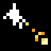Recoil (RECOIL) [[toc](#RECOIL_CONTENTS)]

* **description**: Increases the recoil when casting spells
* **type**: ACTION_TYPE_MODIFIER
* **spawn_level**: [2, 4]
* **spawn_probability**: [0.6, 0.6]
* **price**: 100
* **mana**: 5
* **max_uses**: 0
* **never_unlimited**: false
* **spawn_manual_unlock**: false
* **recursive**: false
* **ai_never_uses**: false
* **is_dangerous_blast**: false
* **related_projectiles**: 
* **spawn_requires_flag**: 
* **related_extra_entities**: 
* **action**:

```lua
 function()
      shot_effects.recoil_knockback = shot_effects.recoil_knockback + 200.0
      draw_actions( 1, true )
    end,
```


### <a id="RECOIL_DAMPER"></a>Recoil Damper (RECOIL_DAMPER) [[toc](#RECOIL_DAMPER_CONTENTS)]

* **description**: Reduces the recoil when casting spells
* **type**: ACTION_TYPE_MODIFIER
* **spawn_level**: [3, 6]
* **spawn_probability**: [0.6, 0.6]
* **price**: 100
* **mana**: 5
* **max_uses**: 0
* **never_unlimited**: false
* **spawn_manual_unlock**: false
* **recursive**: false
* **ai_never_uses**: false
* **is_dangerous_blast**: false
* **related_projectiles**: 
* **spawn_requires_flag**: 
* **related_extra_entities**: 
* **action**:

```lua
 function()
      shot_effects.recoil_knockback = shot_effects.recoil_knockback - 200
      draw_actions( 1, true )
    end,
```


### <a id="REGENERATION_FIELD"></a>Circle of vigour (REGENERATION_FIELD) [[toc](#REGENERATION_FIELD_CONTENTS)]

* **description**: A field of regenerative magic
* **type**: ACTION_TYPE_STATIC_PROJECTILE
* **spawn_level**: [1, 2, 3, 4]
* **spawn_probability**: [0.3, 0.3, 0.3, 0.3]
* **price**: 250
* **mana**: 80
* **max_uses**: 2
* **never_unlimited**: true
* **spawn_manual_unlock**: false
* **recursive**: false
* **ai_never_uses**: false
* **is_dangerous_blast**: false
* **related_projectiles**: {"data/entities/projectiles/deck/regeneration_field.xml"}
* **spawn_requires_flag**: 
* **related_extra_entities**: 
* **action**:

```lua
 function()
      add_projectile("data/entities/projectiles/deck/regeneration_field.xml")
      c.fire_rate_wait = c.fire_rate_wait + 15
    end,
```


### <a id="REMOVE_BOUNCE"></a>Remove Bounce (REMOVE_BOUNCE) [[toc](#REMOVE_BOUNCE_CONTENTS)]

* **description**: A normally bouncy projectile stops doing so
* **type**: ACTION_TYPE_MODIFIER
* **spawn_level**: [2, 3, 4, 5, 6]
* **spawn_probability**: [0.2, 0.2, 1.0, 1.0, 1.0]
* **price**: 50
* **mana**: 0
* **max_uses**: 0
* **never_unlimited**: false
* **spawn_manual_unlock**: false
* **recursive**: false
* **ai_never_uses**: false
* **is_dangerous_blast**: false
* **related_projectiles**: 
* **spawn_requires_flag**: 
* **related_extra_entities**: 
* **action**:

```lua
 function()
      c.extra_entities = c.extra_entities .. "data/entities/misc/remove_bounce.xml,"
      c.bounces = 0
      draw_actions( 1, true )
    end,
```


### <a id="RESET"></a>Wand Refresh (RESET) [[toc](#RESET_CONTENTS)]

* **description**: Reloads the wand immediately
* **type**: ACTION_TYPE_UTILITY
* **spawn_level**: [10]
* **spawn_probability**: [1.0]
* **price**: 120
* **mana**: 20
* **max_uses**: 0
* **never_unlimited**: false
* **spawn_manual_unlock**: false
* **recursive**: true
* **ai_never_uses**: false
* **is_dangerous_blast**: false
* **related_projectiles**: 
* **spawn_requires_flag**: card_unlocked_mestari
* **related_extra_entities**: 
* **action**:

```lua
 function()
      current_reload_time = current_reload_time - 25
      
      for i,v in ipairs( hand ) do
        table.insert( discarded, v )
      end
      
      for i,v in ipairs( deck ) do
        table.insert( discarded, v )
      end
      
      hand = {}
      deck = {}
      
      if ( force_stop_draws == false ) then
        force_stop_draws = true
        move_discarded_to_deck()
        order_deck()
      end
    end,
```


### <a id="ROCKET"></a>Magic missile (ROCKET) [[toc](#ROCKET_CONTENTS)]

* **description**: A fiery, explosive projectile
* **type**: ACTION_TYPE_PROJECTILE
* **spawn_level**: [1, 2, 3, 4, 5]
* **spawn_probability**: [1.0, 1.0, 1.0, 0.5, 0.5]
* **price**: 220
* **mana**: 70
* **max_uses**: 10
* **never_unlimited**: false
* **spawn_manual_unlock**: false
* **recursive**: false
* **ai_never_uses**: false
* **is_dangerous_blast**: false
* **related_projectiles**: {"data/entities/projectiles/deck/rocket.xml"}
* **spawn_requires_flag**: 
* **related_extra_entities**: 
* **action**:

```lua
 function()
      add_projectile("data/entities/projectiles/deck/rocket.xml")
      c.fire_rate_wait = c.fire_rate_wait + 60
      c.ragdoll_fx = 2
      shot_effects.recoil_knockback = 120.0
    end,
```


### <a id="ROCKET_DOWNWARDS"></a>Downwards bolt bundle (ROCKET_DOWNWARDS) [[toc](#ROCKET_DOWNWARDS_CONTENTS)]

* **description**: Makes a projectile separate into a bundle of 5 explosive bolts as soon as it moves downwards
* **type**: ACTION_TYPE_MODIFIER
* **spawn_level**: [1, 2, 3, 4]
* **spawn_probability**: [0.2, 1.0, 1.0, 1.0]
* **price**: 200
* **mana**: 90
* **max_uses**: 0
* **never_unlimited**: false
* **spawn_manual_unlock**: false
* **recursive**: false
* **ai_never_uses**: false
* **is_dangerous_blast**: false
* **related_projectiles**: 
* **spawn_requires_flag**: 
* **related_extra_entities**: { "data/entities/misc/rocket_downwards.xml" }
* **action**:

```lua
 function()
      c.extra_entities = c.extra_entities .. "data/entities/misc/rocket_downwards.xml,"
      c.fire_rate_wait = c.fire_rate_wait + 25
      draw_actions( 1, true )
    end,
```


### <a id="ROCKET_OCTAGON"></a>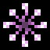Octagonal bolt bundle (ROCKET_OCTAGON) [[toc](#ROCKET_OCTAGON_CONTENTS)]

* **description**: Makes a projectile launch 8 magical bolts if it moves slowly enough
* **type**: ACTION_TYPE_MODIFIER
* **spawn_level**: [2, 3, 4]
* **spawn_probability**: [0.5, 0.5, 0.5]
* **price**: 200
* **mana**: 100
* **max_uses**: 0
* **never_unlimited**: false
* **spawn_manual_unlock**: false
* **recursive**: false
* **ai_never_uses**: false
* **is_dangerous_blast**: false
* **related_projectiles**: 
* **spawn_requires_flag**: 
* **related_extra_entities**: { "data/entities/misc/rocket_octagon.xml" }
* **action**:

```lua
 function()
      c.extra_entities = c.extra_entities .. "data/entities/misc/rocket_octagon.xml,"
      c.fire_rate_wait = c.fire_rate_wait + 20
      draw_actions( 1, true )
    end,
```


### <a id="ROCKET_TIER_2"></a>Large magic missile (ROCKET_TIER_2) [[toc](#ROCKET_TIER_2_CONTENTS)]

* **description**: A more powerful version of Magic missile
* **type**: ACTION_TYPE_PROJECTILE
* **spawn_level**: [2, 3, 4, 5, 6]
* **spawn_probability**: [0.5, 1.0, 1.0, 1.0, 1.0]
* **price**: 240
* **mana**: 90
* **max_uses**: 8
* **never_unlimited**: false
* **spawn_manual_unlock**: false
* **recursive**: false
* **ai_never_uses**: false
* **is_dangerous_blast**: false
* **related_projectiles**: {"data/entities/projectiles/deck/rocket_tier_2.xml"}
* **spawn_requires_flag**: 
* **related_extra_entities**: 
* **action**:

```lua
 function()
      add_projectile("data/entities/projectiles/deck/rocket_tier_2.xml")
      c.fire_rate_wait = c.fire_rate_wait + 90
      c.ragdoll_fx = 2
      shot_effects.recoil_knockback = 160.0
    end,
```


### <a id="ROCKET_TIER_3"></a>Giant magic missile (ROCKET_TIER_3) [[toc](#ROCKET_TIER_3_CONTENTS)]

* **description**: The most powerful version of Magic missile
* **type**: ACTION_TYPE_PROJECTILE
* **spawn_level**: [2, 3, 4, 5, 6]
* **spawn_probability**: [0.25, 0.5, 1.0, 1.0, 1.0]
* **price**: 250
* **mana**: 120
* **max_uses**: 6
* **never_unlimited**: false
* **spawn_manual_unlock**: false
* **recursive**: false
* **ai_never_uses**: false
* **is_dangerous_blast**: false
* **related_projectiles**: {"data/entities/projectiles/deck/rocket_tier_3.xml"}
* **spawn_requires_flag**: 
* **related_extra_entities**: 
* **action**:

```lua
 function()
      add_projectile("data/entities/projectiles/deck/rocket_tier_3.xml")
      c.fire_rate_wait = c.fire_rate_wait + 120
      c.ragdoll_fx = 2
      shot_effects.recoil_knockback = 180.0
    end,
```


### <a id="RUBBER_BALL"></a>Bouncing burst (RUBBER_BALL) [[toc](#RUBBER_BALL_CONTENTS)]

* **description**: A very bouncy projectile
* **type**: ACTION_TYPE_PROJECTILE
* **spawn_level**: [0, 1, 6]
* **spawn_probability**: [1.0, 1.0, 1.0]
* **price**: 60
* **mana**: 5
* **max_uses**: 0
* **never_unlimited**: false
* **spawn_manual_unlock**: false
* **recursive**: false
* **ai_never_uses**: false
* **is_dangerous_blast**: false
* **related_projectiles**: {"data/entities/projectiles/deck/rubber_ball.xml"}
* **spawn_requires_flag**: 
* **related_extra_entities**: 
* **action**:

```lua
 function()
      add_projectile("data/entities/projectiles/deck/rubber_ball.xml")
      c.fire_rate_wait = c.fire_rate_wait - 2
      c.spread_degrees = c.spread_degrees - 1.0
    end,
```


### <a id="SCATTER_2"></a>Double scatter spell (SCATTER_2) [[toc](#SCATTER_2_CONTENTS)]

* **description**: Simultaneously casts 2 spells with low accuracy
* **type**: ACTION_TYPE_DRAW_MANY
* **spawn_level**: [0, 1, 2]
* **spawn_probability**: [0.8, 0.8, 0.8]
* **price**: 100
* **mana**: 0
* **max_uses**: 0
* **never_unlimited**: false
* **spawn_manual_unlock**: false
* **recursive**: false
* **ai_never_uses**: false
* **is_dangerous_blast**: false
* **related_projectiles**: 
* **spawn_requires_flag**: 
* **related_extra_entities**: 
* **action**:

```lua
 function()
      draw_actions( 2, true )
      c.spread_degrees = c.spread_degrees + 10.0
    end,
```


### <a id="SCATTER_3"></a>Triple scatter spell (SCATTER_3) [[toc](#SCATTER_3_CONTENTS)]

* **description**: Simultaneously casts 3 spells with low accuracy
* **type**: ACTION_TYPE_DRAW_MANY
* **spawn_level**: [0, 1, 2, 3]
* **spawn_probability**: [0.7, 0.7, 0.7, 0.8]
* **price**: 120
* **mana**: 1
* **max_uses**: 0
* **never_unlimited**: false
* **spawn_manual_unlock**: false
* **recursive**: false
* **ai_never_uses**: false
* **is_dangerous_blast**: false
* **related_projectiles**: 
* **spawn_requires_flag**: 
* **related_extra_entities**: 
* **action**:

```lua
 function()
      draw_actions( 3, true )
      c.spread_degrees = c.spread_degrees + 20.0
    end,
```


### <a id="SCATTER_4"></a>Quadruple scatter spell (SCATTER_4) [[toc](#SCATTER_4_CONTENTS)]

* **description**: Simultaneously casts 4 spells with low accuracy
* **type**: ACTION_TYPE_DRAW_MANY
* **spawn_level**: [1, 2, 3, 4, 5, 6]
* **spawn_probability**: [0.6, 0.6, 0.7, 0.8, 0.8, 0.8]
* **price**: 140
* **mana**: 2
* **max_uses**: 0
* **never_unlimited**: false
* **spawn_manual_unlock**: false
* **recursive**: false
* **ai_never_uses**: false
* **is_dangerous_blast**: false
* **related_projectiles**: 
* **spawn_requires_flag**: 
* **related_extra_entities**: 
* **action**:

```lua
 function()
      draw_actions( 4, true )
      c.spread_degrees = c.spread_degrees + 40.0
    end,
```


### <a id="SEA_ACID"></a>Sea of acid (SEA_ACID) [[toc](#SEA_ACID_CONTENTS)]

* **description**: Summons a large body of acid below the caster
* **type**: ACTION_TYPE_MATERIAL
* **spawn_level**: [0, 4, 5, 6]
* **spawn_probability**: [0.2, 0.2, 0.2, 0.2]
* **price**: 350
* **mana**: 140
* **max_uses**: 3
* **never_unlimited**: false
* **spawn_manual_unlock**: false
* **recursive**: false
* **ai_never_uses**: false
* **is_dangerous_blast**: false
* **related_projectiles**: {"data/entities/projectiles/deck/sea_acid.xml"}
* **spawn_requires_flag**: 
* **related_extra_entities**: 
* **action**:

```lua
 function()
      add_projectile("data/entities/projectiles/deck/sea_acid.xml")
      c.fire_rate_wait = c.fire_rate_wait + 15
    end,
```


### <a id="SEA_ACID_GAS"></a>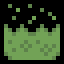Sea of flammable gas (SEA_ACID_GAS) [[toc](#SEA_ACID_GAS_CONTENTS)]

* **description**: Summons a large body of flammable gas below the caster
* **type**: ACTION_TYPE_MATERIAL
* **spawn_level**: [0, 4, 5, 6]
* **spawn_probability**: [0.3, 0.3, 0.3, 0.3]
* **price**: 200
* **mana**: 140
* **max_uses**: 3
* **never_unlimited**: false
* **spawn_manual_unlock**: false
* **recursive**: false
* **ai_never_uses**: false
* **is_dangerous_blast**: false
* **related_projectiles**: {"data/entities/projectiles/deck/sea_acid_gas.xml"}
* **spawn_requires_flag**: 
* **related_extra_entities**: 
* **action**:

```lua
 function()
      add_projectile("data/entities/projectiles/deck/sea_acid_gas.xml")
      c.fire_rate_wait = c.fire_rate_wait + 15
    end,
```


### <a id="SEA_ALCOHOL"></a>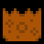Sea of alcohol (SEA_ALCOHOL) [[toc](#SEA_ALCOHOL_CONTENTS)]

* **description**: Summons a large body of tasty alcohol below the caster
* **type**: ACTION_TYPE_MATERIAL
* **spawn_level**: [0, 4, 5, 6]
* **spawn_probability**: [0.3, 0.3, 0.3, 0.3]
* **price**: 350
* **mana**: 140
* **max_uses**: 3
* **never_unlimited**: false
* **spawn_manual_unlock**: false
* **recursive**: false
* **ai_never_uses**: false
* **is_dangerous_blast**: false
* **related_projectiles**: {"data/entities/projectiles/deck/sea_alcohol.xml"}
* **spawn_requires_flag**: 
* **related_extra_entities**: 
* **action**:

```lua
 function()
      add_projectile("data/entities/projectiles/deck/sea_alcohol.xml")
      c.fire_rate_wait = c.fire_rate_wait + 15
    end,
```


### <a id="SEA_LAVA"></a>Sea of lava (SEA_LAVA) [[toc](#SEA_LAVA_CONTENTS)]

* **description**: Summons a large body of lava below the caster
* **type**: ACTION_TYPE_MATERIAL
* **spawn_level**: [0, 4, 5, 6]
* **spawn_probability**: [0.2, 0.2, 0.2, 0.2]
* **price**: 350
* **mana**: 140
* **max_uses**: 3
* **never_unlimited**: false
* **spawn_manual_unlock**: false
* **recursive**: false
* **ai_never_uses**: false
* **is_dangerous_blast**: false
* **related_projectiles**: {"data/entities/projectiles/deck/sea_lava.xml"}
* **spawn_requires_flag**: card_unlocked_sea_lava
* **related_extra_entities**: 
* **action**:

```lua
 function()
      add_projectile("data/entities/projectiles/deck/sea_lava.xml")
      c.fire_rate_wait = c.fire_rate_wait + 15
    end,
```


### <a id="SEA_OIL"></a>Sea of oil (SEA_OIL) [[toc](#SEA_OIL_CONTENTS)]

* **description**: Summons a large body of oil below the caster
* **type**: ACTION_TYPE_MATERIAL
* **spawn_level**: [0, 4, 5, 6]
* **spawn_probability**: [0.3, 0.3, 0.3, 0.3]
* **price**: 350
* **mana**: 140
* **max_uses**: 3
* **never_unlimited**: false
* **spawn_manual_unlock**: false
* **recursive**: false
* **ai_never_uses**: false
* **is_dangerous_blast**: false
* **related_projectiles**: {"data/entities/projectiles/deck/sea_oil.xml"}
* **spawn_requires_flag**: 
* **related_extra_entities**: 
* **action**:

```lua
 function()
      add_projectile("data/entities/projectiles/deck/sea_oil.xml")
      c.fire_rate_wait = c.fire_rate_wait + 15
    end,
```


### <a id="SEA_WATER"></a>Sea of water (SEA_WATER) [[toc](#SEA_WATER_CONTENTS)]

* **description**: Summons a large body of water below the caster
* **type**: ACTION_TYPE_MATERIAL
* **spawn_level**: [0, 4, 5, 6]
* **spawn_probability**: [0.4, 0.4, 0.4, 0.4]
* **price**: 350
* **mana**: 140
* **max_uses**: 3
* **never_unlimited**: false
* **spawn_manual_unlock**: false
* **recursive**: false
* **ai_never_uses**: false
* **is_dangerous_blast**: false
* **related_projectiles**: {"data/entities/projectiles/deck/sea_water.xml"}
* **spawn_requires_flag**: 
* **related_extra_entities**: 
* **action**:

```lua
 function()
      add_projectile("data/entities/projectiles/deck/sea_water.xml")
      c.fire_rate_wait = c.fire_rate_wait + 15
    end,
```


### <a id="SHIELD_FIELD"></a>Circle of shielding (SHIELD_FIELD) [[toc](#SHIELD_FIELD_CONTENTS)]

* **description**: A field of protective magic
* **type**: ACTION_TYPE_STATIC_PROJECTILE
* **spawn_level**: [2, 3, 4, 5, 6]
* **spawn_probability**: [0.3, 0.3, 0.3, 0.3, 0.3]
* **price**: 160
* **mana**: 20
* **max_uses**: 10
* **never_unlimited**: false
* **spawn_manual_unlock**: false
* **recursive**: false
* **ai_never_uses**: false
* **is_dangerous_blast**: false
* **related_projectiles**: {"data/entities/projectiles/deck/shield_field.xml"}
* **spawn_requires_flag**: 
* **related_extra_entities**: 
* **action**:

```lua
 function()
      add_projectile("data/entities/projectiles/deck/shield_field.xml")
      c.fire_rate_wait = c.fire_rate_wait + 15
    end,
```


### <a id="SIGMA"></a>Sigma (SIGMA) [[toc](#SIGMA_CONTENTS)]

* **description**: Copies every static projectile -type spell in the wand when cast
* **type**: ACTION_TYPE_OTHER
* **spawn_level**: [4, 5, 10]
* **spawn_probability**: [0.1, 0.1, 1.0]
* **price**: 500
* **mana**: 120
* **max_uses**: 0
* **never_unlimited**: false
* **spawn_manual_unlock**: false
* **recursive**: true
* **ai_never_uses**: false
* **is_dangerous_blast**: false
* **related_projectiles**: 
* **spawn_requires_flag**: card_unlocked_duplicate
* **related_extra_entities**: 
* **action**:

```lua
 function( recursion_level, iteration )
      c.fire_rate_wait = c.fire_rate_wait + 30
      
      local firerate = c.fire_rate_wait
      local reload = current_reload_time
      local mana_ = mana
      
      if ( discarded ~= nil ) then
        for i,data in ipairs( discarded ) do
          local rec = check_recursion( data, recursion_level )
          if ( data ~= nil ) and ( data.type == 1 ) and ( rec > -1 ) then
            dont_draw_actions = true
            data.action( rec )
            dont_draw_actions = false
          end
        end
      end
      
      if ( hand ~= nil ) then
        for i,data in ipairs( hand ) do
          local rec = check_recursion( data, recursion_level )
          if ( data ~= nil ) and ( data.type == 1 ) and ( rec > -1 ) then
            dont_draw_actions = true
            data.action( rec )
            dont_draw_actions = false
          end
        end
      end
      
      if ( deck ~= nil ) then
        for i,data in ipairs( deck ) do
          local rec = check_recursion( data, recursion_level )
          if ( data ~= nil ) and ( data.type == 1 ) and ( rec > -1 ) then
            dont_draw_actions = true
            data.action( rec )
            dont_draw_actions = false
          end
        end
      end
      
      c.fire_rate_wait = firerate
      current_reload_time = reload
      mana = mana_
      
      draw_actions( 1, true )
    end,
```


### <a id="SINEWAVE"></a>Slithering path (SINEWAVE) [[toc](#SINEWAVE_CONTENTS)]

* **description**: Makes a projectile move rapidly in a slithering manner, like a snake
* **type**: ACTION_TYPE_MODIFIER
* **spawn_level**: [2, 4, 6]
* **spawn_probability**: [0.4, 0.4, 0.4]
* **price**: 10
* **mana**: 0
* **max_uses**: 0
* **never_unlimited**: false
* **spawn_manual_unlock**: false
* **recursive**: false
* **ai_never_uses**: false
* **is_dangerous_blast**: false
* **related_projectiles**: 
* **spawn_requires_flag**: 
* **related_extra_entities**: { "data/entities/misc/sinewave.xml" }
* **action**:

```lua
 function()
      c.extra_entities = c.extra_entities .. "data/entities/misc/sinewave.xml,"
      c.speed_multiplier = c.speed_multiplier * 2
      
      if ( c.speed_multiplier >= 20 ) then
        c.speed_multiplier = math.min( c.speed_multiplier, 20 )
      elseif ( c.speed_multiplier < 0 ) then
        c.speed_multiplier = 0
      end
      
      draw_actions( 1, true )
    end,
```


### <a id="SLIMEBALL"></a>Slimeball (SLIMEBALL) [[toc](#SLIMEBALL_CONTENTS)]

* **description**: A dripping ball of poisonous slime
* **type**: ACTION_TYPE_PROJECTILE
* **spawn_level**: [0, 3, 4]
* **spawn_probability**: [1.0, 1.0, 1.0]
* **price**: 130
* **mana**: 20
* **max_uses**: 0
* **never_unlimited**: false
* **spawn_manual_unlock**: false
* **recursive**: false
* **ai_never_uses**: false
* **is_dangerous_blast**: false
* **related_projectiles**: {"data/entities/projectiles/deck/slime.xml"}
* **spawn_requires_flag**: 
* **related_extra_entities**: 
* **action**:

```lua
 function()
      add_projectile("data/entities/projectiles/deck/slime.xml")
      c.spread_degrees = c.spread_degrees + 4.0
      c.fire_rate_wait = c.fire_rate_wait + 10
      c.speed_multiplier = c.speed_multiplier * 1.1
      
      if ( c.speed_multiplier >= 20 ) then
        c.speed_multiplier = math.min( c.speed_multiplier, 20 )
      elseif ( c.speed_multiplier < 0 ) then
        c.speed_multiplier = 0
      end
    end,
```


### <a id="SLOW_BULLET"></a>Energy orb (SLOW_BULLET) [[toc](#SLOW_BULLET_CONTENTS)]

* **description**: A slow but powerful orb of energy
* **type**: ACTION_TYPE_PROJECTILE
* **spawn_level**: [1, 2, 3, 4]
* **spawn_probability**: [1.0, 1.0, 1.0, 1.0]
* **price**: 160
* **mana**: 30
* **max_uses**: 0
* **never_unlimited**: false
* **spawn_manual_unlock**: false
* **recursive**: false
* **ai_never_uses**: false
* **is_dangerous_blast**: false
* **related_projectiles**: {"data/entities/projectiles/deck/bullet_slow.xml"}
* **spawn_requires_flag**: 
* **related_extra_entities**: 
* **action**:

```lua
 function()
      add_projectile("data/entities/projectiles/deck/bullet_slow.xml")
      c.fire_rate_wait = c.fire_rate_wait + 6
      c.screenshake = c.screenshake + 2
      c.spread_degrees = c.spread_degrees + 3.6
      shot_effects.recoil_knockback = shot_effects.recoil_knockback + 20.0
    end,
```


### <a id="SLOW_BULLET_TIMER"></a>Energy orb with a timer (SLOW_BULLET_TIMER) [[toc](#SLOW_BULLET_TIMER_CONTENTS)]

* **description**: A slow but powerful orb of energy that casts another spell after a timer runs out
* **type**: ACTION_TYPE_PROJECTILE
* **spawn_level**: [1, 2, 3, 4, 5, 6]
* **spawn_probability**: [0.5, 0.5, 0.5, 0.5, 1.0, 1.0]
* **price**: 200
* **mana**: 50
* **max_uses**: 0
* **never_unlimited**: false
* **spawn_manual_unlock**: false
* **recursive**: false
* **ai_never_uses**: false
* **is_dangerous_blast**: false
* **related_projectiles**: {"data/entities/projectiles/deck/bullet_slow.xml"}
* **spawn_requires_flag**: 
* **related_extra_entities**: 
* **action**:

```lua
 function()
      c.fire_rate_wait = c.fire_rate_wait + 6
      c.screenshake = c.screenshake + 2
      c.spread_degrees = c.spread_degrees + 3.6
      add_projectile_trigger_timer("data/entities/projectiles/deck/bullet_slow.xml", 100, 1)
      shot_effects.recoil_knockback = shot_effects.recoil_knockback + 20.0
    end,
```


### <a id="SLOW_BULLET_TRIGGER"></a>Energy orb with a trigger (SLOW_BULLET_TRIGGER) [[toc](#SLOW_BULLET_TRIGGER_CONTENTS)]

* **description**: A slow but powerful orb of energy that casts another spell upon collision
* **type**: ACTION_TYPE_PROJECTILE
* **spawn_level**: [1, 2, 3, 4, 5]
* **spawn_probability**: [0.5, 0.5, 0.5, 0.5, 1.0]
* **price**: 200
* **mana**: 50
* **max_uses**: 0
* **never_unlimited**: false
* **spawn_manual_unlock**: false
* **recursive**: false
* **ai_never_uses**: false
* **is_dangerous_blast**: false
* **related_projectiles**: {"data/entities/projectiles/deck/bullet_slow.xml"}
* **spawn_requires_flag**: 
* **related_extra_entities**: 
* **action**:

```lua
 function()
      c.fire_rate_wait = c.fire_rate_wait + 25
      c.screenshake = c.screenshake + 2
      c.spread_degrees = c.spread_degrees + 10
      add_projectile_trigger_hit_world("data/entities/projectiles/deck/bullet_slow.xml", 1)
      shot_effects.recoil_knockback = shot_effects.recoil_knockback + 20.0
    end,
```


### <a id="SLOW_BUT_STEADY"></a>Slow But Steady (SLOW_BUT_STEADY) [[toc](#SLOW_BUT_STEADY_CONTENTS)]

* **description**: The reload time of the wand is set to exactly 1.5 seconds
* **type**: ACTION_TYPE_MODIFIER
* **spawn_level**: [3, 4, 5, 6, 10]
* **spawn_probability**: [0.1, 0.2, 0.3, 0.4, 0.4]
* **price**: 50
* **mana**: 0
* **max_uses**: 0
* **never_unlimited**: false
* **spawn_manual_unlock**: false
* **recursive**: false
* **ai_never_uses**: false
* **is_dangerous_blast**: false
* **related_projectiles**: 
* **spawn_requires_flag**: card_unlocked_maths
* **related_extra_entities**: 
* **action**:

```lua
 function()
      current_reload_time = 90
      shot_effects.recoil_knockback = shot_effects.recoil_knockback - 80.0
      draw_actions( 1, true )
    end,
```


### <a id="SOILBALL"></a>Chunk of soil (SOILBALL) [[toc](#SOILBALL_CONTENTS)]

* **description**: Don't soil yourself
* **type**: ACTION_TYPE_MATERIAL
* **spawn_level**: [1, 2, 3, 5]
* **spawn_probability**: [1.0, 1.0, 1.0, 1.0]
* **price**: 10
* **mana**: 5
* **max_uses**: 0
* **never_unlimited**: false
* **spawn_manual_unlock**: false
* **recursive**: false
* **ai_never_uses**: false
* **is_dangerous_blast**: false
* **related_projectiles**: {"data/entities/projectiles/chunk_of_soil.xml"}
* **spawn_requires_flag**: 
* **related_extra_entities**: 
* **action**:

```lua
 function()
      add_projectile("data/entities/projectiles/chunk_of_soil.xml")
    end,
```


### <a id="SPEED"></a>Speed Up (SPEED) [[toc](#SPEED_CONTENTS)]

* **description**: Increases the speed at which a projectile flies through the air
* **type**: ACTION_TYPE_MODIFIER
* **spawn_level**: [1, 2, 3]
* **spawn_probability**: [1.0, 0.5, 0.5]
* **price**: 100
* **mana**: 3
* **max_uses**: 0
* **never_unlimited**: false
* **spawn_manual_unlock**: false
* **recursive**: false
* **ai_never_uses**: false
* **is_dangerous_blast**: false
* **related_projectiles**: 
* **spawn_requires_flag**: 
* **related_extra_entities**: 
* **action**:

```lua
 function()
      c.speed_multiplier = c.speed_multiplier * 2.5
      
      if ( c.speed_multiplier >= 20 ) then
        c.speed_multiplier = math.min( c.speed_multiplier, 20 )
      elseif ( c.speed_multiplier < 0 ) then
        c.speed_multiplier = 0
      end
      
      draw_actions( 1, true )
    end,
```


### <a id="SPELLS_TO_POWER"></a>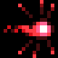Spells to Power (SPELLS_TO_POWER) [[toc](#SPELLS_TO_POWER_CONTENTS)]

* **description**: Converts any nearby projectiles cast by you into extra damage
* **type**: ACTION_TYPE_MODIFIER
* **spawn_level**: [2, 3, 4, 5, 6, 10]
* **spawn_probability**: [0.5, 0.5, 0.5, 0.5, 0.5, 0.1]
* **price**: 140
* **mana**: 110
* **max_uses**: 0
* **never_unlimited**: false
* **spawn_manual_unlock**: false
* **recursive**: false
* **ai_never_uses**: false
* **is_dangerous_blast**: false
* **related_projectiles**: 
* **spawn_requires_flag**: 
* **related_extra_entities**: { "data/entities/misc/spells_to_power.xml" }
* **action**:

```lua
 function()
      c.extra_entities = c.extra_entities .. "data/entities/misc/spells_to_power.xml,"
      c.fire_rate_wait    = c.fire_rate_wait + 40
      draw_actions( 1, true )
    end,
```


### <a id="SPIRALING_SHOT"></a>Spiral Arc (SPIRALING_SHOT) [[toc](#SPIRALING_SHOT_CONTENTS)]

* **description**: A projectile flies in a spiralling pattern
* **type**: ACTION_TYPE_MODIFIER
* **spawn_level**: [1, 2, 3, 4]
* **spawn_probability**: [0.2, 0.3, 0.4, 0.1]
* **price**: 30
* **mana**: 0
* **max_uses**: 0
* **never_unlimited**: false
* **spawn_manual_unlock**: false
* **recursive**: false
* **ai_never_uses**: false
* **is_dangerous_blast**: false
* **related_projectiles**: 
* **spawn_requires_flag**: 
* **related_extra_entities**: { "data/entities/misc/orbit_shot.xml" }
* **action**:

```lua
 function()
      c.extra_entities = c.extra_entities .. "data/entities/misc/orbit_shot.xml,"
      draw_actions( 1, true )
      c.damage_projectile_add = c.damage_projectile_add + 0.1
      c.fire_rate_wait    = c.fire_rate_wait - 6
      c.lifetime_add     = c.lifetime_add + 50
    end,
```


### <a id="SPIRAL_SHOT"></a>Spiral shot (SPIRAL_SHOT) [[toc](#SPIRAL_SHOT_CONTENTS)]

* **description**: A mystical whirlwind of magic sparks
* **type**: ACTION_TYPE_PROJECTILE
* **spawn_level**: [4, 5, 6]
* **spawn_probability**: [1.0, 1.0, 1.0]
* **price**: 190
* **mana**: 50
* **max_uses**: 15
* **never_unlimited**: false
* **spawn_manual_unlock**: false
* **recursive**: false
* **ai_never_uses**: false
* **is_dangerous_blast**: false
* **related_projectiles**: {"data/entities/projectiles/deck/spiral_shot.xml"}
* **spawn_requires_flag**: card_unlocked_spiral_shot
* **related_extra_entities**: 
* **action**:

```lua
 function()
      add_projectile("data/entities/projectiles/deck/spiral_shot.xml")
      c.fire_rate_wait = c.fire_rate_wait + 20
    end,
```


### <a id="SPITTER"></a>Spitter bolt (SPITTER) [[toc](#SPITTER_CONTENTS)]

* **description**: A short-lived magical bolt
* **type**: ACTION_TYPE_PROJECTILE
* **spawn_level**: [0, 1, 2, 3]
* **spawn_probability**: [1.0, 1.0, 1.0, 0.5]
* **price**: 110
* **mana**: 5
* **max_uses**: 0
* **never_unlimited**: false
* **spawn_manual_unlock**: false
* **recursive**: false
* **ai_never_uses**: false
* **is_dangerous_blast**: false
* **related_projectiles**: {"data/entities/projectiles/deck/spitter.xml"}
* **spawn_requires_flag**: 
* **related_extra_entities**: 
* **action**:

```lua
 function()
      add_projectile("data/entities/projectiles/deck/spitter.xml")
      c.fire_rate_wait = c.fire_rate_wait - 1
      c.screenshake = c.screenshake + 0.1
      c.dampening = 0.1
      c.spread_degrees = c.spread_degrees + 6.0
    end,
```


### <a id="SPITTER_TIER_2"></a>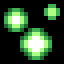Large spitter bolt (SPITTER_TIER_2) [[toc](#SPITTER_TIER_2_CONTENTS)]

* **description**: A more powerful version of Spitter Bolt
* **type**: ACTION_TYPE_PROJECTILE
* **spawn_level**: [2, 3, 4, 5]
* **spawn_probability**: [1.0, 1.0, 1.0, 0.5]
* **price**: 190
* **mana**: 25
* **max_uses**: 0
* **never_unlimited**: false
* **spawn_manual_unlock**: false
* **recursive**: false
* **ai_never_uses**: false
* **is_dangerous_blast**: false
* **related_projectiles**: {"data/entities/projectiles/deck/spitter_tier_2.xml"}
* **spawn_requires_flag**: 
* **related_extra_entities**: 
* **action**:

```lua
 function()
      add_projectile("data/entities/projectiles/deck/spitter_tier_2.xml")
      c.fire_rate_wait = c.fire_rate_wait - 2
      c.screenshake = c.screenshake + 1.1
      c.dampening = 0.2
      c.spread_degrees = c.spread_degrees + 7.5
    end,
```


### <a id="SPITTER_TIER_2_TIMER"></a>Large spitter bolt with timer (SPITTER_TIER_2_TIMER) [[toc](#SPITTER_TIER_2_TIMER_CONTENTS)]

* **description**: A more powerful version of Spitter Bolt that casts another spell after a timer runs out
* **type**: ACTION_TYPE_PROJECTILE
* **spawn_level**: [2, 3, 4, 5]
* **spawn_probability**: [0.5, 0.5, 0.5, 1.0]
* **price**: 220
* **mana**: 30
* **max_uses**: 0
* **never_unlimited**: false
* **spawn_manual_unlock**: false
* **recursive**: false
* **ai_never_uses**: false
* **is_dangerous_blast**: false
* **related_projectiles**: {"data/entities/projectiles/deck/spitter_tier_2.xml"}
* **spawn_requires_flag**: 
* **related_extra_entities**: 
* **action**:

```lua
 function()
      add_projectile_trigger_timer("data/entities/projectiles/deck/spitter_tier_2.xml", 40, 1)
      c.fire_rate_wait = c.fire_rate_wait - 2
      c.screenshake = c.screenshake + 1.1
      c.dampening = 0.2
      c.spread_degrees = c.spread_degrees + 7.5
    end,
```


### <a id="SPITTER_TIER_3"></a>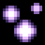Giant spitter bolt (SPITTER_TIER_3) [[toc](#SPITTER_TIER_3_CONTENTS)]

* **description**: The most powerful version of Spitter Bolt
* **type**: ACTION_TYPE_PROJECTILE
* **spawn_level**: [3, 4, 5, 6]
* **spawn_probability**: [0.8, 0.8, 1.0, 1.0]
* **price**: 240
* **mana**: 40
* **max_uses**: 0
* **never_unlimited**: false
* **spawn_manual_unlock**: false
* **recursive**: false
* **ai_never_uses**: false
* **is_dangerous_blast**: false
* **related_projectiles**: {"data/entities/projectiles/deck/spitter_tier_3.xml"}
* **spawn_requires_flag**: 
* **related_extra_entities**: 
* **action**:

```lua
 function()
      add_projectile("data/entities/projectiles/deck/spitter_tier_3.xml")
      c.fire_rate_wait = c.fire_rate_wait - 4
      c.screenshake = c.screenshake + 3.1
      c.dampening = 0.3
      c.spread_degrees = c.spread_degrees + 9.0
    end,
```


### <a id="SPITTER_TIER_3_TIMER"></a>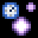Giant spitter bolt with timer (SPITTER_TIER_3_TIMER) [[toc](#SPITTER_TIER_3_TIMER_CONTENTS)]

* **description**: The most powerful version of Spitter Bolt that casts another spell after a timer runs out
* **type**: ACTION_TYPE_PROJECTILE
* **spawn_level**: [4, 5, 6]
* **spawn_probability**: [0.5, 0.5, 0.5]
* **price**: 260
* **mana**: 45
* **max_uses**: 0
* **never_unlimited**: false
* **spawn_manual_unlock**: false
* **recursive**: false
* **ai_never_uses**: false
* **is_dangerous_blast**: false
* **related_projectiles**: {"data/entities/projectiles/deck/spitter_tier_3.xml"}
* **spawn_requires_flag**: 
* **related_extra_entities**: 
* **action**:

```lua
 function()
      add_projectile_trigger_timer("data/entities/projectiles/deck/spitter_tier_3.xml", 40, 1)
      c.fire_rate_wait = c.fire_rate_wait - 4
      c.screenshake = c.screenshake + 3.1
      c.dampening = 0.3
      c.spread_degrees = c.spread_degrees + 9.0
    end,
```


### <a id="SPITTER_TIMER"></a>Spitter bolt with timer (SPITTER_TIMER) [[toc](#SPITTER_TIMER_CONTENTS)]

* **description**: A short-lived magical bolt that casts another spell after a timer runs out
* **type**: ACTION_TYPE_PROJECTILE
* **spawn_level**: [0, 1, 2, 3]
* **spawn_probability**: [0.5, 0.5, 0.5, 1.0]
* **price**: 140
* **mana**: 10
* **max_uses**: 0
* **never_unlimited**: false
* **spawn_manual_unlock**: false
* **recursive**: false
* **ai_never_uses**: false
* **is_dangerous_blast**: false
* **related_projectiles**: {"data/entities/projectiles/deck/spitter.xml"}
* **spawn_requires_flag**: 
* **related_extra_entities**: 
* **action**:

```lua
 function()
      c.fire_rate_wait = c.fire_rate_wait - 1
      c.screenshake = c.screenshake + 0.1
      c.dampening = 0.1
      c.spread_degrees = c.spread_degrees + 6.0
      add_projectile_trigger_timer("data/entities/projectiles/deck/spitter.xml", 40, 1)
    end,
```


### <a id="SPORE_POD"></a>Prickly Spore Pod (SPORE_POD) [[toc](#SPORE_POD_CONTENTS)]

* **description**: Summons a spore pod that attaches to a surface and then grows and explodes into spikes
* **type**: ACTION_TYPE_PROJECTILE
* **spawn_level**: [1, 2, 3, 4, 5]
* **spawn_probability**: [0.8, 0.8, 0.8, 0.8, 0.8]
* **price**: 200
* **mana**: 20
* **max_uses**: 0
* **never_unlimited**: false
* **spawn_manual_unlock**: false
* **recursive**: false
* **ai_never_uses**: false
* **is_dangerous_blast**: false
* **related_projectiles**: {"data/entities/projectiles/deck/spore_pod.xml"}
* **spawn_requires_flag**: 
* **related_extra_entities**: 
* **action**:

```lua
 function()
      add_projectile("data/entities/projectiles/deck/spore_pod.xml")
      c.fire_rate_wait = c.fire_rate_wait + 40
      shot_effects.recoil_knockback = shot_effects.recoil_knockback + 30.0
    end,
```


### <a id="SPREAD_REDUCE"></a>Reduce spread (SPREAD_REDUCE) [[toc](#SPREAD_REDUCE_CONTENTS)]

* **description**: Reduces the spread of a spell
* **type**: ACTION_TYPE_MODIFIER
* **spawn_level**: [1, 2, 3, 4, 5, 6]
* **spawn_probability**: [0.8, 0.8, 0.8, 0.8, 0.8, 0.8]
* **price**: 100
* **mana**: 1
* **max_uses**: 0
* **never_unlimited**: false
* **spawn_manual_unlock**: false
* **recursive**: false
* **ai_never_uses**: false
* **is_dangerous_blast**: false
* **related_projectiles**: 
* **spawn_requires_flag**: 
* **related_extra_entities**: 
* **action**:

```lua
 function()
      c.spread_degrees = c.spread_degrees - 60.0
      draw_actions( 1, true )
    end,
```


### <a id="STATIC_TO_SAND"></a>Ground to sand (STATIC_TO_SAND) [[toc](#STATIC_TO_SAND_CONTENTS)]

* **description**: Makes any hard, solid materials within a projectile's range turn into sand
* **type**: ACTION_TYPE_MODIFIER
* **spawn_level**: [2, 3, 4]
* **spawn_probability**: [0.3, 0.3, 0.3]
* **price**: 140
* **mana**: 70
* **max_uses**: 8
* **never_unlimited**: false
* **spawn_manual_unlock**: false
* **recursive**: false
* **ai_never_uses**: false
* **is_dangerous_blast**: false
* **related_projectiles**: 
* **spawn_requires_flag**: 
* **related_extra_entities**: { "data/entities/misc/static_to_sand.xml", "data/entities/particles/tinyspark_yellow.xml" }
* **action**:

```lua
 function()
      c.extra_entities = c.extra_entities .. "data/entities/misc/static_to_sand.xml,data/entities/particles/tinyspark_yellow.xml,"
      c.fire_rate_wait = c.fire_rate_wait + 60
      draw_actions( 1, true )
    end,
```


### <a id="SUMMON_EGG"></a>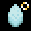Summon egg (SUMMON_EGG) [[toc](#SUMMON_EGG_CONTENTS)]

* **description**: Summons an egg that houses a friendly creature
* **type**: ACTION_TYPE_PROJECTILE
* **spawn_level**: [0, 1, 2, 3, 4, 5, 6]
* **spawn_probability**: [0.8, 0.8, 0.8, 0.8, 0.8, 0.8, 0.8]
* **price**: 220
* **mana**: 100
* **max_uses**: 2
* **never_unlimited**: false
* **spawn_manual_unlock**: false
* **recursive**: false
* **ai_never_uses**: false
* **is_dangerous_blast**: false
* **related_projectiles**: {"data/entities/items/pickup/egg_monster.xml"}
* **spawn_requires_flag**: 
* **related_extra_entities**: 
* **action**:

```lua
 function()
      SetRandomSeed( GameGetFrameNum(), GameGetFrameNum() )
      local types = {"monster","slime","red","fire"}
      local rnd = Random(1, #types)
      local egg_name = "egg_" .. tostring(types[rnd]) .. ".xml"
      add_projectile("data/entities/items/pickup/" .. egg_name)
    end,
```


### <a id="SUMMON_HOLLOW_EGG"></a>Summon hollow egg (SUMMON_HOLLOW_EGG) [[toc](#SUMMON_HOLLOW_EGG_CONTENTS)]

* **description**: Summons an otherwise empty egg that casts a spell upon cracking open
* **type**: ACTION_TYPE_PROJECTILE
* **spawn_level**: [0, 1, 2, 3, 4, 5, 6]
* **spawn_probability**: [0.8, 0.8, 0.8, 0.8, 0.8, 0.8, 0.8]
* **price**: 140
* **mana**: 30
* **max_uses**: 0
* **never_unlimited**: false
* **spawn_manual_unlock**: false
* **recursive**: false
* **ai_never_uses**: false
* **is_dangerous_blast**: false
* **related_projectiles**: {"data/entities/items/pickup/egg_hollow.xml"}
* **spawn_requires_flag**: 
* **related_extra_entities**: 
* **action**:

```lua
 function()
      add_projectile_trigger_death("data/entities/items/pickup/egg_hollow.xml", 1)
      c.fire_rate_wait = c.fire_rate_wait - 12
    end,
```


### <a id="SUMMON_PORTAL"></a>Summon portal (SUMMON_PORTAL) [[toc](#SUMMON_PORTAL_CONTENTS)]

* **description**: Summons a strange portal
* **type**: ACTION_TYPE_OTHER
* **spawn_level**: [10]
* **spawn_probability**: [0.0]
* **price**: 100
* **mana**: 50
* **max_uses**: 7
* **never_unlimited**: false
* **spawn_manual_unlock**: false
* **recursive**: false
* **ai_never_uses**: false
* **is_dangerous_blast**: false
* **related_projectiles**: 
* **spawn_requires_flag**: 
* **related_extra_entities**: 
* **action**:

```lua
 function()
      add_projectile("data/entities/projectiles/deck/summon_portal.xml")
      c.fire_rate_wait = c.fire_rate_wait + 80
    end,
```


### <a id="SUMMON_ROCK"></a>Rock (SUMMON_ROCK) [[toc](#SUMMON_ROCK_CONTENTS)]

* **description**: Create a mighty rock out of thin air
* **type**: ACTION_TYPE_PROJECTILE
* **spawn_level**: [0, 1, 2, 3, 4, 5, 6]
* **spawn_probability**: [0.8, 0.8, 0.8, 0.8, 0.8, 0.8, 0.8]
* **price**: 160
* **mana**: 100
* **max_uses**: 3
* **never_unlimited**: false
* **spawn_manual_unlock**: false
* **recursive**: false
* **ai_never_uses**: false
* **is_dangerous_blast**: false
* **related_projectiles**: {"data/entities/projectiles/deck/rock.xml"}
* **spawn_requires_flag**: 
* **related_extra_entities**: 
* **action**:

```lua
 function()
      add_projectile("data/entities/projectiles/deck/rock.xml")
    end,
```


### <a id="SUMMON_WANDGHOST"></a>Summon Taikasauva (SUMMON_WANDGHOST) [[toc](#SUMMON_WANDGHOST_CONTENTS)]

* **description**: Summons a possessed wand to aid you
* **type**: ACTION_TYPE_UTILITY
* **spawn_level**: [2, 4, 5, 6, 10]
* **spawn_probability**: [0.08, 0.1, 0.1, 0.1, 0.1]
* **price**: 420
* **mana**: 300
* **max_uses**: 1
* **never_unlimited**: true
* **spawn_manual_unlock**: false
* **recursive**: false
* **ai_never_uses**: false
* **is_dangerous_blast**: false
* **related_projectiles**: {"data/entities/projectiles/deck/wand_ghost_player.xml"}
* **spawn_requires_flag**: 
* **related_extra_entities**: 
* **action**:

```lua
 function()
      add_projectile("data/entities/projectiles/deck/wand_ghost_player.xml")
      add_projectile("data/entities/particles/image_emitters/wand_effect.xml")
    end,
```


### <a id="SUPER_TELEPORT_CAST"></a>Warp cast (SUPER_TELEPORT_CAST) [[toc](#SUPER_TELEPORT_CAST_CONTENTS)]

* **description**: Makes a spell immediately jump a long distance, stopped by walls
* **type**: ACTION_TYPE_UTILITY
* **spawn_level**: [0, 1, 2, 4, 5, 6]
* **spawn_probability**: [0.2, 0.2, 0.2, 0.6, 0.6, 0.6]
* **price**: 160
* **mana**: 20
* **max_uses**: 0
* **never_unlimited**: false
* **spawn_manual_unlock**: false
* **recursive**: false
* **ai_never_uses**: false
* **is_dangerous_blast**: false
* **related_projectiles**: {"data/entities/projectiles/deck/super_teleport_cast.xml"}
* **spawn_requires_flag**: 
* **related_extra_entities**: 
* **action**:

```lua
 function()
      add_projectile_trigger_death("data/entities/projectiles/deck/super_teleport_cast.xml", 1)
      c.fire_rate_wait = c.fire_rate_wait + 10
      c.spread_degrees = c.spread_degrees - 6
    end,
```


### <a id="SWAPPER_PROJECTILE"></a>Swapper (SWAPPER_PROJECTILE) [[toc](#SWAPPER_PROJECTILE_CONTENTS)]

* **description**: It was theorized that the source of qualia would be transferred But it turns out it was the whole body all along.
* **type**: ACTION_TYPE_PROJECTILE
* **spawn_level**: [0, 1, 2, 4, 5, 6]
* **spawn_probability**: [0.05, 0.05, 0.05, 0.05, 0.05, 0.05]
* **price**: 100
* **mana**: 5
* **max_uses**: 0
* **never_unlimited**: false
* **spawn_manual_unlock**: false
* **recursive**: false
* **ai_never_uses**: false
* **is_dangerous_blast**: false
* **related_projectiles**: {"data/entities/projectiles/deck/swapper.xml"}
* **spawn_requires_flag**: 
* **related_extra_entities**: 
* **action**:

```lua
 function()
      add_projectile("data/entities/projectiles/deck/swapper.xml")
      c.fire_rate_wait = c.fire_rate_wait + 3
      c.screenshake = c.screenshake + 0.5
      c.spread_degrees = c.spread_degrees - 2.0
      c.damage_critical_chance = c.damage_critical_chance + 5
    end,
```


### <a id="SWARM_FIREBUG"></a>Summon Firebug swarm (SWARM_FIREBUG) [[toc](#SWARM_FIREBUG_CONTENTS)]

* **description**: Summons four fire bugs to aid you in battle
* **type**: ACTION_TYPE_STATIC_PROJECTILE
* **spawn_level**: [2, 4, 5, 6]
* **spawn_probability**: [0.2, 0.2, 0.5, 0.5]
* **price**: 100
* **mana**: 80
* **max_uses**: 0
* **never_unlimited**: false
* **spawn_manual_unlock**: false
* **recursive**: false
* **ai_never_uses**: false
* **is_dangerous_blast**: false
* **related_projectiles**: {"data/entities/projectiles/deck/swarm_firebug.xml",4}
* **spawn_requires_flag**: 
* **related_extra_entities**: 
* **action**:

```lua
 function()
      add_projectile("data/entities/projectiles/deck/swarm_firebug.xml")
      add_projectile("data/entities/projectiles/deck/swarm_firebug.xml")
      add_projectile("data/entities/projectiles/deck/swarm_firebug.xml")
      add_projectile("data/entities/projectiles/deck/swarm_firebug.xml")
      c.spread_degrees = c.spread_degrees + 12.0
      c.fire_rate_wait = c.fire_rate_wait + 60
      current_reload_time = current_reload_time + 20
    end,
```


### <a id="SWARM_FLY"></a>Summon fly swarm (SWARM_FLY) [[toc](#SWARM_FLY_CONTENTS)]

* **description**: Summons five flies to aid you in battle
* **type**: ACTION_TYPE_STATIC_PROJECTILE
* **spawn_level**: [2, 4, 5, 6]
* **spawn_probability**: [0.2, 0.2, 0.5, 0.5]
* **price**: 90
* **mana**: 70
* **max_uses**: 0
* **never_unlimited**: false
* **spawn_manual_unlock**: false
* **recursive**: false
* **ai_never_uses**: false
* **is_dangerous_blast**: false
* **related_projectiles**: {"data/entities/projectiles/deck/swarm_fly.xml",5}
* **spawn_requires_flag**: 
* **related_extra_entities**: 
* **action**:

```lua
 function()
      add_projectile("data/entities/projectiles/deck/swarm_fly.xml")
      add_projectile("data/entities/projectiles/deck/swarm_fly.xml")
      add_projectile("data/entities/projectiles/deck/swarm_fly.xml")
      add_projectile("data/entities/projectiles/deck/swarm_fly.xml")
      add_projectile("data/entities/projectiles/deck/swarm_fly.xml")
      c.spread_degrees = c.spread_degrees + 6.0
      c.fire_rate_wait = c.fire_rate_wait + 60
      current_reload_time = current_reload_time + 20
    end,
```


### <a id="SWARM_WASP"></a>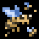Summon Wasp swarm (SWARM_WASP) [[toc](#SWARM_WASP_CONTENTS)]

* **description**: Summon six wasps to aid you in battle
* **type**: ACTION_TYPE_STATIC_PROJECTILE
* **spawn_level**: [2, 4, 5, 6]
* **spawn_probability**: [0.2, 0.2, 0.5, 0.5]
* **price**: 120
* **mana**: 90
* **max_uses**: 0
* **never_unlimited**: false
* **spawn_manual_unlock**: false
* **recursive**: false
* **ai_never_uses**: false
* **is_dangerous_blast**: false
* **related_projectiles**: {"data/entities/projectiles/deck/swarm_wasp.xml",6}
* **spawn_requires_flag**: 
* **related_extra_entities**: 
* **action**:

```lua
 function()
      add_projectile("data/entities/projectiles/deck/swarm_wasp.xml")
      add_projectile("data/entities/projectiles/deck/swarm_wasp.xml")
      add_projectile("data/entities/projectiles/deck/swarm_wasp.xml")
      add_projectile("data/entities/projectiles/deck/swarm_wasp.xml")
      add_projectile("data/entities/projectiles/deck/swarm_wasp.xml")
      add_projectile("data/entities/projectiles/deck/swarm_wasp.xml")
      c.spread_degrees = c.spread_degrees + 24.0
      c.fire_rate_wait = c.fire_rate_wait + 60
      current_reload_time = current_reload_time + 20
    end,
```


### <a id="TAU"></a>Tau (TAU) [[toc](#TAU_CONTENTS)]

* **description**: Copies the two following spells in the wand when cast
* **type**: ACTION_TYPE_OTHER
* **spawn_level**: [5, 6, 10]
* **spawn_probability**: [0.1, 0.1, 1.0]
* **price**: 200
* **mana**: 80
* **max_uses**: 0
* **never_unlimited**: false
* **spawn_manual_unlock**: false
* **recursive**: true
* **ai_never_uses**: false
* **is_dangerous_blast**: false
* **related_projectiles**: 
* **spawn_requires_flag**: card_unlocked_duplicate
* **related_extra_entities**: 
* **action**:

```lua
 function( recursion_level, iteration )
      c.fire_rate_wait = c.fire_rate_wait + 35
      
      local data1 = {}
      local data2 = {}
      
      local s1 = ""
      local s2 = ""
      
      if ( #deck > 0 ) then
        s1 = "deck"
        data1 = deck[1]
      else
        data1 = nil
      end
      
      if ( #deck > 0 ) then
        s2 = "deck 2"
        data2 = deck[2]
      else
        data2 = nil
      end
      
      local rec1 = check_recursion( data1, recursion_level )
      local rec2 = check_recursion( data2, recursion_level )
      
      if ( data1 ~= nil ) and ( rec1 > -1 ) then
        data1.action( rec1 )
      end
      
      if ( data2 ~= nil ) and ( rec2 > -1 ) then
        data2.action( rec2 )
      end
      
    end,
```


### <a id="TELEPORTATION_FIELD"></a>Circle of displacement (TELEPORTATION_FIELD) [[toc](#TELEPORTATION_FIELD_CONTENTS)]

* **description**: A field of teleportative magic
* **type**: ACTION_TYPE_STATIC_PROJECTILE
* **spawn_level**: [0, 1, 2, 3, 4, 5]
* **spawn_probability**: [0.3, 0.6, 0.3, 0.3, 0.6, 0.3]
* **price**: 150
* **mana**: 30
* **max_uses**: 15
* **never_unlimited**: false
* **spawn_manual_unlock**: false
* **recursive**: false
* **ai_never_uses**: false
* **is_dangerous_blast**: false
* **related_projectiles**: {"data/entities/projectiles/deck/teleportation_field.xml"}
* **spawn_requires_flag**: 
* **related_extra_entities**: 
* **action**:

```lua
 function()
      add_projectile("data/entities/projectiles/deck/teleportation_field.xml")
      c.fire_rate_wait = c.fire_rate_wait + 15
    end,
```


### <a id="TELEPORT_CAST"></a>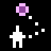Teleporting cast (TELEPORT_CAST) [[toc](#TELEPORT_CAST_CONTENTS)]

* **description**: Casts a spell from the closest enemy
* **type**: ACTION_TYPE_UTILITY
* **spawn_level**: [0, 1, 2, 4, 5, 6]
* **spawn_probability**: [0.6, 0.6, 0.6, 0.6, 0.6, 0.6]
* **price**: 190
* **mana**: 100
* **max_uses**: 0
* **never_unlimited**: false
* **spawn_manual_unlock**: false
* **recursive**: false
* **ai_never_uses**: false
* **is_dangerous_blast**: false
* **related_projectiles**: {"data/entities/projectiles/deck/teleport_cast.xml"}
* **spawn_requires_flag**: 
* **related_extra_entities**: 
* **action**:

```lua
 function()
      add_projectile_trigger_death("data/entities/projectiles/deck/teleport_cast.xml", 1)
      c.fire_rate_wait = c.fire_rate_wait + 20
      c.spread_degrees = c.spread_degrees + 24
    end,
```


### <a id="TELEPORT_PROJECTILE"></a>Teleport bolt (TELEPORT_PROJECTILE) [[toc](#TELEPORT_PROJECTILE_CONTENTS)]

* **description**: A magical bolt that moves you wherever it ends up flying
* **type**: ACTION_TYPE_PROJECTILE
* **spawn_level**: [0, 1, 2, 4, 5, 6]
* **spawn_probability**: [0.6, 0.6, 0.6, 0.4, 0.4, 0.4]
* **price**: 130
* **mana**: 40
* **max_uses**: 0
* **never_unlimited**: false
* **spawn_manual_unlock**: false
* **recursive**: false
* **ai_never_uses**: false
* **is_dangerous_blast**: false
* **related_projectiles**: {"data/entities/projectiles/deck/teleport_projectile.xml"}
* **spawn_requires_flag**: 
* **related_extra_entities**: 
* **action**:

```lua
 function()
      add_projectile("data/entities/projectiles/deck/teleport_projectile.xml")
      c.fire_rate_wait = c.fire_rate_wait + 3
      c.spread_degrees = c.spread_degrees - 2.0
    end,
```


### <a id="TELEPORT_PROJECTILE_CLOSER"></a>Homebringer Teleport Bolt (TELEPORT_PROJECTILE_CLOSER) [[toc](#TELEPORT_PROJECTILE_CLOSER_CONTENTS)]

* **description**: Brings the target hit closer to you
* **type**: ACTION_TYPE_PROJECTILE
* **spawn_level**: [0, 1, 2, 4, 5, 6]
* **spawn_probability**: [0.6, 0.6, 0.6, 0.4, 0.4, 0.4]
* **price**: 130
* **mana**: 20
* **max_uses**: 0
* **never_unlimited**: false
* **spawn_manual_unlock**: false
* **recursive**: false
* **ai_never_uses**: false
* **is_dangerous_blast**: false
* **related_projectiles**: {"data/entities/projectiles/deck/teleport_projectile_closer.xml"}
* **spawn_requires_flag**: 
* **related_extra_entities**: 
* **action**:

```lua
 function()
      add_projectile("data/entities/projectiles/deck/teleport_projectile_closer.xml")
      c.spread_degrees = c.spread_degrees - 2.0
    end,
```


### <a id="TELEPORT_PROJECTILE_SHORT"></a>Small Teleport Bolt (TELEPORT_PROJECTILE_SHORT) [[toc](#TELEPORT_PROJECTILE_SHORT_CONTENTS)]

* **description**: A shortlived magical bolt that moves you wherever it ends up flying
* **type**: ACTION_TYPE_PROJECTILE
* **spawn_level**: [0, 1, 2, 4, 5, 6]
* **spawn_probability**: [0.6, 0.6, 0.6, 0.4, 0.4, 0.4]
* **price**: 130
* **mana**: 20
* **max_uses**: 0
* **never_unlimited**: false
* **spawn_manual_unlock**: false
* **recursive**: false
* **ai_never_uses**: false
* **is_dangerous_blast**: false
* **related_projectiles**: {"data/entities/projectiles/deck/teleport_projectile_short.xml"}
* **spawn_requires_flag**: 
* **related_extra_entities**: 
* **action**:

```lua
 function()
      add_projectile("data/entities/projectiles/deck/teleport_projectile_short.xml")
      c.spread_degrees = c.spread_degrees - 2.0
    end,
```


### <a id="TELEPORT_PROJECTILE_STATIC"></a>Return (TELEPORT_PROJECTILE_STATIC) [[toc](#TELEPORT_PROJECTILE_STATIC_CONTENTS)]

* **description**: After a period of time, you'll be returned to where you cast this spell
* **type**: ACTION_TYPE_PROJECTILE
* **spawn_level**: [0, 1, 2, 4, 5, 6]
* **spawn_probability**: [0.6, 0.6, 0.6, 0.4, 0.4, 0.4]
* **price**: 90
* **mana**: 40
* **max_uses**: 0
* **never_unlimited**: false
* **spawn_manual_unlock**: false
* **recursive**: false
* **ai_never_uses**: false
* **is_dangerous_blast**: false
* **related_projectiles**: {"data/entities/projectiles/deck/teleport_projectile_static.xml"}
* **spawn_requires_flag**: 
* **related_extra_entities**: 
* **action**:

```lua
 function()
      add_projectile("data/entities/projectiles/deck/teleport_projectile_static.xml")
      c.fire_rate_wait = c.fire_rate_wait + 3
      c.spread_degrees = c.spread_degrees - 2.0
    end,
```


### <a id="TEMPORARY_PLATFORM"></a>Summon Platform (TEMPORARY_PLATFORM) [[toc](#TEMPORARY_PLATFORM_CONTENTS)]

* **description**: Summons a shortlived bit of ground
* **type**: ACTION_TYPE_UTILITY
* **spawn_level**: [0, 1, 2, 4, 5, 6]
* **spawn_probability**: [0.1, 0.1, 0.3, 0.4, 0.2, 0.1]
* **price**: 90
* **mana**: 30
* **max_uses**: 20
* **never_unlimited**: false
* **spawn_manual_unlock**: false
* **recursive**: false
* **ai_never_uses**: false
* **is_dangerous_blast**: false
* **related_projectiles**: {"data/entities/projectiles/deck/temporary_platform.xml"}
* **spawn_requires_flag**: 
* **related_extra_entities**: 
* **action**:

```lua
 function()
      add_projectile("data/entities/projectiles/deck/temporary_platform.xml")
      c.fire_rate_wait = c.fire_rate_wait + 40
    end,
```


### <a id="TEMPORARY_WALL"></a>Summon Wall (TEMPORARY_WALL) [[toc](#TEMPORARY_WALL_CONTENTS)]

* **description**: Summons a shortlived obstacle
* **type**: ACTION_TYPE_UTILITY
* **spawn_level**: [0, 1, 2, 4, 5, 6]
* **spawn_probability**: [0.1, 0.1, 0.3, 0.4, 0.2, 0.1]
* **price**: 100
* **mana**: 40
* **max_uses**: 20
* **never_unlimited**: false
* **spawn_manual_unlock**: false
* **recursive**: false
* **ai_never_uses**: false
* **is_dangerous_blast**: false
* **related_projectiles**: {"data/entities/projectiles/deck/temporary_wall.xml"}
* **spawn_requires_flag**: 
* **related_extra_entities**: 
* **action**:

```lua
 function()
      add_projectile("data/entities/projectiles/deck/temporary_wall.xml")
      c.fire_rate_wait = c.fire_rate_wait + 40
    end,
```


### <a id="TENTACLE"></a>Summon Tentacle (TENTACLE) [[toc](#TENTACLE_CONTENTS)]

* **description**: Calls a terrifying appendage from another dimension
* **type**: ACTION_TYPE_PROJECTILE
* **spawn_level**: [3, 4, 5, 6]
* **spawn_probability**: [1.0, 1.0, 1.0, 1.0]
* **price**: 200
* **mana**: 20
* **max_uses**: 0
* **never_unlimited**: false
* **spawn_manual_unlock**: false
* **recursive**: false
* **ai_never_uses**: false
* **is_dangerous_blast**: false
* **related_projectiles**: {"data/entities/projectiles/deck/tentacle.xml"}
* **spawn_requires_flag**: card_unlocked_tentacle
* **related_extra_entities**: 
* **action**:

```lua
 function()
      add_projectile("data/entities/projectiles/deck/tentacle.xml")
      c.fire_rate_wait = c.fire_rate_wait + 40
    end,
```


### <a id="TENTACLE_PORTAL"></a>Eldritch portal (TENTACLE_PORTAL) [[toc](#TENTACLE_PORTAL_CONTENTS)]

* **description**: Summons a one-way portal to a sinister realm
* **type**: ACTION_TYPE_PROJECTILE
* **spawn_level**: [1, 2, 3, 4, 10]
* **spawn_probability**: [0.4, 0.4, 0.4, 0.4, 0.2]
* **price**: 220
* **mana**: 140
* **max_uses**: 5
* **never_unlimited**: false
* **spawn_manual_unlock**: false
* **recursive**: false
* **ai_never_uses**: false
* **is_dangerous_blast**: false
* **related_projectiles**: {"data/entities/projectiles/deck/tentacle_portal.xml"}
* **spawn_requires_flag**: 
* **related_extra_entities**: 
* **action**:

```lua
 function()
      add_projectile("data/entities/projectiles/deck/tentacle_portal.xml")
      c.fire_rate_wait = c.fire_rate_wait + 30
    end,
```


### <a id="TENTACLE_RAY"></a>Tentacler (TENTACLE_RAY) [[toc](#TENTACLE_RAY_CONTENTS)]

* **description**: Makes a projectile cast tentacles in random directions
* **type**: ACTION_TYPE_MODIFIER
* **spawn_level**: [1, 2, 3, 4, 5]
* **spawn_probability**: [0.0, 0.0, 0.4, 0.4, 0.4]
* **price**: 150
* **mana**: 110
* **max_uses**: 16
* **never_unlimited**: false
* **spawn_manual_unlock**: false
* **recursive**: false
* **ai_never_uses**: false
* **is_dangerous_blast**: false
* **related_projectiles**: 
* **spawn_requires_flag**: 
* **related_extra_entities**: { "data/entities/misc/tentacle_ray.xml" }
* **action**:

```lua
 function()
      c.extra_entities = c.extra_entities .. "data/entities/misc/tentacle_ray.xml,"
      draw_actions( 1, true )
    end,
```


### <a id="TENTACLE_RAY_ENEMY"></a>Personal tentacler (TENTACLE_RAY_ENEMY) [[toc](#TENTACLE_RAY_ENEMY_CONTENTS)]

* **description**: Makes creatures hit by a projectile grow tentacles in a chaotic manner
* **type**: ACTION_TYPE_MODIFIER
* **spawn_level**: [1, 2, 3, 4, 5]
* **spawn_probability**: [0.0, 0.0, 0.4, 0.4, 0.4]
* **price**: 150
* **mana**: 90
* **max_uses**: 20
* **never_unlimited**: false
* **spawn_manual_unlock**: false
* **recursive**: false
* **ai_never_uses**: false
* **is_dangerous_blast**: false
* **related_projectiles**: 
* **spawn_requires_flag**: 
* **related_extra_entities**: { "data/entities/misc/hitfx_tentacle_ray_enemy.xml" }
* **action**:

```lua
 function()
      c.extra_entities = c.extra_entities .. "data/entities/misc/hitfx_tentacle_ray_enemy.xml,"
      draw_actions( 1, true )
    end,
```


### <a id="TENTACLE_TIMER"></a>Summon Tentacle with timer (TENTACLE_TIMER) [[toc](#TENTACLE_TIMER_CONTENTS)]

* **description**: Calls a terrifying appendage from another dimension! Comes with a timer
* **type**: ACTION_TYPE_PROJECTILE
* **spawn_level**: [3, 4, 5, 6]
* **spawn_probability**: [0.6, 0.6, 0.6, 0.6]
* **price**: 250
* **mana**: 20
* **max_uses**: 0
* **never_unlimited**: false
* **spawn_manual_unlock**: false
* **recursive**: false
* **ai_never_uses**: false
* **is_dangerous_blast**: false
* **related_projectiles**: {"data/entities/projectiles/deck/tentacle.xml"}
* **spawn_requires_flag**: card_unlocked_tentacle
* **related_extra_entities**: 
* **action**:

```lua
 function()
      add_projectile_trigger_timer("data/entities/projectiles/deck/tentacle.xml",20,1)
      c.fire_rate_wait = c.fire_rate_wait + 40
    end,
```


### <a id="THUNDERBALL"></a>Thunder charge (THUNDERBALL) [[toc](#THUNDERBALL_CONTENTS)]

* **description**: A projectile with immense stored electricity
* **type**: ACTION_TYPE_PROJECTILE
* **spawn_level**: [2, 4, 6, 10]
* **spawn_probability**: [1.0, 1.0, 1.0, 0.2]
* **price**: 300
* **mana**: 120
* **max_uses**: 3
* **never_unlimited**: false
* **spawn_manual_unlock**: false
* **recursive**: false
* **ai_never_uses**: false
* **is_dangerous_blast**: false
* **related_projectiles**: {"data/entities/projectiles/thunderball.xml"}
* **spawn_requires_flag**: 
* **related_extra_entities**: 
* **action**:

```lua
 function()
      add_projectile("data/entities/projectiles/thunderball.xml")
      c.fire_rate_wait = c.fire_rate_wait + 120
    end,
```


### <a id="THUNDER_BLAST"></a>Explosion of thunder (THUNDER_BLAST) [[toc](#THUNDER_BLAST_CONTENTS)]

* **description**: An electric explosion
* **type**: ACTION_TYPE_STATIC_PROJECTILE
* **spawn_level**: [1, 3, 5, 6, 10]
* **spawn_probability**: [0.5, 0.6, 0.6, 0.5, 0.1]
* **price**: 180
* **mana**: 110
* **max_uses**: 0
* **never_unlimited**: false
* **spawn_manual_unlock**: false
* **recursive**: false
* **ai_never_uses**: false
* **is_dangerous_blast**: true
* **related_projectiles**: {"data/entities/projectiles/deck/thunder_blast.xml"}
* **spawn_requires_flag**: 
* **related_extra_entities**: 
* **action**:

```lua
 function()
      add_projectile("data/entities/projectiles/deck/thunder_blast.xml")
      c.fire_rate_wait = c.fire_rate_wait + 15
      c.screenshake = c.screenshake + 3.0
      shot_effects.recoil_knockback = shot_effects.recoil_knockback + 30.0
    end,
```


### <a id="TINY_GHOST"></a>Summon Tiny Ghost (TINY_GHOST) [[toc](#TINY_GHOST_CONTENTS)]

* **description**: Summons a tiny ethereal being to your help. It may cast stronger spells depending on how much damage you have suffered.
* **type**: ACTION_TYPE_PASSIVE
* **spawn_level**: [1, 2, 3, 4, 5, 6]
* **spawn_probability**: [0.1, 0.5, 1.0, 1.0, 1.0, 1.0]
* **price**: 160
* **mana**: 0
* **max_uses**: 0
* **never_unlimited**: false
* **spawn_manual_unlock**: false
* **recursive**: false
* **ai_never_uses**: false
* **is_dangerous_blast**: false
* **related_projectiles**: 
* **spawn_requires_flag**: 
* **related_extra_entities**: 
* **action**:

```lua
 function()
      draw_actions( 1, true )
    end,
```


### <a id="TNTBOX"></a>Summon Explosive Box (TNTBOX) [[toc](#TNTBOX_CONTENTS)]

* **description**: Summons a box of explosive matter
* **type**: ACTION_TYPE_PROJECTILE
* **spawn_level**: [1, 2, 3, 4, 5]
* **spawn_probability**: [0.8, 0.8, 0.8, 0.8, 0.8]
* **price**: 150
* **mana**: 40
* **max_uses**: 15
* **never_unlimited**: false
* **spawn_manual_unlock**: false
* **recursive**: false
* **ai_never_uses**: false
* **is_dangerous_blast**: false
* **related_projectiles**: {"data/entities/projectiles/deck/tntbox.xml"}
* **spawn_requires_flag**: 
* **related_extra_entities**: 
* **action**:

```lua
 function()
      add_projectile("data/entities/projectiles/deck/tntbox.xml")
      c.fire_rate_wait = c.fire_rate_wait + 30
    end,
```


### <a id="TNTBOX_BIG"></a>Summon Large Explosive Box (TNTBOX_BIG) [[toc](#TNTBOX_BIG_CONTENTS)]

* **description**: Summons a large box of explosive matter
* **type**: ACTION_TYPE_PROJECTILE
* **spawn_level**: [1, 2, 3, 4, 5]
* **spawn_probability**: [0.8, 0.8, 0.8, 0.8, 0.8]
* **price**: 170
* **mana**: 40
* **max_uses**: 15
* **never_unlimited**: false
* **spawn_manual_unlock**: false
* **recursive**: false
* **ai_never_uses**: false
* **is_dangerous_blast**: false
* **related_projectiles**: {"data/entities/projectiles/deck/tntbox_big.xml"}
* **spawn_requires_flag**: 
* **related_extra_entities**: 
* **action**:

```lua
 function()
      add_projectile("data/entities/projectiles/deck/tntbox_big.xml")
      c.fire_rate_wait = c.fire_rate_wait + 30
    end,
```


### <a id="TORCH"></a>Torch (TORCH) [[toc](#TORCH_CONTENTS)]

* **description**: Lights your wand right up!
* **type**: ACTION_TYPE_PASSIVE
* **spawn_level**: [0, 1, 2]
* **spawn_probability**: [1.0, 1.0, 1.0]
* **price**: 100
* **mana**: 0
* **max_uses**: 0
* **never_unlimited**: false
* **spawn_manual_unlock**: false
* **recursive**: false
* **ai_never_uses**: false
* **is_dangerous_blast**: false
* **related_projectiles**: 
* **spawn_requires_flag**: 
* **related_extra_entities**: 
* **action**:

```lua
 function()
      draw_actions( 1, true )
    end,
```


### <a id="TORCH_ELECTRIC"></a>Electric Torch (TORCH_ELECTRIC) [[toc](#TORCH_ELECTRIC_CONTENTS)]

* **description**: Gives your wand a bright but very dangerous light!
* **type**: ACTION_TYPE_PASSIVE
* **spawn_level**: [0, 1, 2]
* **spawn_probability**: [1.0, 1.0, 1.0]
* **price**: 150
* **mana**: 0
* **max_uses**: 0
* **never_unlimited**: false
* **spawn_manual_unlock**: false
* **recursive**: false
* **ai_never_uses**: false
* **is_dangerous_blast**: false
* **related_projectiles**: 
* **spawn_requires_flag**: 
* **related_extra_entities**: 
* **action**:

```lua
 function()
      draw_actions( 1, true )
    end,
```


### <a id="TOUCH_ALCOHOL"></a>Touch of Spirits (TOUCH_ALCOHOL) [[toc](#TOUCH_ALCOHOL_CONTENTS)]

* **description**: Transmutes everything in a short radius into alcohol, including walls, creatures... and you
* **type**: ACTION_TYPE_MATERIAL
* **spawn_level**: [1, 2, 3, 4, 5, 6, 7, 10]
* **spawn_probability**: [0.0, 0.0, 0.0, 0.0, 0.1, 0.1, 0.1, 0.1]
* **price**: 360
* **mana**: 240
* **max_uses**: 5
* **never_unlimited**: false
* **spawn_manual_unlock**: false
* **recursive**: false
* **ai_never_uses**: false
* **is_dangerous_blast**: false
* **related_projectiles**: {"data/entities/projectiles/deck/touch_alcohol.xml"}
* **spawn_requires_flag**: 
* **related_extra_entities**: 
* **action**:

```lua
 function()
      add_projectile("data/entities/projectiles/deck/touch_alcohol.xml")
    end,
```


### <a id="TOUCH_BLOOD"></a>Touch of Blood (TOUCH_BLOOD) [[toc](#TOUCH_BLOOD_CONTENTS)]

* **description**: Transmutes everything in a short radius into blood, including walls, creatures... and you
* **type**: ACTION_TYPE_MATERIAL
* **spawn_level**: [1, 2, 3, 4, 5, 6, 7, 10]
* **spawn_probability**: [0.0, 0.0, 0.0, 0.0, 0.1, 0.1, 0.1, 0.5]
* **price**: 390
* **mana**: 270
* **max_uses**: 3
* **never_unlimited**: false
* **spawn_manual_unlock**: false
* **recursive**: false
* **ai_never_uses**: false
* **is_dangerous_blast**: false
* **related_projectiles**: {"data/entities/projectiles/deck/touch_blood.xml"}
* **spawn_requires_flag**: 
* **related_extra_entities**: 
* **action**:

```lua
 function()
      add_projectile("data/entities/projectiles/deck/touch_blood.xml")
    end,
```


### <a id="TOUCH_GOLD"></a>Touch of Gold (TOUCH_GOLD) [[toc](#TOUCH_GOLD_CONTENTS)]

* **description**: Transmutes everything in a short radius into gold, including walls, creatures... and you
* **type**: ACTION_TYPE_MATERIAL
* **spawn_level**: [1, 2, 3, 4, 5, 6, 7, 10]
* **spawn_probability**: [0.0, 0.0, 0.0, 0.0, 0.1, 0.1, 0.1, 0.5]
* **price**: 480
* **mana**: 300
* **max_uses**: 1
* **never_unlimited**: true
* **spawn_manual_unlock**: false
* **recursive**: false
* **ai_never_uses**: false
* **is_dangerous_blast**: false
* **related_projectiles**: {"data/entities/projectiles/deck/touch_gold.xml"}
* **spawn_requires_flag**: 
* **related_extra_entities**: 
* **action**:

```lua
 function()
      add_projectile("data/entities/projectiles/deck/touch_gold.xml")
    end,
```


### <a id="TOUCH_OIL"></a>Touch of Oil (TOUCH_OIL) [[toc](#TOUCH_OIL_CONTENTS)]

* **description**: Transmutes everything in a short radius into oil, including walls, creatures... and you
* **type**: ACTION_TYPE_MATERIAL
* **spawn_level**: [1, 2, 3, 4, 5, 6, 7, 10]
* **spawn_probability**: [0.0, 0.0, 0.0, 0.0, 0.1, 0.1, 0.1, 0.1]
* **price**: 380
* **mana**: 260
* **max_uses**: 5
* **never_unlimited**: false
* **spawn_manual_unlock**: false
* **recursive**: false
* **ai_never_uses**: false
* **is_dangerous_blast**: false
* **related_projectiles**: {"data/entities/projectiles/deck/touch_oil.xml"}
* **spawn_requires_flag**: 
* **related_extra_entities**: 
* **action**:

```lua
 function()
      add_projectile("data/entities/projectiles/deck/touch_oil.xml")
    end,
```


### <a id="TOUCH_SMOKE"></a>Touch of Smoke (TOUCH_SMOKE) [[toc](#TOUCH_SMOKE_CONTENTS)]

* **description**: Transmutes everything in a short radius into smoke, including walls, creatures... and you
* **type**: ACTION_TYPE_MATERIAL
* **spawn_level**: [1, 2, 3, 4, 5, 6, 7, 10]
* **spawn_probability**: [0.0, 0.0, 0.0, 0.0, 0.1, 0.1, 0.1, 0.1]
* **price**: 350
* **mana**: 230
* **max_uses**: 5
* **never_unlimited**: false
* **spawn_manual_unlock**: false
* **recursive**: false
* **ai_never_uses**: false
* **is_dangerous_blast**: false
* **related_projectiles**: {"data/entities/projectiles/deck/touch_smoke.xml"}
* **spawn_requires_flag**: 
* **related_extra_entities**: 
* **action**:

```lua
 function()
      add_projectile("data/entities/projectiles/deck/touch_smoke.xml")
    end,
```


### <a id="TOUCH_WATER"></a>Touch of Water (TOUCH_WATER) [[toc](#TOUCH_WATER_CONTENTS)]

* **description**: Transmutes everything in a short radius into water, including walls, creatures... and you
* **type**: ACTION_TYPE_MATERIAL
* **spawn_level**: [1, 2, 3, 4, 5, 6, 7, 10]
* **spawn_probability**: [0.0, 0.0, 0.0, 0.0, 0.1, 0.1, 0.1, 0.1]
* **price**: 420
* **mana**: 280
* **max_uses**: 5
* **never_unlimited**: false
* **spawn_manual_unlock**: false
* **recursive**: false
* **ai_never_uses**: false
* **is_dangerous_blast**: false
* **related_projectiles**: {"data/entities/projectiles/deck/touch_water.xml"}
* **spawn_requires_flag**: 
* **related_extra_entities**: 
* **action**:

```lua
 function()
      add_projectile("data/entities/projectiles/deck/touch_water.xml")
    end,
```


### <a id="TOXIC_TO_ACID"></a>Toxic sludge to acid (TOXIC_TO_ACID) [[toc](#TOXIC_TO_ACID_CONTENTS)]

* **description**: Makes any toxic sludge within a projectile's range turn into acid
* **type**: ACTION_TYPE_MODIFIER
* **spawn_level**: [2, 3, 4]
* **spawn_probability**: [0.3, 0.3, 0.3]
* **price**: 120
* **mana**: 50
* **max_uses**: 0
* **never_unlimited**: false
* **spawn_manual_unlock**: false
* **recursive**: false
* **ai_never_uses**: false
* **is_dangerous_blast**: false
* **related_projectiles**: 
* **spawn_requires_flag**: 
* **related_extra_entities**: { "data/entities/misc/toxic_to_acid.xml", "data/entities/particles/tinyspark_green.xml" }
* **action**:

```lua
 function()
      c.extra_entities = c.extra_entities .. "data/entities/misc/toxic_to_acid.xml,data/entities/particles/tinyspark_green.xml,"
      c.fire_rate_wait = c.fire_rate_wait + 10
      draw_actions( 1, true )
    end,
```


### <a id="TRANSMUTATION"></a>Chaotic transmutation (TRANSMUTATION) [[toc](#TRANSMUTATION_CONTENTS)]

* **description**: Transmutes various liquids and powdery substances within a projectile's range into something else
* **type**: ACTION_TYPE_MODIFIER
* **spawn_level**: [2, 3, 4, 5, 6, 10]
* **spawn_probability**: [0.3, 0.3, 0.3, 0.3, 0.3, 0.2]
* **price**: 180
* **mana**: 80
* **max_uses**: 8
* **never_unlimited**: false
* **spawn_manual_unlock**: false
* **recursive**: false
* **ai_never_uses**: false
* **is_dangerous_blast**: false
* **related_projectiles**: 
* **spawn_requires_flag**: 
* **related_extra_entities**: { "data/entities/misc/transmutation.xml", "data/entities/particles/tinyspark_purple_bright.xml" }
* **action**:

```lua
 function()
      c.extra_entities = c.extra_entities .. "data/entities/misc/transmutation.xml,data/entities/particles/tinyspark_purple_bright.xml,"
      c.fire_rate_wait = c.fire_rate_wait + 20
      draw_actions( 1, true )
    end,
```


### <a id="T_SHAPE"></a>Formation - above and below (T_SHAPE) [[toc](#T_SHAPE_CONTENTS)]

* **description**: Casts 3 spells - ahead, above and below the caster
* **type**: ACTION_TYPE_DRAW_MANY
* **spawn_level**: [1, 2, 3, 4, 5]
* **spawn_probability**: [0.4, 0.4, 0.4, 0.4, 0.4]
* **price**: 120
* **mana**: 3
* **max_uses**: 0
* **never_unlimited**: false
* **spawn_manual_unlock**: false
* **recursive**: false
* **ai_never_uses**: false
* **is_dangerous_blast**: false
* **related_projectiles**: 
* **spawn_requires_flag**: 
* **related_extra_entities**: 
* **action**:

```lua
 function()
      draw_actions(3, true)
      c.pattern_degrees = 90
    end,
```


### <a id="UNSTABLE_GUNPOWDER"></a>Firecrackers (UNSTABLE_GUNPOWDER) [[toc](#UNSTABLE_GUNPOWDER_CONTENTS)]

* **description**: Makes a projectile release firecrackers when it disappears
* **type**: ACTION_TYPE_MODIFIER
* **spawn_level**: [2, 3, 4]
* **spawn_probability**: [0.3, 0.3, 0.3]
* **price**: 140
* **mana**: 15
* **max_uses**: 0
* **never_unlimited**: false
* **spawn_manual_unlock**: false
* **recursive**: false
* **ai_never_uses**: false
* **is_dangerous_blast**: false
* **related_projectiles**: 
* **spawn_requires_flag**: 
* **related_extra_entities**: 
* **action**:

```lua
 function()
      c.material = "gunpowder_unstable"
      c.material_amount = c.material_amount + 10
      draw_actions( 1, true )
    end,
```


### <a id="VACUUM_ENTITIES"></a>Vacuum Field (VACUUM_ENTITIES) [[toc](#VACUUM_ENTITIES_CONTENTS)]

* **description**: Sucks nearby projectiles and creatures into the middle of the field instantaneously
* **type**: ACTION_TYPE_STATIC_PROJECTILE
* **spawn_level**: [2, 3, 5, 6]
* **spawn_probability**: [0.3, 1.0, 0.3, 0.3]
* **price**: 200
* **mana**: 50
* **max_uses**: 20
* **never_unlimited**: false
* **spawn_manual_unlock**: false
* **recursive**: false
* **ai_never_uses**: false
* **is_dangerous_blast**: false
* **related_projectiles**: {"data/entities/projectiles/deck/vacuum_liquid.xml"}
* **spawn_requires_flag**: 
* **related_extra_entities**: 
* **action**:

```lua
 function()
      add_projectile("data/entities/projectiles/deck/vacuum_entities.xml")
      c.fire_rate_wait = c.fire_rate_wait + 10
    end,
```


### <a id="VACUUM_LIQUID"></a>Liquid Vacuum Field (VACUUM_LIQUID) [[toc](#VACUUM_LIQUID_CONTENTS)]

* **description**: Sucks liquid materials nearby and releases them upon expiring
* **type**: ACTION_TYPE_STATIC_PROJECTILE
* **spawn_level**: [2, 3, 5, 6]
* **spawn_probability**: [0.3, 1.0, 0.3, 0.3]
* **price**: 150
* **mana**: 40
* **max_uses**: 20
* **never_unlimited**: false
* **spawn_manual_unlock**: false
* **recursive**: false
* **ai_never_uses**: false
* **is_dangerous_blast**: false
* **related_projectiles**: {"data/entities/projectiles/deck/vacuum_liquid.xml"}
* **spawn_requires_flag**: 
* **related_extra_entities**: 
* **action**:

```lua
 function()
      add_projectile("data/entities/projectiles/deck/vacuum_liquid.xml")
      c.fire_rate_wait = c.fire_rate_wait + 10
    end,
```


### <a id="VACUUM_POWDER"></a>Powder Vacuum Field (VACUUM_POWDER) [[toc](#VACUUM_POWDER_CONTENTS)]

* **description**: Sucks powder-like materials nearby and releases them upon expiring
* **type**: ACTION_TYPE_STATIC_PROJECTILE
* **spawn_level**: [2, 3, 5, 6]
* **spawn_probability**: [0.3, 1.0, 0.3, 0.3]
* **price**: 150
* **mana**: 40
* **max_uses**: 20
* **never_unlimited**: false
* **spawn_manual_unlock**: false
* **recursive**: false
* **ai_never_uses**: false
* **is_dangerous_blast**: false
* **related_projectiles**: {"data/entities/projectiles/deck/vacuum_powder.xml"}
* **spawn_requires_flag**: 
* **related_extra_entities**: 
* **action**:

```lua
 function()
      add_projectile("data/entities/projectiles/deck/vacuum_powder.xml")
      c.fire_rate_wait = c.fire_rate_wait + 10
    end,
```


### <a id="WALL_HORIZONTAL"></a>Horizontal barrier (WALL_HORIZONTAL) [[toc](#WALL_HORIZONTAL_CONTENTS)]

* **description**: A thin, horizontal barrier that harms passing creatures, including you
* **type**: ACTION_TYPE_STATIC_PROJECTILE
* **spawn_level**: [0, 1, 2, 4, 5, 6]
* **spawn_probability**: [0.4, 0.4, 0.4, 0.4, 0.4, 0.4]
* **price**: 160
* **mana**: 70
* **max_uses**: 0
* **never_unlimited**: false
* **spawn_manual_unlock**: false
* **recursive**: false
* **ai_never_uses**: false
* **is_dangerous_blast**: false
* **related_projectiles**: {"data/entities/projectiles/deck/wall_horizontal.xml"}
* **spawn_requires_flag**: 
* **related_extra_entities**: 
* **action**:

```lua
 function()
      add_projectile("data/entities/projectiles/deck/wall_horizontal.xml")
      c.fire_rate_wait = c.fire_rate_wait + 5
    end,
```


### <a id="WALL_SQUARE"></a>Square barrier (WALL_SQUARE) [[toc](#WALL_SQUARE_CONTENTS)]

* **description**: A thin, square-shaped barrier that harms passing creatures, including you
* **type**: ACTION_TYPE_STATIC_PROJECTILE
* **spawn_level**: [0, 1, 2, 4, 5, 6]
* **spawn_probability**: [0.4, 0.4, 0.4, 0.4, 0.4, 0.4]
* **price**: 160
* **mana**: 70
* **max_uses**: 20
* **never_unlimited**: false
* **spawn_manual_unlock**: false
* **recursive**: false
* **ai_never_uses**: false
* **is_dangerous_blast**: false
* **related_projectiles**: {"data/entities/projectiles/deck/wall_square.xml"}
* **spawn_requires_flag**: 
* **related_extra_entities**: 
* **action**:

```lua
 function()
      add_projectile("data/entities/projectiles/deck/wall_square.xml")
      c.fire_rate_wait = c.fire_rate_wait + 20
    end,
```


### <a id="WALL_VERTICAL"></a>Vertical barrier (WALL_VERTICAL) [[toc](#WALL_VERTICAL_CONTENTS)]

* **description**: A thin, vertical barrier that harms passing creatures, including you
* **type**: ACTION_TYPE_STATIC_PROJECTILE
* **spawn_level**: [0, 1, 2, 4, 5, 6]
* **spawn_probability**: [0.4, 0.4, 0.4, 0.4, 0.4, 0.4]
* **price**: 160
* **mana**: 70
* **max_uses**: 0
* **never_unlimited**: false
* **spawn_manual_unlock**: false
* **recursive**: false
* **ai_never_uses**: false
* **is_dangerous_blast**: false
* **related_projectiles**: {"data/entities/projectiles/deck/wall_vertical.xml"}
* **spawn_requires_flag**: 
* **related_extra_entities**: 
* **action**:

```lua
 function()
      add_projectile("data/entities/projectiles/deck/wall_vertical.xml")
      c.fire_rate_wait = c.fire_rate_wait + 5
    end,
```


### <a id="WATER_TO_POISON"></a>Water to poison (WATER_TO_POISON) [[toc](#WATER_TO_POISON_CONTENTS)]

* **description**: Makes any water within a projectile's range turns into poison
* **type**: ACTION_TYPE_MODIFIER
* **spawn_level**: [2, 3, 4]
* **spawn_probability**: [0.3, 0.3, 0.3]
* **price**: 80
* **mana**: 30
* **max_uses**: 0
* **never_unlimited**: false
* **spawn_manual_unlock**: false
* **recursive**: false
* **ai_never_uses**: false
* **is_dangerous_blast**: false
* **related_projectiles**: 
* **spawn_requires_flag**: 
* **related_extra_entities**: { "data/entities/misc/water_to_poison.xml", "data/entities/particles/tinyspark_purple.xml" }
* **action**:

```lua
 function()
      c.extra_entities = c.extra_entities .. "data/entities/misc/water_to_poison.xml,data/entities/particles/tinyspark_purple.xml,"
      c.fire_rate_wait = c.fire_rate_wait + 10
      draw_actions( 1, true )
    end,
```


### <a id="WATER_TRAIL"></a>Water trail (WATER_TRAIL) [[toc](#WATER_TRAIL_CONTENTS)]

* **description**: Gives a projectile a trail of water
* **type**: ACTION_TYPE_MODIFIER
* **spawn_level**: [1, 2, 3, 4]
* **spawn_probability**: [0.3, 0.3, 0.3, 0.3]
* **price**: 160
* **mana**: 10
* **max_uses**: 0
* **never_unlimited**: false
* **spawn_manual_unlock**: false
* **recursive**: false
* **ai_never_uses**: false
* **is_dangerous_blast**: false
* **related_projectiles**: 
* **spawn_requires_flag**: 
* **related_extra_entities**: 
* **action**:

```lua
 function()
      c.game_effect_entities = c.game_effect_entities .. "data/entities/misc/effect_apply_wet.xml,"
      c.trail_material = c.trail_material .. "water,"
      c.trail_material_amount = c.trail_material_amount + 20
      draw_actions( 1, true )
    end,
```


### <a id="WORM_RAIN"></a>Matosade (WORM_RAIN) [[toc](#WORM_RAIN_CONTENTS)]

* **description**: Alea iacta est
* **type**: ACTION_TYPE_STATIC_PROJECTILE
* **spawn_level**: [6, 10]
* **spawn_probability**: [0.1, 1.0]
* **price**: 300
* **mana**: 225
* **max_uses**: 2
* **never_unlimited**: true
* **spawn_manual_unlock**: false
* **recursive**: false
* **ai_never_uses**: false
* **is_dangerous_blast**: false
* **related_projectiles**: {"data/entities/animals/worm_big.xml"}
* **spawn_requires_flag**: card_unlocked_rain
* **related_extra_entities**: 
* **action**:

```lua
 function()
      add_projectile("data/entities/projectiles/deck/worm_rain.xml")
      c.fire_rate_wait = c.fire_rate_wait + 100
      current_reload_time = current_reload_time + 60
    end,
```


### <a id="WORM_SHOT"></a>Worm Launcher (WORM_SHOT) [[toc](#WORM_SHOT_CONTENTS)]

* **description**: Summons a giant worm to cause havoc for a moment!
* **type**: ACTION_TYPE_PROJECTILE
* **spawn_level**: [3, 4, 5]
* **spawn_probability**: [0.6, 0.8, 0.6]
* **price**: 200
* **mana**: 150
* **max_uses**: 10
* **never_unlimited**: true
* **spawn_manual_unlock**: false
* **recursive**: false
* **ai_never_uses**: false
* **is_dangerous_blast**: false
* **related_projectiles**: {"data/entities/projectiles/deck/worm_shot.xml"}
* **spawn_requires_flag**: card_unlocked_exploding_deer
* **related_extra_entities**: 
* **action**:

```lua
 function()
      add_projectile("data/entities/projectiles/deck/worm_shot.xml")
      c.fire_rate_wait = c.fire_rate_wait + 80
      current_reload_time = current_reload_time + 40
      c.spread_degrees = c.spread_degrees + 20
    end,
```


### <a id="W_SHAPE"></a>Formation - trifurcated (W_SHAPE) [[toc](#W_SHAPE_CONTENTS)]

* **description**: Casts 3 spells in a trifurcated pattern
* **type**: ACTION_TYPE_DRAW_MANY
* **spawn_level**: [2, 3, 4, 5, 6]
* **spawn_probability**: [0.4, 0.3, 0.3, 0.3, 0.3]
* **price**: 160
* **mana**: 3
* **max_uses**: 0
* **never_unlimited**: false
* **spawn_manual_unlock**: false
* **recursive**: false
* **ai_never_uses**: false
* **is_dangerous_blast**: false
* **related_projectiles**: 
* **spawn_requires_flag**: 
* **related_extra_entities**: 
* **action**:

```lua
 function()
      draw_actions(3, true)
      c.pattern_degrees = 20
    end,
```


### <a id="X_RAY"></a>All-seeing eye (X_RAY) [[toc](#X_RAY_CONTENTS)]

* **description**: See into the unexplored. But not everywhere...
* **type**: ACTION_TYPE_UTILITY
* **spawn_level**: [0, 1, 2, 3, 4, 5, 6]
* **spawn_probability**: [0.8, 1.0, 1.0, 0.8, 0.6, 0.4, 0.2]
* **price**: 230
* **mana**: 100
* **max_uses**: 10
* **never_unlimited**: false
* **spawn_manual_unlock**: false
* **recursive**: false
* **ai_never_uses**: false
* **is_dangerous_blast**: false
* **related_projectiles**: {"data/entities/projectiles/deck/xray.xml"}
* **spawn_requires_flag**: 
* **related_extra_entities**: 
* **action**:

```lua
 function()
      add_projectile("data/entities/projectiles/deck/xray.xml")
    end,
```


### <a id="Y_SHAPE"></a>Formation - bifurcated (Y_SHAPE) [[toc](#Y_SHAPE_CONTENTS)]

* **description**: Casts 2 spells in a bifurcated pattern
* **type**: ACTION_TYPE_DRAW_MANY
* **spawn_level**: [0, 1, 2, 3, 4]
* **spawn_probability**: [0.8, 0.4, 0.4, 0.4, 0.4]
* **price**: 100
* **mana**: 2
* **max_uses**: 0
* **never_unlimited**: false
* **spawn_manual_unlock**: false
* **recursive**: false
* **ai_never_uses**: false
* **is_dangerous_blast**: false
* **related_projectiles**: 
* **spawn_requires_flag**: 
* **related_extra_entities**: 
* **action**:

```lua
 function()
      draw_actions(2, true)
      c.pattern_degrees = 45
    end,
```


### <a id="ZETA"></a>Zeta (ZETA) [[toc](#ZETA_CONTENTS)]

* **description**: Copies a random spell in another wand you're holding
* **type**: ACTION_TYPE_OTHER
* **spawn_level**: [1, 2, 3, 10]
* **spawn_probability**: [0.2, 0.8, 0.6, 0.1]
* **price**: 200
* **mana**: 10
* **max_uses**: 0
* **never_unlimited**: false
* **spawn_manual_unlock**: true
* **recursive**: true
* **ai_never_uses**: false
* **is_dangerous_blast**: false
* **related_projectiles**: 
* **spawn_requires_flag**: card_unlocked_duplicate
* **related_extra_entities**: 
* **action**:

```lua
 function( recursion_level, iteration )
      local entity_id = GetUpdatedEntityID()
      local x, y = EntityGetTransform( entity_id )
      local options = {}
      
      local children = EntityGetAllChildren( entity_id )
      local inventory = EntityGetFirstComponent( entity_id, "Inventory2Component" )
      
      if ( children ~= nil ) and ( inventory ~= nil ) then
        local active_wand = ComponentGetValue2( inventory, "mActiveItem" )
        
        for i,child_id in ipairs( children ) do
          if ( EntityGetName( child_id ) == "inventory_quick" ) then
            local wands = EntityGetAllChildren( child_id )
            
            if ( wands ~= nil ) then
              for k,wand_id in ipairs( wands ) do
                if ( wand_id ~= active_wand ) and EntityHasTag( wand_id, "wand" ) then
                  local spells = EntityGetAllChildren( wand_id )
                  
                  if ( spells ~= nil ) then
                    for j,spell_id in ipairs( spells ) do
                      local comp = EntityGetFirstComponentIncludingDisabled( spell_id, "ItemActionComponent" )
                      
                      if ( comp ~= nil ) then
                        local action_id = ComponentGetValue2( comp, "action_id" )
                        
                        table.insert( options, action_id )
                      end
                    end
                  end
                end
              end
            end
          end
        end
      end
      
      if ( #options > 0 ) then
        SetRandomSeed( x + GameGetFrameNum(), y + 251 )
        
        local rnd = Random( 1, #options )
        local action_id = options[rnd]
        
        for i,data in ipairs( actions ) do
          if ( data.id == action_id ) then
            local rec = check_recursion( data, recursion_level )
            if ( rec > -1 ) then
              dont_draw_actions = true
              data.action( rec )
              dont_draw_actions = false
            end
            break
          end
        end
      end
      
      draw_actions( 1, true )
    end,
```


